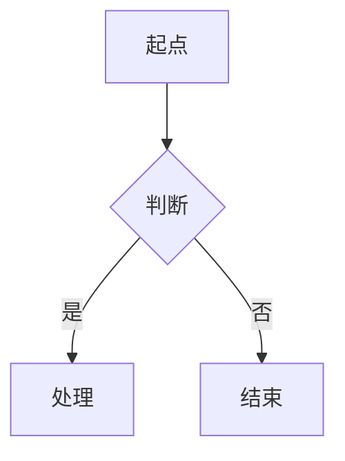

# Diagram Craft — Mermaid 与 D2 图表编写

## 用途

以**纯文本源码**产出图表，用于笔记与文档内嵌。所有图表必须满足：Agent 可自动产出、git 可 diff、改一行即改图。

## 工具选型与产出纪律

### 选型（按序判断，命中即停）

| 场景                                                            | 工具              | 理由                                |
| --------------------------------------------------------------- | ----------------- | ----------------------------------- |
| 嵌入 Markdown 笔记的小图（流程/时序/状态/ER），节点 ≤15        | **Mermaid** | GitHub/CNB/VS Code 原生渲染，零成本 |
| 架构大图、层级嵌套（集群/服务边界/VPC）、节点 >15、需要手绘观感 | **D2**      | 自动布局引擎，只描述拓扑不算坐标    |

判断口径：默认 Mermaid；仅当 Mermaid 布局会失控（节点多、嵌套深、拓扑复杂）时升级 D2。

### 禁止

- 使用 Excalidraw、draw.io、Visio 等坐标类格式——Agent 编辑必然损坏或重叠
- 由 Agent 直接产出 PNG/位图——不可再编辑
- 手动计算坐标——交给布局引擎兜底

### 产出纪律

1. 保持图源为纯文本：图错了改源码重渲染，不在渲染产物（SVG/PNG）上打补丁
2. 图源与笔记同目录存放，命名与主题一致（如 `cache-mapping.d2`）
3. SVG 渲染产物一并提交，便于未装 CLI 的环境查看
4. Mermaid 直接内嵌 Markdown 代码块；D2 以 `.d2` 源文件 + 渲染 SVG 成对存在
5. D2 渲染：`d2 源文件.d2 产物.svg`；手绘风 `d2 --sketch --theme 0 源文件.d2 产物.svg`（二进制位于 `/usr/local/bin/d2`，v0.9.0）

## 工作流程

1. 按上文《选型》确定工具（Mermaid 或 D2）。
2. 按《参考文件索引》定位图型，只加载对应的 `references/` 文件。
3. 按该图型语法骨架编写图源。
4. 文件成对落盘；Mermaid 直接内嵌代码块，D2 生成 `.d2` 源文件与 SVG 成对提交。

## Mermaid 语法骨架

首行声明图型（`flowchart` / `sequenceDiagram` / `classDiagram` / `erDiagram` / `stateDiagram-v2` / `C4Context` / `gantt` / `pie` / `gitGraph`）：

````markdown

````

- 用 `%%` 写注释；含特殊字符（`{}`、引号）的标签必须加引号包裹
- 主题与变量通过块内 frontmatter 配置：`config: {theme: base, themeVariables: {...}}`
- 中文标签可直接使用；一图一主题，图过大时按《选型》拆分或升级 D2

## D2 语法骨架

只声明拓扑，缩进即容器层级：

```d2
users: 用户 {shape: person}
lb: 负载均衡 {shape: queue}

cloud: 服务集群 {
  api: API 网关
  svc: 订单服务
}

users -> lb: HTTPS
lb -> cloud.api
cloud.api -> cloud.svc
```

- 容器内节点被外部引用时必须写全路径（`cloud.api`），否则会新建孤立节点
- 常用形状：`{shape: person | cylinder | queue | diamond | cloud | circle}`
- 强调数据流用 `{style.animated: true}`；同构节点阵列用容器内 `{grid-rows: 2}`

## 参考文件索引

按"要画什么"查表，只加载需要的那一份：

| 要画什么                                  | 读取文件                                                                  |
| ----------------------------------------- | ------------------------------------------------------------------------- |
| 流程、算法、决策树、判断分支              | [references/flowcharts.md](references/flowcharts.md)                       |
| 交互时序、协议流程、API 调用链            | [references/sequence-diagrams.md](references/sequence-diagrams.md)         |
| 状态机、状态流转（进程状态、TCP 状态）    | [references/state-diagrams.md](references/state-diagrams.md)               |
| 类与对象结构、设计模式、领域模型          | [references/class-diagrams.md](references/class-diagrams.md)               |
| 数据库表结构、键与基数                    | [references/erd-diagrams.md](references/erd-diagrams.md)                   |
| 软件架构（C4）、云资源与网络拓扑          | [references/architecture-diagrams.md](references/architecture-diagrams.md) |
| 主题、样式、布局引擎、导出与可访问性      | [references/styling-and-config.md](references/styling-and-config.md)       |
| 饼图、甘特、时间线、思维导图、象限图      | [references/other-diagrams.md](references/other-diagrams.md)               |
| D2 语法、容器嵌套、主题与渲染             | [references/d2-essentials.md](references/d2-essentials.md)                 |

## 渲染兼容性

各渲染环境内置的 Mermaid 版本不同，"语法正确但图不显示"通常源于此：

| 图型 / 特性                                     | 兼容情况                                    |
| ----------------------------------------------- | ------------------------------------------- |
| `flowchart`、`sequenceDiagram`、`classDiagram`、`erDiagram`、`stateDiagram-v2` | 各环境通用，首选 |
| `pie`、`gantt`、`gitGraph`                       | 支持较早，通用                              |
| C4（`C4Context` 等）                             | 需 v10 及以上                               |
| `mindmap`、`timeline`                            | 需 v9.4 / v10，旧环境会失败                 |
| `quadrantChart`                                  | 11.x 下轴标签、象限名**只接受 ASCII**，中文报 `Lexical error` → 不用 |
| `architecture-beta`                              | 11.x 下方括号标签**只接受 ASCII**，中文报 `Lexer error` → 基础设施图改用 D2 |
| `sankey-beta`、`packet-beta`、`block-beta`       | 较新特性，部分平台尚未跟进                  |
| 图内 `config:` frontmatter、`look: handDrawn`    | 需 v10.1 及以上，旧版会静默忽略配置         |
| `%%{init: ...}%%` 指令                           | 必须写在图型声明之前，写在末尾会被忽略      |

本 skill 内全部图块已用 Mermaid **11.4.1**（与当前渲染环境一致）逐个实测通过。拿不准时按此顺序处理：改用通用图型 → 本地渲染验证后再提交 → 或改用 D2（产出 SVG，无版本兼容问题）。
