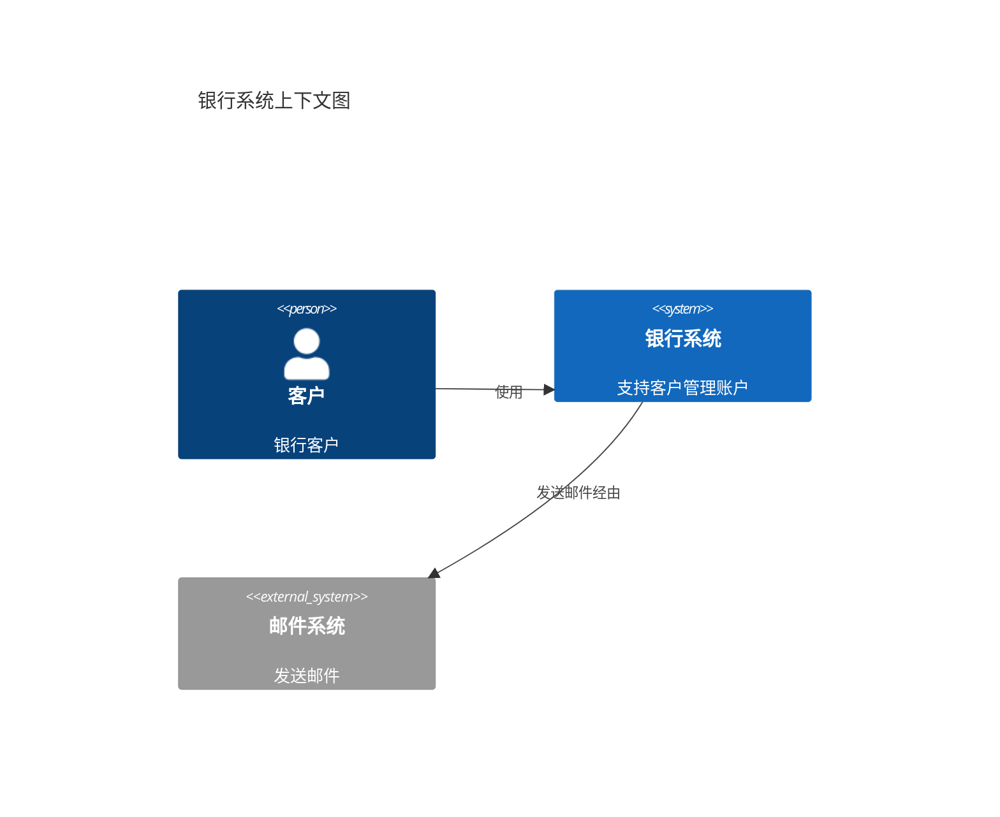
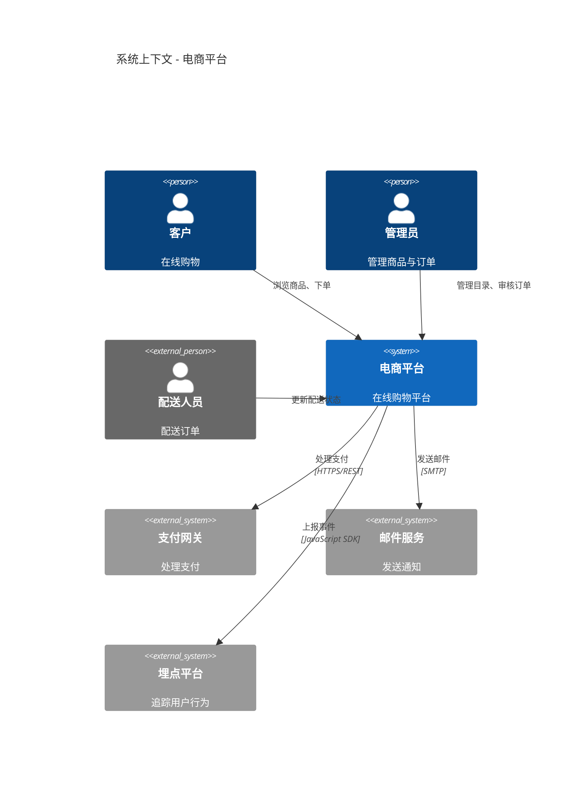
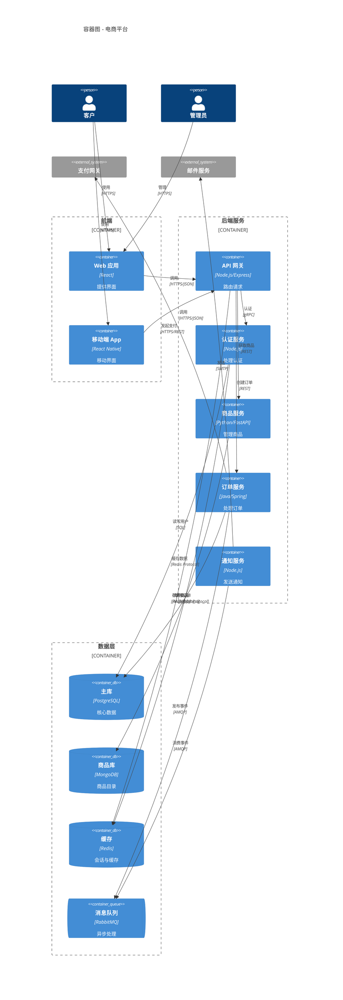
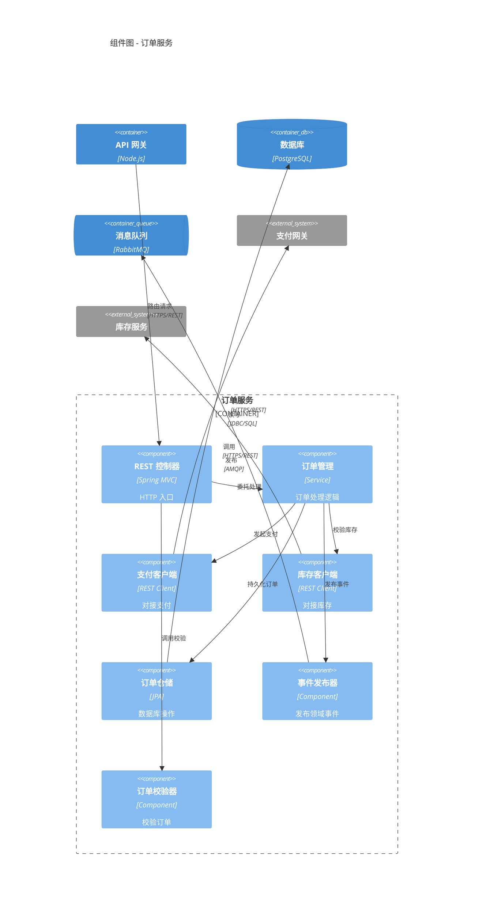
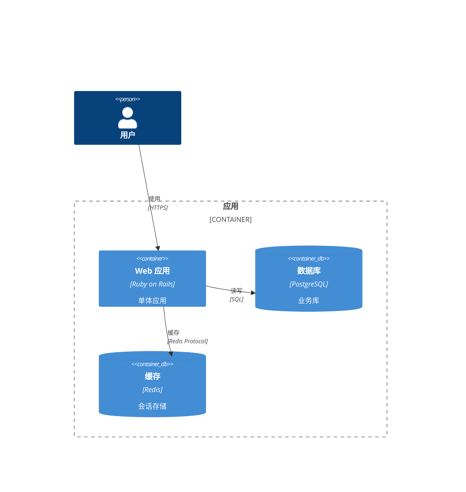
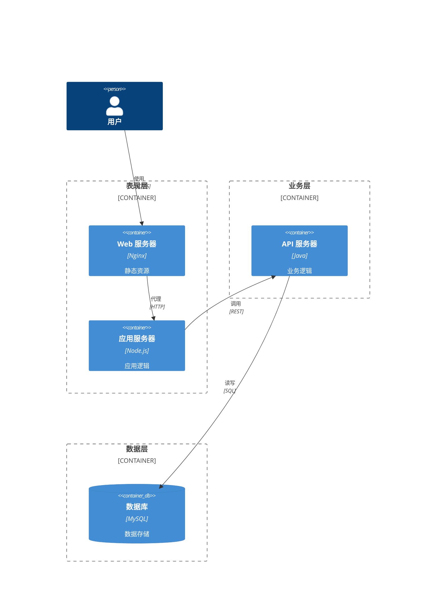
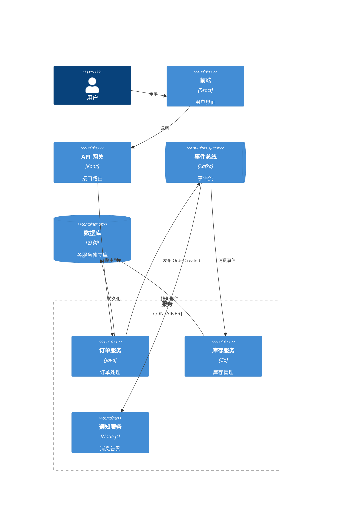

# 架构图（Architecture）

架构类图有两条路线，先按下面的表选一种语法，再往下看对应章节。

| 要表达的内容                                        | 用哪一节                                      |
| --------------------------------------------------- | --------------------------------------------- |
| 软件系统的分层结构（系统 / 容器 / 组件）            | [C4 软件架构](#c4-软件架构)                    |
| 云资源与网络拓扑（VPC、负载均衡、集群）             | [基础设施拓扑](#基础设施拓扑用-d2)             |

基础设施拓扑用 **D2** 编写：节点多、嵌套深，且中文标签在 Mermaid 11.x 下不可用（原因见该节）。

---

# C4 软件架构

C4 模型用分层方式表达软件架构，从高到低为：上下文（Context）、容器（Container）、组件（Component）、代码（Code）。

| 层级       | 关注点                     | 受众         |
| ---------- | -------------------------- | ------------ |
| 系统上下文 | 系统与用户、外部系统的关系 | 非技术干系人 |
| 容器       | 系统内的应用、数据库、服务 | 架构师       |
| 组件       | 某个容器的内部结构         | 开发者       |
| 代码       | 实现细节，直接用普通类图   | 开发者       |

## 上下文图（C4Context）



| 元素                                  | 含义                     |
| ------------------------------------- | ------------------------ |
| `Person` / `Person_Ext`           | 内部 / 外部人员          |
| `System` / `System_Ext`           | 内部 / 外部系统          |
| `SystemDb` / `SystemDb_Ext`       | 内部 / 外部数据库系统    |
| `SystemQueue` / `SystemQueue_Ext` | 内部 / 外部消息队列      |
| `Rel(from, to, "标签")`             | 单向关系，可加技术栈参数 |
| `BiRel(a, b, "标签")`               | 双向关系                 |

`Rel` 的第四个参数写技术栈，如 `Rel(a, b, "调用", "HTTPS/REST")`。

### 完整示例：电商平台上下文



## 容器图（C4Container）

放大到系统内部，展示应用、数据库、服务等容器。



容器元素：`Container(id, "名称", "技术栈", "说明")`、`ContainerDb`（数据库）、`ContainerQueue`（消息队列）、`Container_Ext`（外部容器）、`Container_Boundary(id, "名称") { ... }`（逻辑边界）。

## 组件图（C4Component）

放大到某个容器内部，展示其组件构成。



## 常见软件架构模式

**单体应用**



**三层架构**



**事件驱动架构**



---

# 基础设施拓扑（用 D2）

表达云资源、网络分区与部署关系。

**为什么不用 Mermaid 的 `architecture-beta`**：它自 v11.1.0 才引入，且方括号标签只接受 ASCII——中文标签在 Mermaid 11.x 下直接报 `Lexer error: unexpected character: ->[<-`（本仓库渲染环境即 11.x，已实测复现）。D2 对中文标签无限制，且产物是 SVG，任何环境都能查看。

用法要点（完整语法见 [d2-essentials.md](d2-essentials.md)）：

- **分组即容器嵌套**：缩进表示层级，天然表达公网 / 内网 / VPC 边界
- **跨容器引用写全路径**：`internet.client -> internet.lb`
- **用形状标注角色**：`{shape: person | queue | cylinder | cloud}`
- **只声明拓扑**，坐标交给布局引擎

## 分组与边界

```d2
internet: 公网 {
  client: 客户端 {shape: person}
  lb: 负载均衡 {shape: queue}
}

private_net: 内网 {
  api1: API 服务器 1
  api2: API 服务器 2
  db: 主数据库 {shape: cylinder}
}

internet.client -> internet.lb: HTTPS
internet.lb -> private_net.api1
internet.lb -> private_net.api2
private_net.api1 -> private_net.db
private_net.api2 -> private_net.db
```

## 完整示例：VPC 内的主从数据库

```d2
cloud: 云环境 {
  vpc: 私有 VPC {
    lb: 负载均衡 {shape: queue}
    api1: API 服务器 1
    api2: API 服务器 2
    db: 主数据库 {shape: cylinder}
    replica: 只读副本 {shape: cylinder}
  }
}

users: 用户 {shape: person}
users -> cloud.vpc.lb
cloud.vpc.lb -> cloud.vpc.api1
cloud.vpc.lb -> cloud.vpc.api2
cloud.vpc.api1 -> cloud.vpc.db
cloud.vpc.api2 -> cloud.vpc.db
cloud.vpc.db -> cloud.vpc.replica: 异步复制
```

## 技术栈图标（可选）

D2 可用 `icon` 标注技术图标，但远程图标需联网拉取，离线环境会渲染失败：

```d2
web: Docker 容器 {
  icon: https://icons.terrastruct.com/dev/docker.svg
}
```

## 部署流程怎么画

"流水线阶段推进"不属于拓扑，用 [flowcharts.md](flowcharts.md) 的流程图表达，不要用拓扑图硬套。

---

# 最佳实践

**C4 部分**

1. 按受众选层级：上下文图给干系人，容器图给架构师，组件图给开发者
2. 一张上下文图只画一个系统；一张组件图只画一个容器
3. 只画关键关系，不要把所有可能连接都堆上去
4. 各层级命名保持一致，便于跨层追溯
5. 容器/组件层标注技术栈与协议（REST、gRPC、AMQP 等）
6. 外部系统一律用 `*_Ext` 变体，一眼区分内外

**基础设施部分（D2）**

7. 按环境（公网/内网）或层次（前端/后端）用容器分组
8. 只声明拓扑关系，不手算坐标
9. 节点超过 15 个时改用 `d2 --layout elk`，或拆成多图
10. 保持单图聚焦，复杂架构拆成多个视图

## 相关参考

- D2 画大图 → [d2-essentials.md](d2-essentials.md)
- 请求级交互细节 → [sequence-diagrams.md](sequence-diagrams.md)
- 类与模块结构 → [class-diagrams.md](class-diagrams.md)
