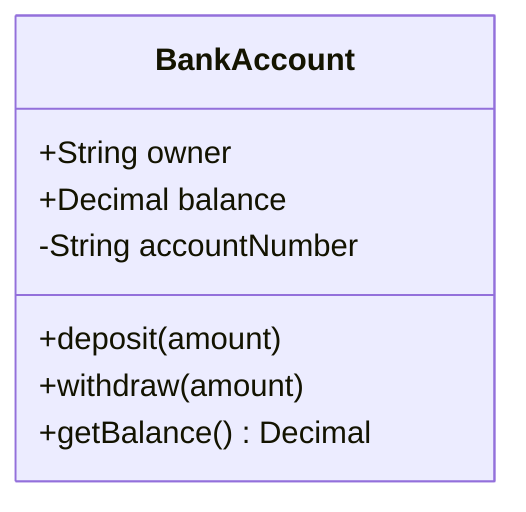
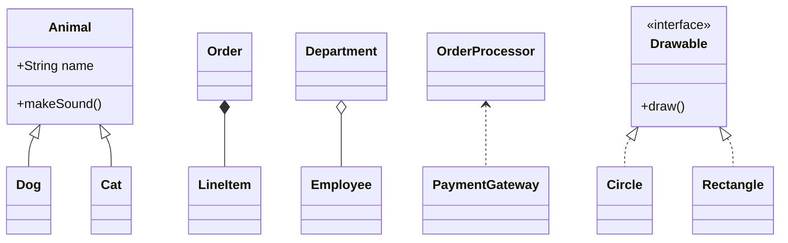
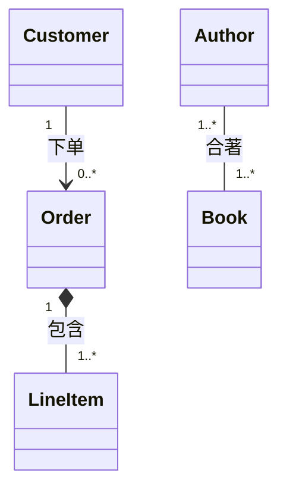
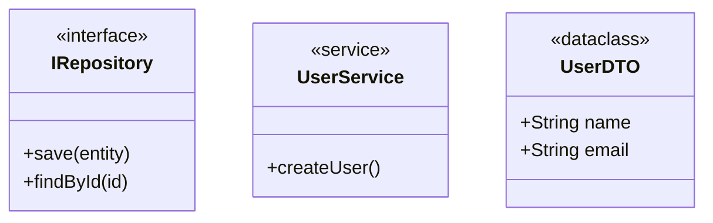
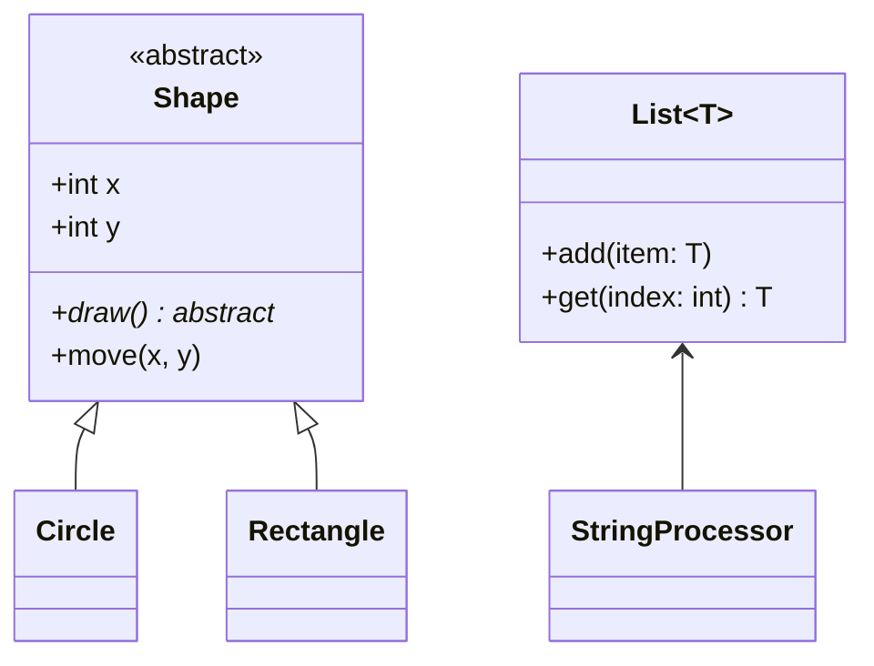
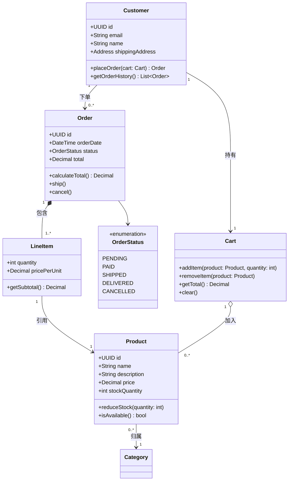
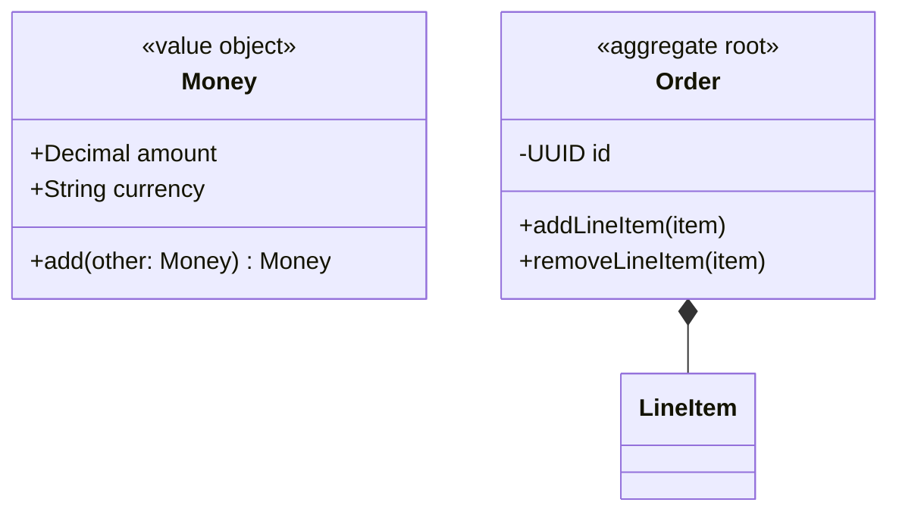
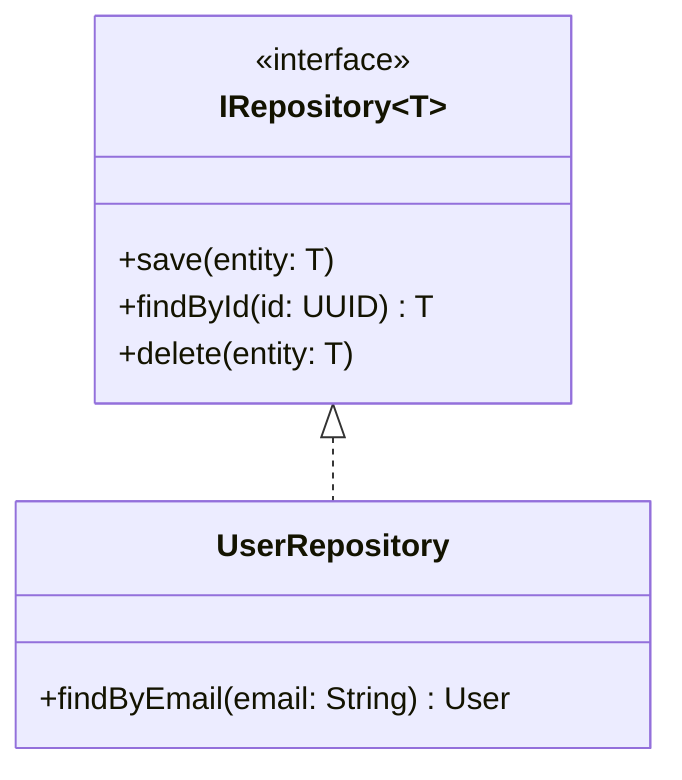
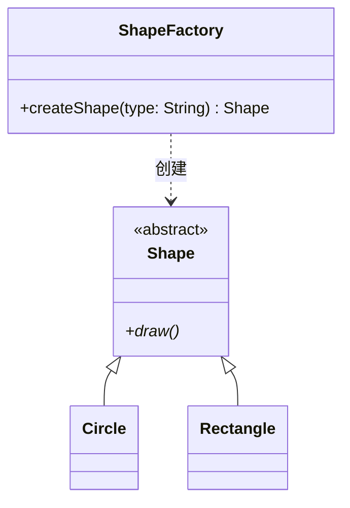
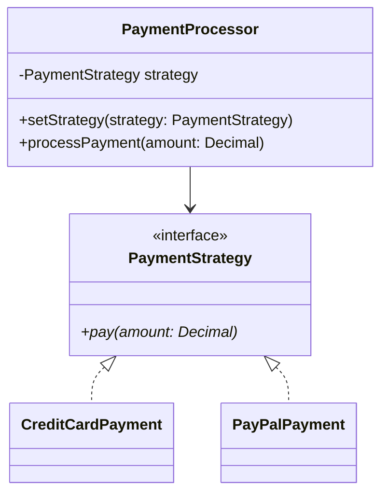

# 类图（Class Diagram）

对面向对象设计与领域模型建模，表达类（实体）、其属性/方法以及类之间的关系。

用于画数据结构、设计模式结构与领域模型；数据库表结构请用 [erd-diagrams.md](erd-diagrams.md)。

## 基础语法

```mermaid
classDiagram
    ClassName
```

## 定义类与成员



| 可见性修饰符 | 含义             |
| ------------ | ---------------- |
| `+`        | public           |
| `-`        | private          |
| `#`        | protected        |
| `~`        | package/internal |

成员写法：

- `+type attribute`：带类型的属性
- `+method(params) ReturnType`：带参数与返回值的方法

## 关系类型

| 关系 | 语法     | 含义                                                         |
| ---- | -------- | ------------------------------------------------------------ |
| 关联 | `--`   | 松散关系，双方可独立存在                                     |
| 组合 | `*--`  | 强拥有，父删除则子删除（如`Order *-- LineItem`）           |
| 聚合 | `o--`  | 弱拥有，子可独立存在（has-a，如`Department o-- Employee`） |
| 继承 | `<\|--` | is-a，子类继承父类                                           |
| 依赖 | `<..`  | 一方依赖另一方，通常作为参数或局部变量                       |
| 实现 | `<\|..` | 类实现接口                                                   |



## 多重性（Multiplicity）

标出关系中各方的实例数量：



| 写法             | 含义       |
| ---------------- | ---------- |
| `1`            | 恰好一个   |
| `0..1`         | 零或一个   |
| `0..*` / `*` | 零或多个   |
| `1..*`         | 一个或多个 |
| `m..n`         | m 到 n 个  |

关系标签写在关系末尾：`Customer --> Order : 下单`。

## 类型标注（Stereotype）

用 `<<...>>` 标注类的类型：



## 抽象类与泛型



方法名后加 `*` 表示抽象方法；`~T~` 声明类型参数，实例化时写 `List~String~`。

## 完整示例：电商领域模型



## 领域驱动设计（DDD）标注

| 模式   | 标注                   | 要点                                       |
| ------ | ---------------------- | ------------------------------------------ |
| 实体   | `<<entity>>`         | 有唯一标识，如`User`                     |
| 值对象 | `<<value object>>`   | 不可变、按值比较，如`Money`、`Address` |
| 聚合根 | `<<aggregate root>>` | 内部一致性边界，外部只引用根               |



## 常用设计模式

**仓储模式（Repository）**



**工厂模式（Factory）**



**策略模式（Strategy）**



## 最佳实践

1. 从核心实体起步，逐步补属性和方法
2. 只画有信息量的成员，显而易见的 getter/setter 可省略
3. 谨慎区分关联、聚合与组合，避免一律用 `-->`
4. 标注多重性，明确各方实例数量
5. 用 `<<interface>>`、`<<abstract>>` 表达设计意图
6. 用 `%%` 注释说明业务规则与不变量
7. 图过大时按 `SKILL.md`《选型》拆分或升级 D2

## 相关参考

- 数据库表结构 → [erd-diagrams.md](erd-diagrams.md)
- 对象状态流转 → [state-diagrams.md](state-diagrams.md)
