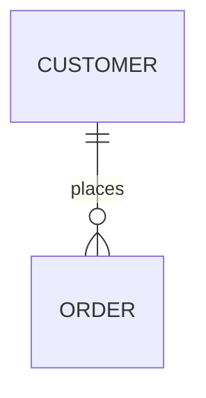
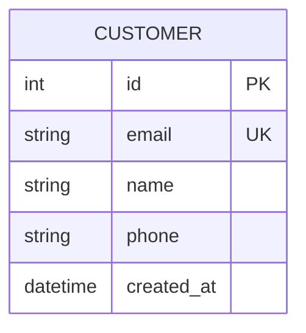
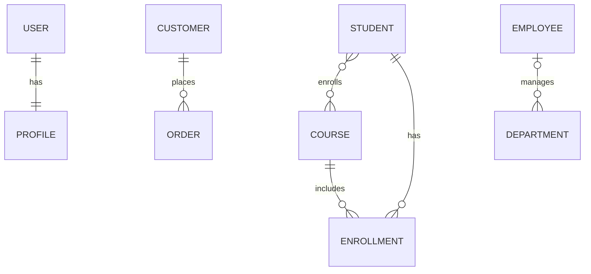
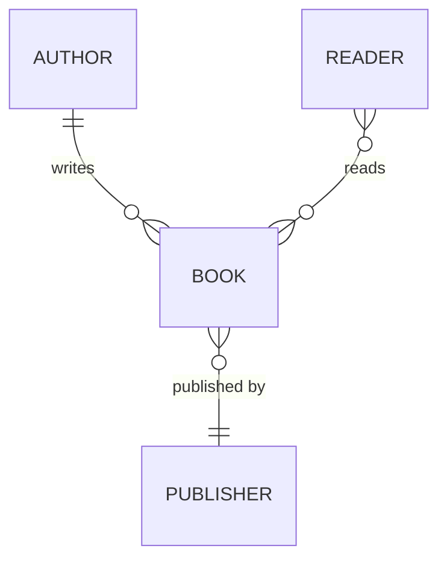
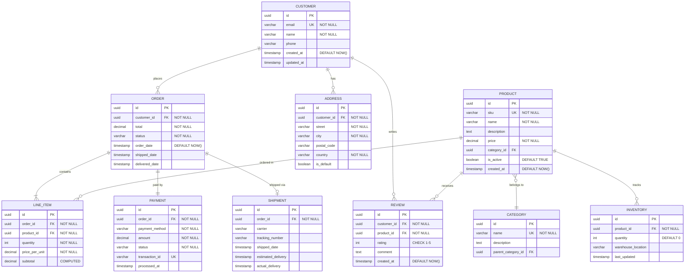
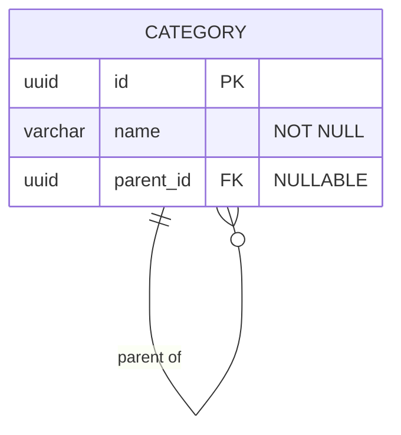
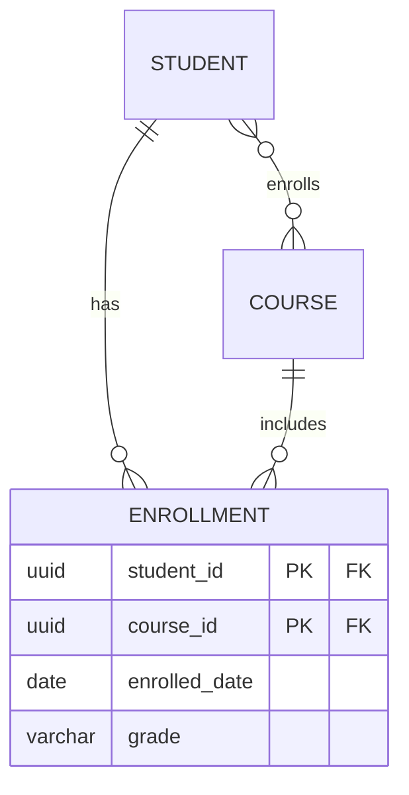
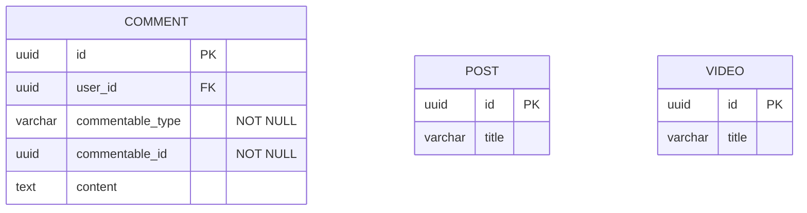
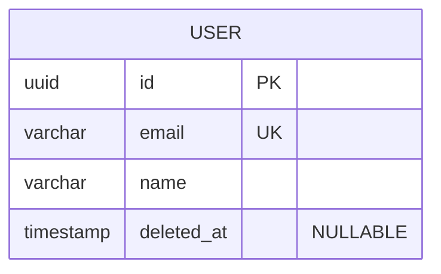
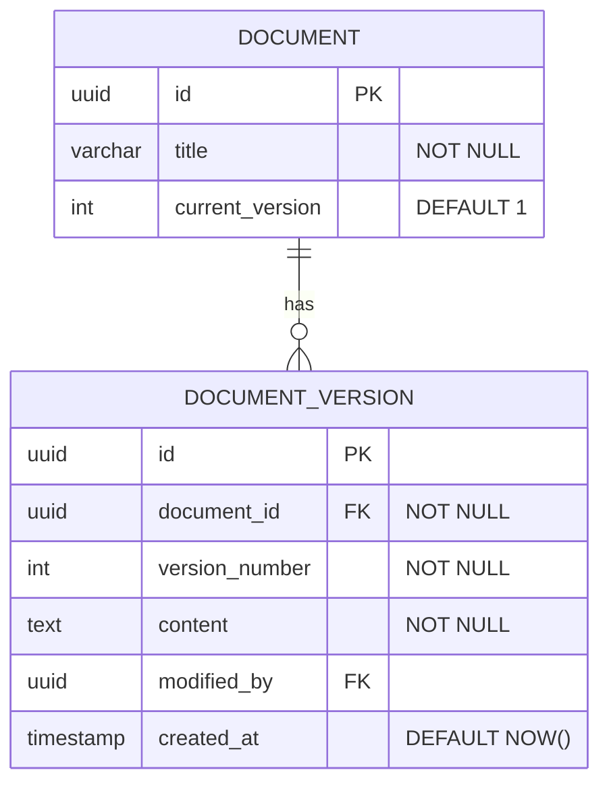

# ER 图（Entity Relationship Diagram）

对数据库模式建模，表达表（实体）、列（属性）以及表之间的关系。适用于数据库设计与文档化。

若画的是面向对象结构而非表结构，用 [class-diagrams.md](class-diagrams.md)。

## 基础语法

## 定义实体与属性

属性写法为 `类型 名称 约束`：

| 约束 | 含义   |
| ---- | ------ |
| `PK` | 主键   |
| `FK` | 外键   |
| `UK` | 唯一键 |
| `NN` | 非空   |

约束之外还可加引号描述，如 `decimal subtotal "COMPUTED"`。

## 关系

### 基数符号

| 符号    | 含义       |
| ------- | ---------- |
| `\|\|`  | 恰好一个   |
| `\|o`   | 零或一个   |
| `}\|`   | 一个或多个 |
| `}o`    | 零或多个   |

符号分别写在关系线两端，例如 `||--o{` 表示"一端恰好一个，另一端零或多个"。

关系线用 `--`（非标识关系）；`..` 表示标识关系，实践中较少使用。

### 常见关系写法

### 关系标签

标签可直接写，含空格时需加引号。

## 数据类型

沿用数据库常用类型：`int`、`bigint`、`smallint`、`varchar`、`text`、`char`、`decimal`、`float`、`double`、`boolean`、`date`、`datetime`、`timestamp`、`json`、`jsonb`、`uuid`、`blob`、`bytea`。

## 完整示例：电商数据库

## 常见建模模式

**自引用（层级结构）**

**多对多中间表**

**多态关联**

**软删除**

**审计轨迹（版本表）**

## 最佳实践

1. 实体名用**大写**、**单数**形式（`USER` 而非 `USERS`）
2. 完整标注约束：PK、FK、UK、NOT NULL
3. 基数符号要准确，严格区分一对多与多对多
4. 加入 `created_at` / `updated_at` 便于审计
5. 计算列、派生列要显式标注（如 `"COMPUTED"`）
6. 多对多关系显式建模中间表，而不是只画一条 `}o--o{`
7. 用引号补充约束与说明，把业务规则写进图里
8. 数据类型与目标数据库保持一致

## 数据库设计要点

1. 适度范式化，在范式化与查询性能间取平衡
2. 用代理键（UUID 或自增整数）作主键
3. 为外键建索引，保证连接性能
4. 预留软删除（`deleted_at`）而非直接物理删除
5. 关键数据做版本留痕
6. 为 `created_at`、`status`、布尔标志设置合理默认值
7. 计数、缓存类字段可适度反范式化
8. 用枚举/CHECK 约束在数据库层兜住取值范围
