# 流程图（Flowchart）

表达流程、算法、决策树与用户旅程，展示逐步推进的过程。

`flowchart` 是 Mermaid 默认选择：笔记内的流程、算法、判断分支都用它。

## 基础语法

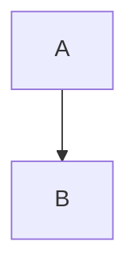

| 方向关键字      | 方向             |
| --------------- | ---------------- |
| `TD` / `TB` | 从上到下（默认） |
| `BT`          | 从下到上         |
| `LR`          | 从左到右         |
| `RL`          | 从右到左         |

## 节点形状

| 形状         | 语法                                        | 常用场景       |
| ------------ | ------------------------------------------- | -------------- |
| 矩形         | `A[处理步骤]`                             | 默认，普通步骤 |
| 圆角矩形     | `B([圆角处理])`                           | 处理           |
| 胶囊/Stadium | `C([开始或结束])`                         | 起止节点       |
| 子程序       | `D[[子程序]]`                             | 调用子过程     |
| 圆柱         | `E[(数据库)]`                             | 数据存储       |
| 圆形         | `F((圆形节点))`                           | 连接点         |
| 非对称/旗帜  | `G>旗帜节点]`                             | 特殊标记       |
| 菱形         | `H{判断?}`                                | 分支判断       |
| 六边形       | `I{{六边形}}`                             | 准备/循环      |
| 平行四边形   | `J[/输入或输出/]` `K[\另一种输入输出\]` | 输入输出       |
| 梯形         | `L[/梯形\]` `M[\反向梯形/]`             | 人工操作       |

同一流程中，同类动作应使用同一种形状。

## 连线

| 类型       | 语法                                           |
| ---------- | ---------------------------------------------- |
| 实线箭头   | `A --> B`                                    |
| 实线无箭头 | `A --- B`                                    |
| 带标签     | `A -->\|标签\| B`、`C ---\|"含空格的标签"\| D` |
| 虚线       | `A -.-> B`、`C -.- D`、`E -.标签.-> F`   |
| 粗线       | `A ==> B`、`C === D`、`E ==标签==> F`    |

链式与一对多写法：

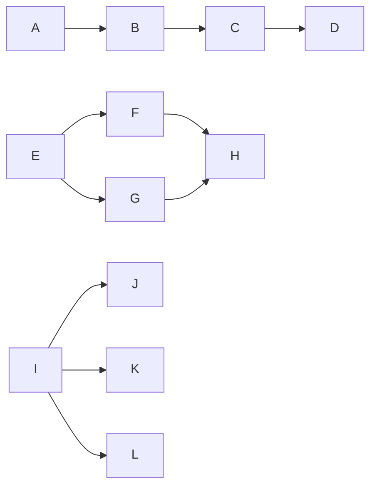

## 子图（Subgraph）

用子图对相关节点分组，可嵌套，也可单独指定内部方向：

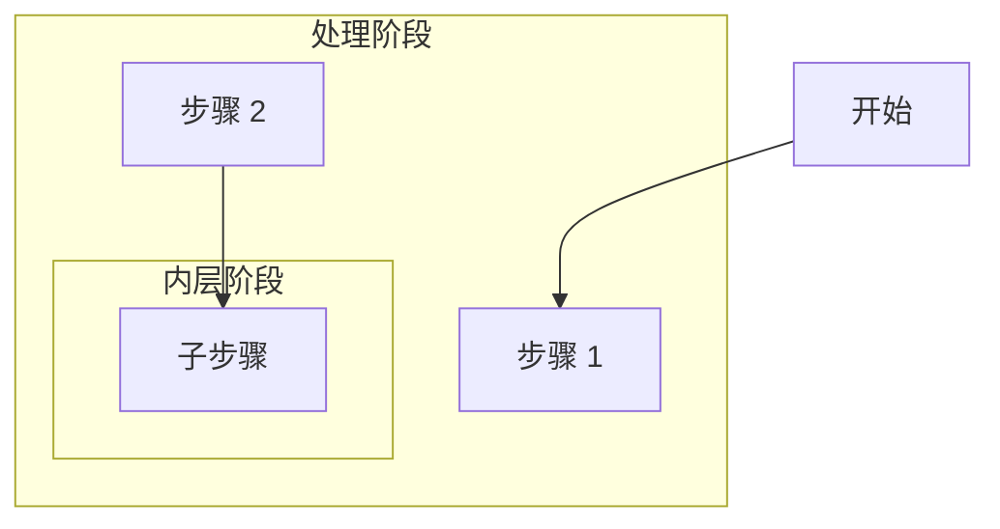

## 样式

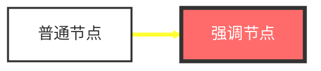

`linkStyle` 的下标对应已存在的连线；图里没有连线时使用它会直接报错。

- `style <节点ID>`：设置单个节点
- `classDef <类名>`：定义样式类，节点用 `:::` 引用，适合批量复用
- `linkStyle <连线序号>`：按下标设置连线样式

更多主题与布局配置见 [styling-and-config.md](styling-and-config.md)。

## 完整示例

### 算法流程：二分查找

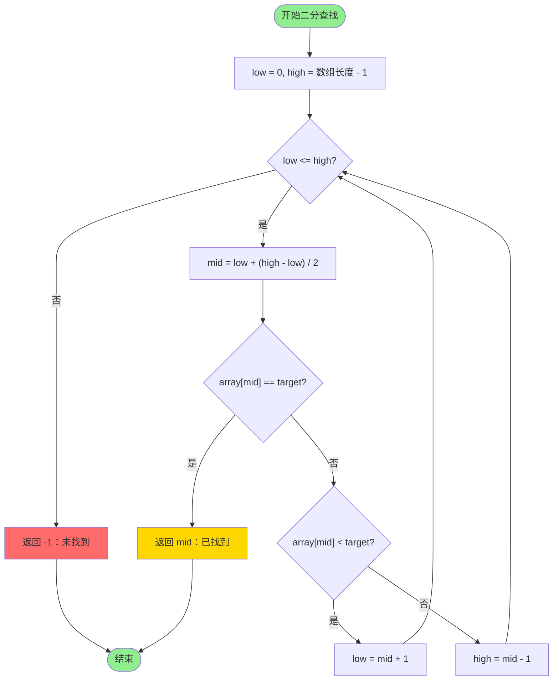

标签中含 `<`、`(`、`[` 等特殊字符时必须用引号包裹，否则 Mermaid 解析报错。

### 业务流程：用户注册

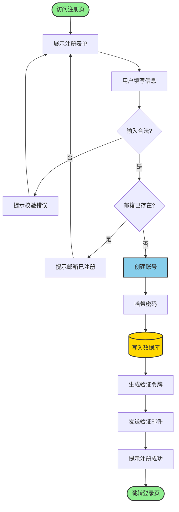

### 部署流程：CI/CD 流水线

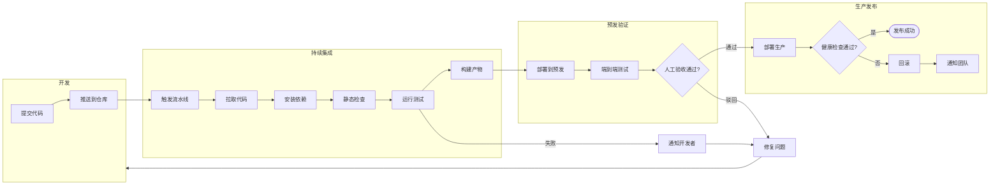

## 最佳实践

1. 节点文案用明确的动作短语，避免无意义名词
2. 同类节点保持同形状；判断一律用菱形
3. 默认自上而下或自左向右，遵循自然阅读方向
4. 起止节点用胶囊形状明确标注
5. 用子图划分逻辑边界，用颜色区分动作类型
6. 减少连线交叉，必要时重排节点顺序
7. 一图一流程；节点超过 15 个时按 `SKILL.md`《选型》拆分或升级 D2

## 常用模式

**线性流程**

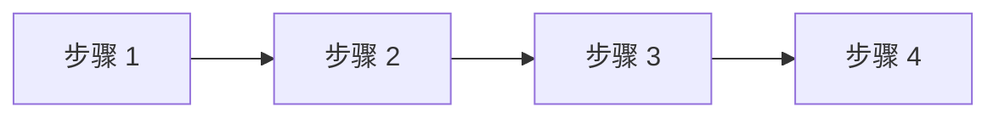

**分支判断**

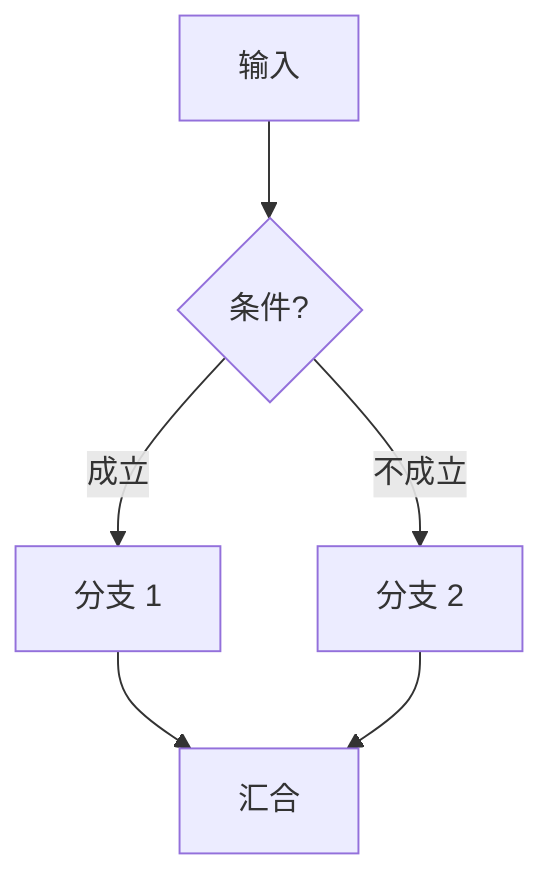

**循环**

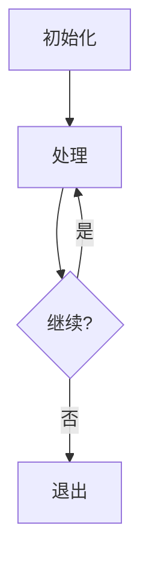

**错误处理**

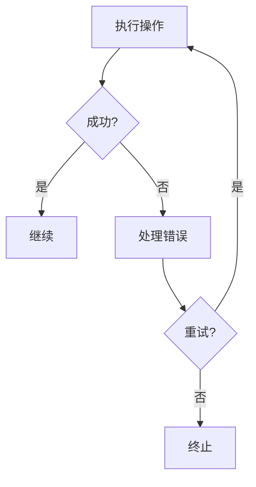

## 相关参考

- 状态流转、状态机 → [state-diagrams.md](state-diagrams.md)
- 时序交互 → [sequence-diagrams.md](sequence-diagrams.md)
