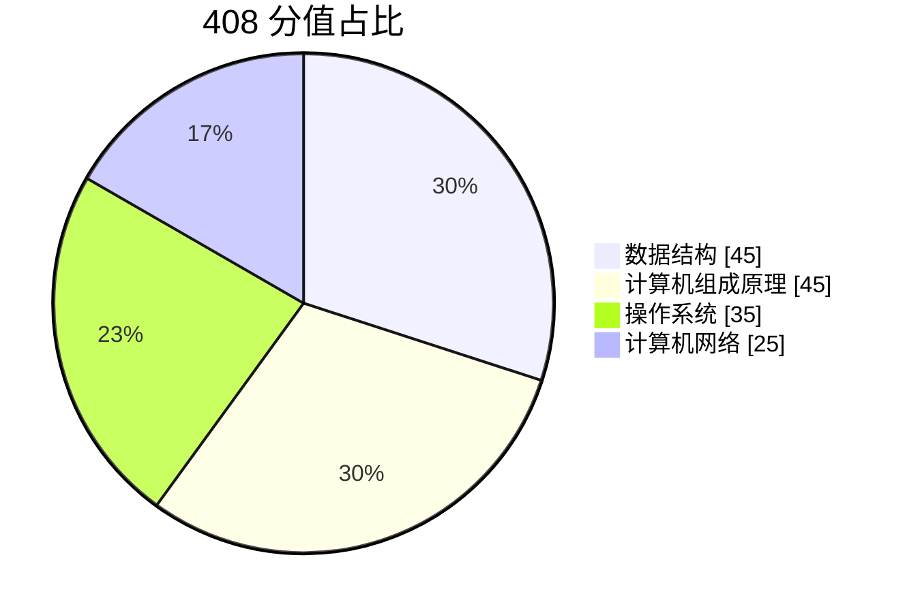
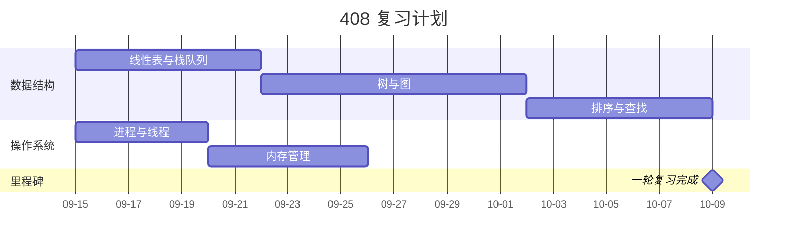
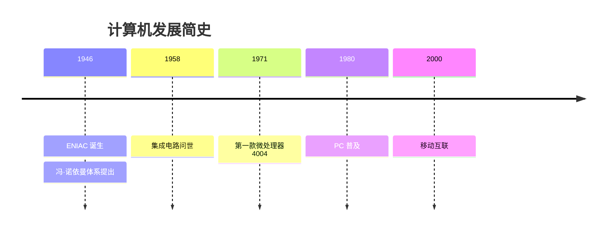
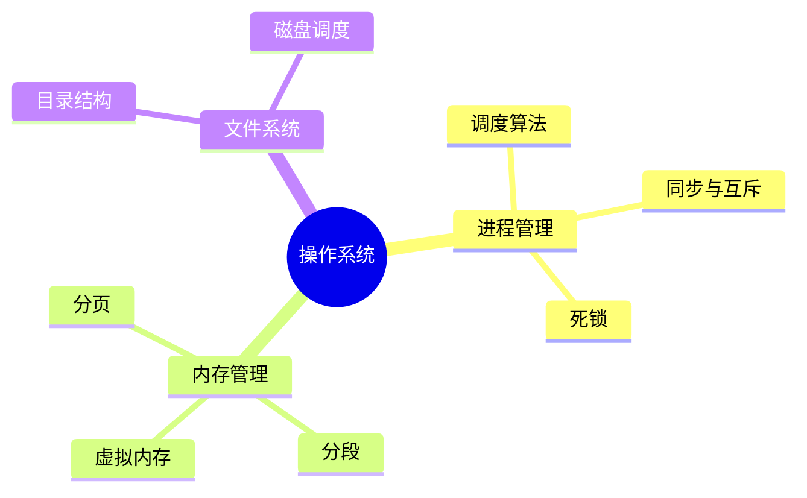
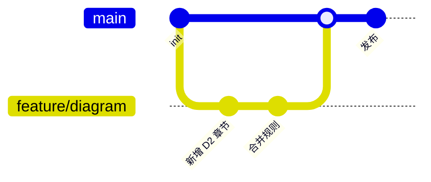

# 其他图型速查（饼图、甘特、时间线、导图等）

补充高频但不常用的图型。写笔记时优先用流程、时序、状态、结构、架构五类；确实需要"占比/排期/时间轴/发散结构"时再用本文件。

| 图型        | 关键字           | 用途                       |
| ----------- | ---------------- | -------------------------- |
| 饼图        | `pie`            | 占比构成                   |
| 甘特图      | `gantt`          | 学习计划、项目排期         |
| 时间线      | `timeline`       | 历史脉络、发展阶段         |
| 思维导图    | `mindmap`        | 知识发散、章节大纲         |
| 提交图      | `gitGraph`       | 分支与提交流转               |

## 饼图（pie）

`showData` 会把数值一并显示在扇区旁；不加则只显示百分比。

## 甘特图（gantt）

- `dateFormat` 必写，否则无法解析日期
- 任务写法：`任务名 :id, 起始, 时长`，起始可用 `after 前置id`
- `section` 分组；`milestone` 标记里程碑

## 时间线（timeline）

同一时间点可写多行事件，缩进对齐即可。

## 思维导图（mindmap）

用缩进表达层级，`root((文本))` 为根节点；层级过深会难以阅读，建议不超过 4 层。

## 关于象限图（暂不收录）

Mermaid 的 `quadrantChart` 在 **11.x 下不支持中文**：轴标签（`x-axis` / `y-axis`）与象限名（`quadrant-1..4`）只接受 ASCII，写中文会报 `Lexical error: Unrecognized text`。本仓库渲染环境为 11.x，故不收录；做优先级/四象限评估时直接用 Markdown 表格。

## 提交图（gitGraph）

## 使用提醒

1. 这些图型在各渲染环境的支持程度不一，且部分图型对中文支持不佳，跨平台分享前先实测
2. 内容复杂、需要精细布局时，宁可改用流程图或架构图（或按 `SKILL.md`《选型》升级 D2）
3. 饼图扇区不宜超过 6 个，甘特图任务不宜超过 20 条
