# 时序图（Sequence Diagram）

表现参与者之间随时间的交互，适合协议流程、API 调用链与系统组件协作。

## 基础语法

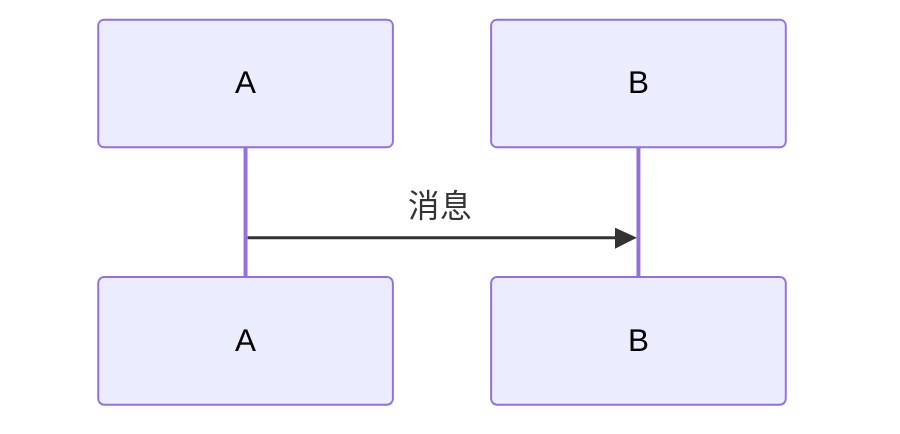

## 参与者与角色

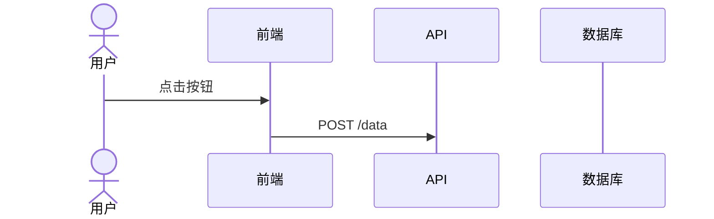

- `participant`：系统组件（服务、类、数据库）
- `actor`：外部实体（用户、第三方系统）

参与者顺序决定泳道顺序，建议按 `用户 → 前端 → 后端 → 数据库` 排列。

## 消息类型

| 语法   | 含义                     |
| ------ | ------------------------ |
| `->>`  | 实线箭头，同步请求       |
| `-->>` | 虚线箭头，响应/返回      |
| `-)`   | 实线开口箭头，异步消息   |
| `--)`  | 虚线开口箭头，异步响应   |
| `-x`   | 叉号箭头，表示删除或终止 |

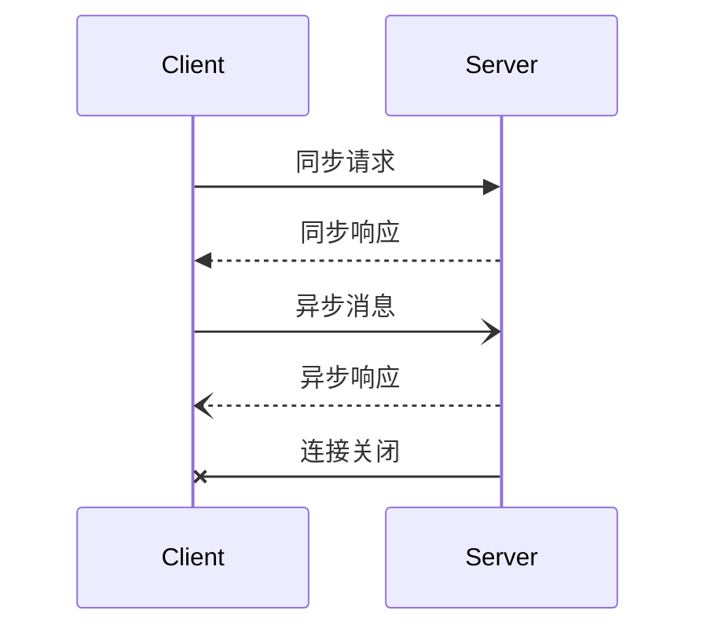

## 激活块（Activation）

用 `+` / `-` 标出参与者正在处理的时间段：

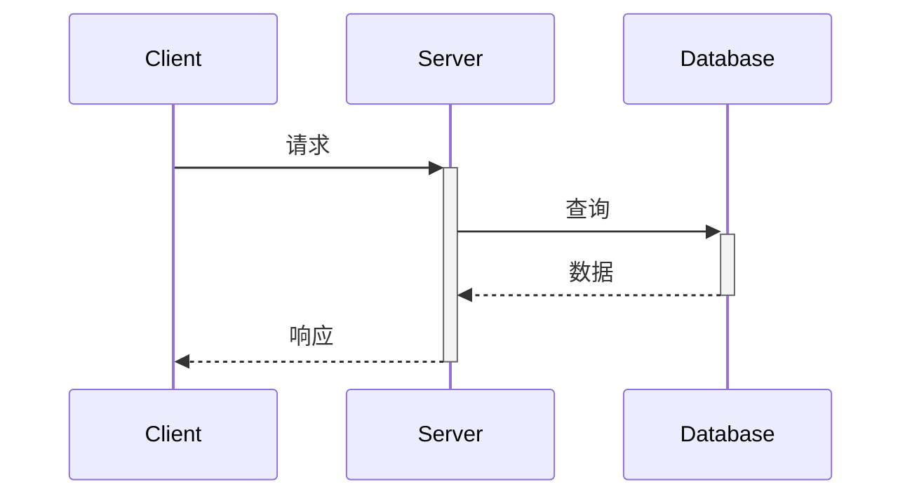

`->>+` 在箭头后加 `+` 开始激活，`-->>-` 在箭头前加 `-` 结束激活。

## 条件分支：alt / else

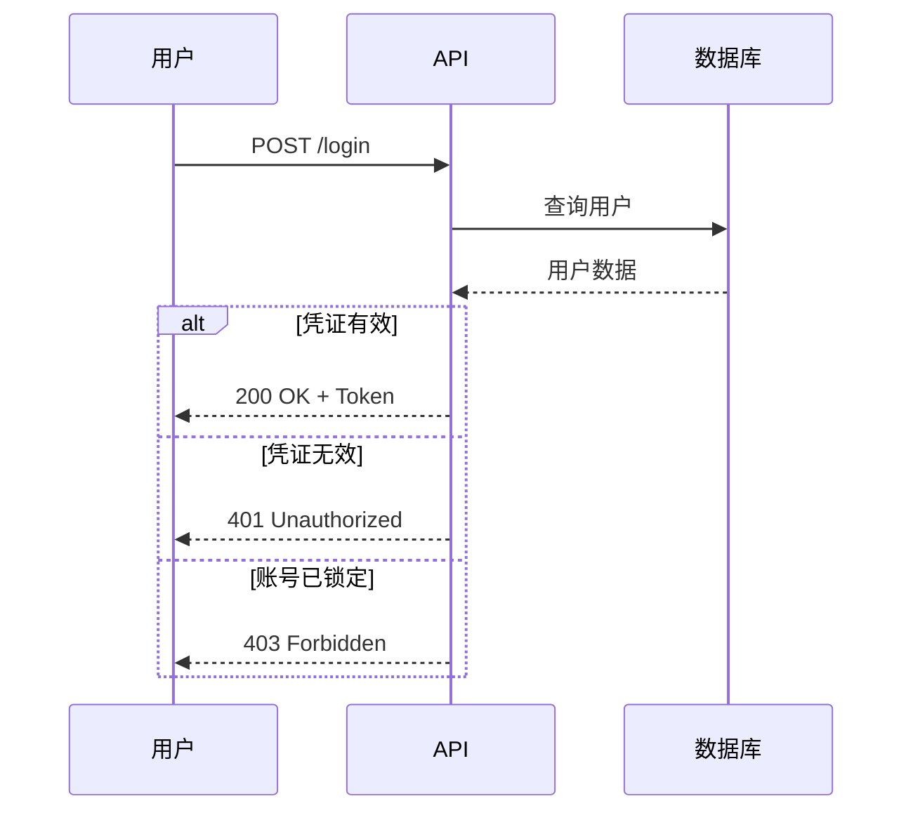

## 可选分支：opt

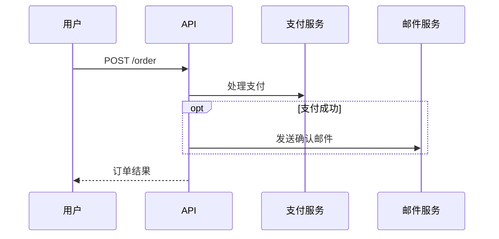

## 并行：par

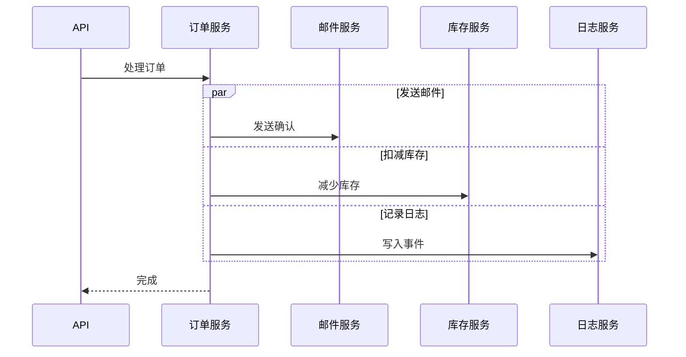

## 循环：loop

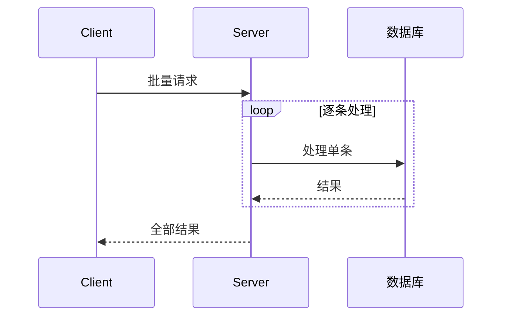

循环条件直接写在 `loop` 后，例如 `loop 每 5 秒`。

## 提前退出：break

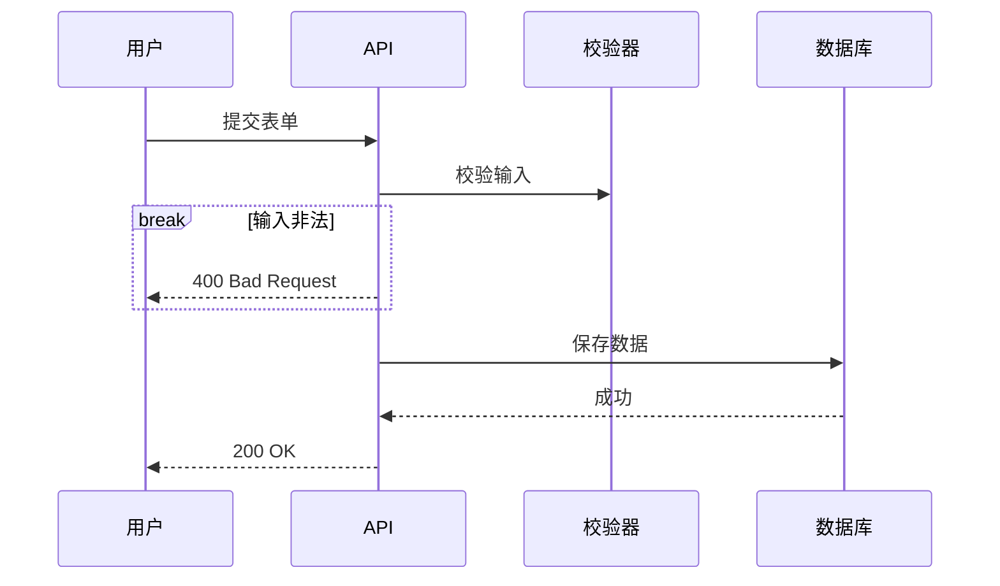

## 注释（Note）

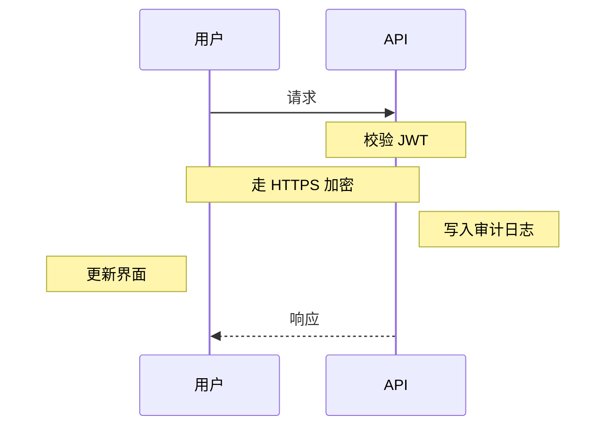

`over` 覆盖单个或多个参与者（`over A,B`），`right of` / `left of` 贴在指定参与者一侧。

## 自动编号与链接

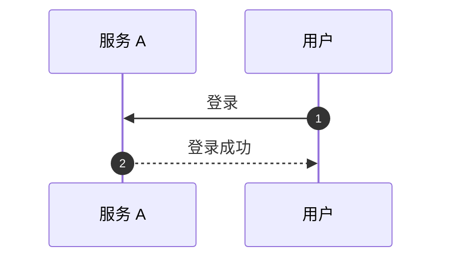

`autonumber` 给消息自动编号；`link` 为参与者附加可点击链接（在支持的渲染环境中生效）。

## 完整示例

### 用户认证流程

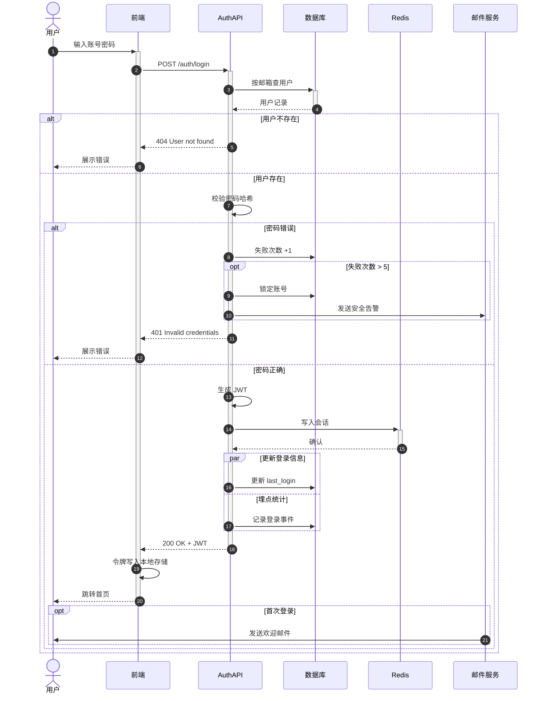

### 微服务间协作

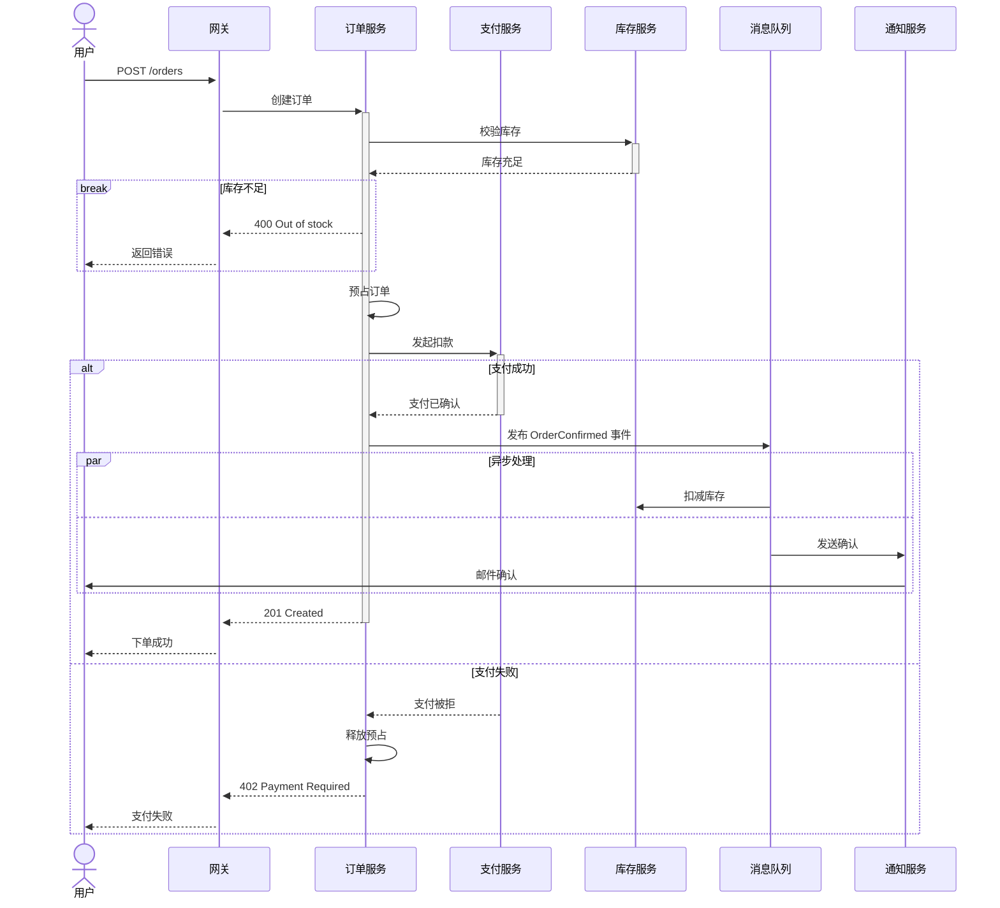

## 最佳实践

1. 参与者按逻辑顺序排列，通常为 `用户 → 前端 → 后端 → 数据库`
2. 用激活块标出正在处理的组件
3. 用 `alt` / `opt` / `par` 组织条件、可选与并发分支
4. 用 `Note` 解释复杂逻辑，而非堆砌消息
5. 一图一场景，避免把多个流程塞进一张图
6. 消息较多时开启 `autonumber`
7. 用 `alt/else` 显式画出失败路径
8. 异步、fire-and-forget 的消息用开口箭头

## 常见场景

| 类别     | 典型主题                                           |
| -------- | -------------------------------------------------- |
| 认证授权 | 登录、OAuth/SSO、令牌刷新、找回密码                |
| 协议交互 | TCP 握手挥手、HTTP 请求响应、DNS 解析              |
| 系统集成 | 微服务调用、第三方 API、消息队列、事件驱动架构     |
| 业务流程 | 订单履约、支付处理、审批流、通知链                 |

## 相关参考

- 状态流转 → [state-diagrams.md](state-diagrams.md)
- 整体架构 → [architecture-diagrams.md](architecture-diagrams.md)
