# 状态图（State Diagram）

表达对象或系统在生命周期内的状态与状态迁移，用 `stateDiagram-v2`。

典型用途：进程状态机、TCP 连接状态、线程生命周期、订单状态流转。若只是"步骤推进"而非"状态停留"，用 [flowcharts.md](flowcharts.md)。

## 基础语法

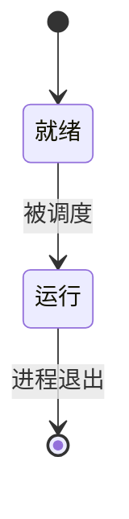

- `[*]` 表示起点或终点
- `A --> B: 标签` 表示一次状态转换
- 状态名可直接用中文

## 状态别名

状态名含空格或较长时，用 `state "描述" as 别名`：

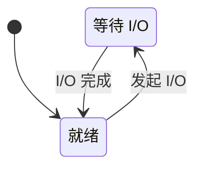

## 复合状态（嵌套）

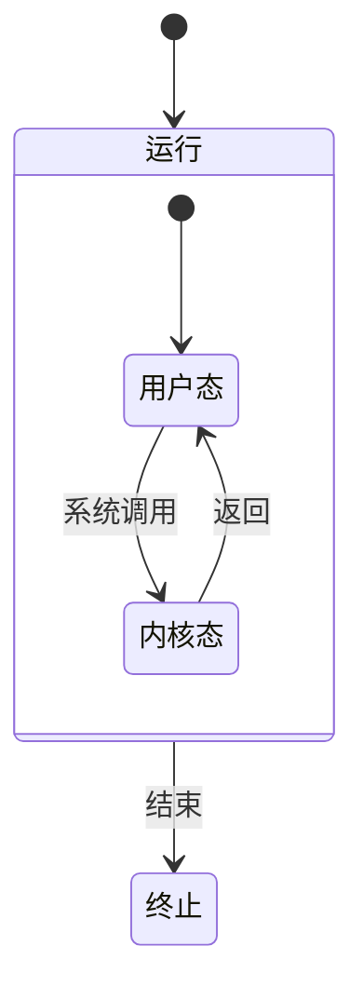

## 并发区域

用 `--` 分隔并发的子状态机：

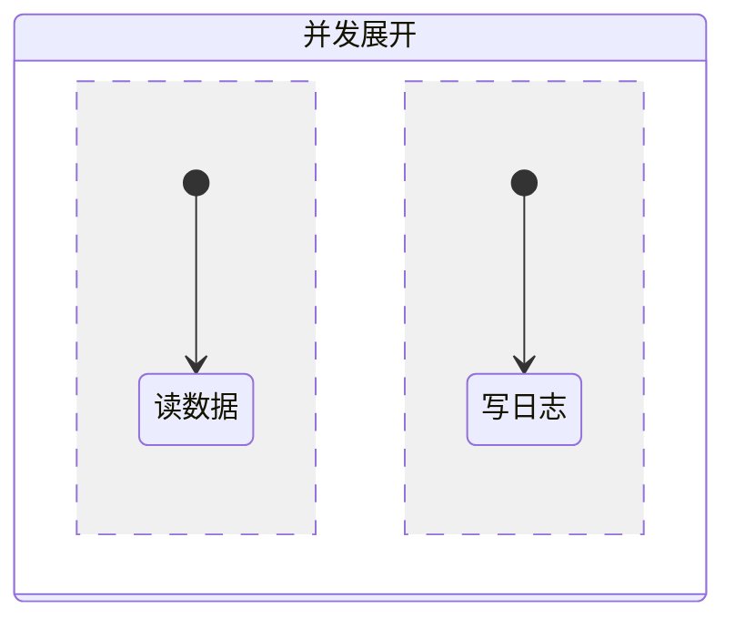

## 选择与分叉汇合

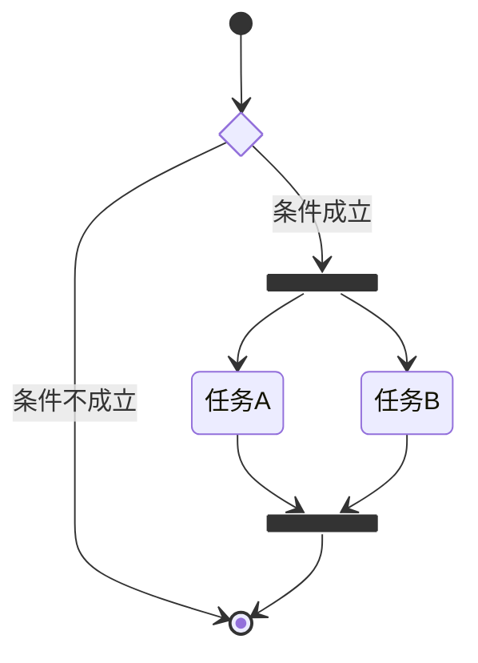

## 方向

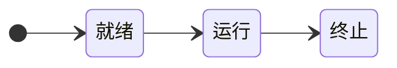

## 注释

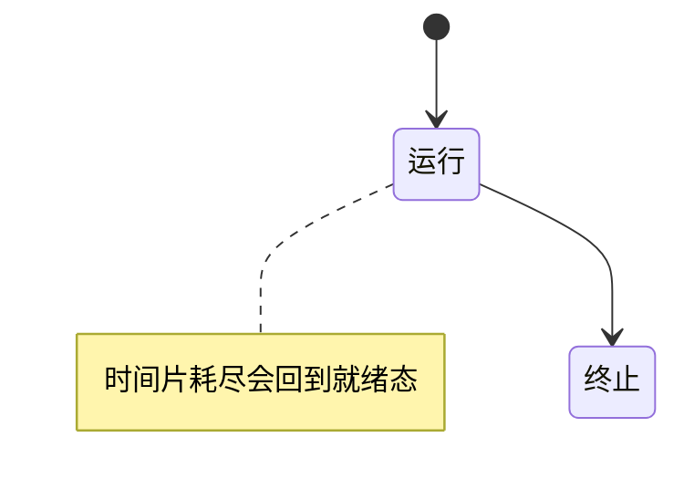

## 样式

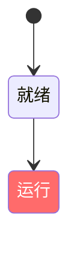

状态图的 `classDef` / `class` 只接受 ASCII 标识符：中文状态需先用 `state "中文名" as 别名` 声明，再对别名施加样式。

## 完整示例

### 进程状态机（408 高频考点）

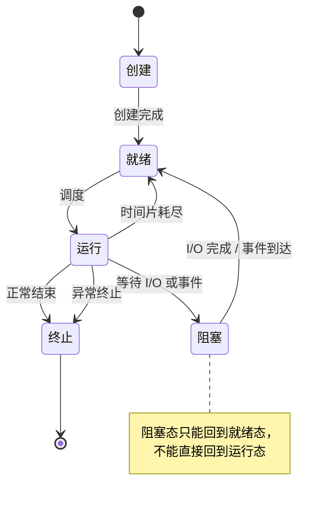

### TCP 连接状态机

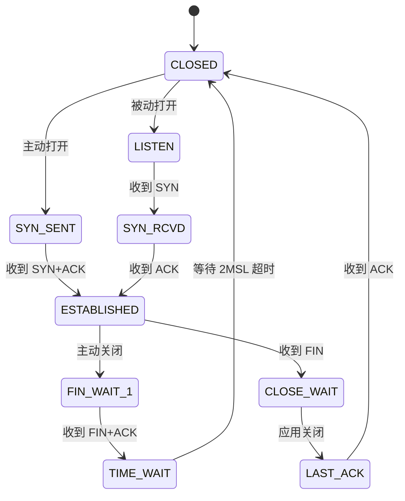

### 订单状态流转

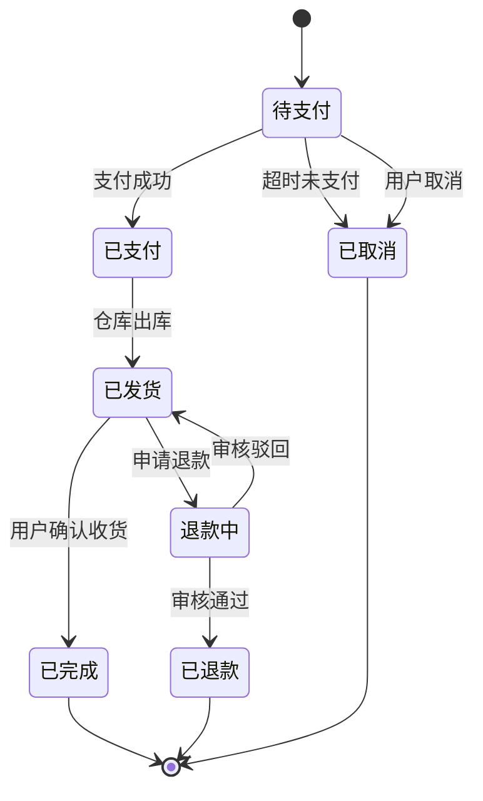

## 最佳实践

1. 状态名用"形容词/名词"（就绪、运行、阻塞），迁移标签用"动作/事件"
2. 迁移标签写清触发条件，避免无标签的裸连线
3. 状态与迁移太多时，用复合状态分层，而不是把几十个状态平铺
4. `[*]` 起点可有多个，终点也可有多个
5. 状态超过 15 个时按 `SKILL.md`《选型》拆分或升级 D2

## 相关参考

- 流程、分支、算法 → [flowcharts.md](flowcharts.md)
- 消息交互顺序 → [sequence-diagrams.md](sequence-diagrams.md)
