# 样式与配置（主题、布局、导出）

适用于**所有** Mermaid 图型：主题、样式、布局引擎、导出与可访问性。图型专属语法见各自文件。

配置用图内块 frontmatter 声明，只影响当前这一张图。

## Frontmatter 配置

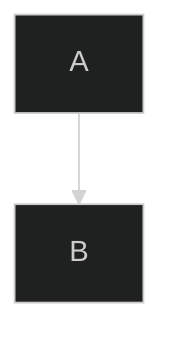

## 内置主题

| 主题      | 风格                       |
| --------- | -------------------------- |
| `default` | 标准蓝色主题               |
| `forest`  | 绿色自然色调               |
| `dark`    | 深色模式                   |
| `neutral` | 灰阶专业风                 |
| `base`    | 最小化基础主题，便于自定义 |

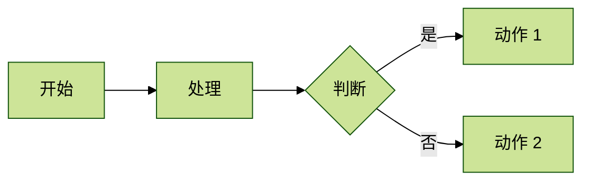

## 自定义主题变量

用 `theme: base` 打底，再逐个覆盖变量：

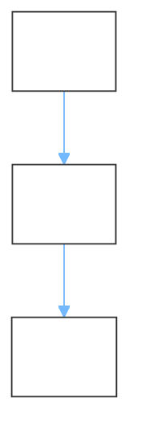

常用变量：`primaryColor`（主节点底色）、`primaryTextColor`（主节点文字）、`lineColor`（连线）、`secondaryColor`/`tertiaryColor`（次级节点）、`background`/`mainBkg`（画布与节点背景）、`clusterBkg`/`clusterBorder`（子图）。

## 布局引擎

**dagre（默认）**

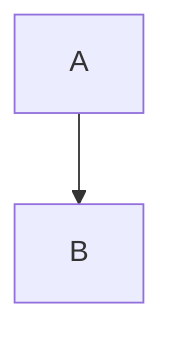

**elk（复杂图更优）**

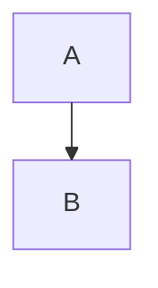

| 节点放置策略      | 说明             |
| ----------------- | ---------------- |
| `SIMPLE`          | 基础放置         |
| `NETWORK_SIMPLEX` | 网络优化         |
| `LINEAR_SEGMENTS` | 线性排列         |
| `BRANDES_KOEPF`   | 均衡放置（默认） |

dagre 出现大量交叉线或节点超过 20 个时，改用 elk，并开启 `mergeEdges` 减少连线杂乱。

## 视觉风格（look）

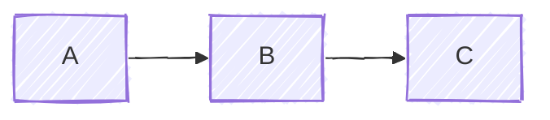

- `classic`：传统 Mermaid 观感
- `handDrawn`：手绘草图风，适合非正式场合

## 完整配置示例

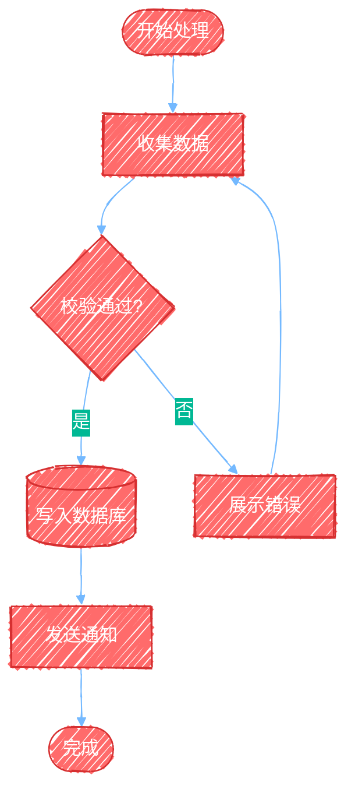

## 逐元素样式

**样式类（推荐，可复用）**

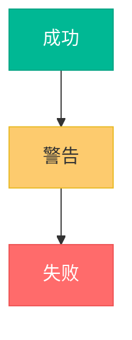

**单节点与单连线**


- `classDef 类名 ...` 定义样式类，节点用 `:::类名` 引用
- `style <节点ID> ...` 只作用于单个节点
- `linkStyle <连线序号> ...` 按下标设置连线样式

**子图样式与分组配色**

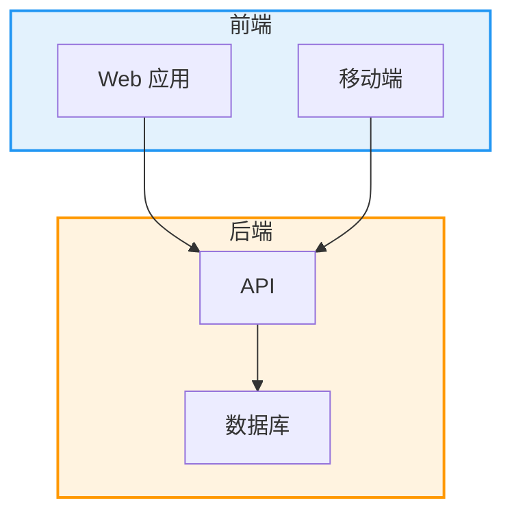

**整图主题覆盖**：时序图、类图这类没有逐元素样式的图型，用 `%%{init: ...}%%` 指令声明，**指令必须写在图型声明之前**：

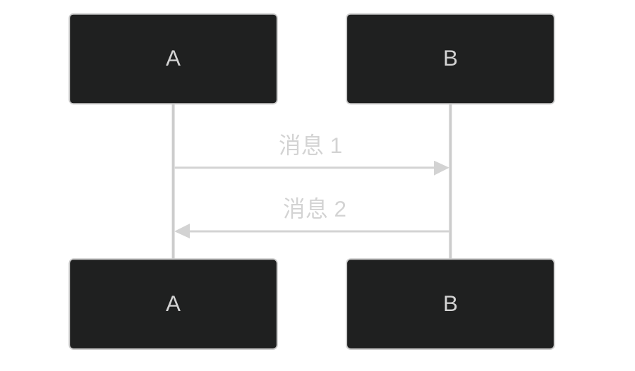

**综合示例**

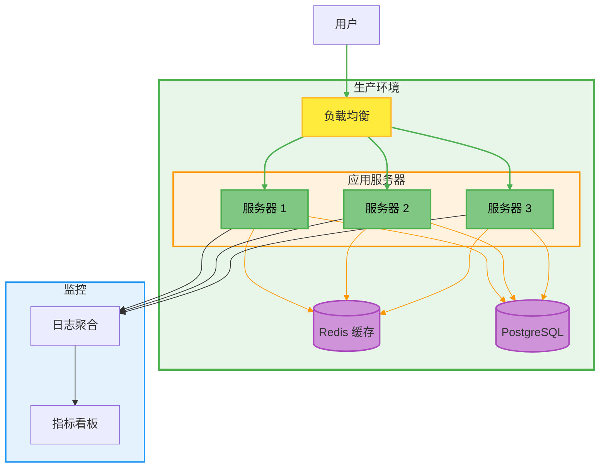

## 交互元素

节点可以加跳转链接与悬浮提示（需渲染环境允许外链，Mermaid 侧对应 `securityLevel: loose`）：

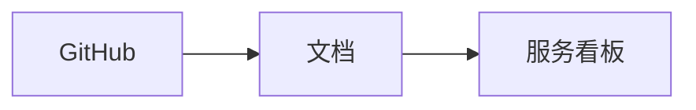

`click <节点ID> "URL" "悬浮提示"`：第二个参数是跳转地址，第三个是鼠标悬浮提示。

注意：`link <参与者>: 文本 @ URL` 是**时序图**专属写法，流程图不支持，二者不要混用，见 [sequence-diagrams.md](sequence-diagrams.md)。

## 注释

用 `%%` 写注释，仅提升源码可读性，不出现在渲染结果中：

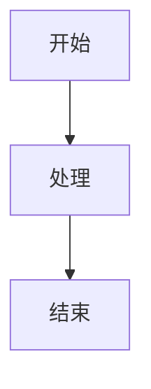

## 导出与内嵌

**命令行导出 SVG**（`@mermaid-js/mermaid-cli`）：

```bash
mmdc -i diagram.mmd -o output.svg -w 1920 -H 1080    # 指定尺寸
mmdc -i diagram.mmd -o output.svg -b "#ffffff"       # 指定背景色
mmdc -i diagram.mmd -o output.svg -b "transparent"   # 透明背景
```

**Markdown 内嵌**：直接用 ```` ```mermaid ```` 代码块，无需导出：

````markdown
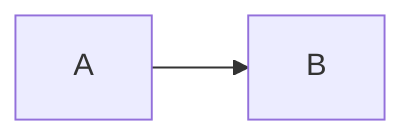
````

**网页内嵌自适应**：套一层限制宽度的容器：

```html
<div style="max-width: 100%; overflow: auto;">
    <pre class="mermaid">
        flowchart LR
            A --> B --> C
    </pre>
</div>
```

## 可访问性

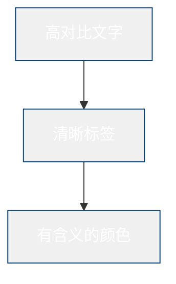

- 使用高对比度配色
- 不要只靠颜色传递含义，同时给出文字标签
- 用色盲模拟器检查配色
- 必要时提供深色模式版本

## 性能

- 节点超过 20 个时改用 `layout: elk` 并开启 `mergeEdges`
- 超大图拆成多张聚焦的小图，或用子图分层组织
- 样式只施加在关键元素上，避免全图刷色

## 最佳实践

1. 同一批图使用同一套主题，保持视觉一致
2. 不过度美化，颜色过多反而降低可读性
3. 手绘风（`handDrawn`）适合非正式场景，正式文档优先 `classic`
4. 复杂配置写注释说明非直觉的样式选择
5. 导出后实测目标渲染环境（GitHub、CNB、VS Code）效果
6. 主题变更随源码一起纳入版本控制
