# [计算机组成原理——CPU 的结构和功能](https://mp.weixin.qq.com/s/314KAavC00P3GDNWP1sxpQ)

## CPU 概述

CPU 包括运算器和控制器两大部分，以控制器的功能为重点。

### 控制器概述

控制器负责协调并控制计算机各部件执行过程的指令序列，其基本功能是：
- 取指令、分析指令、执行指令
- 发出各种操作命令
- 控制程序输入以及结果的输出
- 总线管理
- 处理异常情况和特殊情况

### CPU 框架图

- **寄存器**：用于存储当前指令的地址
- **控制器 CU**：用于控制指令（获取、分析、执行）
- **运算器 ALU**：用于完成算术运算以及逻辑运算
- **中断系统**：主要用于处理异常情况以及特殊请求

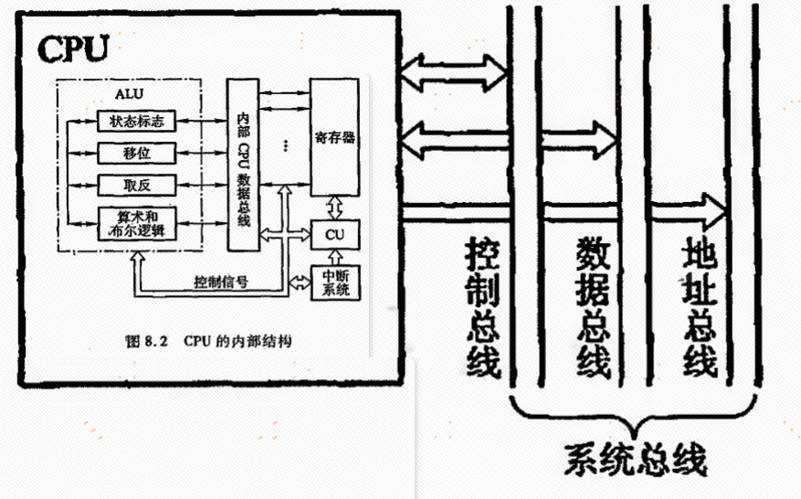

### CPU 寄存器

**用户可见寄存器**（通常 CPU 执行机器语言访问的寄存器）：
- **通用寄存器**：可由程序设计者指定许多功能，可用于存放操作数，也可作为满足某种寻址方式所需的寄存器
- **数据寄存器**：存放操作数（满足各种数据类型）
- **地址寄存器**：存放地址，也可用于特殊寻址方式（段取值、栈指针）
- **条件码寄存器**：存放条件码，作为程序分支的依据（正、负、零、溢出、进位等）

**控制和状态寄存器**（用于控制 CPU 的操作或运算）：
- **控制寄存器**：PC → MAR → M → MDR → IR（除 PC 外，其他用户均不可见）
- **状态寄存器**：PSW 寄存器（存放程序状态字）

### 控制单元 CU

CU 产生全部指令的微操作命令序列，有两种设计方法：
- **组合逻辑设计方法**：硬连线逻辑
- **微程序设计方法**：存储逻辑

## 指令周期

### 概述

**指令周期**：CPU 取出并执行一条指令所需要的全部时间。

完成一条指令普遍需要：
- 取指、分析（取指周期）
- 执行（执行周期）

每一条指令的指令周期不同。

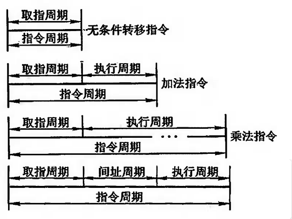

**带有中断周期的指令周期**：取指 → 间址 → 执行 → 中断。

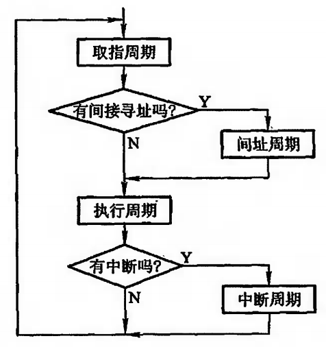

CPU 的工作周期包括四个周期：取指周期、间址周期、执行周期、中断周期。CPU 内设置 4 个标志触发器来区分它们。

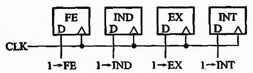

### 指令周期的数据流

**取指周期数据流**：

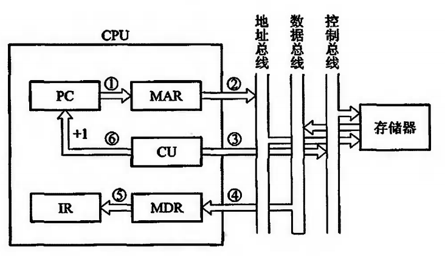

**间址周期数据流**：取指周期结束，CU 检查 IR 中的内容，确定是否有间址操作。如果需要间址操作，MDR 中指示形式地址的右 N 位将被送到 MAR。

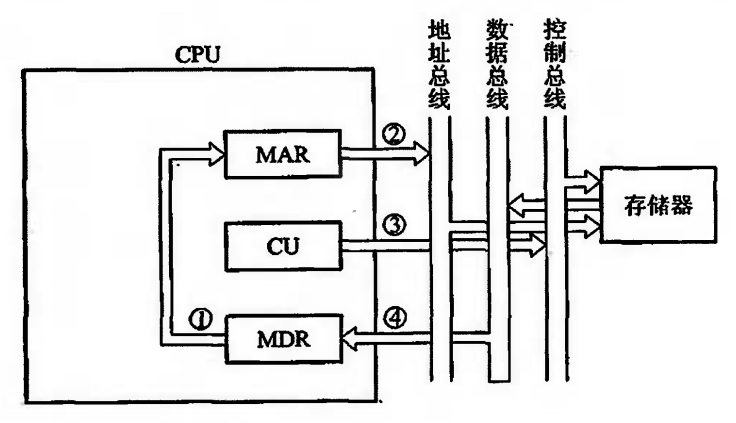

**执行周期数据流**：差异较多，各种指令各不相同。

**中断周期数据流**：CPU 进入中断周期要保存 PC 当前的内容，以便执行完中断服务程序后准确返回。

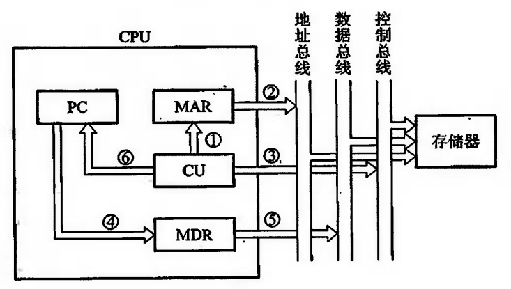

## 指令流水

### 如何提高机器速度？

- 提高访存速度（高速芯片、Cache 等）
- 提高 I/O 和主机之间的传送速度（中断、DMA、通道、I/O 处理机等）
- 提高运算器速度（高速芯片、改进算法、快速进位链等）
- 提高整机处理能力（高速器件、改进系统结构、开发系统的并行性等）

### 系统的并行性概念

- **并发**：两个或两个以上的事件在**同一时间段**发生。
- **同时**：两个或两个以上的事件在**同一时刻**发生（流水线方式）。

### 并行性的等级

- **过程级**（程序、进程）：粗粒度，软件实现。
- **指令级**（指令之间、指令内部）：细粒度，硬件实现。

### 指令流水的原理

**指令的串行执行**：取指令由取指令部件完成，执行指令由执行指令部件完成，取指和执行顺序进行。

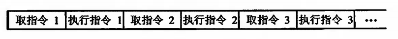

**指令的二级流水**：取指和执行阶段完全重叠，指令周期减半，速度提高一倍。

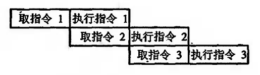

**影响指令流水效率加倍的因素**：
- 执行时间 > 取指时间时，取指令部件通过指令部件缓冲区向执行指令部件输送指令。
- 条件转移指令对指令流水的影响：必须等上条指令执行结束，才能确定下条指令的地址，造成时间损失。

**指令的六级流水**：

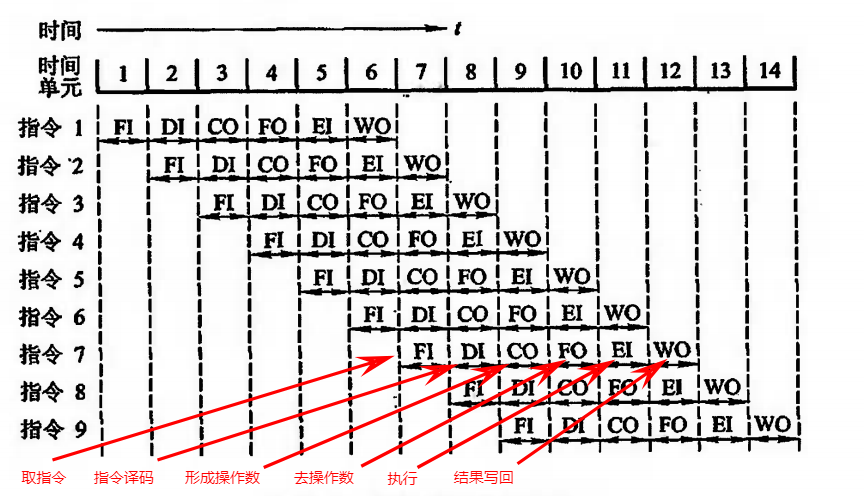

### 影响流水线性能的因素

**结构相关**：不同指令争用同一功能部件产生资源冲突。
- 解决方法：停顿、指令存储器和数据存储器分开、指令预取技术（适用于访存周期短的情况）。

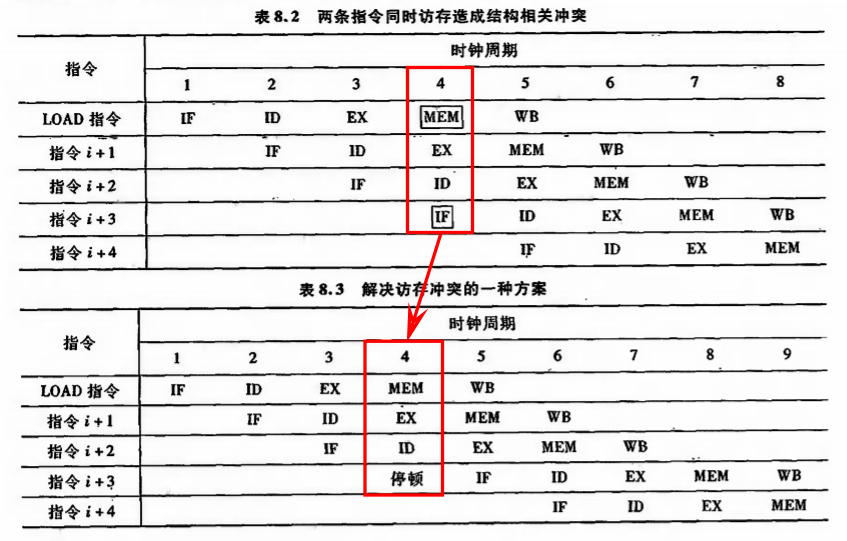

**数据相关**：不同指令因重叠操作，可能改变操作数的读/写访问顺序。
- 解决办法：后推法（类似停顿）、采用旁路技术（不需要等待计算结果写入寄存器再读取，计算出结果即可读取）。
- **写后读相关（RAW）**：需要读取到写之后的寄存器里的数据。
- **读后写相关（WAR）**：需要读取到写之前的寄存器的数据。
- **写后写相关（WAW）**：

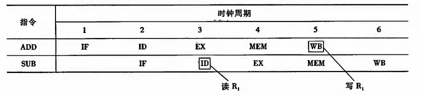

**控制相关**：由指令转移引起（类似于条件判断）。

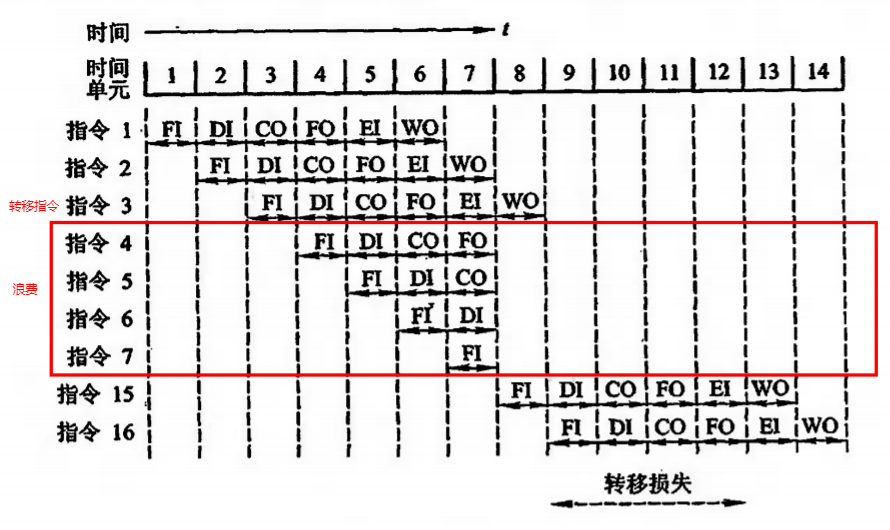

### 流水线的性能

**吞吐率**：单位时间内流水线所完成指令或者输出结果的数量。
- 对于 m 段的指令流水线，若各段的时间均为 △t：
  - 最大吞吐率：`TP_max = 1 / △t`
  - 实际吞吐率：`TP = n / (m + n - 1) × △t`

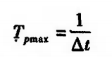

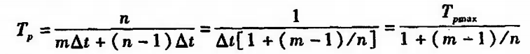

**加速比 Sp**：m 段的流水线的速度与等功能的非流水线的速度之比。
- 设流水线各段时间为 △t，完成 n 条指令在 m 段流水线共需时间：`T = (m + n - 1) × △t`
- 完成 n 条指令在等效的非流水线上共需时间：`T = n × m × △t`
- 加速比：`Sp = n × m / (m + n - 1)`

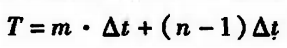

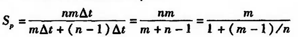

**效率**：流水线中各功能段的利用率。
- 效率 = 流水线各段处于工作时间的时空区 / 流水段中各段总的时空区

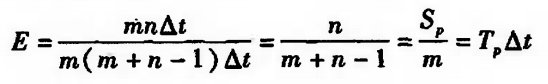

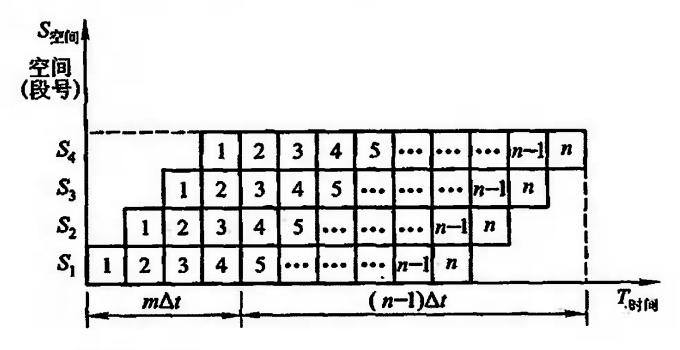

### 流水线的多发技术

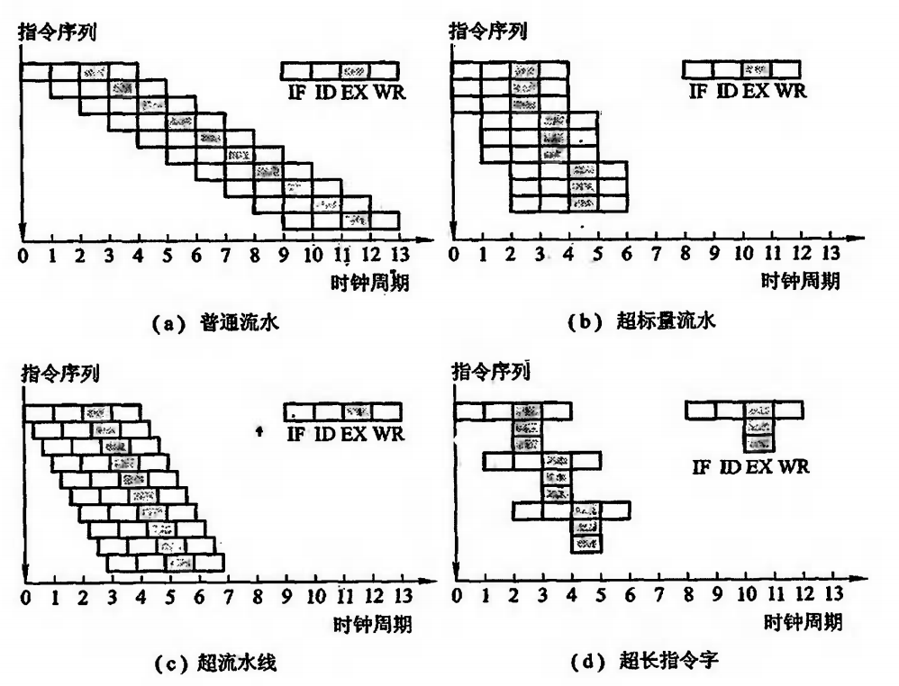

- **超标量技术**：每个时钟周期内可并发多条独立指令，配置多个功能部件。不能调整指令的执行顺序，通过编译优化技术把可并行执行的指令搭配起来。
- **超流水线技术**：在同一个时钟周期内再分段，依旧不能调整指令的执行顺序。
- **超长指令字技术**：由编译程序挖掘出指令间潜在的并行性，将多条能并行操作的指令组合成一条具有多个操作码字段的超长指令字（可达几百位）。

### 流水线结构

**指令流水线结构**：完成一条指令分成 6 段，每段需要一个时钟周期，每段之间需要加上锁存器（用于保存前面流水段的操作结果以及为下面流水提供操作数据）。

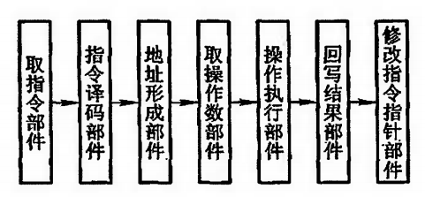

**运算流水线**：完成浮点加减法运算可分为对阶、尾数求和、规格化三段。

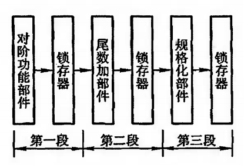

## 中断系统

### 概述

**引起中断的各种因素**：
- 人为设置的因素（如转管指令，通常出现在流水线处理器的上下文中，用于控制流水线操作的一组指令）
- 程序性事故（溢出、操作码等程序设计不周导致）
- 硬件故障（如电源掉电）
- I/O 设备（I/O 设备被启动后，一旦准备就绪，便向 CPU 发出中断请求）
- 外部事件（如键盘中断现行程序）

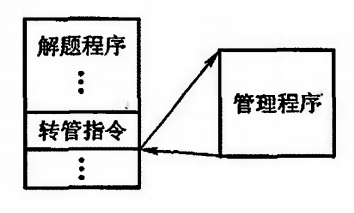

### 中断请求标记和中断判优逻辑

#### 中断请求标记 INTR

一个请求源对应一个中断请求标志触发器，多个中断请求标记组成中断请求标记寄存器。中断请求标记触发器有的集中在 CPU 的中断系统内，也有分散在各个中断源的接口电路中。

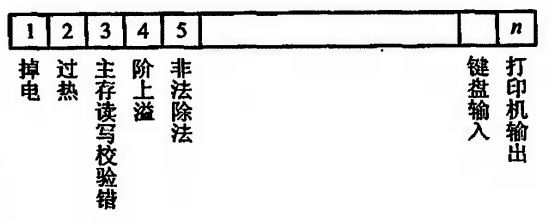

中断请求触发器越多，说明计算机处理中断的能力越强。

#### 中断判优逻辑

**硬件实现（排队器）**：
- 分散在各个中断源的接口电路中（链式排队器）
- 集中在 CPU 内部

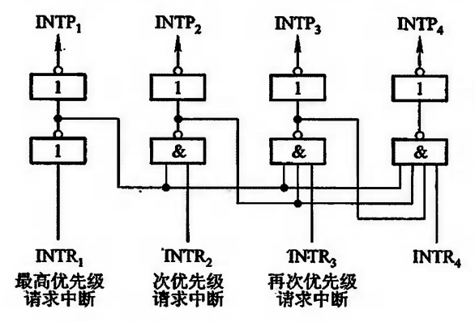

**软件实现（程序查询）**：编写代码实现查询中断服务程序。

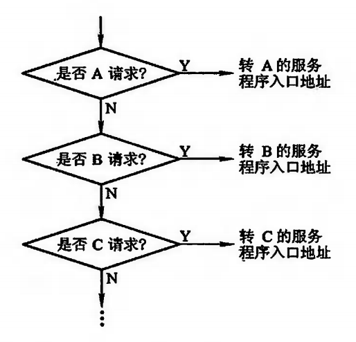

### 中断服务程序入口地址查询

**硬件向量法**：
1. 输入：排队器的输出 → 输出：中断向量地址
2. 通过输出的向量地址，在中断向量地址表中查询中断服务程序入口地址

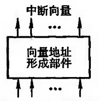

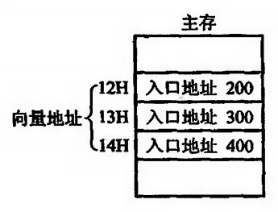

**软件查询法**：用软件寻找中断服务程序入口地址。相比硬件向量法，查询时间长，但方便用户使用，更加灵活。

### 中断响应

**响应中断的条件**：允许中断触发器 EINT = 1。
**响应中断的时间**：指令执行周期结束时刻，由 CPU 发出查询条件。

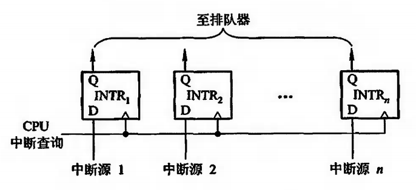

**中断隐指令**：在机器指令系统中没有的指令，由 CPU 在中断周期内由硬件自动完成。
- 保存程序断点：断点存于特定地址内；断点进栈
- 寻找服务程序入口地址
- 硬件关中断（防止其他优先级低的中断请求打断当前中断）

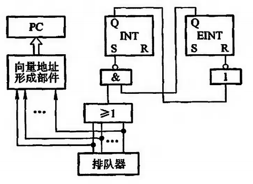

### 保护现场和恢复现场

**保护现场**：
- 保护断点：中断隐指令完成
- 保护 CPU 内部各寄存器内容：中断服务程序完成

**中断服务程序的四个步骤**：
1. 保护现场 PUSH（保存在堆栈中）
2. 其他服务程序（视不同请求源而定）
3. 恢复现场 POP
4. 中断返回 IRET

**恢复现场**：在中断返回前，将寄存器的内容恢复到中断处理前的状态，由中断服务程序完成。

### 多重中断

#### 概述

当 CPU 正在执行某个中断服务程序时，另一个中断源又提出了新的中断请求，而 CPU 又响应了这个新的请求，暂时停止正在运行的服务程序，转去执行新的中断服务程序，称为多重中断（中断嵌套）。

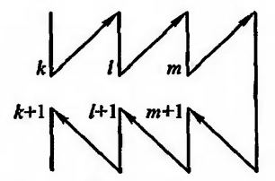

#### 实现多重中断的条件

- 提前设置开中断指令
- 优先级别高的中断源有权中断优先级别低的中断源

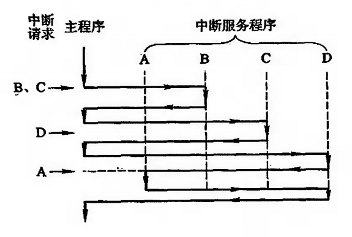

#### 屏蔽技术和屏蔽字

**屏蔽技术**：使某个中断源无法向 CPU 提出中断请求，也不能参加中断优先级排队器。

触发器 D、中断请求触发器 INTR、屏蔽触发器 MASK。

如果排队器集中设在 CPU 内，加上屏蔽条件，就可组成具有屏蔽功能的排队器。

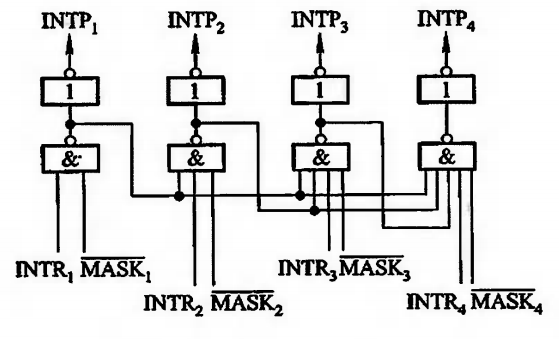

**屏蔽字**：对应每个中断请求触发器就有一个屏蔽触发器，将所有屏蔽触发器组合在一起构成屏蔽寄存器，屏蔽寄存器的内容称为屏蔽字。

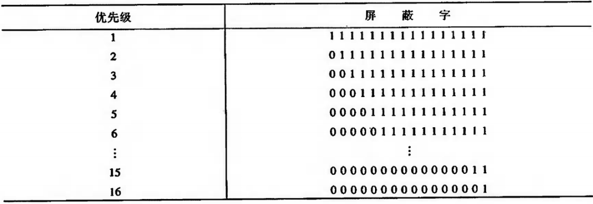

**屏蔽技术可以改变处理优先级等级**：
- 优先级包含响应优先级和处理优先级。
- 响应优先级：CPU 响应各中断源请求的优先次序，由硬件线路设置，不便于改动。
- 处理优先级：CPU 实际对各中断源请求的处理优先次序（不采用屏蔽技术时，响应优先级就是处理优先级）。

修改屏蔽字前后的变化：

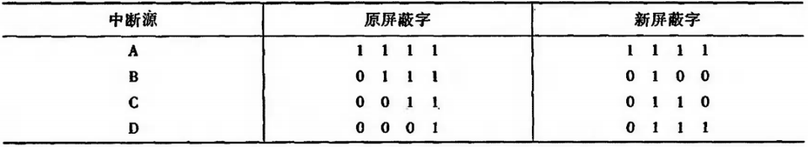

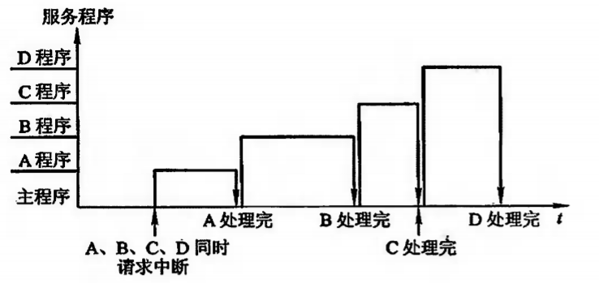

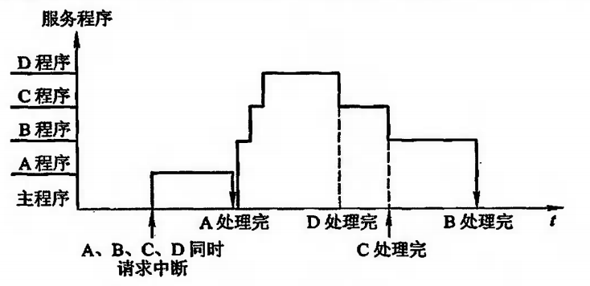

**新屏蔽字的设置**：

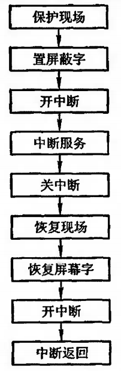

#### 多重中断的断点保护

多重中断时，每次中断出现的断点都必须保存起来。
- 断点可以保存在堆栈中，由于堆栈先进后出的特点，实现对断点的保存和恢复。
- 断点也可保存在特定的存储单元内，在中断服务程序中的开中断指令之前，必须先将 0 地址单元的内容转存至其他地址单元中，才能真正保存每一个断点。