# [计算机组成原理——存储器（上）](https://mp.weixin.qq.com/s/fwRyIIe7WO-Odiv3V3QYng)

> 大家好呀！我是小笙，由于存储器这部分章节内容较多，我分成两部分进行总结，以下是第一部分，希望内容对你有所帮助！

## 概述

存储器是计算机系统中的记忆设备，用来存放程序和数据。

### 存储器分类

存储器分类主要按照存储介质、存储方式以及计算机中的作用来进行分类。

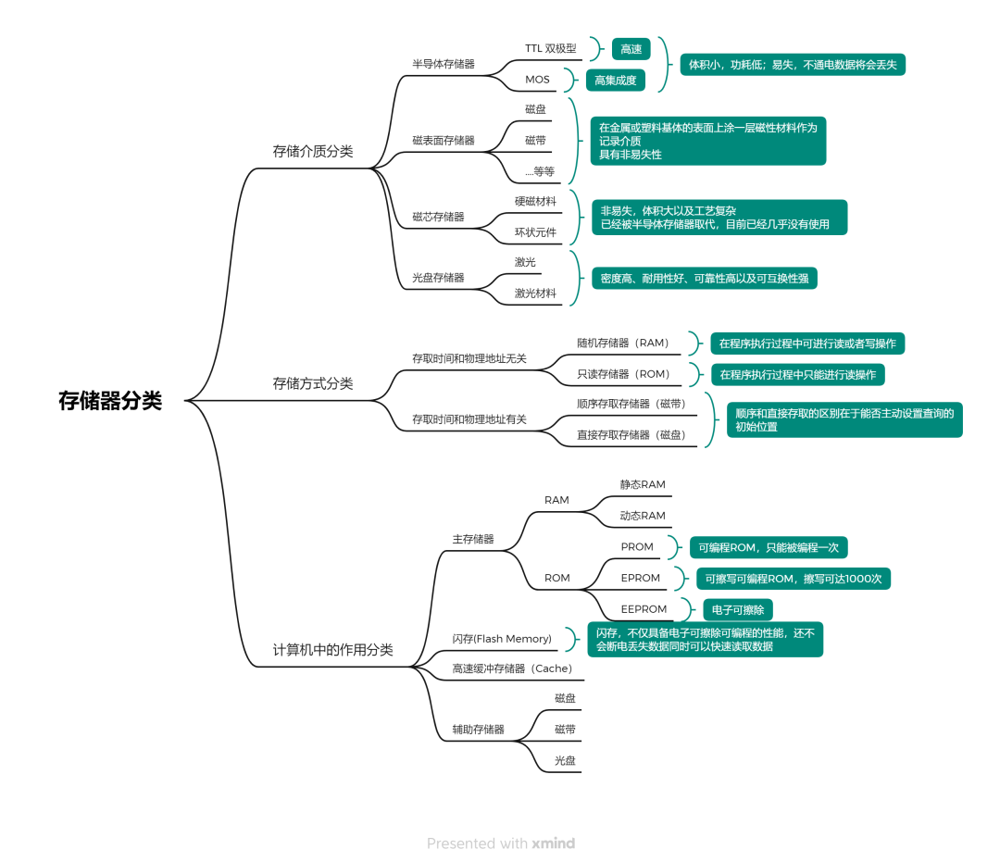

### 存储器的层次结构

从速度、容量以及价格三个性能指标来分析存储器。

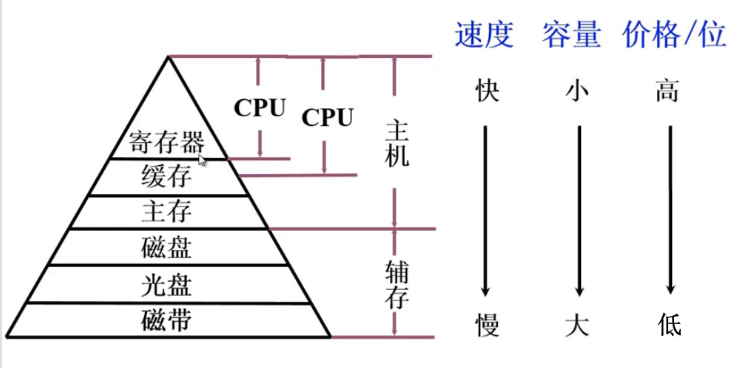

## 主存储器

### 概述

主存储器简称主存，是计算机硬件的一个重要部件。它的主要作用是存放指令和数据，并能由中央处理器（CPU）直接随机存取。

#### 主存储器的组成

**MAR 寻址操作**：根据 MAR 中的地址访问某个存储单元时，还需经过地址译码、驱动等电路，才能找到所需访问的单元。

**MDR 数据读入写出操作**：
- 读出时，需经过读出放大器，才能将被选中单元的存储字送到 MDR。
- 写入时，MDR 中的数据也必须经过写入电路才能真正写入到被选中的单元中。

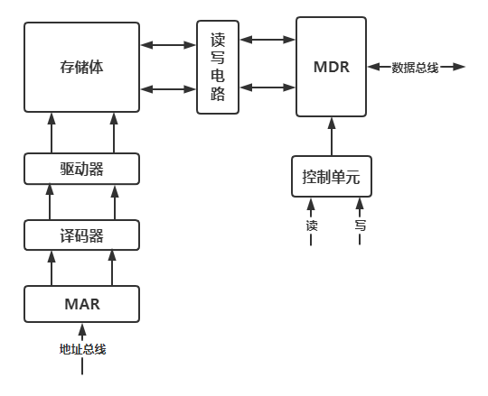

#### 主存和 CPU 之间的联系

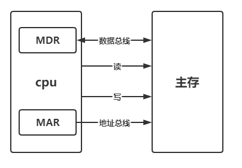

#### 主存中存储单元地址的分配

主存储器被划分为许多存储单元，每个存储单元都有一个唯一的地址。

主存中存储单元地址的分配还涉及到字节顺序的问题，即大端模式和小端模式。假设用每个存储字 32 位来存储 `12345678H` 数据：

- **大端大尾方式**：高位字节地址为字地址。
- **小端小尾方式**：低位字节地址为字地址。

#### 主存中的技术指标

主存的主要技术指标是**存储容量**和**存储速度**。

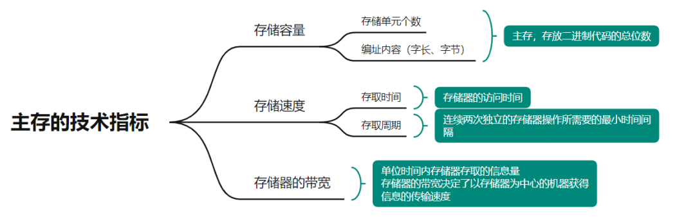

### 半导体存储芯片

#### 基本结构

译码驱动能把地址总线送来的地址信号翻译成对应存储单元的选择信号，该信号在读/写电路的配合下完成对被选中单元的读/写操作。

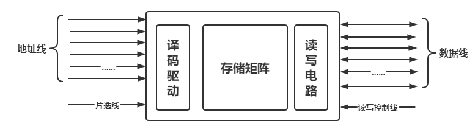

地址线是单向输入的，数据线是双向的，它们的位数与芯片容量有关。

#### 译码驱动方式

译码驱动方式有两种：线选法和重合法。

**线选法**：一种直接寻址方式，每个存储单元由一个独特的地址线组合直接选中，每个存储单元或其对应的存储位都有一个专用的选择线。

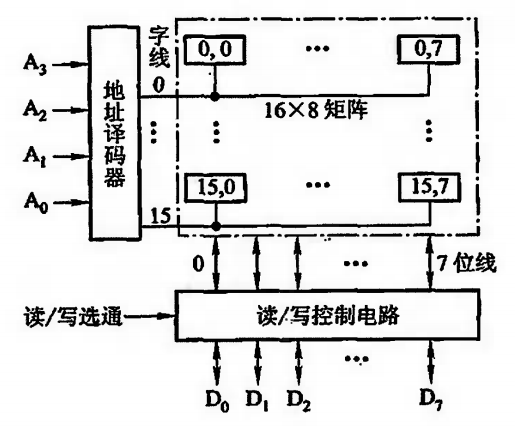

**重合法**：一种寻址技术，通过减少地址线的数量来实现更高效的存储器寻址。地址线被复用，即同一组地址线在不同的时间阶段用于传递不同的地址信息。

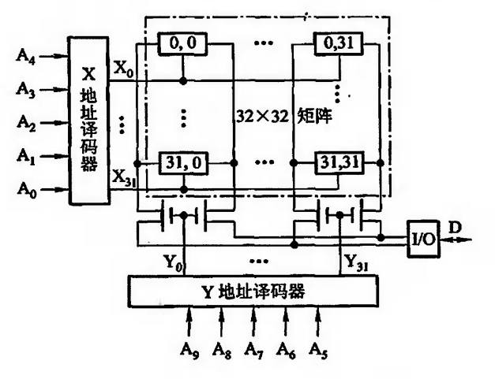

在实际的存储器设计中，通常会根据存储器的容量、性能要求、成本和功耗等因素来选择合适的寻址方法。重合法在**较高密度**的存储器设计中更为常见，因为它可以更有效地利用地址线资源。而线选法则在一些**对速度要求较高或者存储容量较小**的应用中更为合适。

### 随机存取存储器（RAM）

#### 静态 RAM（SRAM）

存储器中用于寄存"0"和"1"代码的电路称为存储器的基本单元电路。

**静态 RAM 基本电路**：
- 存储器：T1-T4；行开关：T5-T6；列开关：T7-T8（T5-T8 都属于晶体管）
- 位线 A 为触发器原端、位线 A' 为触发器非端（A 取反）

**读写操作**：
- **读操作**：置行地址、列地址有效，触发器 A 电平会通过 T6、T8 最后通过读出放大器进行读出。
- **写操作**：置行地址、列地址有效，电平会从 Din 写入，会先取反，然后通过 T5-T8，将数据保存到触发器中。

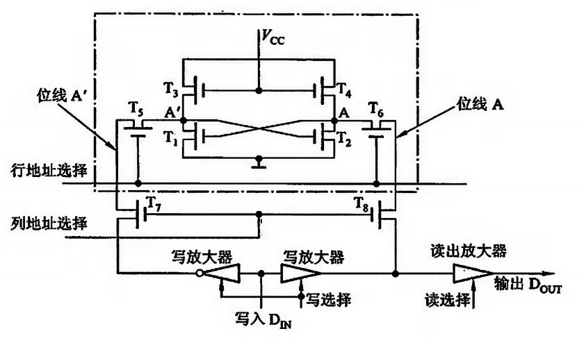

#### 动态 RAM（DRAM）

**动态 RAM 基本单元电路**：靠电容存储电荷的原理来寄存信息。若电容上存在足够多的电荷表示存"1"，电容上无电荷表示存"0"。

**三管 MOS**：

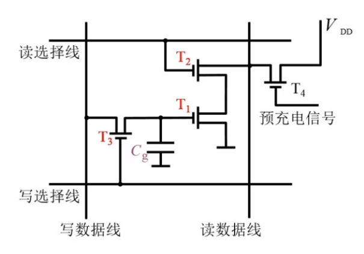

- 读出时，先对预充电管 T4 置一预充电信号，使读数据线达到高电平 VDD。然后由读选择线打开 T2，若 T1 的极间电容 Cg 存有足够电荷（被认为原存"1"），使 T1 导通，则因 T2、T1 接地，使读数据线降为零电平，读出"0"信息；若 Cg 没有足够电荷（原存"0"），则 T1 截止，读数据线为高电平不变，读出"1"信息。可见，读出线的高低电平可以区分"1"和"0"，且**读出与原存信息相反**。
- 写入时，将写信号加到写数据线上，然后由写数据线打开 T3，这样 Cg 便能随输入信息充电（写"1"）或放电（写"0"），且**写入与输入信息相同**。

**单管 MOS**：

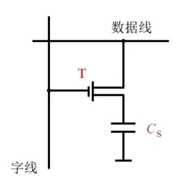

- 读出时，字线上的高电平使 T 接通，若 Cs 有电荷，视为"1"；若 Cs 无电荷，视为"0"。（读出结束时，Cs 中电荷释放完毕，所以为破坏性读出，必须再生。）
- 写入时，字线上的高电平使 T 接通，若数据线为高电平，经过 T 对 Cs 充电，使其存"1"；若数据线为低电平，Cs 经 T 放电，使其存"0"。

#### 动态 RAM 刷新（刷新与行地址有关）

刷新的过程实质上是先将原存信息读出，再由刷新放大器形成原信息并重新写入的再生过程。再生周期就是在一定的时间内，对动态 RAM 的全部基本单元电路作一次刷新操作。

**集中式刷新**（存取周期为 0.5μs，刷新周期为 2ms）：

以 128×128 为例：

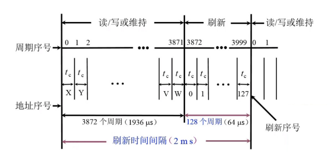

- 死区：0.5μs × 128 = 64μs（死区就是不能进行读写操作的时间）
- 死时间率：128/4000 × 100 = 3.2%

**分散刷新**（存取周期为 1μs，刷新周期为 2ms）：

以 128×128 为例：

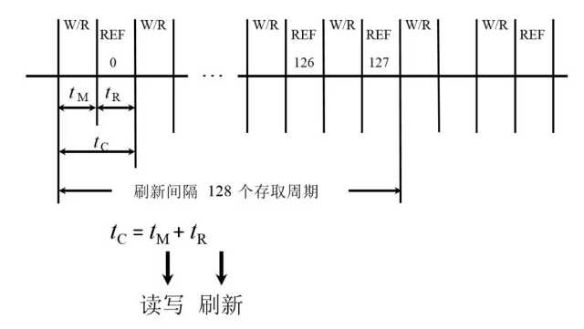

- 优点：没有死区

**异步刷新**（分散刷新与集中刷新相结合）：

以 128×128 为例（若每隔约 15.6μs 刷新一行）：

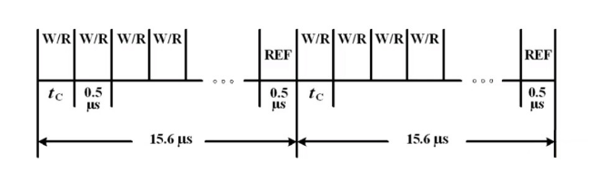

- 每行每隔 2ms 刷新一次；死区为 0.5μs
- 优点：将刷新安排在指令译码阶段，不会出现"死区"问题

#### 静态 RAM vs 动态 RAM

DRAM（动态 RAM）常用于做主存；SRAM（静态 RAM）常用于做缓存。

### 只读存储器（ROM）

初衷是一旦注入原始信息就不能再改变了，但是随着市场的需要，希望能改变原来的数据，便出现了后续可以修改数据的只读存储器。

**发展历程**：
1. 早期的只读存储器——由厂家写内容（MROM）
2. 改进 1——用户可以自己写（一次性）（PROM）
3. 改进 2——可以多次写（要能对信息进行擦除）（EPROM）
4. 改进 3——电可擦写（特定设备）（EEPROM）
5. 改进 4——电可擦写（直接连接到计算机）

#### 掩模 ROM（MROM）

一种只读存储器，它在制造过程中被编程，并且一旦编程完毕，其内容就无法再次修改。

**实现原理**：通过行地址以及列地址来确定输出哪个位置的数据，然后通过是否存在 MOS 管来决定输出的数据是 0 还是 1，最后通过放大器输出。
- 行列选择交叉处有 MOS 管为"1"
- 行列选择交叉处无 MOS 管为"0"

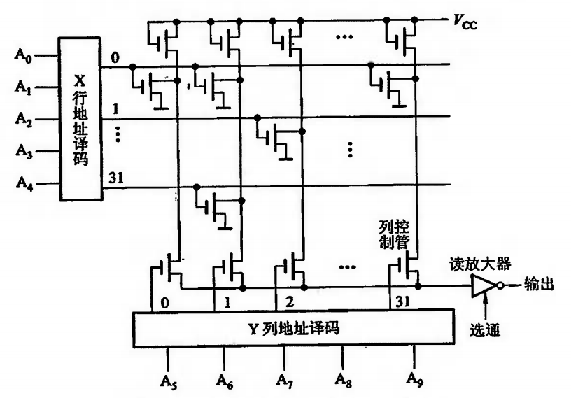

#### PROM（一次性编程）

PROM 是可以实现一次性编程的只读存储器。

**实现原理**：通过熔丝是否熔断来进行判断 0 还是 1，但是熔断之后无法再恢复，所以只能让用户实现一次编程。
- 熔丝断："0"
- 熔丝未断："1"

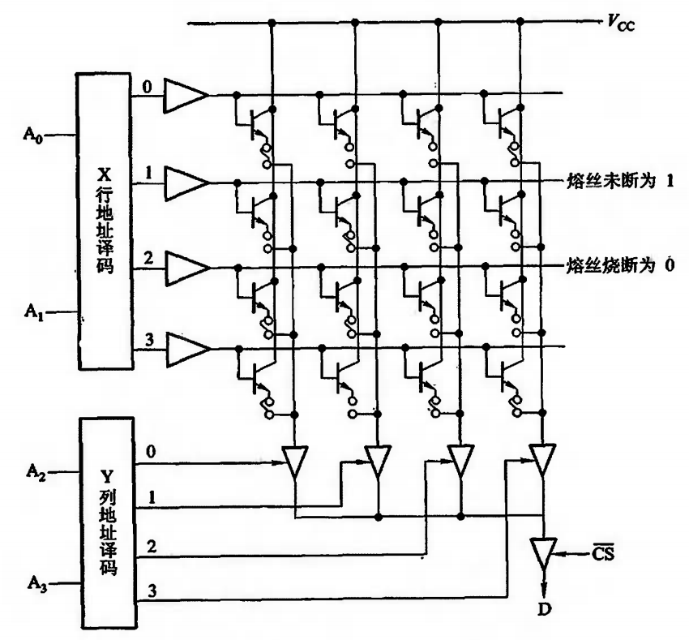

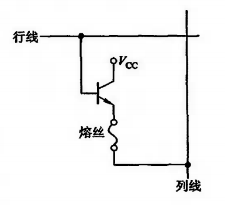

#### EPROM（多次性编程）

EPROM 是一种可擦除可编程只读存储器。N 型沟道浮动栅 MOS 电路（利用紫外线进行擦除）。
- D 端加正电压 → 形成浮动栅 → S 与 D 不导通为"0"
- D 端不加正电压 → 不形成浮动栅 → S 与 D 导通为"1"

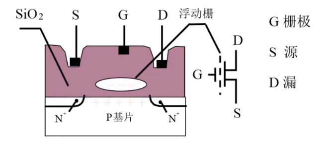

注意：如果需要重置数据，可用紫外线照射的方式驱散浮动栅。

#### EEPROM（多次性编程）

一种可以在电子设备中使用多次的存储器芯片，允许数据被多次编程和擦除，而不需要从电路板上移除芯片。
- **多次编程**：EEPROM 可以被重新编程多次
- **非易失性**：EEPROM 在断电后仍能保留数据
- **擦除和编程速度**：相对较慢
- **有限的生命周期**：通常有数十万到数百万次的编程/擦除周期

#### Flash Memory（闪速型存储器）

一种非易失性存储技术，可以在电力供应的情况下快速擦除和编程。

#### EPROM、EEPROM、Flash Memory 三者区别

- **EPROM**——价格便宜，集成度高，需要紫外线照射来擦除，不支持多次编程
- **EEPROM**——电可擦洗重写，允许数据被多次编程和擦除
- **Flash Memory**——支持更快速的擦除和编程操作，通常用于更大的存储容量

### 存储器与 CPU 的连接

#### 存储器容量的扩展

**位扩展**：用 2 片 1K×4 位存储芯片组成 1K×8 位的存储器。地址线 A0-A9；数据线拼接成 D0-D7。

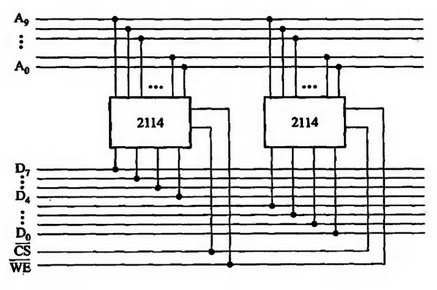

**字扩展**：用 2 片 1K×8 位存储芯片组成 2K×8 位的存储器。A10 决定存储在哪个存储芯片里。

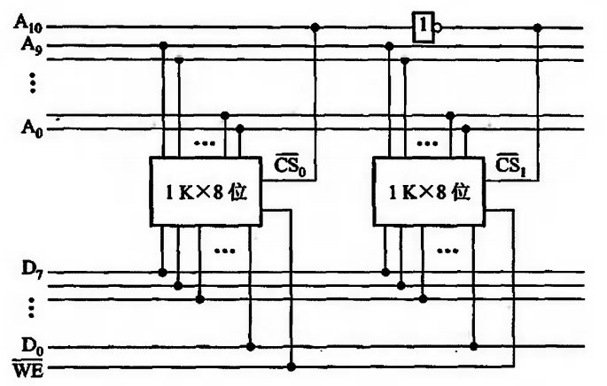

**字、位扩展**：用 8 片 1K×4 位存储芯片组成 4K×8 位的存储器。

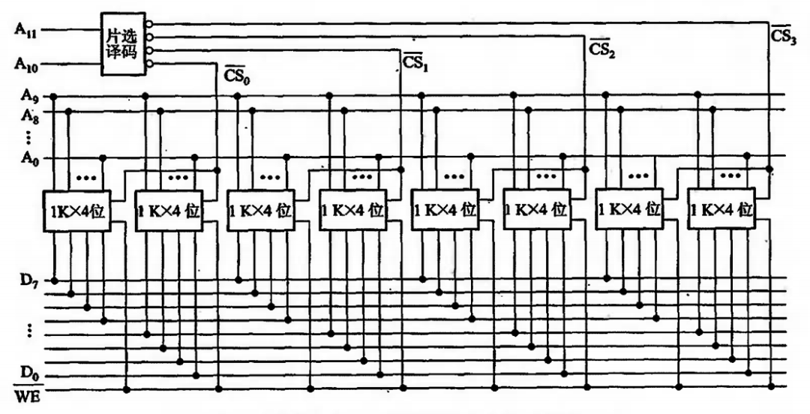

#### 存储器与 CPU 的连接要点

- **地址线的连接**：通常将 CPU 地址线的低位与存储芯片的地址线相连，高位做片选或其他用途
- **数据线的连接**：数据位数不同时需对存储芯片扩位
- **读/写命令线的连接**：一般可直接与存储芯片的读/写控制端相连，高电平为读，低电平为写
- **片选线的连接**
- **合理选择存储芯片**：ROM 存放系统程序，RAM 为用户编程设置
- **其他**（时序、负载等）

### 存储器的校验

在计算机运行过程中，由于种种原因致使数据在存储过程中可能出现差错。为了能及时发现错误并及时纠正，通常可将原数据配成海明编码。

**合法代码集合**：任意两组合法代码之间二进制位数的最小差异，编码的纠错、检错能力与编码的最小距离有关。

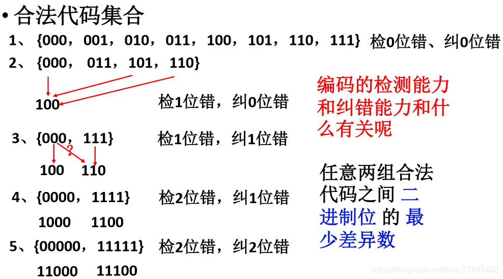

> L - 1 = D + C（D ≥ C）
> - L：编码的最小距离
> - D：检错的位数
> - C：纠错的位数

#### 海明码

**码距**：又叫海明距离，是在信息编码中，两个编码之间对应位上编码不同的位数。例如编码 100110 和 010101，第 1、2、5、6 位都不相同，所以这两个编码的码距就是 4，可以通过异或的方式求出。

**工作流程**：
1. **确定校验码位数 r**：数据位数为 m，校验码位数为 r，满足 **2^r ≥ m + r + 1**
2. **确定校验码和数据的位置**
3. **求出校验码的值**：根据偶校验分组计算
4. **海明码组合**
5. **检错并纠错**

### 提高访存速度的措施

不仅可采用高速器件、层次结构 Cache-主存，还可调整主存结构方式来提高访存的速度。

**单体多字系统**：程序和数据在存储体内连续存放，在一个存取周期内从同一地址中取出多条指令。存在问题：若数据不连续，会取出无用数据。

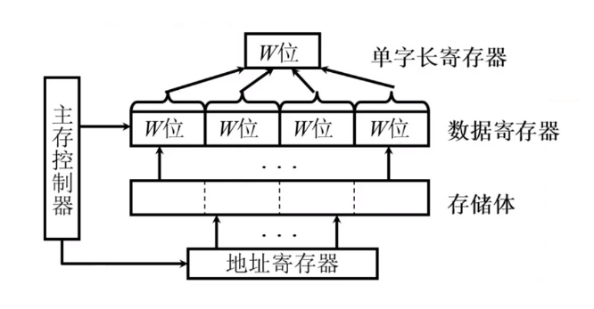

**多体并行系统（顺序编址）**：采用多体模块组成的存储器，主要应用于存储器容量的扩展。存在问题：某个存储体可能非常繁忙，其余存储体空闲。

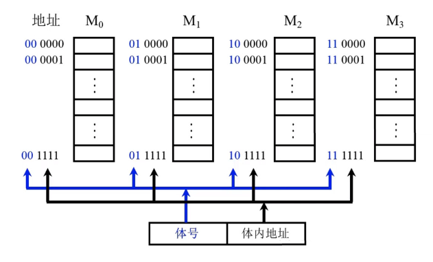

**低位交叉（各个体轮流编址）**：主要应用于存储器的带宽和访问速度的提高（低位地址可表示体号，高位地址为体内地址）。

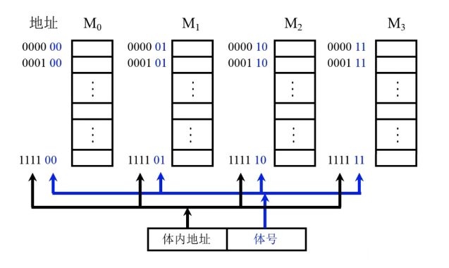

**低位交叉的特点**：
- 物理地址（体号）与虚拟地址（体内地址）的区别
- 在不改变存储周期的前提下，增加存储器的带宽

**高性能存储芯片（了解）**：SDRAM、RDRAM、带 Cache 的 DRAM。