# [计算机组成原理——存储器（下）：Cache 与辅助存储器](https://mp.weixin.qq.com/s/CXYk37R_kymW0IyisvCqyQ)

## 高速缓冲存储器

### 概述

**目的**：避免 CPU **空等**现象。

**原理**：程序访问的局部性原理（指令和数据在主存地址分布不是随机的，而是相对地簇聚，也就是说程序大部分访问都是少数的指令和数据）。

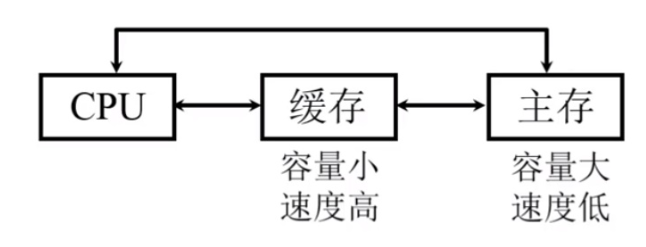

---

### Cache 工作原理

#### 主存和缓存的编址

- 主存和缓存按块存储，块的大小相同（B 就是块的大小）。
- Cache 内的块内地址不仅大小和主存一样，而且取值也是一样的。
- Cache 内的标记就是用来记录主存的主存块号。

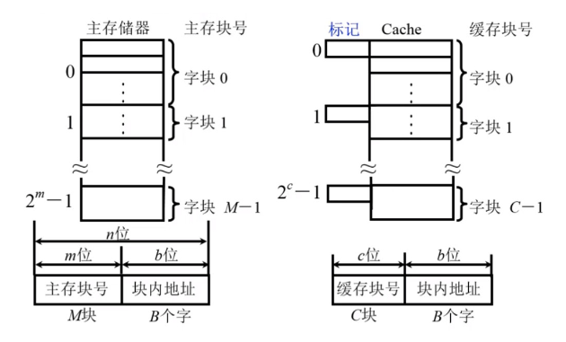

#### 命中与未命中

缓存共有 C 块，主存共有 M 块（M >> C）。

- **命中**：CPU 所要访问的数据已经从主存储器映射到了 Cache 缓存中（用标记建立起与主存的关系）。
- **未命中**：CPU 所要访问的数据没有在 Cache 缓存中找到。
- **命中率 h**：CPU 欲访问的信息在 Cache 中的比率（与 Cache 的容量和块长有关）。
- **访问效率 e**：`tc / (h * tc + (1 - h) * (tm + tc)) * 100%`（区间：`[tc/tm, 1]`），其中 tc 为访问 Cache 的时间，tm 为访问主存的时间。

#### 示例详解

假设 CPU 执行某段程序时，共访问 Cache 命中 3000 次，访问主存 20 次。已知 Cache 的存取周期为 50ns，主存的存取周期为 200ns，求 Cache-主存系统的命中率、访问效率和平均访问时间？

- 命中率 = 命中 Cache 的次数 / 总次数 = 3000 / (3000 + 20)
- 平均访问时间 = Cache 存取周期 × 命中率 + (1 - 命中率) × 主存存取周期 = 50ns × h + (1 - h) × 200ns
- 访问效率 e = 访问 Cache 的时间 / 平均访问时间 × 100% = 50ns / [50ns × h + (1 - h) × 200ns]

---

### Cache 的基本结构

CPU（通过**地址总线**）给出地址，这个地址包括**（主存）块号**和**块内地址**。块内地址直接传给 Cache，使用块号在**主存 Cache 地址映像机构**中确认**是否命中**。如果发生命中，得到 Cache 的块号；如果未命中，查看 Cache 中**是否有空间可装入主存块**。若有，访问主存装入 Cache；若没有，启用**Cache 替换机构**，根据替换算法，决定 Cache 中哪块可以被替换，然后**访问主存替换 Cache** 即可。

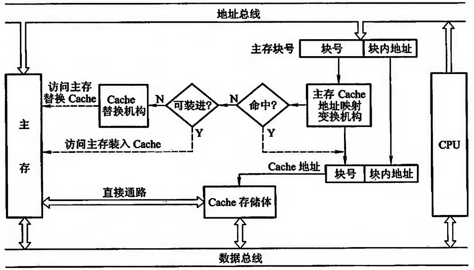

它主要由 Cache 存储体、地址映射变换机构、Cache 替换机构几大模块组成。

- **Cache 存储体**：以块为单位与主存交换信息，为加速 Cache 与主存之间的调动，主存大多采用多体结构，且 Cache 访存的优先级最高。
- **地址映射变换机构**：将 CPU 送来的主存地址转换为 Cache 地址。
- **Cache 替换机构**：当 Cache 内容已满，无法接受来自主存块的信息时，由 Cache 内的替换机构按一定的替换算法来确定应从 Cache 内移出哪个块返回主存，而把新的主存块调入 Cache。
- **Cache 的读写操作**：
  - **写直达**：写操作数据既写入 Cache 又写入主存；写操作时间就是访问主存的时间。
  - **写回法**：写操作只把数据写入到 Cache 缓存而不写入主存；当 Cache 写入的数据要被替换的时候才写入主存。
  - **读操作与写操作**：Cache 对用户来说是透明的。

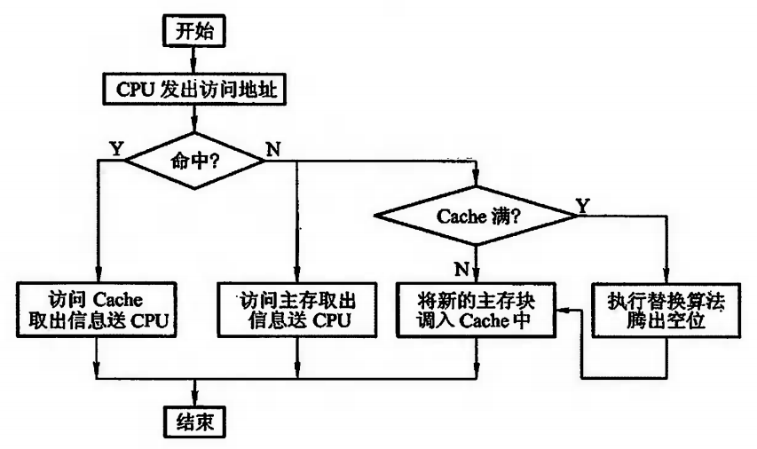

---

### Cache 的改进

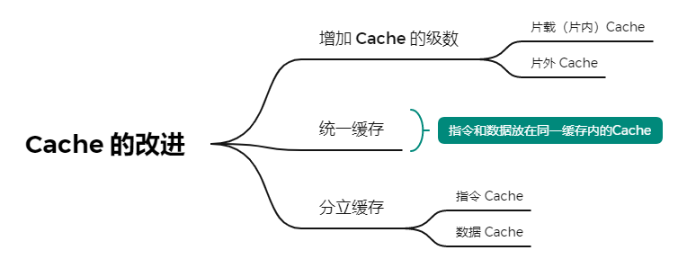

**片内缓存**（单一缓存）：在 CPU 和主存之间只设一个缓存。片内缓存与 CPU 之间的数据通路很短，大大提高了存取速度，外部总线又可更多地支持 I/O 设备与主存的信息传输，增强了系统的整体效率。但容量不可能很大。

**片外缓存**（二级缓存）：由比主存动态 RAM 和 ROM 存取速度更快的静态 RAM 组成。

**统一缓存 vs 分立缓存**：
- 与主存结构有关：主存统一则 Cache 统一，主存分开则 Cache 分立。
- 与指令执行的控制方式有关：采用超前控制或流水线控制时，一般采用分立缓存。

---

### Cache-主存的地址映射

由主存地址映射到 Cache 地址称为地址映射。地址映射方式有直接映射、全相联映射、组相联映射三种。

#### 直接映射

- 每个缓存块 i 可以和若干个主存块对应。
- 每个主存块 j 只能和一个缓存块对应。

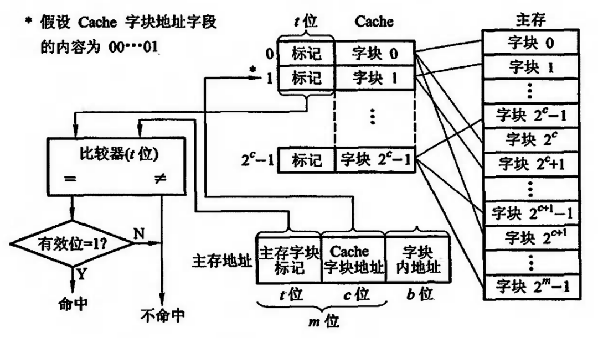

**说明**：
- 主存字块标记（区号）：将主存分成 2^t 倍 Cache 大小，t 的位数取决于主存 / Cache 的大小。
- Cache 字块地址（块号）：主存每个区都会对应字块 2^c 方块数，Cache 中也会有对应的块号与之一一对应。

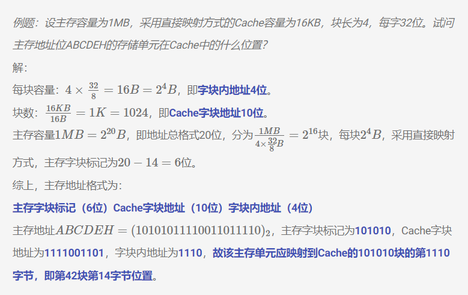

**优点**：实现简单，只需利用主存地址的某些位直接判断。

**缺点**：不够灵活，每个内存块只能固定地对应某个缓存块，即使缓存内还空着许多位置也不能占用，使缓存的存储空间得不到充分的利用。

#### 全相联映射

允许主存中每一字块映射到 Cache 中的任何一块位置上。

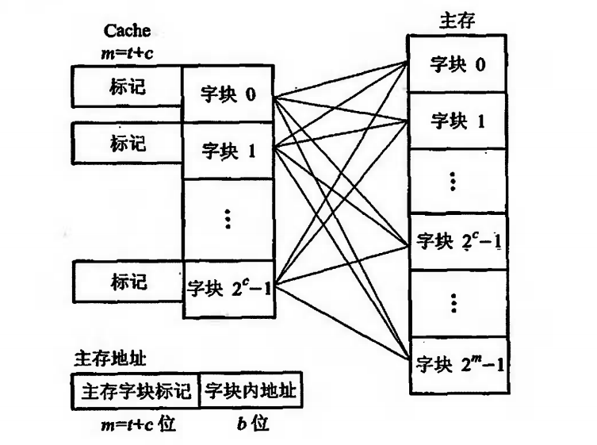

**优点**：灵活，命中率高，缩短了块冲突率。

**缺点**：
- 主存字块标记需要与 Cache 的所有标记进行**同时**比较，电路会非常复杂。
- 标记位数增多，比较器长度增长。

#### 组相联映射

对直接映射和全相联映射的一种折中。`i = j mod Q`（某一主存块 j 按模 Q 映射到缓存的第 i 组中的任一块）。

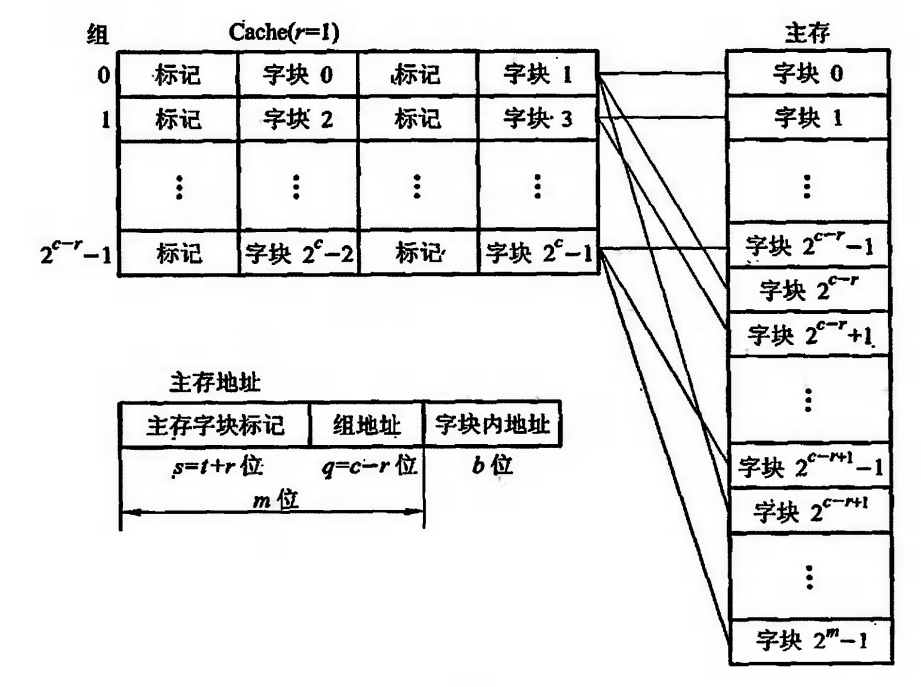

**说明**：主存的字块号对应了 Cache 的组数，Cache 的组数决定可以主存相同块号同时放入 Cache 中的数量。

**优点**：
1. **减少了冲突失效**：与直接映射相比，组相联映射通过将主存块映射到一组而不是单一的缓存块，减少了因为多个频繁访问的内存块映射到同一个缓存块而产生的冲突失效。
2. **简化了替换策略**：由于一个组内有多个块可供选择替换，因此替换策略的实施比全相联映射简单，只需在组内进行选择。
3. **灵活性和适应性强**：组相联映射可以根据缓存的大小和设计，调整组的大小，从而提供更好的性能和适应性。
4. **成本适中**：与全相联映射相比，组相联映射在硬件实现上的成本更低。

**缺点**：
1. **硬件复杂性高于直接映射**：需要额外的硬件来识别和选择组内的缓存块。
2. **并行度低于全相联映射**：仍然存在一定程度的冲突失效，限制了并行访问缓存的能力。

#### 例题详集

**例题 1：直接映射**：假设有一个 Cache，容量为 16KB，块大小为 4 字节，使用直接映射技术。主存地址为 32 位。求：
1. Cache 中有多少个块？
2. Cache 的索引位数是多少？
3. 主存地址 0x0000A5F8 会被映射到 Cache 的哪个块？

**解答**：
1. Cache 的总块数 = 16KB / 4B = 4096 个块
2. 索引位数 = log₂(4096) = 12 位
3. 地址 0x0000A5F8 的索引部分是 A5F8 的后 12 位，即 0x5F8

**例题 2：组相联映射**：Cache 容量 32KB，块大小 8 字节，2 路组相联，求：
1. Cache 中有多少个块？
2. Cache 的组数是多少？
3. 主存地址 0x00012345 会被映射到哪个组？

**解答**：
1. 总块数 = 32KB / 8B = 4096 个块
2. 组数 = 4096 / 2 = 2048 组
3. 索引位数 = log₂(2048) = 11 位，索引为 0x345

**例题 3：全相联映射**：Cache 容量 8KB，块大小 16 字节，全相联映射，求：
1. Cache 中有多少个块？
2. 主存地址 0x00005678 会被映射到哪个块？

**解答**：
1. 总块数 = 8KB / 16B = 512 个块
2. 全相联映射不需要索引位，任何块都可以映射到任何一个地址，具体取决于替换策略和当前 Cache 状态。

---

### 替换算法

#### 先进先出（FIFO）算法

选择最早调入 Cache 的字块进行替换，它不需要记录各字块的使用情况。

- **优点**：比较容易实现，开销小。
- **缺点**：没有根据访存的局部性原理，故不能提高 Cache 的命中率。

#### 近期最少使用（LRU）算法

LRU 算法比较好地利用访存局部性原理，替换出近期用得最少的字块。它需要随时记录 Cache 中各字块的使用情况，以便确定哪个字块是近期最少使用的字块。

**优点**：平均命中率比 FIFO 高。

---

## 辅助存储器（了解）

### 概述

辅助存储器，也称为外部存储器或第二存储器，是计算机系统中用于长期存储大量数据和程序的设备，与主存储器（RAM）相对。数据在断电后仍然可以保持。

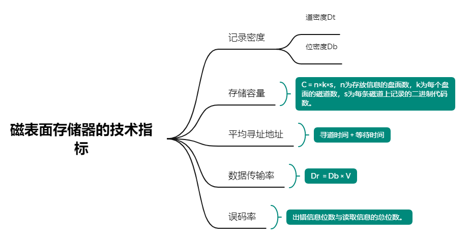

**关键指标**：
- **记录密度**：决定了磁盘上可以存储多少数据位。
- **存储容量**：由磁盘的数量、尺寸以及存储密度决定。
- **平均寻址时间**：包括寻道时间和等待时间。
- **数据传输速率**：受限于磁盘的旋转速度和磁头的读写能力。
- **误码率**：与存储介质的品质、磁头的技术以及读写过程的准确性有关。

### 磁记录原理

利用磁性的变化来存储和读取数据的技术。本质就是利用磁体的南北极来对应二进制的 0 和 1。

**写入过程**：输入信息 → 电信号 → 磁头线圈产生磁场 → 磁介质表面产生磁化区域。

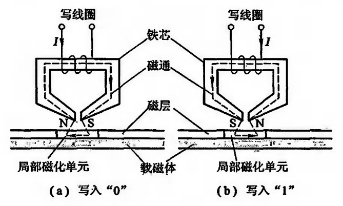

**读取过程**：磁头移动到磁化区域上方 → 磁化状态影响磁头磁场 → 转换成电信号 → 恢复原始信息。

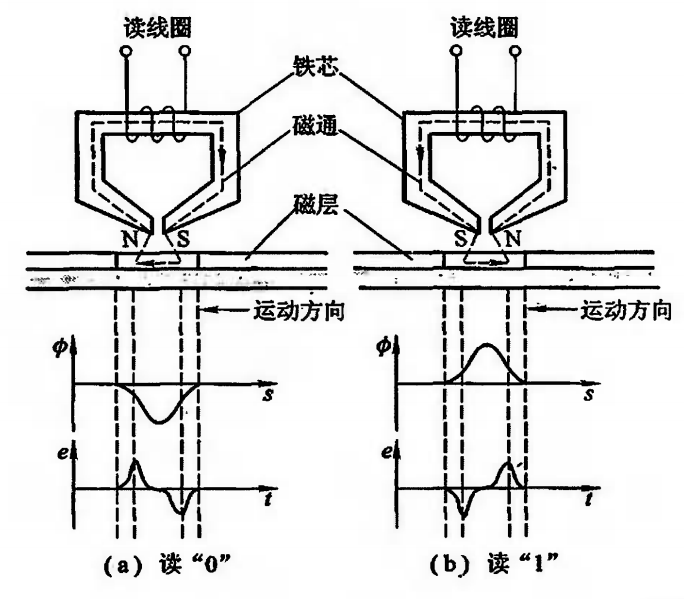

### 硬磁盘存储器

**类型**：固定磁头 / 移动磁头；可换盘 / 固定盘。

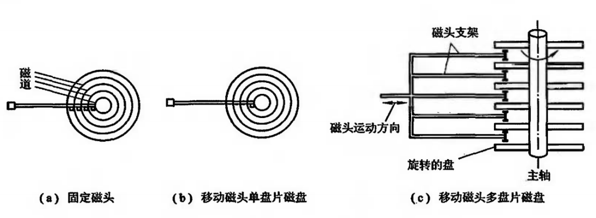

**结构**：由磁盘驱动器、磁盘控制器和盘片 3 大部分组成。

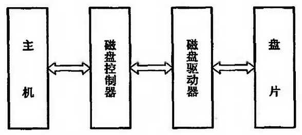

- **磁盘驱动器**：核心部件，控制磁头的移动以及磁盘的旋转，包括磁头组件、盘片组件、电机和控制器等。
- **磁盘**：数据存储介质，由一个或多个铝或玻璃制成的盘片组成，涂有磁性材料。
- **磁头**：读取和写入数据的关键部件，安装在磁头臂上，可精确移动到指定位置。
- **硬盘控制器**：硬盘存储器和计算机主板之间的接口，管理数据传输和磁盘操作（IDE、SCSI、SATA 等）。

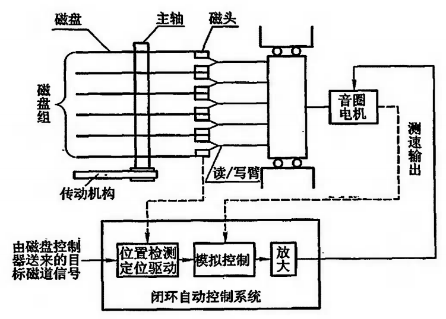

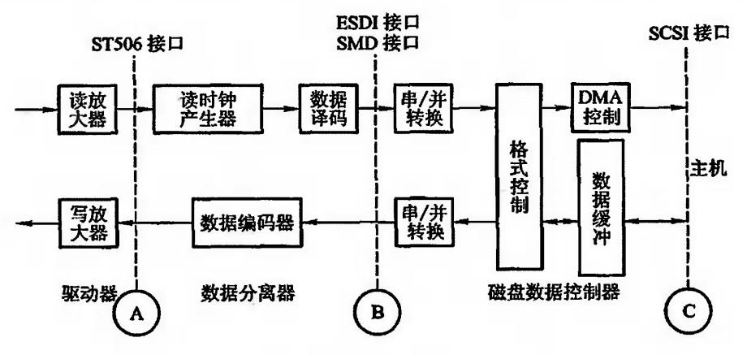

### 软磁盘存储器

与硬磁盘存储器的存储原理和记录方式相同，但在结构上有较大的区别。软盘片是一种较为过时的存储介质，因其有限的存储容量和相对较慢的数据传输速度，已经被更高效的大容量存储设备所取代。

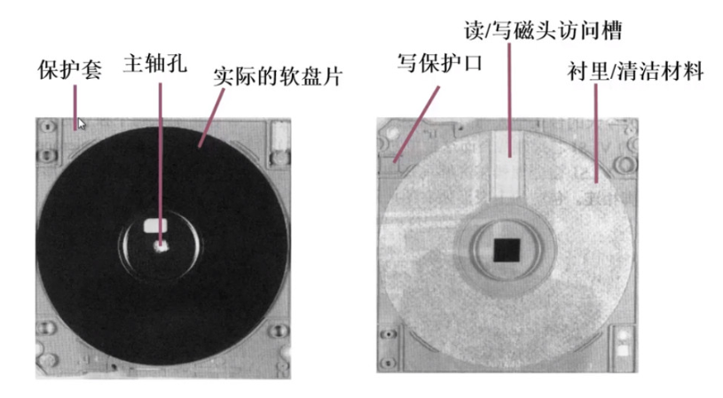

### 光盘存储器

使用光学技术来读取和写入数据的存储设备，利用激光束在光盘表面形成的小凹槽（即"坑"）来存储信息。

- 第一代光存储技术——采用非磁性介质，不可擦写
- 第二代光存储技术——采用磁性介质，可擦写

**写入数据**：激光束加热光盘表面的特殊染料或相变材料，使其融化或改变相位，形成凹槽。

**读取数据**：激光束照射在光盘表面，反射率发生变化，光传感器检测到变化并将其转换为电信号，解码为数字数据。