# [计算机组成原理——指令系统](https://mp.weixin.qq.com/s/Cv_f-v-k5gM-1Ndjg9FmjA)

## 指令的概述

### 指令的格式

- **操作码**：反映机器做什么操作
  - 长度固定：操作码集中放在指令字的一个字段内（如 IBM370）
  - 长度可变：操作码分散在指令字的不同字段中（如 PDP-11）
  - 扩展操作码技术：操作码的位数随地址数的减少而增加

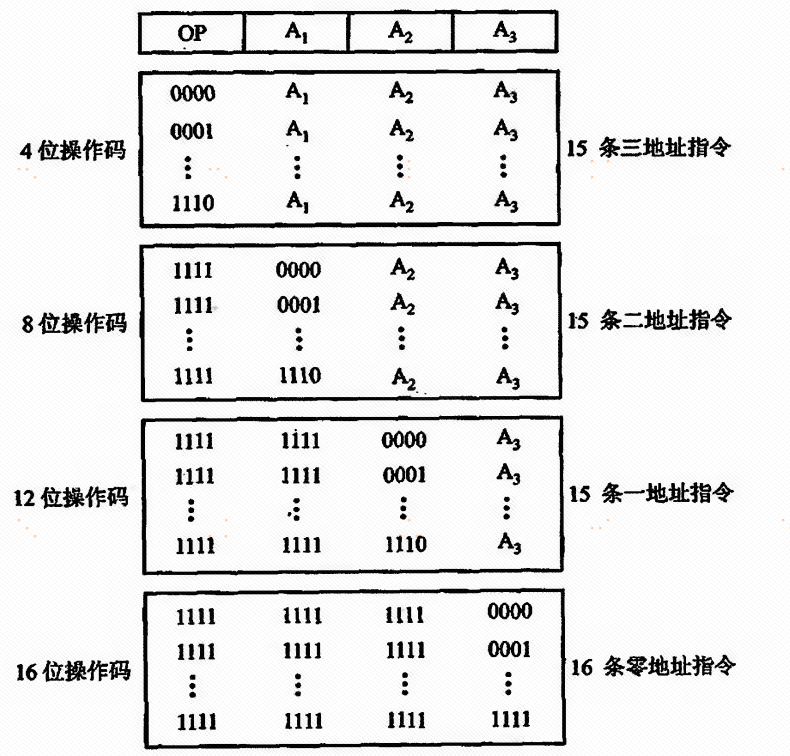

- **地址码**：用来指出该指令的源操作数的地址（一个或两个）、结果的地址以及下一条指令的地址

分类：四地址指令、三地址指令、二地址指令、一地址指令、零地址指令。

### 指令的字长取决于

- 操作码的长度
- 操作数地址的长度
- 操作数地址的个数

指令字长可以分为固定和可变：固定时，指令字长 = 存储字长；可变时，按字节的整数倍数变化。

## 操作数类型和操作种类

### 操作数的类型

- **地址**：无符号整数
- **数字**：定点数、浮点数、十进制数
- **字符**：ASCII
- **逻辑数**：逻辑运算

### 数据在存储器中的存放方式

- **不对准边界**（从任意位置开始访问）：不浪费存储资源，但访问可能花费两个存储周期，读写控制复杂。
- **对准边界**（从一个存储字的起始位置开始访问）：一个周期内完成，读写控制简单，但浪费存储资源。
- **边界对转方式**（从地址的整数倍位置开始访问）：前两种方式的折中方案。

### 操作类型

- **数据传送**：寄存器与寄存器、寄存器与存储单元、存储单元与存储单元之间
- **算术逻辑操作**：算术运算和逻辑运算
- **移位操作**：算术移位、逻辑移位和循环移位
- **转移**：跳转、无条件/条件转移等
- **输入输出**：从外设寄存器读入数据到 CPU，或将数据从 CPU 输出至外设

## 寻址方式

寻址方式分为指令寻址和数据寻址两大类。

### 指令寻址

- **顺序寻址**：通过程序计数器 PC 加 1，自动形成下一条指令的地址
- **跳跃寻址**：通过转移类指令实现

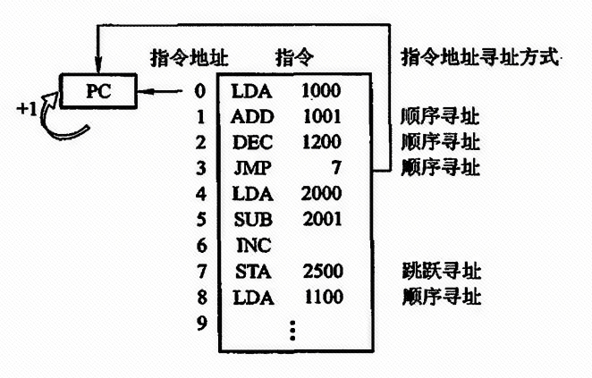

### 数据寻址

指令的地址码字段通常都不代表操作数的真实地址。

- **形式地址**：指令中的地址（逻辑地址）
- **有效地址**：操作数的真实地址

以下寻址方式建立在指令字长 = 存储字长 = 机器字长的前提下。

#### 立即寻址

操作数本身设在指令字内，即形式地址 A 不是操作数的地址，而是操作数本身（立即数，采用补码形式存放）。

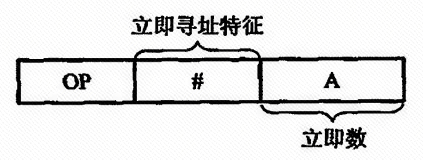

**优点**：只要取出指令，便可立即获得操作数，不必再访问存储器。
**缺点**：A 的位数限制了立即数的范围。

#### 直接寻址

EA = A，有效地址由形式地址直接给出。

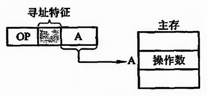

**优点**：寻找操作数比较简单，不需要专门计算操作数的地址，在指令执行阶段对主存只访问一次。
**缺点**：A 的位数限制了操作数的寻址范围，且必须修改 A 的值才能修改操作数的地址。

#### 隐含寻址

指令字中不明显地给出操作数的地址，其操作数的地址隐含在操作码或某个寄存器中。

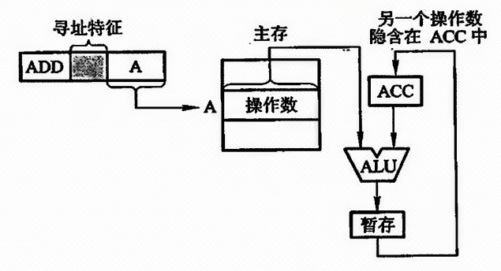

由于隐含寻址在指令字中少了一个地址，因此有利于缩短指令字长。

#### 间接寻址

EA = (A)，有效地址由形式地址间接给出（即 A 指向的存储单元中的内容才是有效地址）。

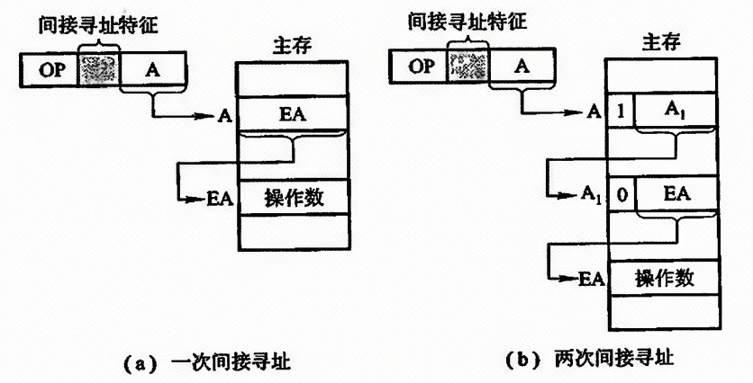

**优点**：扩大了操作数的寻址范围，便于编程。
**缺点**：指令的执行阶段需要访存两次（一次间接寻址）或多次（多次间接寻址），致使指令执行时间延长。

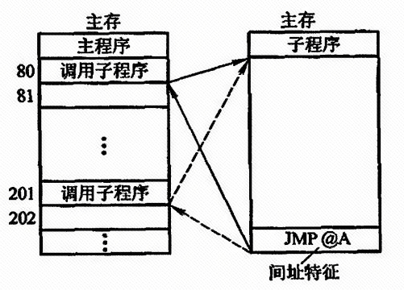

#### 寄存器寻址

EA = Ri，有效地址即为寄存器编号。

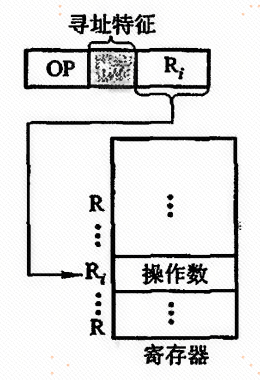

**优点**：
- 操作数不在主存中，故寄存器寻址在指令执行阶段无须访存，减少了执行时间
- 地址字段只需指明寄存器编号，故指令字较短，节省了存储空间

#### 寄存器间接寻址

EA = (Ri)，有效地址在寄存器中（Ri 中的内容不是操作数，而是操作数所在主存单元的地址号）。

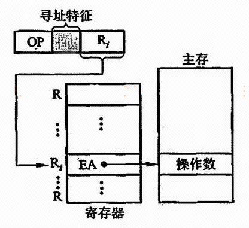

#### 基址寻址

EA = (BR) + A，有效地址等于基址寄存器内容加上形式地址。

- **隐式**：计算机内部专门设置一个基址寄存器 BR，使用时用户不必明显指出
- **显式**：一组通用寄存器里，由用户明确指出哪个寄存器用作基址寄存器

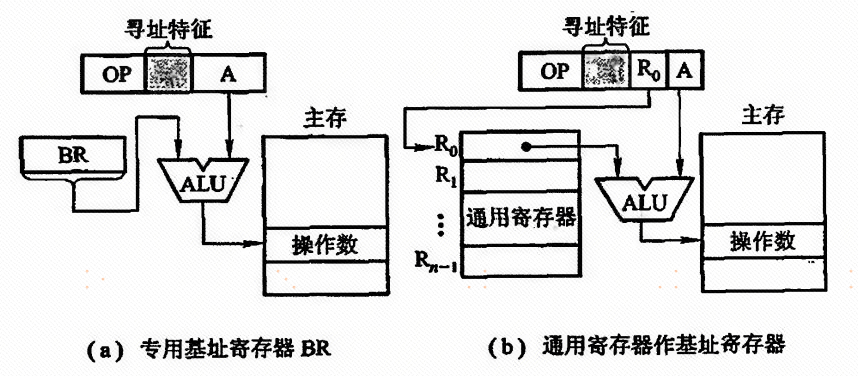

**优点**：
- 可以扩大操作数的寻址范围
- 在多道程序中极为有用
- 用户不可修改基址寄存器的内容，确保系统安全可靠地运行

#### 变址寻址

EA = (IX) + A，有效地址等于变址寄存器内容加上形式地址。

变址寻址主要用于处理数组问题。在数组处理过程中，可设定 A 为数组的首地址，不断改变变址寄存器 IX 的内容，便可很容易形成数组中任一数据的地址，特别适合编制循环程序。

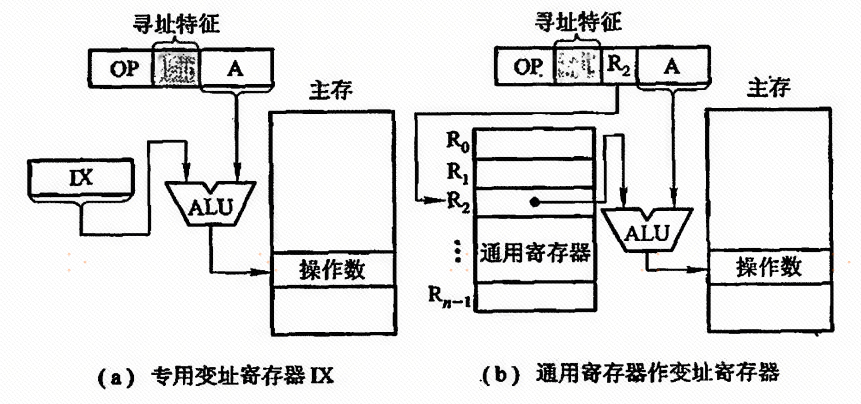

**优点**：
- 只要变址寄存器位数足够，也可扩大操作数的寻址范围
- IX 的内容由用户给定，在程序执行过程中 IX 内容可变，形式地址 A 是不可变的
- 便于处理数组问题

#### 相对寻址

EA = (PC) + A，有效地址等于程序计数器内容加上形式地址。

#### 堆栈寻址

堆栈分为硬堆栈（多个寄存器）和软堆栈（指定的存储空间）。堆栈寻址就其本质也可视为寄存器间接寻址，因 SP 可视为寄存器，它存放着操作数的有效地址。

### 寻址方式对比表

| 寻址方式 | 有效地址 | 访问次数 | 主要用途 |
|----------|----------|:-------:|---------|
| 立即寻址 | A 即为操作数 | 0 | 初始化常数 |
| 直接寻址 | EA = A | 1 | 访问全局变量 |
| 隐含寻址 | 隐含在操作码中 | 0 | 特殊指令 |
| 间接寻址 | EA = (A) | 2 | 指针操作 |
| 寄存器寻址 | EA = Ri | 0 | 中间变量 |
| 寄存器间接寻址 | EA = (Ri) | 1 | 数组访问 |
| 基址寻址 | EA = (BR) + A | 1 | 多道程序/重定位 |
| 变址寻址 | EA = (IX) + A | 1 | 数组/循环 |
| 相对寻址 | EA = (PC) + A | 1 | 程序转移 |

## CISC 与 RISC

### CISC（复杂指令集计算机）

- 指令系统复杂庞大，指令条数多
- 指令长度可变，格式多样
- 寻址方式丰富
- 指令执行时间差异大
- 微程序控制为主
- 代表：x86 架构

### RISC（精简指令集计算机）

- 指令系统精简，指令条数少
- 指令长度固定，格式统一
- 寻址方式较少
- 指令执行时间接近（一个周期）
- 硬布线控制为主
- 代表：ARM、MIPS

### CISC 与 RISC 的对比

| 特性 | CISC | RISC |
|------|------|------|
| 指令条数 | 多 | 少 |
| 指令长度 | 可变 | 固定 |
| 寻址方式 | 丰富 | 较少 |
| 通用寄存器 | 较少 | 多（32+） |
| 控制方式 | 微程序 | 硬布线 |
| 流水线 | 较难实现 | 易于实现 |
| 编译优化 | 较难 | 较易 |
| 典型架构 | x86 | ARM、MIPS、RISC-V |