# [计算机组成原理——控制单元的功能](https://mp.weixin.qq.com/s/k_ysOxKQhmJQNOkP5y2PCw)

## 微操作命令分析

完成一条指令分四个周期：取指周期、间址周期、执行周期、中断周期。

### 取指周期

1. **指令地址计算**：CPU 根据程序计数器 PC 中的值计算下一条指令的地址。
2. **访问内存**：CPU 根据计算得到的指令地址，向主存发送请求，读取下一条指令所在的内存单元。
3. **指令译码**：CPU 对从内存中读取的指令进行译码，确定指令的操作类型、操作数等信息。
4. **指令存储**：将从内存中读取的指令存储到指令寄存器 IR 中。

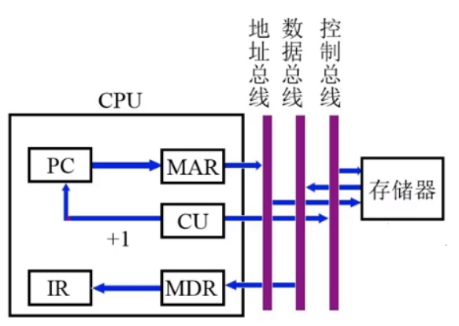

### 间址周期

在间接寻址中，指令不直接提供操作数的地址，而是提供一个指向操作数地址的指针。

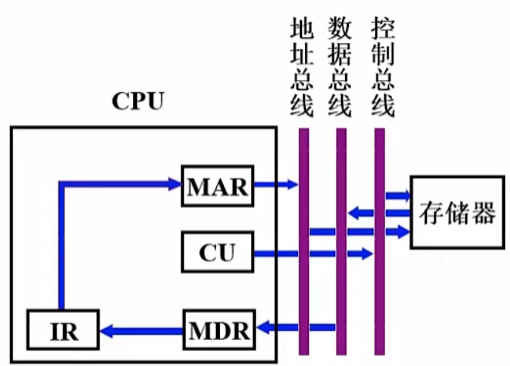

### 执行周期

#### 非访存指令

| 指令 | 操作 | 说明 |
|------|------|------|
| CLA | 0 → ACC | 清除累加器 |
| COM | ACC → ACC | 累加器取反 |
| SHR | L(ACC) → R(ACC) | 算术右移一位 |
| CSL | R(ACC) → L(ACC) | 循环左移一位 |
| STP | 0 → G | 停机指令 |

#### 访存指令

**加法指令 ADD X**：
1. Ad(IR) → MAR：将指令的地址码部分送至存储器地址寄存器
2. 1 → R：向主存发读命令
3. M(MAR) → MDR：将主存单元中的操作数读至 MDR
4. (ACC) + (MDR) → ACC：ALU 执行加法，结果存于 ACC

**存数指令 STA X**：
1. Ad(IR) → MAR
2. 1 → W：向主存发写命令
3. ACC → MDR：将累加器内容送至 MDR
4. MDR → M(MAR)：将 MDR 内容写入主存单元

**取数指令 LDA X**：
1. Ad(IR) → MAR
2. 1 → R
3. M(MAR) → MDR
4. MDR → ACC：将 MDR 内容送至 ACC

#### 转移类指令

- **无条件转移指令 JMP X**
- **条件转移指令 BAN X**（负则转）

#### 三类指令的指令周期

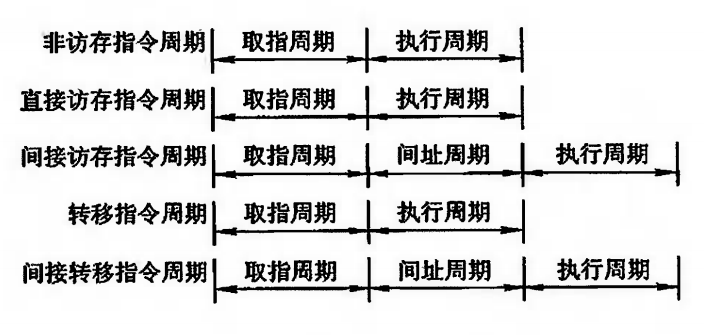

### 中断周期

1. 0 → MAR：将特定地址送至存储器地址寄存器
2. 1 → W：向主存发写命令
3. PC → MDR：将 PC 内容（程序断点）送至 MDR
4. MDR → M(MAR)：将程序断点写入主存单元
5. 向量地址 → PC：将向量地址送至 PC
6. 0 → ET：关中断，将允许中断触发器清零

如果程序断点存入堆栈，且进栈操作是先修改栈指针后存入数据，则需将第一步改为 (SP) - 1 → MAR。

## 控制单元的功能

### 控制单元的外特性

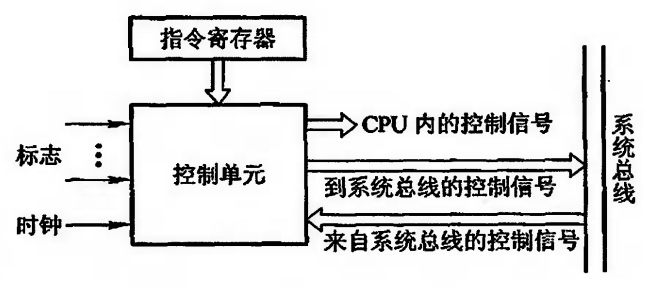

#### 输入信号

- **时钟**：CU 受时钟控制，一个时钟脉冲发送一个操作命令或一组需同时执行的操作命令
- **指令寄存器** OP(IR) → CU：控制信号与操作码有关，现行指令的操作码决定了不同指令在执行周期所需完成的不同操作
- **标志**：CU 有时需依赖 CPU 当前所处的状态（如 ALU 操作的结果）产生控制信号
- **外来信号**：如 INTR 中断请求、HRQ 总线请求

#### 输出信号

- CPU 内的各种控制信号（如 PC + 1 → PC）
- 送至控制总线的信号（访存控制信号、读写命令等）

### 控制信号举例

#### 不采用 CPU 内部总线的方式

**取指周期**：
- 控制信号 C0 有效，打开 PC 送往 MAR 的控制门
- 控制信号 C1 有效，打开 MAR 送往地址总线的输出门
- 通过控制总线向主存发读命令
- C2 有效，打开数据总线送至 MDR 的输入门
- C3 有效，打开 MDR 和 IR 之间的控制门，至此指令送至 IR
- C4 有效，打开指令操作码送至 CU 的输出门
- CU 在操作码和时钟的控制下，可产生各种控制信号
- 使 PC 内容加 1

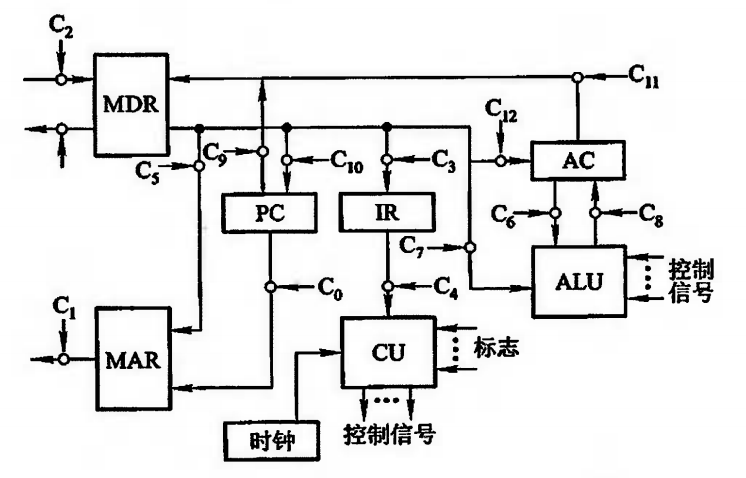

**间址周期**：
- C5 有效，打开 MDR 和 MAR 之间的控制门，将指令的形式地址送至 MAR
- C1 有效，打开 MAR 送往地址总线的输出门
- 通过控制总线向主存发读命令
- C2 有效，打开数据总线送至 MDR 的输入门，至此有效地址存入 MDR
- C3 有效，打开 MDR 和 IR 之间的控制门，将有效地址送至 IR 的地址码字段

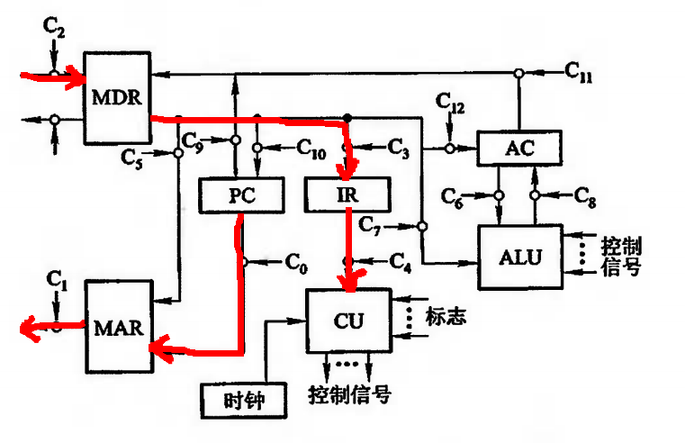

**执行周期**：
- C5 有效，打开 MDR 和 MAR 之间的控制门，将有效地址送至 MAR
- C1 有效，打开 MAR 送往地址总线的输出门
- 通过控制总线向主存发读命令
- C2 有效，打开数据总线送至 MDR 的输入门，至此操作数存入 MDR
- C6、C7 同时有效，打开 AC 和 MDR 通往 ALU 的控制门
- 通过 CPU 内部控制总线对 ALU 发 **ADD** 加控制信号，完成 AC 的内容和 MDR 的内容相加
- C8 有效，打开 ALU 通往 AC 的控制门，至此将求和结果存入 AC

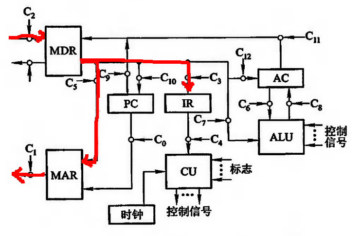

#### 采用 CPU 内部总线的方式

采用 CPU 内部总线方式的数据通路和控制信号的关系，图中每一个小圈处都有一个控制信号，它控制寄存器到总线或总线到寄存器之间的传送。

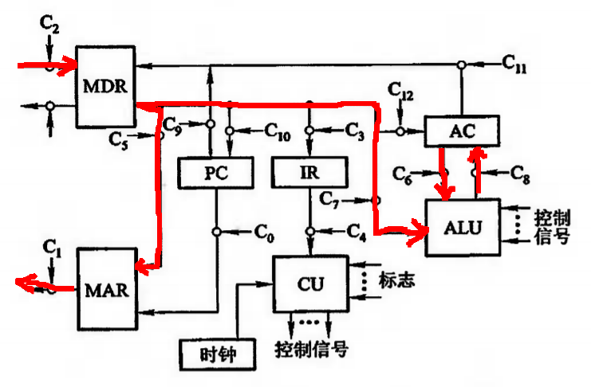

**取指周期**：
- PC0 和 MARi 有效，完成 PC 经内部总线送至 MAR 的操作，即 PC → MAR
- 通过控制总线向主存发读命令，即 1 → R
- 存储器通过数据总线将 MAR 所指单元的内容（指令）送至 MDR
- MDR0 和 IRi 有效，将 MDR 的内容送至 IR，即 MDR → IR，至此指令送至 IR，其操作码字段开始控制 CU
- 使 PC 内容加 1

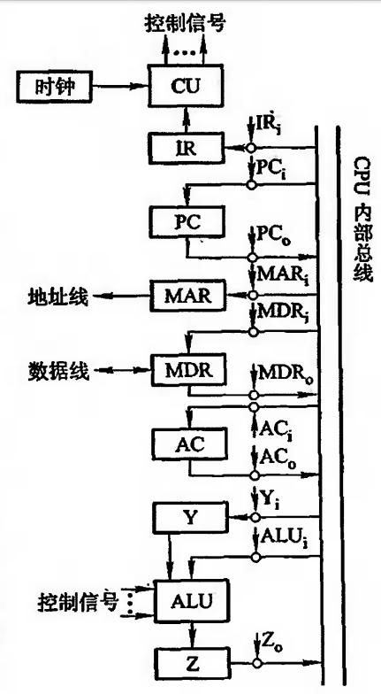

**间址周期**：
- MDR0 和 MARi 有效，将指令的形式地址经内部总线送至 MAR，即 MDR → MAR
- 通过控制总线向主存发读命令，即 1 → R
- 存储器通过数据总线将 MAR 所指单元的内容（有效地址）送至 MDR
- MDR0 和 IRi 有效，将 MDR 中的有效地址送至 IR 的地址码字段，即 MDR → Ad(IR)

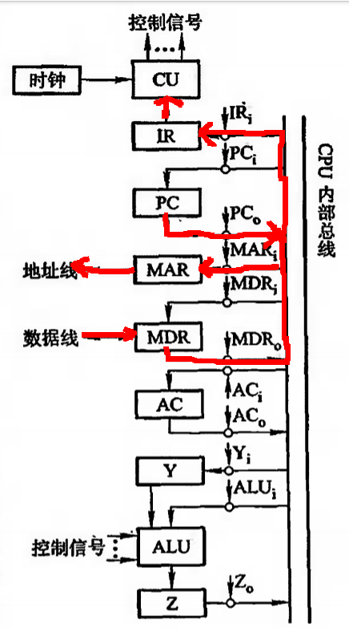

**执行周期**：
- MDR0 和 MARi 有效，将有效地址经内部总线送至 MAR，即 MDR → MAR
- 通过控制总线向主存发读命令，即 1 → R
- 存储器通过数据总线将 MAR 所指单元的内容（操作数）送至 MDR
- MDR0 和 Yi 有效，将操作数送至 Y，即 MDR → Y
- AC0 和 ALUi 有效，同时 CU 向 ALU 发 **ADD** 加控制信号，使 AC 的内容和 Y 的内容相加（Y 的内容送至 ALU 不必通过总线），结果送寄存器 Z，即 (AC) + (Y) → Z
- Z0 和 ACi 有效，将运算结果存入 AC，即 Z → AC

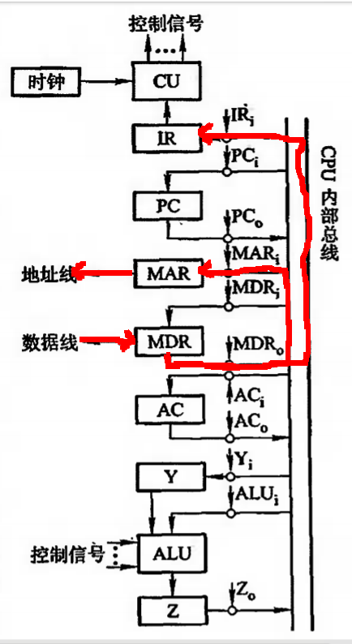

### 多级时序系统

#### 机器周期

机器周期可看做是所有指令执行过程中的一个基准时间。通常以访问一次存储器的时间为基准，因此机器周期也称为主存周期。

#### 时钟周期（节拍）

一个机器周期内包含若干个时钟周期（节拍）。时钟周期是 CPU 处理操作的最小时间单位。

#### 指令周期、机器周期、时钟周期的关系

- 指令周期由若干个机器周期组成
- 机器周期由若干个时钟周期组成
- 时钟周期是 CPU 的基本时间单位

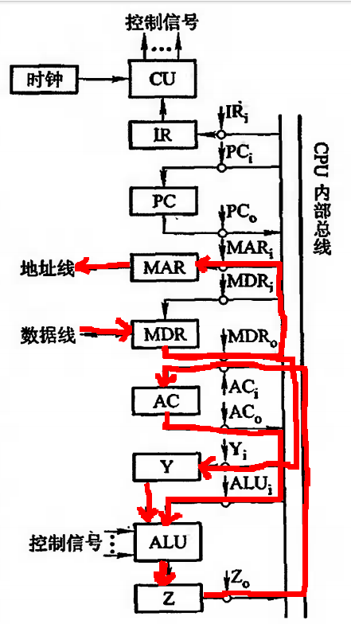

#### 机器速度和机器主频的关系

机器速度不仅与主频有关，还与机器周期中所含时钟周期（主频的倒数）数以及指令周期所含的机器周期数有关。

#### 控制方式

- **同步控制方式**：任一微操作均由统一基准时标的时序信号控制
  - **采用定长的机器周期**：以最长的微操作序列和最复杂的微操作作为标准
  - **采用不定长的机器周期**：机器周期内的节拍数不等，通常把大多数微操作安排在一个较短的机器周期内完成，而对某些复杂的微操作，采用延长机器周期或增加节拍的办法来解决
  - **采用中央控制和局部控制相结合的方法**：将机器的大部分指令安排在统一的、较短的机器周期内完成，称为中央控制；而将少数操作复杂的指令中的某些操作（如乘除法和浮点运算等）采用局部控制方式来完成

- **异步控制方式**：无基准时标信号，无固定的周期节拍和严格的时钟同步，采用应答方式
- **联合控制方式**：同步和异步结合
- **人工控制方式**：为了调机和软件开发的需要，在机器面板或内部设置一些开关或按键，来达到人机控制的目的