# [计算机组成原理——系统总线](https://mp.weixin.qq.com/s/KlwkPvr7ogS-1JzaOYYtqQ)

## 总线的基本概念

总线是连接各个部件的信息传输线，是各个部件共享的传输介质。（注意：在某一时刻，只允许有一个部件向总线发送信息，而多个部件可以同时从总线上接收相同的信息。）

## 为什么会出现总线？

- **分散式设计的需求**：各个部件需要升级以及迭代发展，如果需要将这些部件统一起来或者说连接起来，就产生了总线的概念。
- **标准化和模块化**：为了降低成本和提高生产效率，计算机制造商开始寻求一种标准化方法来连接不同的硬件组件。
- **IBM 的早期贡献**：在 20 世纪 70 年代，IBM 在其大型计算机系统中引入了系统总线的概念。特别是 IBM System/360 系列，它们使用了标准化总线来连接 CPU、内存和 I/O 设备，这标志着系统总线在商业计算机中的广泛应用。

随后系统总线快速发展并不断演变，从 ISA 总线到 EISA、VESA 总线，再到 PCI 总线，系统总线的速度和带宽不断提高，支持更多的设备和更复杂的系统。

## 总线的分类

按连接的部件不同，分成三类总线：

- **片内总线**
- **系统总线**
- **通信总线**

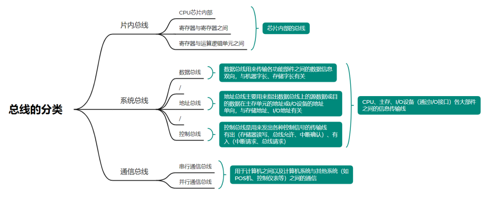

### 注意点

- 注意区别**总线**和**系统总线**之间的概念和范围的区别。
- 通信总线中，串行和并行通信的数据传送速率都与距离成反比，并行通信适宜于近距离的数据传输（通常小于 30m）；串行通信适宜于远距离传送，可以从几米到数千公里。

**定义：**

- **总线**：总线是一种用于在计算机内部或计算机与外部设备之间传输数据的通信链路。它可以包含数据线、地址线和控制线。总线可以是并行或串行的，可以是单向或双向的，并且可以用于传输各种类型的信息。
- **系统总线**：系统总线是连接计算机主要组件（如 CPU、内存和 I/O 设备）的内部总线。它是计算机内部数据传输的主要通道，通常包括数据总线、地址总线和控制总线。

**范围和功能：**

- **总线**：这个术语更广泛，可以指任何类型的通信链路，包括但不限于系统总线、I/O 总线、内部总线、外部总线等。
- **系统总线**：它是特定于计算机内部的一种总线，主要负责 CPU 和内存之间的数据传输，以及 CPU 与其他系统组件的通信。

**应用场景：**

- **总线**：广泛应用于各种电子设备中，不仅限于计算机，还可以用于嵌入式系统、通信设备等。
- **系统总线**：专用于计算机内部，是构建计算机系统的核心部分。

## 总线特性及性能指标

### 总线特性

1. **并行与串行**：并行总线多个数据位同时传输，提高速率；串行总线数据位逐个传输，用于较长距离通信。
2. **宽度**：总线的宽度决定了可以同时传输的数据位数。例如，16 位总线可以一次性传输 16 位数据。
3. **速度**：总线的速度通常以时钟速率（MHz）来衡量。
4. **数据传输模式**：同步传输（时钟信号同步）和异步传输（握手协议）。
5. **总线仲裁**：决定多个设备请求使用总线时的优先级和处理机制。
6. **可扩展性**：总线是否支持扩展，以便连接更多的设备。
7. **热插拔**：总线是否支持在不关闭系统的情况下添加或移除设备。

### 性能指标

1. **带宽**：单位时间内可以传输的最大数据量（bps 或 Mbps）。
2. **传输速率**：数据通过总线的实际速度。
3. **延迟**：数据从源头传输到目的地所需的时间，包括传输延迟和仲裁延迟。
4. **吞吐量**：单位时间内总线实际传输的数据量。
5. **错误率**：总线在数据传输过程中发生错误的频率。
6. **可靠性**：总线在长时间运行中的稳定性。
7. **兼容性**：总线是否支持不同类型和版本的设备。

### 总线标准（了解）

1. **ISA 总线**（1984 年）：IBM 公司为推出 PC/AT 机而建立的系统总线标准。支持 64K I/O 地址空间、16M 主存地址空间的寻址，以及 15 级硬中断和 7 级 DMA 通道。
2. **EISA 总线**：在 ISA 总线基础上进行扩展，提供了更多的功能和性能。
3. **MCA 总线**（1987 年）：IBM 公司推出的一种局部总线标准，具有较高的性能和带宽。
4. **VESA 局部总线**（1992 年）：VESA 组织推出的一种高性能局部总线，主要应用于图形加速卡。
5. **PCI 总线**（1993 年）：英特尔、微软、Compaq 等公司共同制定的一种局部总线标准，具有即插即用、高性能等特点，广泛应用于现代计算机系统中。
6. **AGP 总线**（1996 年）：英特尔推出的一种专门用于图形加速卡的局部总线，以提高显示性能。
7. **USB 总线**（1996 年）：英特尔、微软、Compaq 等公司共同制定的一种外部总线标准，具有即插即用、热插拔等特点，广泛应用于各种外设连接。

## 总线的结构

总线结构通常可分为单总线结构和多总线结构两种。

### 单总线结构

将 CPU、主存、I/O 设备都挂在一组总线上，允许 I/O 设备之间、I/O 设备与 CPU、主存之间直接交换信息。

**优势**：结构简便，便于扩充 I/O 接口和设备。
**劣势**：不允许两个设备同时和 CPU 进行数据传输，严重影响系统工作效率。
**根本问题**：数据传输速率不匹配，CPU 和 I/O 设备、主存的传输速度不匹配，因此出现了多总线结构。

---

### 面向 CPU 的双总线结构

为提高数据处理能力和系统的扩展性，设计了两条独立的总线，分为前端总线和后端总线。

- **前端总线**：负责 CPU 与内存之间的数据传输。它的频率通常与 CPU 的外频相同，直接影响到 CPU 与内存之间的通信速度。
- **后端总线**：负责连接低速外设，如 USB、IDE、SATA 等，处理一些外设的数据传输以及系统管理功能。

（以下为简易示意图方便理解，M 总线类似前端总线，I/O 总线类似后端总线。）

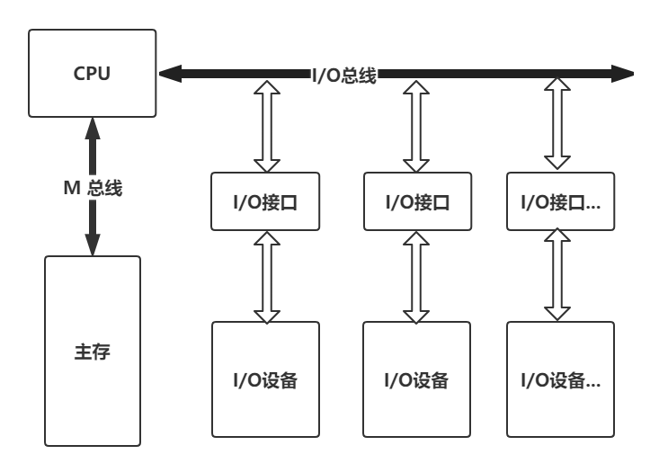

**优势**：分离高速与低速传输，减少互相干扰，提高系统整体性能；扩展性好。
**劣势**：增加系统设计的复杂性，需要更多硬件组件，增加成本和故障点。

---

### 面向存储器的双总线结构

为提高存储器访问效率和系统带宽，设计了两条独立的总线专门用于处理存储器相关的数据传输。一条用于 CPU 到内存，另一条用于 I/O 设备到内存。

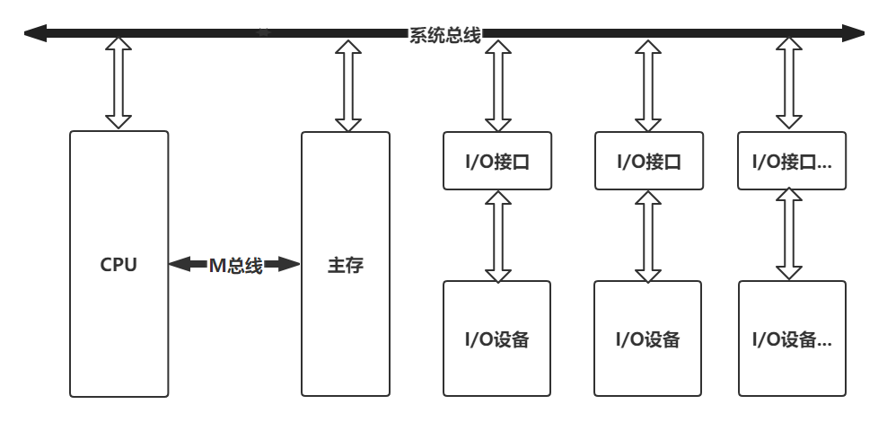

**优势**：CPU 和 I/O 设备可以并行访问内存，提高了系统带宽和效率。
**劣势**：成本上升，能耗和热量增加。

---

### 双总线结构（主存总线 + I/O 总线）

将速度较低的 I/O 设备从单总线上分离出来，形成主存总线与 I/O 总线分开的结构。CPU 将一部分功能下放给通道，使其对 I/O 设备具有统一管理的功能。

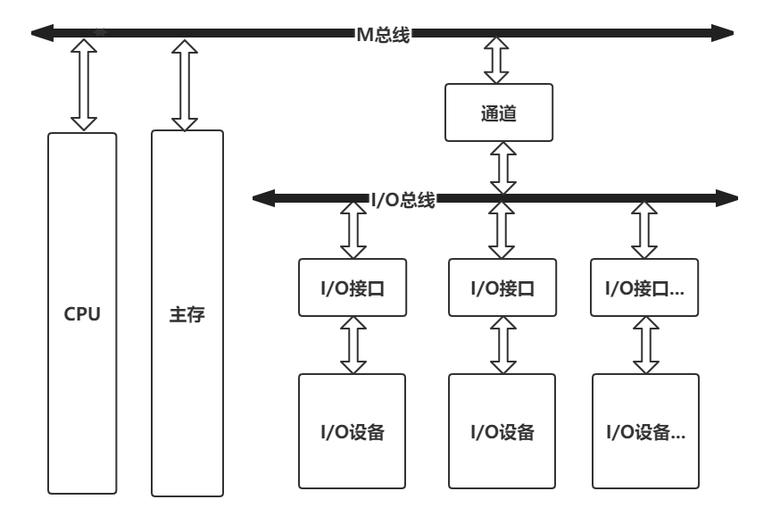

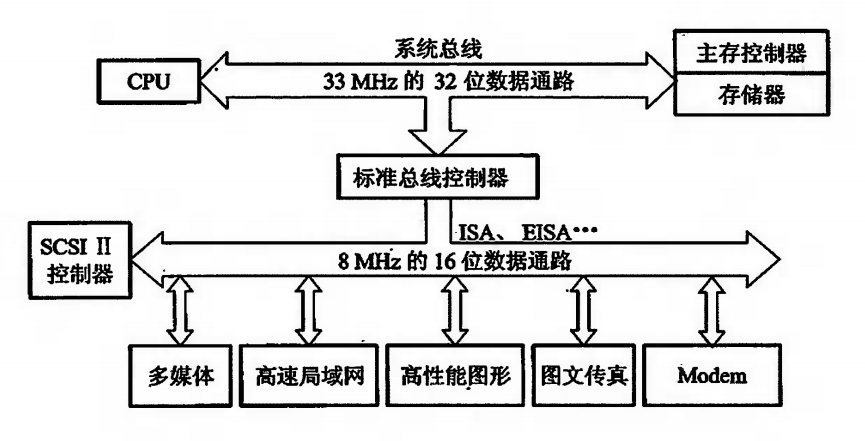

---

### 三总线结构

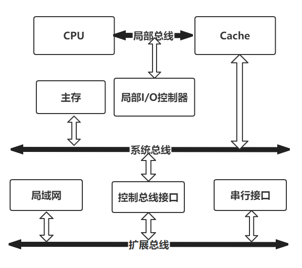

---

### 四总线结构

为进一步提高 I/O 设备的性能，使其更快地响应命令，又出现了四总线结构。

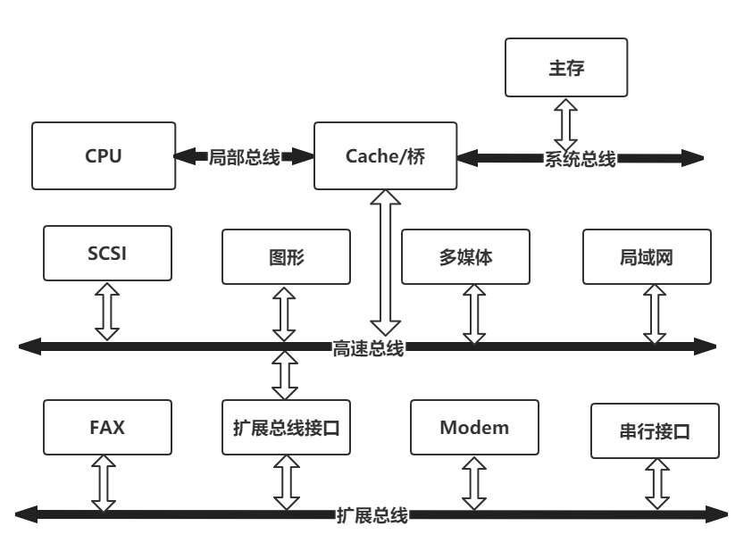

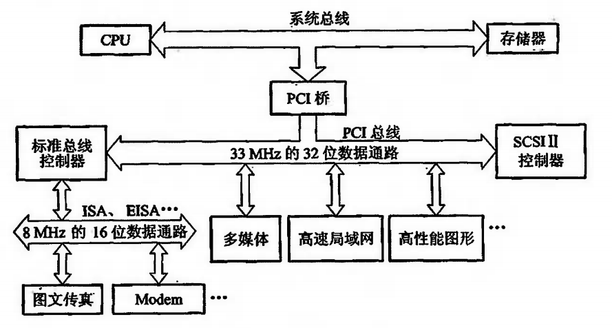

## 总线的控制

主要包括判优控制（或称仲裁逻辑）和通信控制。

### 总线的判优控制

**主要目的**：决定在多个设备同时请求使用总线时，哪一个设备将获得总线的控制权。

#### 集中式判优控制

一个专门的硬件单元（如总线控制器）负责决定哪个设备可以访问总线。可以是静态的（固定优先级）或动态的（轮询或基于请求的优先级）。

##### 链式查询方式

**原理**：设备接口通过 BR 向总线控制部件发送请求（占用总线请求），BG 通过链式方式查询第一个向总线控制部件发送请求的设备，该设备更新总线为忙并占用总线。

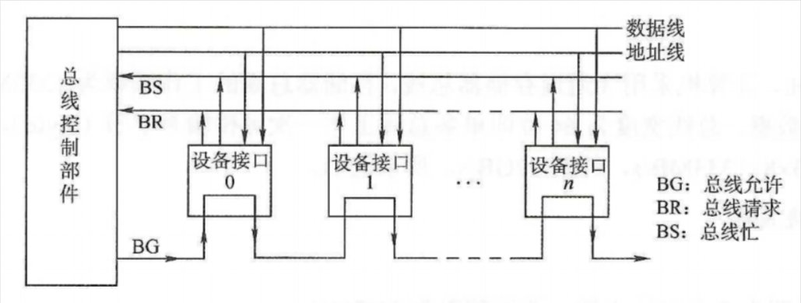

**优点**：通过"令牌"在设备间传递，确保每个设备都有机会获得总线访问权；实现简单。
**缺点**：访问顺序固定，如果某个设备不需要立即访问总线，会造成总线资源的浪费；如果令牌传递中的某个设备故障，可能会影响整个总线系统的运行。

##### 计数器定时查询方式

**原理**：总线控制部件中有计数器，如果 BR 中有设备向总线控制部件发送请求并且总线控制部件没有被占用的情况，则开启计数器，通过设备地址轮询查找每个设备的请求情况（该查询中与每条设备连接的线是并行的，相互之间不会受到影响）。

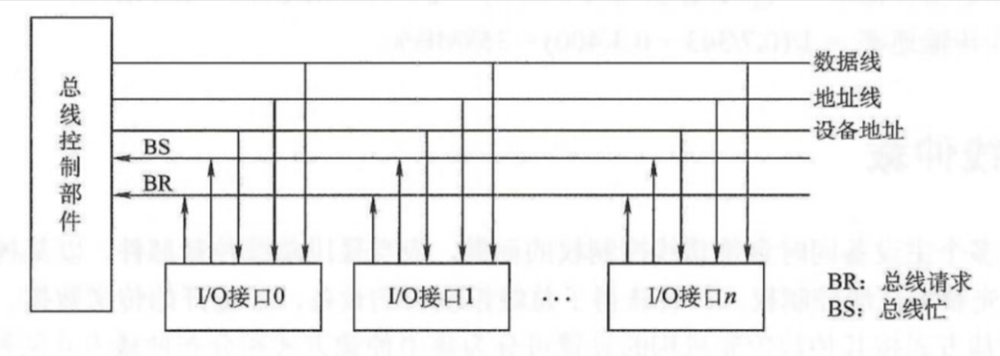

**优点**：通过计数器值来选择下一个访问总线的设备，可以实现更公平的访问；可以根据系统的实时负载情况动态调整每个设备的访问概率。
**缺点**：实现复杂，需要额外逻辑来维护和更新计数器值；实时性要求高的设备可能无法保证快速响应。

##### 独立请求方式

**原理**：每个设备接口都有单独的 BG、BR 线，当部分设备接口向总线控制部件发送请求时候，总线控制部件通过排队器来决定设备的优先级并作出快速的响应。

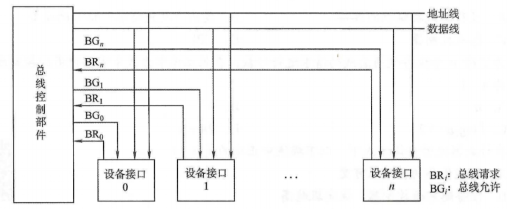

**优点**：设备在需要时立即发出请求，无需等待，适用于实时性要求高的系统；每个设备根据自己的需要请求总线，不受其他设备的影响。
**缺点**：多个设备同时请求时需要额外机制解决冲突；需要更复杂的控制逻辑来处理多个请求并确保公平性和效率。

##### 三种判优控制方式的对比

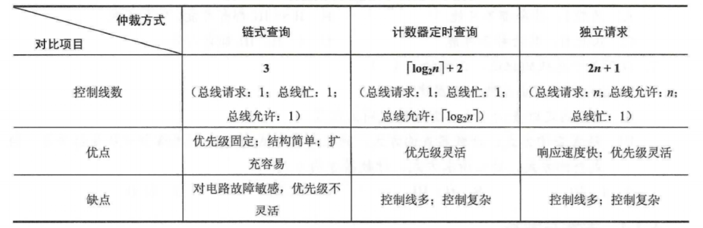

#### 分布式判优控制（了解）

仲裁逻辑分布在各个网络节点上，而不是集中在一个单一的位置。

**优点**：减少中央控制单元的负担，提高系统整体效率；节点可快速做出本地决策，减少通信延迟；某些节点故障时其他节点仍可继续工作。
**缺点**：多个节点可能同时请求访问共享资源，需要有效的冲突解决机制；设计和实现比集中式更加复杂。

**示例**：

- **CSMA/CD**：发送前先监听信道，信道忙则等待，检测到碰撞则停止发送并等待随机时间后重试。
- **CSMA/CA**：类似 CSMA/CD，但增加了碰撞避免机制，发送前先发送预约信号。
- **Token Ring**：令牌在网络中传递，只有持有令牌的节点才能发送数据。

---

### 总线通信控制

**目的**：解决通信双方协调配合问题。在多设备系统中，确保数据有效传输，同时避免冲突和数据丢失。

#### 总线的传输周期

1. **申请分配阶段**：主模块申请，总线仲裁决定。
2. **寻址阶段**：主模块向从模块给出地址和指令。
3. **传数阶段**：主模块和从模块进行数据交换。
4. **结束阶段**：主模块撤销相关信息。

#### 总线通信的四种方式

1. **同步通信**：由统一时标控制数据传送。
2. **异步通信**（不互锁、半互锁、全互锁）：采用应答方式，没有公共时钟标准。
3. **半同步通信**：同步、异步结合（允许不同传输速度的主从模块传输数据）。
4. **分离式通信**：充分挖掘系统总线每个瞬间的潜力。

##### 同步通信

**同步式数据输入**：T1 主模块发地址 → T2 主模块发读命令 → T3 从模块提供数据 → T4 主模块撤销读命令，从模块撤销数据。

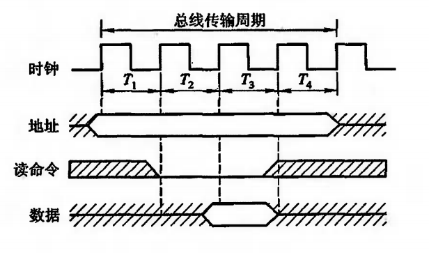

**同步式数据输出**（类似输入）

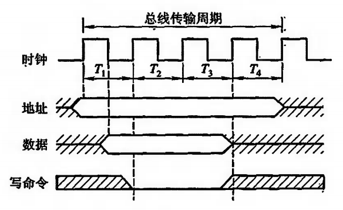

**同步通信的利弊**：规定明确统一，模块间配合简单一致。但主、从模块时间配合属于强制性"同步"，必须在限定时间内完成规定要求。对所有从模块都用同一限时，必须按最慢速度的部件来设计公共时钟，严重影响总线效率，缺乏灵活性。

##### 异步通信

异步通信中，发送方和接收方不需要以相同的时钟速率或同步方式操作（允许各模块的速度不一致）。

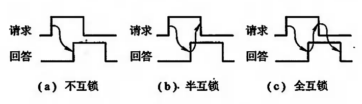

**不互锁**：发送方发送消息后不会等待接收方的任何确认，可以立即继续发送其他消息。优点是传输速度快，缺点是缺乏可靠性。

**半互锁**：发送方在发送消息后会等待一个短时间窗口，如果在这段时间内接收到接收方的确认，则继续执行下一个任务；如果没有收到确认，发送方可能会重发消息或采取其他措施。提高了可靠性，同时允许发送方在一定时间内继续执行其他任务。

**全互锁**：发送方在发送消息后会完全阻塞，直到接收到接收方的确认。提供了最高的可靠性，但可能导致发送方资源在等待确认时被浪费，降低系统整体效率。

**适用场景**：

- 不互锁：实时性要求高的场合（实时操作系统、视频流传输），可容忍丢包。
- 半互锁：对可靠性有一定要求但需保持通信效率的场合（大多数网络通信）。
- 全互锁：对数据可靠性要求极高的场合（金融交易、文件传输）。

##### 半同步通信

结合了同步通信和异步通信的特点。传输的一部分是同步的，另一部分是异步的。

以半同步通信数据输入为例（起始同步，中间等待异步）：

- T1：主模块发出地址信息
- T2：主模块发出命令
- Tw：当 WAIT 为低电平时，进入等待（异步情况）
- T3：从模块提供数据
- T4：主模块撤销读命令，从模块撤销数据

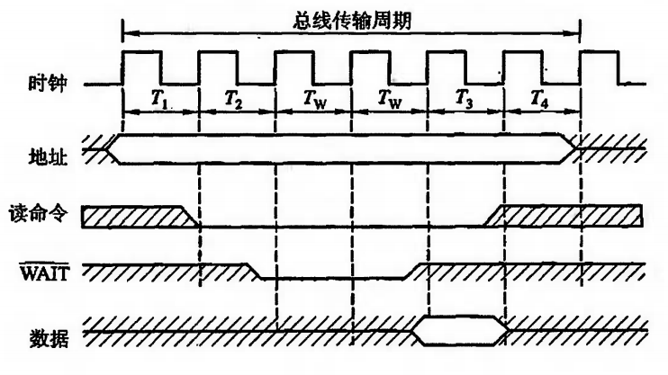

##### 分离式通信

允许发送方和接收方在时间和空间上解耦。消息的生产者和消费者不必直接相互知晓，也不必同时在线或实时交互。常用于分布式系统、异步处理和消息队列场景中。

**传输周期**（只有单方向的信息流）：

- **子周期 1**：主模块申请占用总线后，将命令、地址以及其他有关信息发送到系统总线上，使用完后即放弃总线的使用权。
- **子周期 2**：当从模块接收到请求信息，开始准备数据。当数据准备好之后，从模块申请占用总线后，将各种信息送至总线上，使用完后即放弃总线的使用权。

**特点**：各模块有权申请占用总线；采用同步方式通信，不等对方回答；各模块准备数据时，不占用总线；总线被占用时，无空闲。

**应用场景**：分布式系统、事件驱动架构、后台处理（视频转码、数据分析等）。