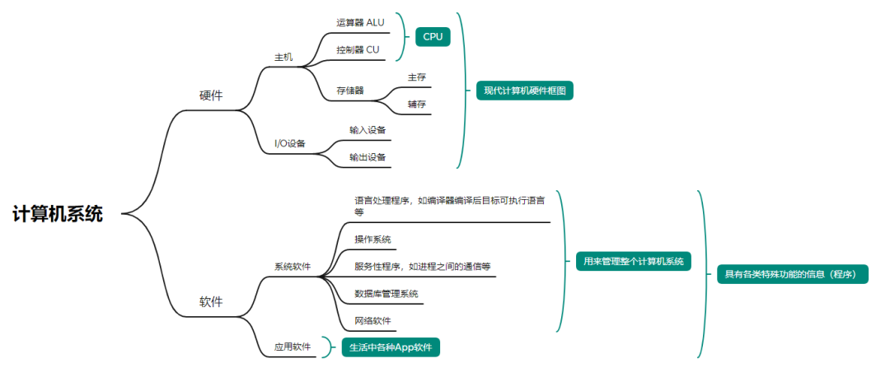
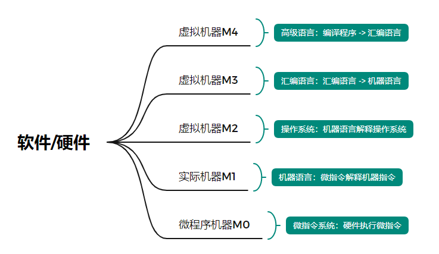
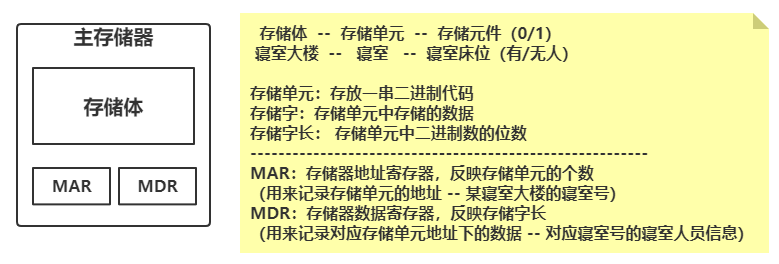
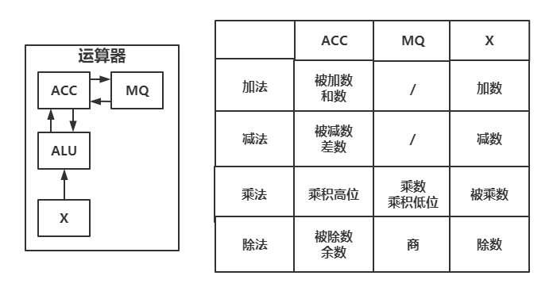
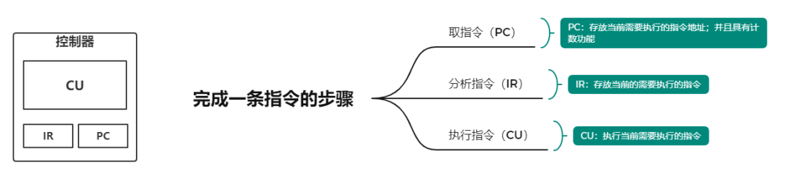
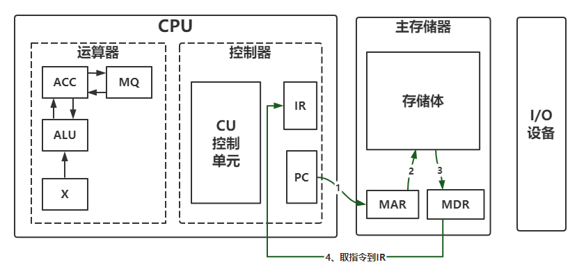
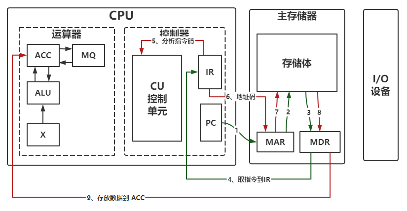
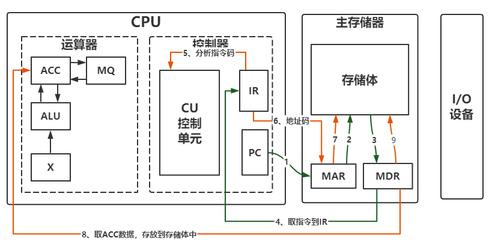
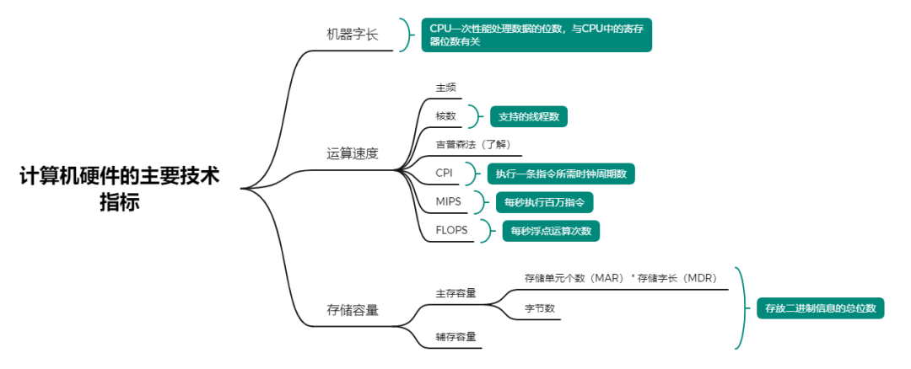

# [计算机组成原理——计算机系统概述](https://mp.weixin.qq.com/s/tipcS7qBZEcyju2VFMc7yg)

## 计算机系统简介

### 计算机系统

计算机系统由**硬件**和**软件**两大部分组成。

### 计算机软硬件机器

微程序机器 M0、实际机器 M1 归属于硬件；虚拟机 M2、M3、M4 归属于软件。

### 计算机体系结构与计算机组成的区别

**计算机体系结构**：程序员所见到的计算机系统的属性，概念性的结构与功能特性（指令系统、数据类型、寻址技术、I/O 机理等），类似定义接口的概念。

**计算机组成**：实现计算机系统结构所体现的属性（具体指令的实现），类似接口实现的概念。

举例说明：一台机器是否具有某一项功能，是计算机体系结构的问题；而这项功能是怎么实现的，是计算机组成的问题。

## 计算机的基本组成

### 冯·诺依曼计算机的特点

1. 五大部件组成（控制器、运算器、存储器、输入设备、输出设备）
2. 指令和数据以相同的地位存储在存储器中，可按地址进行寻访
3. 指令由操作码和地址码组成
4. 指令和数据以二进制的形式表示
5. 以运算器为中心
6. 指令在存储器内按顺序存放

### 存储器的基本组成

主要介绍存储体、存储器地址寄存器 MAR、存储器数据寄存器 MDR。

### 运算器的基本组成

主要介绍算术逻辑运算单元 ALU、累加器 ACC、乘商寄存器 MQ、操作数寄存器 X。

### 控制器的基本组成

主要介绍控制单元 CU、程序计数器 PC、指令寄存器 IR。

## 主机完成一条指令的过程

指令包含两部分：一个是指令码（决定进行什么操作，比如是取数操作）；另一个是地址码（存放数据的地址）。

### 以取数指令为例

**步骤 1：** 取**取数指令**到指令寄存器 IR（绿线）

**步骤 2：** 分析指令码以及执行指令操作（红线）

### 以存数指令为例

**步骤 1：** 取**存数指令**到指令寄存器 IR（如上图取数指令步骤 1）

**步骤 2：** 分析指令码以及执行指令操作（橙线）

## 计算机硬件的主要技术指标

