# [计算机组成原理——输入输出系统](https://mp.weixin.qq.com/s/fVKFkDbQJAYQiYp7FKBr0A)

## 概述

### 发展概况

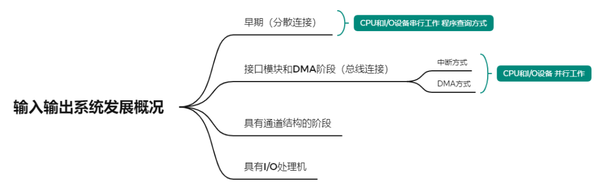

- **早期阶段**：I/O 设备与主存交换信息都必须通过 CPU。

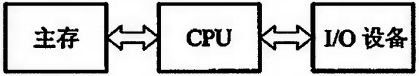
- **接口模块和 DMA 阶段**：I/O 设备通过接口模块与主机连接，计算机系统采用了总线结构。

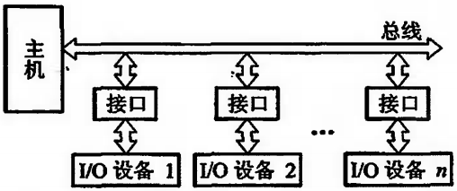
- **具有通道结构的阶段**：依赖通道管理的 I/O 设备在与主机交换信息时，CPU 不直接参与管理，提高了 CPU 的资源利用率。

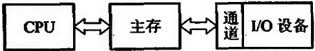
- **具有 I/O 处理机的阶段**：基本独立于主机工作，既可完成 I/O 通道要完成的 I/O 控制，又可完成码制变换、格式处理、数据块检错、纠错等操作。

---

### 输入输出系统的组成

#### I/O 软件

- **I/O 指令**（机器指令的一种）

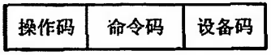
  - 操作码字段可作为 I/O 指令与其他指令（如访存指令、算逻指令、控制指令等）的判别代码
  - 命令码体现 I/O 设备的具体操作
  - I/O 指令的设备码相当于设备的地址

- **通道指令**（通道自身的指令）：对具有通道的 I/O 系统专门设置的指令，一般指出数据组的首地址、传送字数、操作命令。

- **两者的区别**：通道指令是通道自身的指令，用来执行 I/O 操作；而 I/O 指令是 CPU 指令系统的一部分，是 CPU 用来控制输入输出操作的指令，由 CPU 译码后执行。

#### I/O 硬件（了解）

计算机系统中用于与外部设备进行数据传输的物理设备。

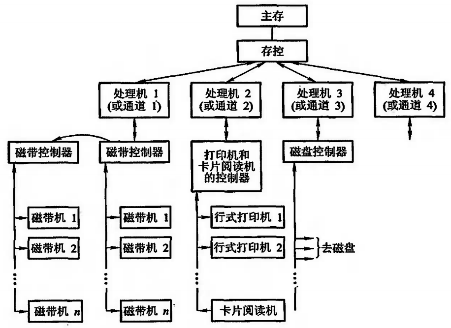

---

### I/O 设备和主机的联系方式

#### I/O 设备编址方式

- **统一编址**（用取数、存数指令）：将 I/O 地址看做是存储器地址的一部分。占用了存储空间，减少了主存容量，但无须专用的 I/O 指令。
- **不统一编址**（有专门的 I/O 指令）：I/O 地址和存储器地址是分开的。不占用主存空间，但需设 I/O 专用指令。

#### 设备寻址

用**设备选择电路**识别是否被选中。

#### 传送方式

- **串行**：同一瞬间只传送一位信息，在不同时刻连续逐位传送一串信息。
- **并行**：同一瞬间，n 位信息同时从 CPU 输出至 I/O 设备。

#### 联络方式

- **立即响应**：对于工作速度十分缓慢的 I/O 设备，CPU 的 I/O 指令一到就会立即响应。
- **异步工作采用应答信号**：应对 I/O 设备与主机工作速度不匹配的情况。

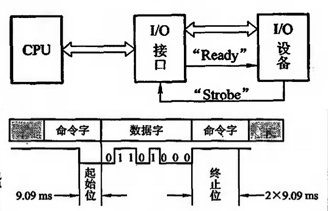
- **同步工作采用同步时标联络**：要求 I/O 设备与 CPU 的工作速度完全同步。

---

### I/O 设备与主机的连接方式

#### 辐射式连接

每台 I/O 设备都有一套控制线路和一组信号线，器件和连线较多，增删困难（计算机发展的初级阶段）。

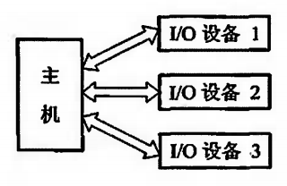

#### 总线连接

通过一组总线（地址线、数据线、控制线）将所有 I/O 设备与主机连接（现代大多数计算机系统所采用的方式）。

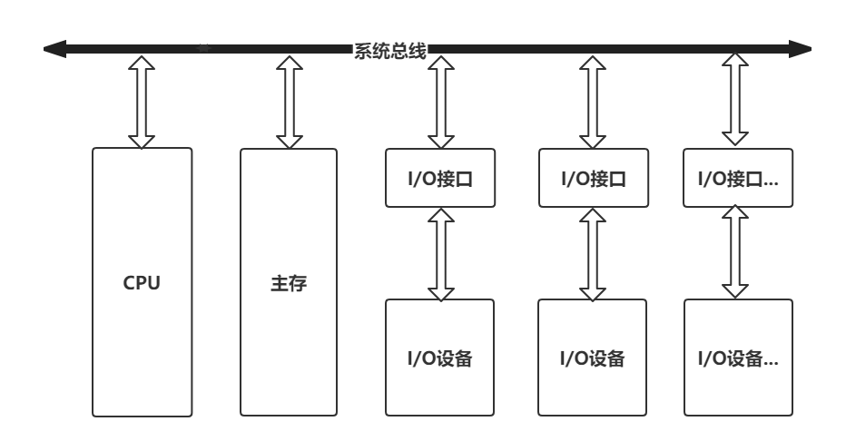

---

### I/O 设备与主机信息传送的控制方式

共 5 种控制方式：程序查询方式、程序中断方式、DMA 方式、I/O 通道方式、I/O 处理机方式。

#### 程序查询方式

CPU 通过程序不断查询 I/O 设备是否已做好准备，从而控制 I/O 设备与主机交换信息。

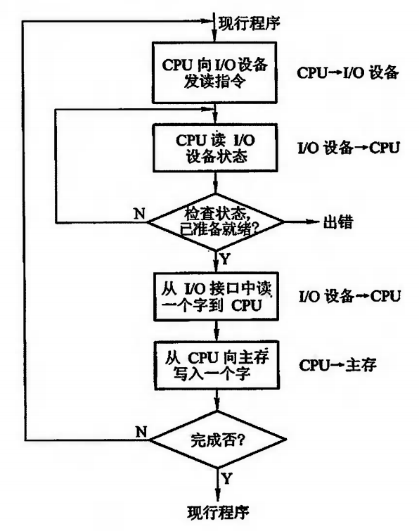

**缺点**：CPU 和 I/O 处于串行传输，CPU 的工作效率不高。

#### 程序中断方式

CPU 在启动 I/O 设备后，不查询设备是否已准备就绪，继续执行自身程序，只是当 I/O 设备准备就绪并向 CPU 发出中断请求后才予以响应。

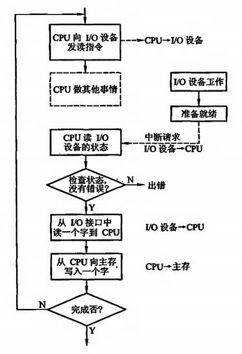

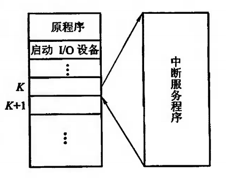

#### DMA 方式

主存与 I/O 设备之间有一条数据通路，主存与 I/O 设备交换信息时，无须调用中断服务程序。若出现 DMA 和 CPU 同时访问主存，CPU 总是将总线占有权让给 DMA（窃取或挪用周期）。

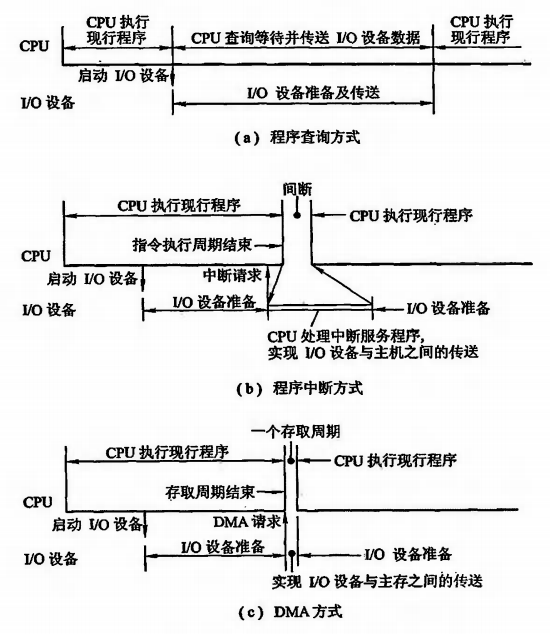

#### 三种方式区别

---

## I/O 设备

### 概述

中央处理器和主存构成了主机，除主机外的大部分硬件设备都可称为 I/O 设备或外部设备。

**外部设备大致分三类**：
- **人机交互设备**：键盘、鼠标、扫描仪、摄像机、语音识别器等。
- **计算机信息存储设备**：磁盘、光盘、磁带等。
- **机-机通信设备**：调制解调器等。

### 输入设备（了解）

键盘、鼠标、触摸屏、扫描仪、摄像头、条形码阅读器、数码化仪等。

### 输出设备（了解）

显示器、打印机、音响设备、投影仪等。

### 其他 I/O 设备（了解）

磁盘驱动器、USB 闪存驱动器、网络接口卡、读卡器等。

---

## I/O 接口

### 概述

I/O 接口通常是指主机与 I/O 设备之间设置的一个硬件电路及其相应的软件控制。

**为什么要设置接口？**
- 实现设备的选择
- 实现数据缓冲达到速度匹配
- 实现数据串-并格式转换
- 实现电平转换
- 传送控制命令
- 反映设备的状态（忙、等待、中断请求）

### 接口的功能和组成

#### 总线连接方式的 I/O 接口电路

每一台 I/O 设备都是通过 I/O 接口挂到系统总线上的。

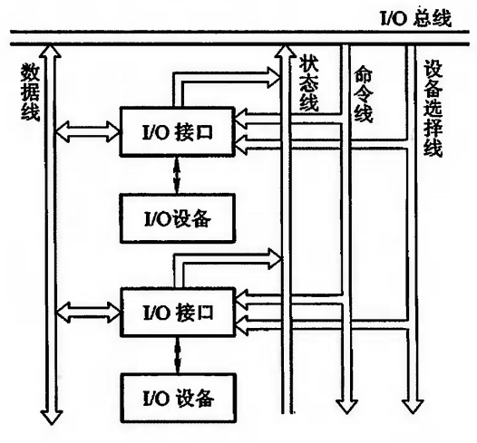

**I/O 总线包括**：
- **数据线**：I/O 设备与主机之间数据代码的传送线，双向或单向。
- **设备选择线**：传送设备码，根数取决于 I/O 指令中设备码的位数。
- **命令线**：传输 CPU 向设备发出的各种命令信号（启动、清除、屏蔽、读、写等）。
- **状态线**：将 I/O 设备的状态向主机报告（设备是否准备就绪等）。

#### 接口的功能和组成

| 功能 | 组成 |
|------|------|
| 选址功能 | 设备选择电路 |
| 传送命令的功能 | 命令寄存器、命令译码器 |
| 传送数据的功能 | 数据缓冲寄存器 |
| 反映设备状态的功能 | 设备状态标记（完成触发器 D、工作触发器 B、中断请求触发器 INTR、屏蔽触发器 MASK） |

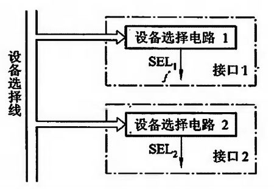

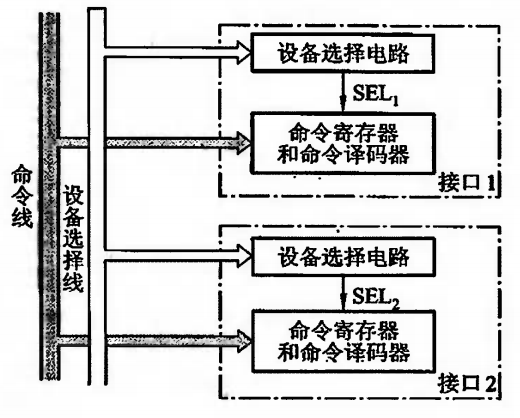

### 接口类型

1. **按数据传送方式**：并行接口（如 Intel8255）和串行接口（如 Intel8251）。
2. **按功能选择的灵活性**：可编程接口（如 Intel8255、Intel8251）和不可编程接口（如 Intel8212）。
3. **按通用性**：通用接口（如 Intel8255、Intel8212）和专用接口（如 Intel8279、Intel8275）。
4. **按数据传送的控制方式**：程序型接口（如 Intel8259）和 DMA 型接口（如 Intel8257）。

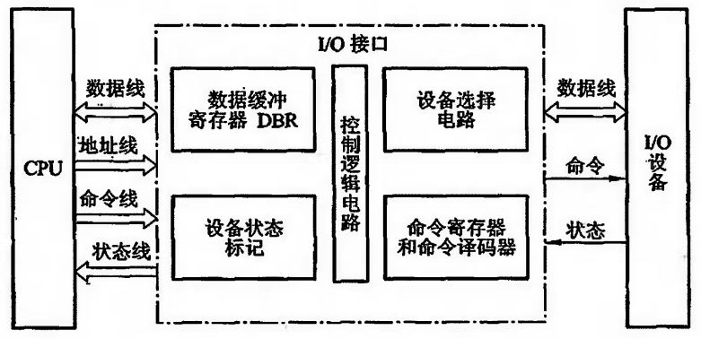

---

## 程序查询方式

### 程序查询流程

在程序查询方式中，CPU 会通过查询程序不断地检查各个 I/O 设备是否准备好进行数据传输。

- CPU 初始化时，在寄存器中设置好主存缓冲区的首地址和计数值
- CPU 发出启动指令，启动所有需要的 I/O 设备
- CPU 循环执行查询操作，从第一个设备开始，逐一检查每个设备是否准备就绪
- 如果某个设备准备好，CPU 就发出传送指令，并与该设备进行数据传输
- 数据传输完成后，CPU 返回到查询循环，继续检查下一个设备

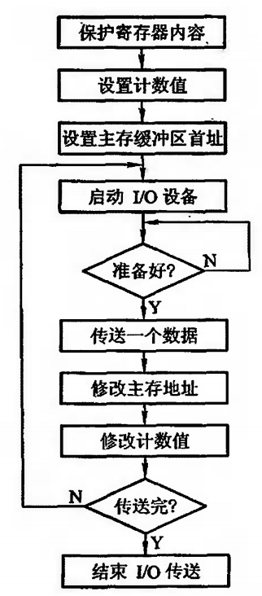

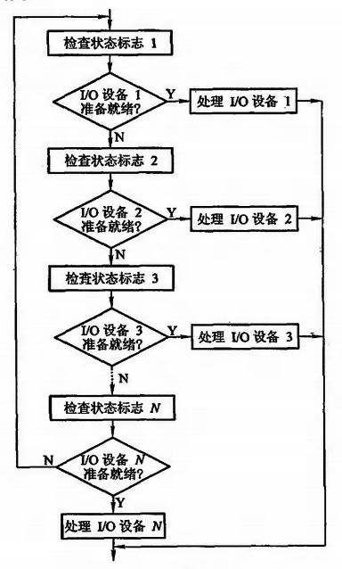

**缺点**：
- CPU 在等待 I/O 设备准备就绪的过程中，持续执行查询操作，导致 CPU 利用率低
- 如果多个设备同时准备好，无法有效地处理并行操作

### 程序查询接口

1. 当 CPU 通过 I/O 指令启动输入设备时，指令的设备码字段通过地址线送至设备选择电路
2. 若该接口的设备码与地址线上的代码吻合，其输出 SEL 有效
3. I/O 指令的启动命令经过"与非"门将工作触发器 B 置"1"，将完成触发器 D 置"0"
4. 由 B 触发器启动设备工作
5. 输入设备将数据送至数据缓冲寄存器
6. 由设备发设备工作结束信号，将 D 置"1"，B 置"0"，表示外设准备就绪
7. D 触发器以"准备就绪"状态通知 CPU，表示"数据缓冲满"
8. CPU 执行输入指令，将数据缓冲寄存器中的数据送至 CPU 的通用寄存器，再存入主存相关单元

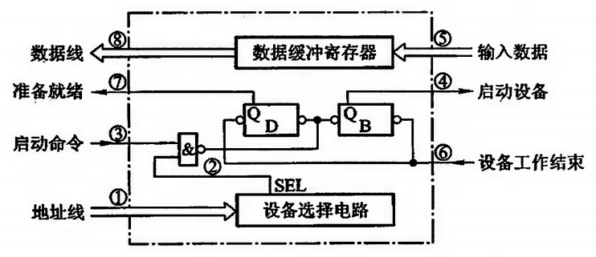

---

## 程序中断方式

### 概述

程序中断方式是基于程序查询方式的改进，它允许 I/O 设备在准备好后主动中断 CPU，而不是让 CPU 不断地查询。

- CPU 初始化所有 I/O 设备，并允许它们通过中断请求线（IRQ）发起中断
- CPU 开始执行其他任务，不需要持续查询 I/O 设备状态
- 当某个 I/O 设备准备好数据传输时，它会通过中断请求线发送中断信号给 CPU
- CPU 响应中断，暂停当前任务，处理中断（即与请求的 I/O 设备进行数据传输）
- 数据传输完成后，CPU 恢复被中断的任务

**I/O 中断案例**：当打印机在准备数据以及打印前准备阶段，CPU 都会继续执行主程序，只有当打印机准备好之后才会发中断请求给 CPU，然后 CPU 响应该中断。

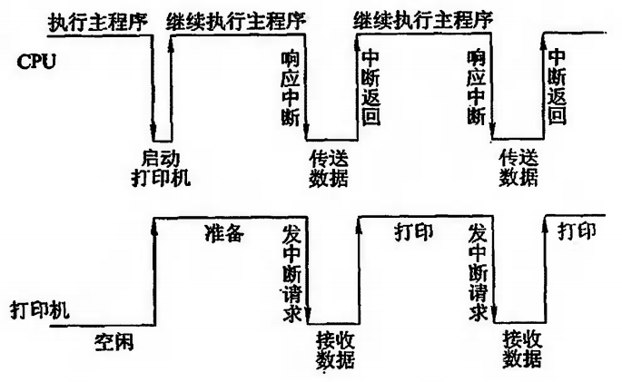

**优点**：
- CPU 的利用率提高，无需不断执行查询循环，可在等待 I/O 操作的同时执行其他任务
- 支持并行操作，多个设备可以独立地中断 CPU

### 程序中断方式接口

**中断请求触发器和中断屏蔽触发器**：接口电路中的完成触发器 D、中断请求触发器 INTR、中断屏蔽触发器 MASK 和中断查询信号的关系如下图所示。可见，仅当设备准备就绪（D = 1），且该设备未被屏蔽（MASK = 0）时，CPU 的中断查询信号可将中断请求触发器置"1"（INTR = 1）。

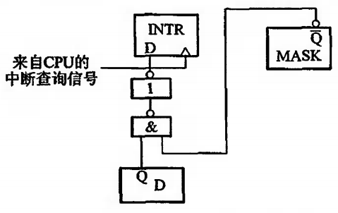

**排队器**：当多个中断源同时向 CPU 提出请求时，CPU 只能按中断源的不同性质对其排队，给予不同等级的优先权，并按优先等级的高低予以响应。硬件排队器优先级从左到右依次降低，是用 INTRn 的非来控制右侧 INTR(n+1) 的输出。

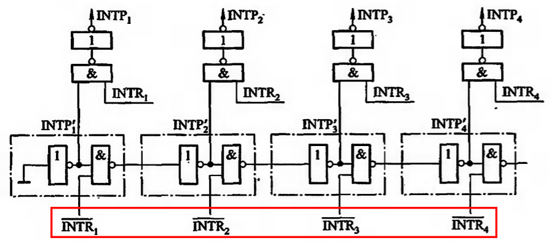

**中断向量地址形成部件（设备编码器）**：由硬件产生向量地址，再由向量地址找到入口地址。

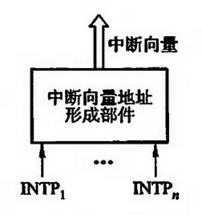

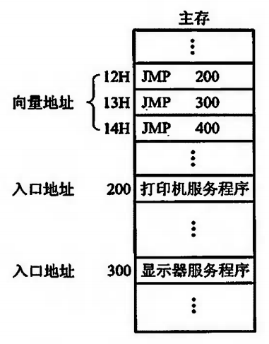

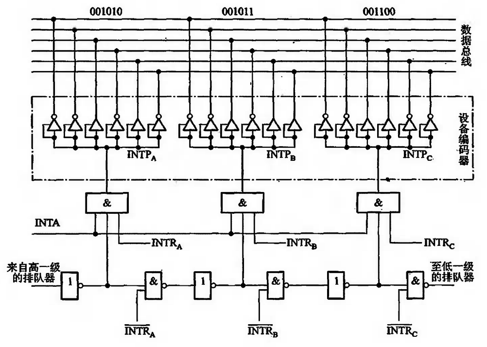

**程序中断方式接口电路的基本组成**：
1. **中断请求线（IRQ）**：设备使用中断请求线向 CPU 发送中断信号
2. **中断控制器**：当有多个设备时，负责管理多个中断请求，确定优先级
3. **设备选择电路**：用于识别哪个设备请求中断
4. **设备忙/就绪状态触发器**：指示设备是否忙或者就绪
5. **数据缓冲寄存器（DBR）**：暂存设备准备好的数据，等待 CPU 读取
6. **中断屏蔽寄存器（MASK）**：控制哪些中断请求被允许通过
7. **中断处理程序**：CPU 接收中断请求后执行的中断处理代码
8. **排队器**：当有多个中断请求同时发生时，决定哪个请求优先被处理
9. **设备编码器**：生成中断向量，指向特定的中断服务程序
10. **中断向量地址形成部件**：用于生成中断向量的地址

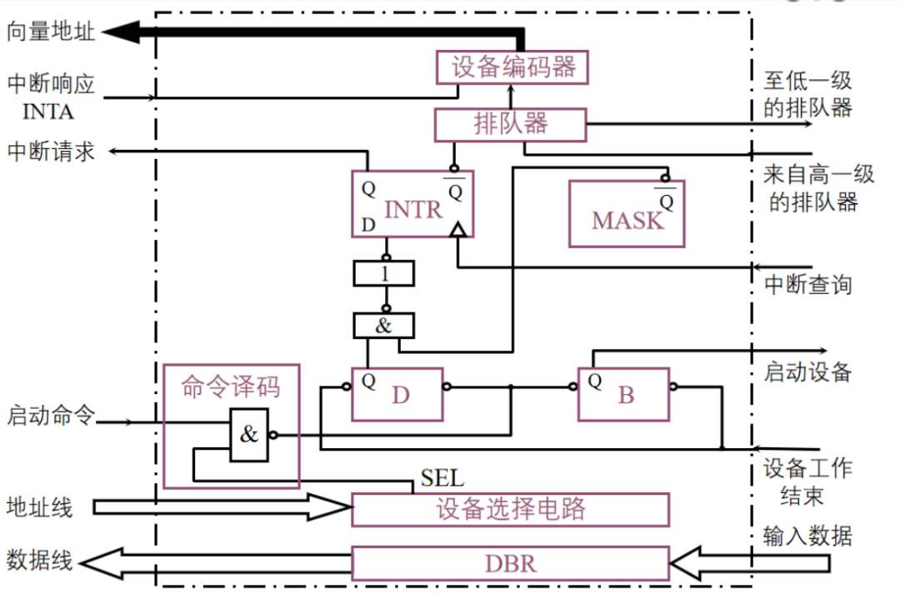

### 中断处理过程

**CPU 响应中断的条件和时间**：
- 条件：允许中断触发器 EINT = 1
- 时间：当 D = 1 且 MASK = 0，在每条指令执行阶段的结束前，INTR 置 1

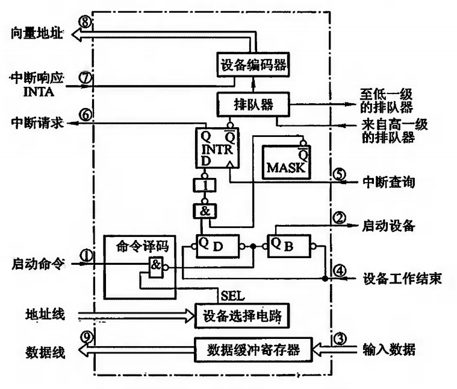

**中断服务程序的流程**：
1. **保护现场**：程序断点的保护（中断隐指令完成），寄存器内容的保护（出栈指令）
2. **中断服务**：对不同的 I/O 设备具有不同内容的设备服务
3. **恢复现场**（取数指令或者出栈指令）
4. **中断返回**（中断返回指令）

### 单重中断与多重中断

- **单重中断**：不允许中断现行的中断服务程序
- **多重中断**：允许级别更高的中断源来中断现行的中断服务程序

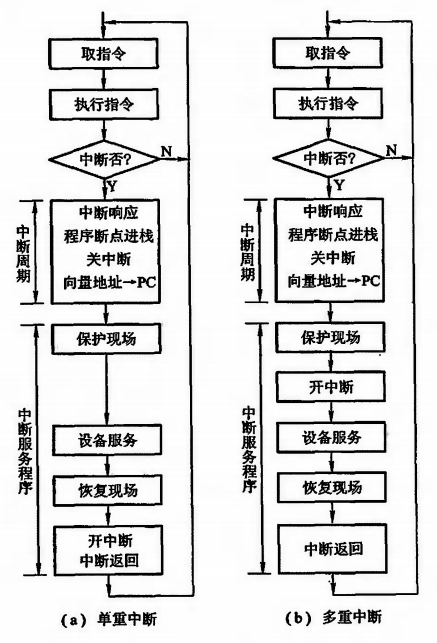

---

## DMA 方式

### 概述

DMA（Direct Memory Access）是一种允许 I/O 设备直接与主存进行数据传输的方式，不需要 CPU 的干预。

### DMA 与程序中断方式的区别

由于主存和 DMA 接口之间有一条数据通路，因此主存和设备交换信息时，不通过 CPU，也不需要 CPU 暂停现行程序为设备服务，省去了保护现场和恢复现场，因此工作速度比程序中断方式高。

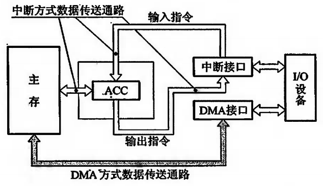

### DMA 控制器的组成

- **主存地址寄存器（AR）**：存放主存中需要交换数据的地址
- **字计数器（WC）**：记录传送数据的总字数，每传送一字加 1，直到计数器为 0
- **数据缓冲寄存器（BR）**：暂存每次传送的数据
- **DMA 控制逻辑**：负责管理 DMA 的传送过程
- **中断机构**：当字计数器溢出时，向 CPU 提出中断请求
- **设备地址寄存器（DAR）**：存放 I/O 设备的设备码或寻址信息

### DMA 传送方式

- **停止 CPU 访问主存**：DMA 传送期间 CPU 完全放弃主存控制权

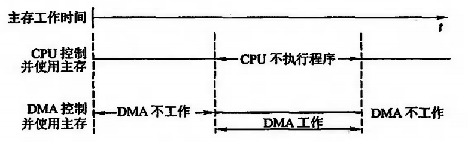
- **周期挪用（周期窃取）**：DMA 传送时，CPU 暂停一个存取周期，将总线让给 DMA

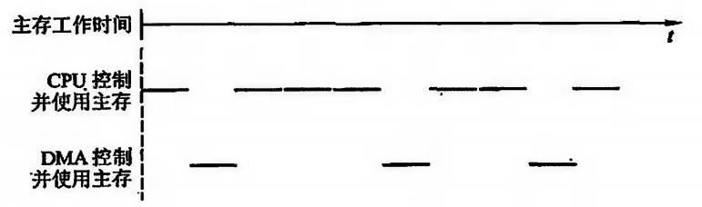
- **DMA 与 CPU 交替访问**：将时间分成两个时间片，分别给 CPU 和 DMA

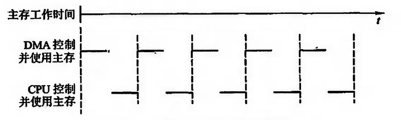

### DMA 传送过程

DMA 传送过程分：预处理、数据传送、后处理。

**预处理**：
- 给 DMA 控制逻辑指明数据传送方向
- 向 DMA 设备地址寄存器送入设备号，并启动设备
- 向 DMA 主存地址寄存器送入交换数据的主存起始地址
- 对字计数器赋予交换数据的个数

**数据传送**：DMA 方式是以数据块为单位传送的。

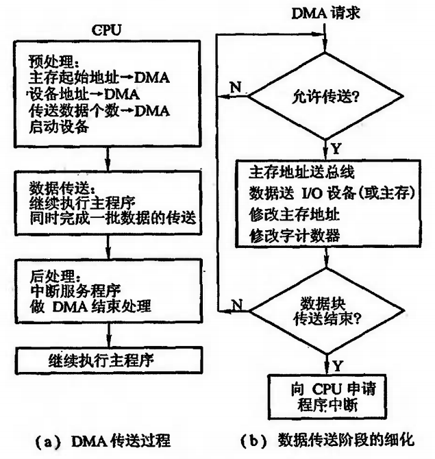

**后处理**：当 DMA 的中断请求得到响应后，CPU 转去执行中断服务程序，做 DMA 的结束工作。
- 校验传送主存的数据是否正确
- 决定是否继续用 DMA 传送其他数据块
- 测试在传送过程中是否发生错误

### 选择 DMA 方式的因素

- 主存与 CPU 的连接方式
- I/O 设备的工作速度
- 系统的实时性要求