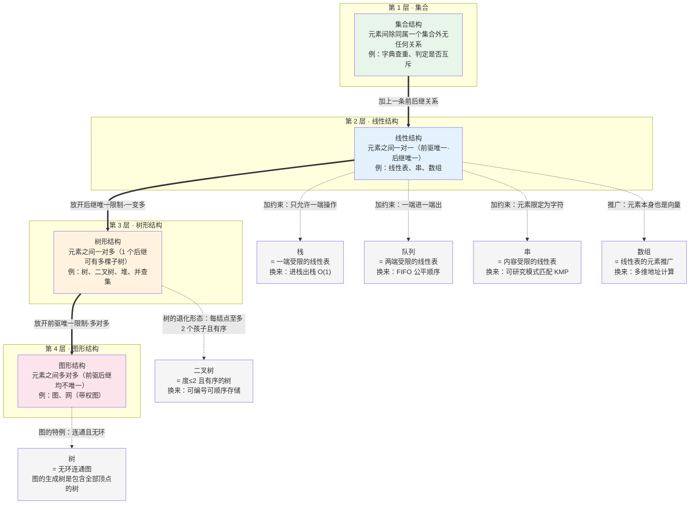
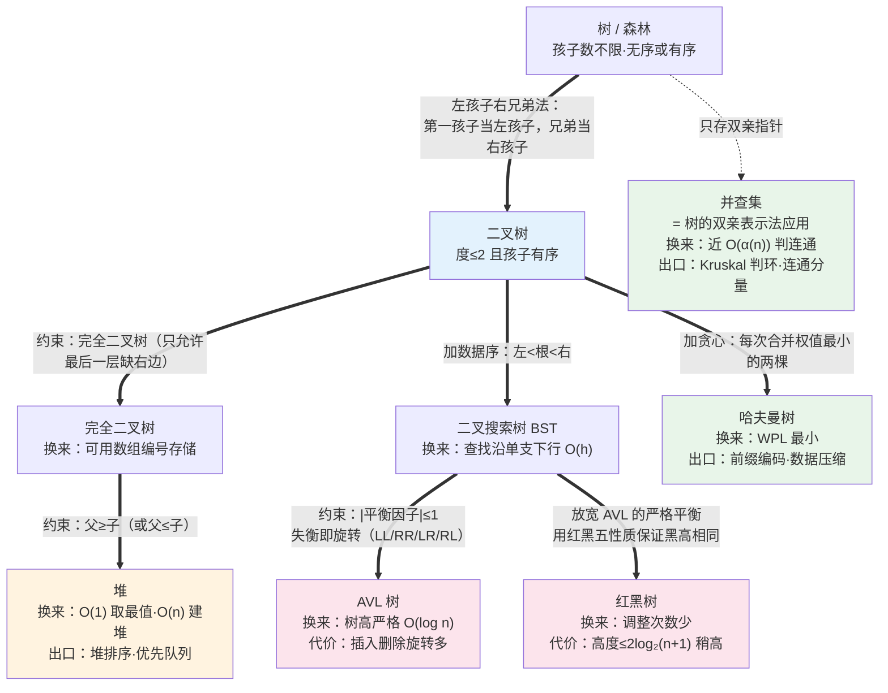
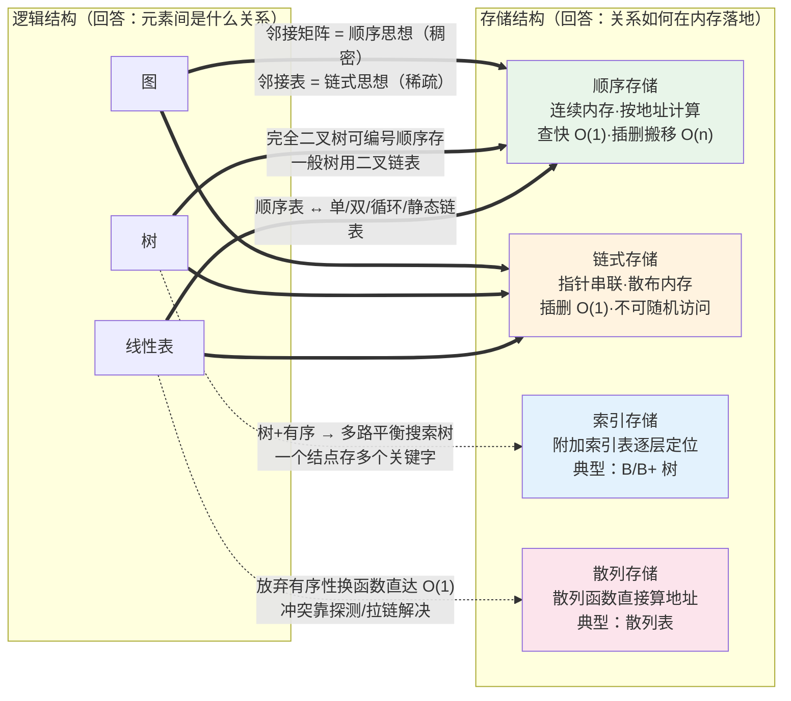
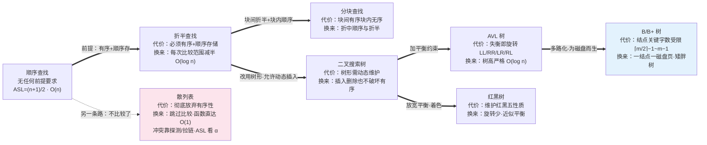
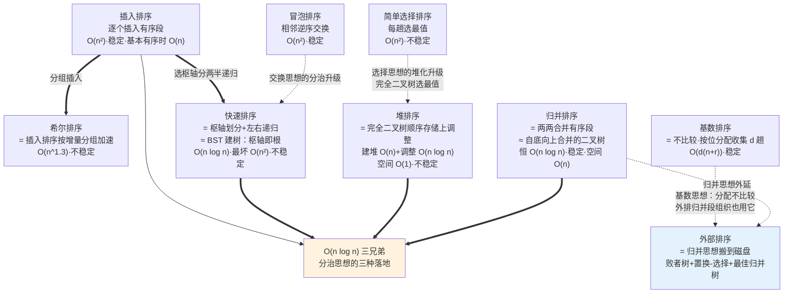
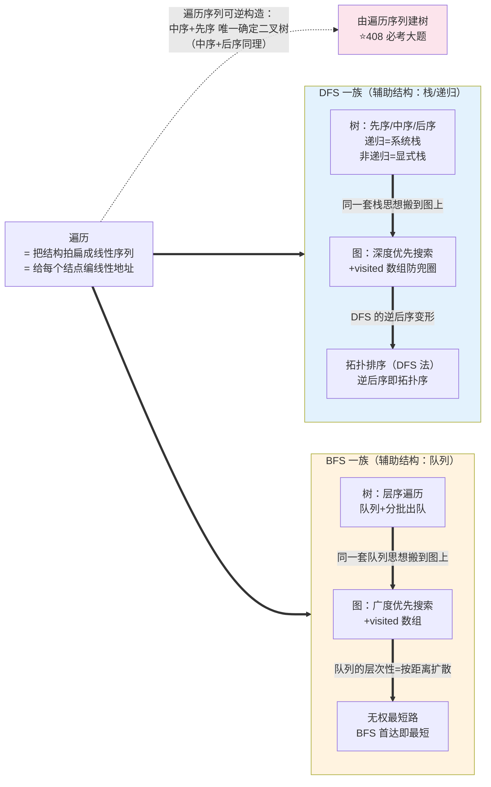
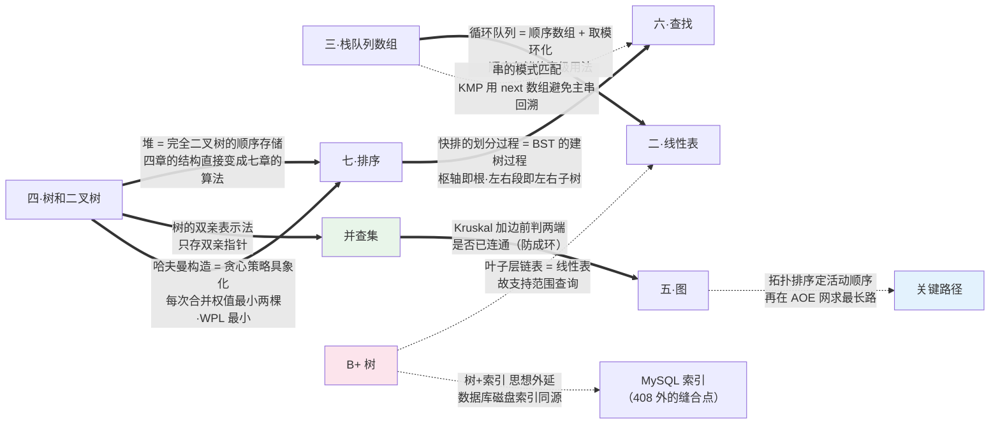

# 数据结构关系图谱

> 用 mermaid 具象化考纲各数据结构之间的关系——逻辑结构、存储结构、查找/排序演化链、遍历接口、跨章缝合点。

---

## 1. 逻辑结构：约束逐层收紧的光谱

> 图读法：主链（粗线）= 四种逻辑结构**逐层泛化**的方向；虚线 = 每种「衍生结构」是如何从主链上的结构**加约束或推广**变出来的，换来了什么。

---

## 2. 树家族：向二叉树降维

> 图读法：粗线 = 从树到各种受限二叉树的**约束叠加**过程，每个节点写明「加了什么约束、换来什么、代价是什么」；虚线 = 树的存储结构（双亲表示法）直接支撑并查集。

---

## 3. 存储结构：正交维度（跷跷板）

> 图读法：逻辑结构与存储结构**正交**——同一逻辑结构换不同存储，性能随之改变；实线 = 考纲直接给出的组合（表格对应关系已并入连线标签），虚线 = 演化出的高级组合。跷跷板总原则：`顺序 = 查快改慢，链式 = 查慢改快`。

---

## 4. 查找演化链：每一步都是「拿自由换性能」

> 图读法：主链（粗线）= **缩小比较范围**的进化方向，每条边标注「付出什么代价·换来什么性能」；虚线 = 从顺序查找分岔出的**跳过比较**路线（散列）。

---

## 5. 排序演化链：三种 O(n log n) 对应三种二叉树视角

> 图读法：三种 $O(n \log n)$ 排序（粗线汇合）各自对应一种二叉树视角——快排划分=建 BST、堆=完全二叉树、归并=自底向上合并；虚线 = 各朴素排序的升级/外延路线，外部排序是归并思想在磁盘上的延伸。

---

## 6. 遍历：结构到线性的统一接口

> 图读法：遍历只有两族——**栈思想（DFS）**与**队列思想（BFS）**，从树到图只是加了 visited 标记；「中序+先序建树」是遍历可逆性的直接产物，也是必考大题来源。

---

## 7. 跨章缝合点总图

> 图读法：粗线 = 考纲内部的高频缝合点（连线标签写明「缝的是什么、为什么能缝」）；虚线 = 思想外延（串、AOE、数据库索引），每条线一句话即可回忆整条推理链。

---

> 整理日期：2026-09-10 ｜ 配套：[README.md](./README.md) ｜ 考纲依据：教育部 2026 年 408 大纲
