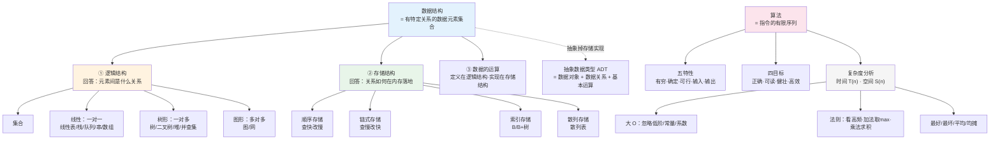

# 第一章 基本概念（2026 考纲新增独立章）

> 📍 **本章定位**：约 2 分，纯选择题。**"涂料级"偏上（接近砖墙下沿）**——概念辨析题几乎必有一道，但不出大题。
> **命题人套路**：四个"数据X"概念偷换、逻辑结构 vs 存储结构混淆、"算法五特性"与"好算法四目标"张冠李戴。
>
> **学这章要回答的问题**：没有数据结构，计算机出什么 bug ？
> → 计算机只会"读写内存 / 做加减"，如果没有"把数据按某种关系组织起来"的规矩，就退化成一堆散沙，无法高效增删查改。数据结构 = **给数据立规矩**（逻辑结构定"是什么关系"，存储结构定"怎么在内存落地"）。
> → 更狠的一句话：**规模一大，选错结构就不是"慢一点"，而是"根本跑不起来"** —— 30 亿条 KV 用哈希表要 210G 内存，改成"排序后线性存储 + 二分查找"只要 30G。**这就是必须学复杂度的原因**。
>
> ⚠️ 2026 变动：往年这些内容散乱在"绪论"里，2026 正式升格为**独立章节**，且与"算法基本概念"合并成章，选择题权重上升。

---

## 一、数据结构的基本概念

### （一）四个基础术语（⚠️ 选择题主战场）

| 术语 | 定义 | 关系 |
| --- | --- | --- |
| **数据（Data）** | 客观事物的符号表示，是计算机程序加工的原料 | 最大范围 |
| **数据对象（Data Object）** | 性质相同的数据元素的集合，是数据的子集 | ⊃ 数据元素 |
| **数据元素（Data Element）** | 数据的**基本单位**，通常作为一个整体考虑 | ⊃ 数据项 |
| **数据项（Data Item）** | 构成数据元素的**不可分割的最小单位** | 最小 |

**辨析口诀**：`数据对象 ⊃ 数据元素 ⊃ 数据项`，**数据元素是基本单位，数据项是最小单位**。

> 💡 例子：一张「学生表」是数据对象；「张三这行记录」是一个数据元素；「张三的学号、姓名、年龄」各是一个数据项。

### （二）数据结构 = 三要素（⚠️ 选择题必考）

**数据结构（Data Structure）**：存在一种或多种特定关系的数据元素的集合。

拆成三个要素：

```
数据结构
├── ① 逻辑结构 —— 数据元素之间的逻辑关系（"是什么关系"）
├── ② 存储结构（物理结构）—— 数据结构在计算机中的表示（"怎么落地"）
└── ③ 数据的运算 —— 对数据施加的操作
```

**① 逻辑结构（四种）**：

| 逻辑结构 | 元素间关系 | 典型例子 |
| --- | --- | --- |
| **集合** | 除"同属一个集合"外无其他关系 | 哈希集合、判定互斥 |
| **线性结构** | **一对一**（前驱唯一·后继唯一） | 线性表、栈、队列、串、数组 |
| **树形结构** | **一对多**（一个后继，多个前驱） | 树、二叉树、堆、并查集 |
| **图形结构** | **多对多**（前驱后继均不唯一） | 图、网（带权图） |

> 💡 **栈 / 队列 / 串 / 数组都是线性结构**（不要因为它们名字特殊就误判为非线形）。

**② 存储结构（四种）**：

| 存储结构 | 做法 | 特点 |
| --- | --- | --- |
| **顺序存储** | 用连续内存，靠地址计算定位 | 随机存取 O(1)，插删搬移 O(n) |
| **链式存储** | 用指针串联，结点散布内存 | 插删 O(1)，不可随机访问 |
| **索引存储** | 附加索引表，逐层定位 | 典型：B/B+ 树 |
| **散列存储** | 散列函数直接算地址 | 典型：散列表 |

> 💡 **记忆跷跷板**：`顺序 = 查快改慢，链式 = 查慢改快`。

**③ 数据的运算**：定义在**逻辑结构**上，实现在**存储结构**上。（⚠️ 高频陷阱：问"运算定义在哪"→ 逻辑结构；"实现在哪"→ 存储结构。）

### （三）逻辑结构与存储结构的关系（核心辨析）

> **逻辑结构是"面向问题"的，与计算机无关；存储结构是"面向机器"的，依赖具体实现。**
>
> 同一逻辑结构可对应多种存储结构（如线性表 → 顺序表 / 链表）；不同逻辑结构也可用同一存储结构实现。

### （四）抽象数据类型 ADT

**抽象数据类型（Abstract Data Type）**：用数学方式定义的数据类型，由一个**数据对象**、一组**数据关系**和一组**基本运算**组成。

- 关键词：**抽象**——只关心"能做什么操作"，不关心"怎么实现"。
- 三要素：数据对象 + 数据关系 + 基本运算。
- ADT 与"数据结构"的区别：ADT 是**逻辑概念**（不含存储实现），数据结构含存储结构。

---

## 二、算法的基本概念

### （一）算法定义

**算法（Algorithm）**：对特定问题求解步骤的一种描述，是**指令的有限序列**。

### （二）算法的五个特性（⭐选择题必背）

| 特性 | 含义 | 反例（缺了会怎样） |
| --- | --- | --- |
| **有穷性** | 算法必须在执行**有穷步**后终止 | 死循环 = 程序，但不是算法 |
| **确定性** | 每条指令含义明确、无二义性 | 同一输入产生不同结果 |
| **可行性** | 每一步都能用**已实现的基本运算**执行有穷次实现 | 步骤无法实现 |
| **输入** | 有 0 个或多个输入 | — |
| **输出** | 有 1 个或多个输出（**必须有输出**） | 无输出则无意义 |

> ⚠️ **易错**：输入可以是 **0 个**，输出**至少 1 个**。"有穷性"≠"确定性"，两者别混。

### （三）好算法的目标（四目标，⚠️ 与五特性区分）

| 目标 | 含义 |
| --- | --- |
| **正确性** | 能正确解决求解问题（最重要） |
| **可读性** | 便于理解、交流、调试 |
| **健壮性** | 对非法输入能恰当反应，不崩溃 |
| **高效率与低存储量** | 时间/空间复杂度低 |

> ⚠️ **选择题陷阱**：问"算法设计的目标/要求"选这 4 个；问"算法的特性"选前面 5 个。**"可读性"属于目标不属于特性！**

---

## 三、时间复杂度（★）

### （一）为什么需要复杂度分析

事后统计法（跑一遍看耗时）的两大局限：

1. **依赖测试环境**——i9 和 i3 跑同一段代码结果不同；
2. **受数据规模影响**——小规模数据下，插入排序可能反而快过快排。

→ 需要一种**不依赖具体环境、能反映增长趋势**的评估方法 = 渐进复杂度分析。

> 💡 **定调**：复杂度分析"几乎占了这门课的半壁江山，是精髓"——**只会用现成结构而不会分析复杂度，等于只会口诀不会心法**。

### （二）大 O 表示法

$$
T(n) = O(f(n))
$$

- $T(n)$：代码执行时间；$n$：数据规模；$f(n)$：每行代码执行次数之和。
- $O$ 表示 $T(n)$ 与 $f(n)$ **成正比**，反映的是**增长趋势**，不是精确时间。
- **忽略**：低阶、常量、系数。（如 $O(2n+2)$ → $O(n)$）

### （三）三条分析法则（⭐会用它算题就够）

| 法则 | 内容 | 记忆 |
| --- | --- | --- |
| **只看最高频** | 只关注循环执行次数最多的那段代码 | 单段看高频 |
| **加法法则** | $T(n)=T_1+T_2=\max(O(f),O(g))$ | 多段取最大 |
| **乘法法则** | $T(n)=T_1\times T_2=O(f)\times O(g)=O(f\times g)$ | 嵌套求乘积 |

> ⚠️ **多数据规模特例**：$m$、$n$ 是**两个独立规模**且无法比较量级时，加法不能合并 → $O(m+n)$，不能用 max。但乘法法则仍有效。
>
> ⭐ **多规模时的完整公式**（`之美/03`）：
>
> | 组合 | 写法 |
> | --- | --- |
> | 加法 | $T_1(m) + T_2(n) = O\big(f(m) + g(n)\big)$，例：遍历长度 $m$ 和 $n$ 的两个数组 → $O(m+n)$ |
> | 乘法 | $T_1(m) \times T_2(n) = O\big(f(m) \times g(n)\big)$，例：**遍历 $m$ 行 $n$ 列的二维数组** → $O(m\times n)$ |
>
> 🔎 **乘法法则不止"for 套 for"**：函数调用/递归嵌套同样适用——`for (i < n) ret += f(i);` 若 `f()` 自身是 $O(n)$，整体就是 $O(n^2)$。

### （四）常见复杂度量级（⭐必背顺序）

$$
O(1) < O(\log n) < O(n) < O(n\log n) < O(n^2) < O(n^3) < O(2^n) < O(n!)
$$

- **多项式量级**：$O(1)$、$O(\log n)$、$O(n)$、$O(n\log n)$、$O(n^2)$、$O(n^3)$
- **非多项式量级**（只有两个）：$O(2^n)$、$O(n!)$ → 对应的算法问题称 **NP 问题**，极其低效。

**几个易混点**：

- **$O(1)$**：不是"只执行一行"，而是**执行时间不随 $n$ 增长**。成千上万行无循环/无递归的代码也是 $O(1)$。
  - ⚠️ **也包括固定次数的循环**：`for (i = 0; i < 100; i++)` 这类**循环次数是已知常数、与 $n$ 无关**的代码，仍然是 $O(1)$（哪怕循环 10 万次）。
  - 📌 准确判据：**执行次数是否随 $n$ 变化**，而不是"有没有循环"。
- **$O(\log n)$**：对数的底可以忽略。$O(\log_2 n)=O(\log_3 n)$，因为 $\log_3 n = \log_3 2 \cdot \log_2 n$，底换算是**常数系数**。
  - 典型：`while (i <= n) i = i * 2;` → 执行 $\log_2 n$ 次。
  - 对比：`i = i + 2` 是**等差**，执行 $n/2$ 次 → $O(n)$。
- **$O(n\log n)$**：外层 $O(n)$ × 内层 $O(\log n)$。归并、快排的常见量级。

### （五）最好 / 最坏 / 平均 / 均摊（砖墙级，理解概念即可）

| 概念 | 定义 | 例子（无序数组查 x） |
| --- | --- | --- |
| **最好情况** | 最理想输入下的复杂度 | x 在首位 →$O(1)$ |
| **最坏情况** | 最糟输入下的复杂度 | x 不存在 →$O(n)$ |
| **平均情况** | 所有输入按概率的**加权平均（期望值）** | $\frac{3n+1}{4}$ → $O(n)$ |
| **均摊情况** | 一组连续操作把"高耗时"摊到"低耗时"上 | 动态数组扩容 →$O(1)$ |

> ⚠️ **平均 vs 均摊**：
>
> - 平均复杂度 = **加权平均**，需要对各种输入的概率做假设，与**输入分布**有关；
> - 均摊复杂度 = 用**摊还分析法**，把一次 $O(n)$ 摊到后续 $n-1$ 次 $O(1)$ 上，与**操作的时序规律**有关；
> - 在能应用均摊分析的场合，均摊复杂度一般**等于最好情况复杂度**。
> - 做题时若没特别说明，"时间复杂度"通常指**最坏情况**。

> ⭐ **"平均"是怎么加权出来的**（`之美/04`）：先看**不加权**的平均 —— 无序数组查 $x$，共 $n+1$ 种情况（在位置 $1..n$ 或不存在），
> $$\frac{1+2+\cdots+n+n}{n+1} = \frac{n(n+3)}{2(n+1)}$$
> 但这个算法**默认了"存在/不存在"各占一半**，与事实不符（实际"存在"的概率大得多）——所以才要按**真实概率**加权，得到 $\frac{3n+1}{4}$。**这就是"平均复杂度必须做概率假设"的由来**。

> ⭐ **摊还分析的适用条件（两条，`之美/04`）** —— 判断"这里能不能用均摊"的可操作标准：
> ① **绝大部分情况是 $O(1)$，只有个别情况是 $O(n)$**（反例：`find()` 恰好相反——只有极端情况才 $O(1)$，故**不能摊还**）；
> ② **高低耗时的出现频率有规律**：一个 $O(n)$ 之后**紧跟着 $n-1$ 个 $O(1)$**，循环往复。

> ⭐ **什么时候才需要区分最好/最坏/平均**（`之美/04`）：**只有当同一段代码在不同输入下复杂度出现量级差距时才区分**；否则（如不带 `break` 的查找，无论如何都扫满 $n$ 次）直接答 $O(n)$ 即可。

> 💡 **作者本人的定调**（`之美/04`）："**均摊时间复杂度就是一种特殊的平均时间复杂度**，没必要花太多精力区分；最该掌握的是**分析方法**（摊还分析），结果叫平均还是均摊只是个说法。" —— 考研真考的话，只会在选择题里辨析"**谁依赖概率分布**"。

### （六）空间复杂度

**渐进空间复杂度**：算法**额外**存储空间与数据规模 $n$ 的增长关系（不含输入本身）。

- 常见量级：$O(1)$、$O(n)$、$O(n^2)$（$\log$ 阶几乎用不到）。
- **原地工作（in-place）**：所需额外空间为常数 → 空间复杂度 $O(1)$。
- **递归算法**：空间复杂度 = **递归深度 × 每层所需空间**（系统栈开销）。
  - 例：二叉树后序遍历递归深度 $h$ → 空间 $O(h)$。

---

## 四、复习工具箱

> 本部分是正文之外的复习辅助区：概念关系图（L1 结构化）、跨科缝合（L2 关联化）、易错点清单、配套资源与自测。

### 4.0 通用复习动作：四问模板
对**任何一个知识点**，都自问这四个问题 —— **答不出哪个，就是哪块没懂**：

| 四问 | 检验的是什么 |
| --- | --- |
| ① **它的来历**？ | 是为了解决什么问题才被造出来的 |
| ② **它自身的特点**？ | 逻辑结构 / 存储结构 / 核心操作与复杂度 |
| ③ **它适合解决什么问题**？ | 适用场景与选型依据 |
| ④ **实际应用场景**？ | 能不能举出真实例子（文件系统？索引？缓存？） |

> 💡 这四问可以直接当**费曼自测的判据**，也可以当"这一章学完了没有"的验收标准。
> 📌 另外两条配套习惯：**边学边练**（每章的结构/算法自己敲一遍，刷题要适度，别用刷题量代替理解）；**允许反复**（第一遍不懂是正常的，隔几天重来，别卡在一个拦路虎上停摆）。

### 4.1 脉络打通：概念关系图（L1 结构化）



---

### 4.2 跨科缝合（L2 关联化）

| 本章概念 | 缝合到 | 缝的是什么 |
| --- | --- | --- |
| **时间复杂度** | 计组 · 指令执行周期 | 复杂度是"指令条数"的抽象，计组告诉你一条指令为什么有快有慢（CPI、时钟周期） |
| **空间复杂度 / 栈** | OS · 进程栈空间 | 递归深度对应进程栈帧的增长，栈溢出 = 递归太深 |
| **顺序 vs 链式存储** | 计组 · Cache 局部性 | 顺序存储**空间局部性好**，Cache 命中率高 → 同样是 O(n) 遍历，顺序表常快于链表 |
| **散列存储** | OS · 页表 / 数据库索引 | 散列思想直达寻址，页表、哈希索引同源 |

> ⛓️ 一句话：**"复杂度"是 408 四科共同的度量尺**——数据结构用 T(n)、S(n) 描述，计组用 CPI/时钟周期解释底层原因，OS 用栈/页表落实空间。

---

### 4.3 易错点

1. **数据元素是基本单位，数据项是最小单位**——别反。
2. **算法五特性 vs 好算法四目标**——"可读性/健壮性"是目标，不是特性。
3. **输入可以是 0 个，输出至少 1 个**。
4. **栈/队列/串/数组属线性结构**——名字特殊不代表结构特殊。
5. **运算"定义"在逻辑结构、"实现"在存储结构**——选择题高频偷换。
6. **$O(1)$ ≠ 一行代码**——判据是"**执行次数是否随 $n$ 增长**"。无循环无递归是 $O(1)$，**固定次数的循环（如 `for i < 100`）同样是 $O(1)$**。
7. **对数底忽略**：$\log_2 n = \log_3 n$（同量级）；但 $i=i\times2$（$O(\log n)$）与 $i=i+2$（$O(n)$）**天差地别**。
8. **多数据规模不能取 max**：$O(m+n) \neq O(\max(m,n))$。
9. **平均 ≠ 均摊**：平均看概率分布，均摊看操作时序；均摊通常 = 最好情况。
10. **递归空间 = 深度 × 每层空间**——不是"递归次数"。
11. **多规模时记得 $O(m\times n)$ 这种写法**：二维数组遍历、两个独立规模相乘时不能合并成一个规模。
12. **摊还分析有前提**：必须"绝大多数是 $O(1)$、个别是 $O(n)$，且**高低耗时有规律地交替**"。`find()` 那种"只有极端情况才 $O(1)$"的不能用摊还。
13. **不是每段代码都要分最好/最坏/平均**——只有**不同输入下量级不同**时才需要区分，否则直接给 $O(n)$。

---

### 4.4 配套资源 & 练习

#### 📚 阅读材料

| 主题 | 位置 | 状态 · 本章吸收了什么 |
| --- | --- | --- |
| 复杂度分析（上）：大 O + 三法则 | `数据结构与算法之美/03` | ✅ ⭐多规模时的加法/乘法公式与 $O(m\times n)$；⭐固定次数循环也是 $O(1)$；🔎 乘法法则不止 for 套 for |
| 复杂度分析（下）：最好/最坏/平均/均摊 | `数据结构与算法之美/04` | ✅ ⭐**摊还分析的两条适用条件**；⭐何时才需区分三种情况；⭐非加权平均式（说明为何要加权）；⭐**`add()` 均摊分析标准答案** |
| 学习框架 / 为什么学 | `数据结构与算法之美/01、02` | ✅ 只取了两点：开头那句"**规模一大选错结构就跑不起来**"的动机；"**复杂度分析是精髓**"的定调。⚠️ 其余（面试焦虑、10 数据结构清单、外链知识图谱）**无备考价值**，未收录 |

#### 💻 力扣练习

> 考纲给本章挂了 **0 题**（纯概念，无对应算法题）。若想练复杂度手感，用下面这道自测题。

**⭐ 自测题：动态数组 `add()` 的复杂度分析**（`之美/04` 课后题的标准答案）

2 倍扩容的动态数组，插入一个元素：

| 情况 | 复杂度 | 分析 |
| --- | --- | --- |
| **最好** | $O(1)$ | 数组还有空位，直接写到末尾 |
| **最坏** | $O(n)$ | 数组已满 → 申请 $2n$ 空间 + 拷贝原 $n$ 个元素 |
| **均摊** | $O(1)$ | 一次 $O(n)$ 之后，要**再插入 $n$ 次**才会再次扩容 → 把 $O(n)$ 摊到 $n$ 次 $O(1)$ 上 |

> 💡 这道题同时考了"三种复杂度"和"均摊分析的适用条件 ②"（高低耗时有规律交替），是本章最好的收尾练习。

#### ✅ 费曼自测

- [ ] 能用大白话讲清"逻辑结构"和"存储结构"的区别，且不出现"显然""众所周知"。
- [ ] 拿到一段嵌套循环代码，能在 30 秒内报出时间复杂度。
- [ ] 能举一个"平均复杂度是 O(n)、均摊是 O(1)"的反差例子。
- [ ] 能解释为什么 `O(log n)` 的底可以忽略，而 `i=i+2` 却退化成 `O(n)`。
- [ ] 能说出"摊还分析的**两条适用条件**"，并解释为什么 `find()` 不能用摊还而 `insert()` 可以。
- [ ] 能独立完成"动态数组 `add()` 的三种复杂度"分析（最好 / 最坏 / 均摊）。

---

> 整理日期：2026-09-11 ｜ 考纲依据：2026 版《计算机学科专业基础考试大纲》
