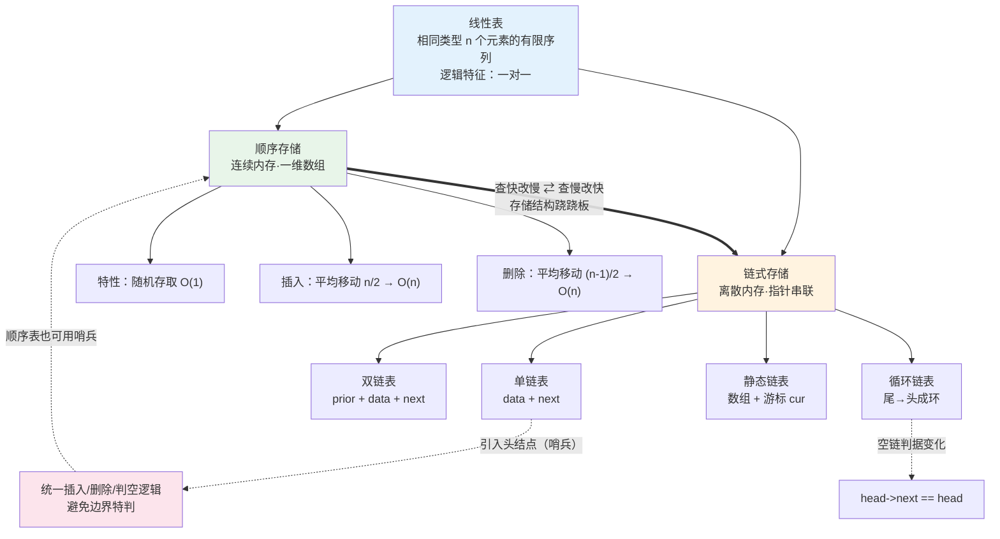

# 第二章 线性表（2026 考纲）

> 📍 **本章定位**：🏗️ **梁柱级**——大题 + 选择双高频。
>
> - **选择题**：顺序表地址计算、链表指针操作、判空条件、各链表对比（约 2 分）
> - **大题**：⭐⭐ **代码题主战场**！408 数据结构大题常考"设计算法 + 写代码"，本章是最高频出题点（约 10-12 分）
> - **考纲明确要求**：具备采用 **C 或 C++** 语言设计与实现算法的能力 → **手写代码能力**
>
> **学这章要回答的问题**：数组和链表都能存一串数据，为什么还要分两种？
> → 顺序表**查得快（O(1)）但改得慢（O(n)）**，链表**改得快（O(1)）但查得慢（O(n)）**。没有银弹，只有"用空间换时间"或"用时间换空间"的取舍。这道"跷跷板"贯穿整本数据结构。
>
> ⚠️ **代码作答规范**：
> 考纲考的是"**设计与实现**"能力 → **必须手搓数据结构，禁止调库**。
>
> - ✅ 本仓库 **C 版 = 造轮子版**：手写 `struct` + `malloc/free` + 操作函数，**这就是考试要写的代码**。
> - 🧠 **C++ / Python / Java 三版 = 调库版**：直接用 `std::list` / `list` / `ArrayList` / `LinkedList` 等现成容器，**仅为理解算法思想**。
> - ❌ 考场禁用：STL 容器、`java.util.*`、Python 高级容器代替手写结构 → 会被判"未实现数据结构"。
> - ✅ 考场可用：语言基础（`int`/数组/`malloc`/`free`/`printf`/基本运算符），这些是"语言"不是"数据结构"。

---

## 一、线性表的基本概念

### （一）定义

**线性表（Linear List）**：具有**相同数据类型**的 $n$（$n \geq 0$）个数据元素的**有限序列**。

一般表示为：$(a_1, a_2, \dots, a_i, a_{i+1}, \dots, a_n)$

### （二）逻辑特征（一对一）

- 除第一个元素 $a_1$ 外，每个元素有且仅有一个**直接前驱**；
- 除最后一个元素 $a_n$ 外，每个元素有且仅有一个**直接后继**；
- $n=0$ 时为空表。

> 💡 **注意**：线性表是**逻辑结构**，不是存储结构。它可以用顺序存储（顺序表）或链式存储（链表）实现。

### （三）基本操作（考纲列出的接口）

| 操作 | 含义 |
| --- | --- |
| `InitList(&L)` | 初始化，构造一个空线性表 |
| `Length(L)` | 求表长 |
| `LocateElem(L, e)` | 按值查找，返回第一个值为 e 的元素位置 |
| `GetElem(L, i, &e)` | 按位查找，用 e 返回第 i 个元素 |
| `ListInsert(&L, i, e)` | 在第 i 个位置插入元素 e |
| `ListDelete(&L, i, &e)` | 删除第 i 个元素，用 e 返回其值 |
| `Empty(L)` / `DestroyList(&L)` | 判空 / 销毁 |

> ⚠️ **大题常考**：这些操作的健壮性判断（越界、表满、空表）和边界处理，是代码题拿分关键。

---

## 二、线性表的实现

### （一）顺序存储——顺序表

**顺序表**：用一组**地址连续**的存储单元**依次**存储线性表的数据元素（用一维数组实现）。

#### 1. 核心特征

| 特征 | 说明 |
| --- | --- |
| **随机存取** | 通过下标直接算出地址，$O(1)$ |
| **插入/删除** | 需移动大量元素，平均$O(n)$ |
| **地址计算** | $Loc(a_i) = Loc(a_1) + (i-1) \times L$（$L$ 为每个元素字节数） |

> ⚠️ **易错辨析**（极客时间 05 篇强调）：
>
> - ❌ 错："数组适合查找，时间复杂度 O(1)"
> - ✅ 对："数组支持**随机访问**，**按下标访问**的时间复杂度为 O(1)"
> - 原因：即便有序数组，**二分查找也是 O(log n)**，不是 O(1)。

#### 2. 插入操作分析（⭐选择题计算）

在第 $i$ 个位置插入元素 $e$：从最后一个元素开始**依次后移**一位。

| 情况 | 移动次数 | 复杂度 |
| --- | --- | --- |
| 最好（插在表尾） | 0 | $O(1)$ |
| 最坏（插在表头） | $n$ | $O(n)$ |
| **平均** | $\frac{n}{2}$ | $O(n)$ |

**平均移动次数推导**：各位置等概率 $\frac{1}{n+1}$，插入位置 $i$ 需移动 $n-i+1$ 次

$$
\frac{1}{n+1}\sum_{i=1}^{n+1}(n-i+1) = \frac{1}{n+1} \cdot \frac{n(n+1)}{2} = \frac{n}{2}
$$

#### 3. 删除操作分析（⭐选择题计算）

删除第 $i$ 个元素：将第 $i+1$ 到第 $n$ 个元素**依次前移**一位。

| 情况 | 移动次数 | 复杂度 |
| --- | --- | --- |
| 最好（删表尾） | 0 | $O(1)$ |
| 最坏（删表头） | $n-1$ | $O(n)$ |
| **平均** | $\frac{n-1}{2}$ | $O(n)$ |

> ⭐ **三个"平均次数"放在一起记**
>
> | 操作 | 平均次数 | 说明 |
> | --- | --- | --- |
> | 插入（移动） | $\dfrac{n}{2}$ | 等概率插在 $1 \sim n+1$ |
> | 删除（移动） | $\dfrac{n-1}{2}$ | 等概率删 $1 \sim n$ |
> | **按值查找（比较）** | $\dfrac{n+1}{2}$ | 位置 1 比 1 次…位置 $n$ 比 $n$ 次，等概率求均值 |
>
> ⚠️ 注意区分：**查找失败**时是比较 $n$ 次（不是 $\frac{n+1}{2}$）。

> ⭐ **搬移方向为什么不能反**
> - **插入**必须从**最后一个**元素开始往后移——若先动第 $i$ 个，会覆盖掉第 $i+1$ 个；
> - **删除**必须从**被删位的后一个**开始往前移——若先动第 $i$ 个，会覆盖第 $i-1$ 个。
> 📌 记不住就想一句话：**"先腾出空位，再往空位里放"**。

> ⭐ **顺序表的五条特点**
> ① 随机存取 $O(1)$；② 存储紧凑，**无需额外空间表示逻辑关系**；③ 插入删除**要移动大量元素，效率低**；④ **需要大片连续内存**；⑤ **扩容容量难定**（太大浪费、太小频繁申请释放，且扩容本身 $O(n)$）。
>
> ⚠️ **连续内存的隐藏代价**：申请 100MB 数组时，**即使总剩余内存 > 100MB，若没有连续的 100MB 也会申请失败**——链表没有这个问题。

> 🔎 **扩展（非考纲 · 工程技巧）**
> ① **无序表的插入可做到 $O(1)$**：若数组只当"集合"用、不要求保序，可把第 $k$ 位的元素搬到表尾，再把新元素填到第 $k$ 位（$O(1)$）。
> ② **延迟删除 / 标记清除**：多次删除先只做标记，等空间不足时**一次性**执行真正的搬移。作者原话："这不就是 JVM 标记清除垃圾回收算法的核心思想吗？"
> ③ **连续删除优化**：删除多个紧邻元素时，"全部删完后一次性搬移"而非每次都搬——这正是"移除元素 / 原地去重"的**读写双指针**。

#### 4. 四语言实现：顺序表

> 🔧 **C = 造轮子版（主练）** ｜ 🧠 **C++/Python/Java = 调库版（理解用）**

##### 🔧 C 语言（造轮子版）

静态数组版，考纲要求的实现语言：

```c
#include <stdio.h>
#include <stdlib.h>

#define MaxSize 50          // 顺序表最大长度
#define ElemType int

// 静态分配的顺序表定义
typedef struct {
    ElemType data[MaxSize]; // 用静态数组存放数据元素
    int length;             // 当前表长
} SqList;

// 初始化
void InitList(SqList *L) {
    L->length = 0;
}

// 判空
int Empty(SqList L) {
    return L.length == 0;
}

// 求表长
int Length(SqList L) {
    return L.length;
}

// 按位查找：用 e 返回第 i 个元素，位置从 1 开始
int GetElem(SqList L, int i, ElemType *e) {
    if (i < 1 || i > L.length) return 0;  // 越界
    *e = L.data[i - 1];                    // 下标从 0 开始
    return 1;
}

// 按值查找：返回第一个值为 e 的元素位置，找不到返回 0
int LocateElem(SqList L, ElemType e) {
    for (int i = 0; i < L.length; i++)
        if (L.data[i] == e) return i + 1;
    return 0;
}

// 插入：在第 i 个位置插入 e，平均 O(n)
int ListInsert(SqList *L, int i, ElemType e) {
    if (i < 1 || i > L->length + 1) return 0;   // 位置非法
    if (L->length >= MaxSize) return 0;         // 表满
    for (int j = L->length; j >= i; j--)        // 从后往前后移
        L->data[j] = L->data[j - 1];
    L->data[i - 1] = e;
    L->length++;
    return 1;
}

// 删除：删除第 i 个元素，用 e 返回其值，平均 O(n)
int ListDelete(SqList *L, int i, ElemType *e) {
    if (i < 1 || i > L->length) return 0;       // 位置非法
    *e = L->data[i - 1];
    for (int j = i; j < L->length; j++)         // 从前往前移
        L->data[j - 1] = L->data[j];
    L->length--;
    return 1;
}

// 遍历输出
void PrintList(SqList L) {
    printf("[");
    for (int i = 0; i < L.length; i++)
        printf("%d%s", L.data[i], i < L.length - 1 ? ", " : "");
    printf("]\n");
}

int main(void) {
    SqList L;
    InitList(&L);
    ListInsert(&L, 1, 10);
    ListInsert(&L, 2, 20);
    ListInsert(&L, 3, 30);
    ListInsert(&L, 2, 15);   // 插入到第 2 位
    PrintList(L);            // [10, 15, 20, 30]

    ElemType e;
    ListDelete(&L, 3, &e);   // 删除第 3 位
    printf("deleted = %d\n", e);   // 20
    PrintList(L);            // [10, 15, 30]
    return 0;
}
```

##### 🧠 C++（调库版 · `std::vector`）

```cpp
#include <iostream>
#include <vector>
using namespace std;

int main() {
    // vector 底层就是动态数组，已是"造好的顺序表"
    vector<int> seq = {10, 20, 30};

    // 插入：在第 i 个位置（从 0 开始）插入，vector 自动搬移，O(n)
    seq.insert(seq.begin() + 1, 15);        // 下标 1 处插入 15
    // 删除：O(n)
    seq.erase(seq.begin() + 2);             // 删除下标 2 的元素
    // 随机访问：O(1)
    cout << "seq[1] = " << seq[1] << "\n";

    cout << "[";
    for (size_t i = 0; i < seq.size(); ++i)
        cout << seq[i] << (i < seq.size() - 1 ? ", " : "");
    cout << "]\n";                          // [10, 15, 30]

    seq.push_back(40);                      // 尾部插入，均摊 O(1)
    return 0;
}
```

> 🧠 **理解点**：`vector::insert/erase` 的 O(n) 正是"顺序表搬移元素"的库实现——调库只是把搬移藏起来了，复杂度没变。

##### 🧠 Python（调库版 · `list`）

```python
# Python 的 list 底层就是动态数组，本身即"造好的顺序表"
seq = [10, 20, 30]

seq.insert(1, 15)        # 下标 1 处插入，底层搬移 O(n)
seq.pop(2)               # 删除下标 2，O(n)
print(seq[1])            # 随机访问 O(1) → 15
print(seq)               # [10, 15, 30]

seq.append(40)           # 尾部插入，均摊 O(1)
```

> 🧠 **理解点**：`list.insert/pop` 的 O(n) 就是顺序表搬移元素；`list` 同时支持 O(1) 下标随机访问——这正是动态数组的特征。

##### 🧠 Java（调库版 · `ArrayList`）

```java
import java.util.ArrayList;

public class Main {
    public static void main(String[] args) {
        // ArrayList 底层是动态数组，即"造好的顺序表"
        ArrayList<Integer> seq = new ArrayList<>();
        seq.add(10); seq.add(20); seq.add(30);

        seq.add(1, 15);              // 下标 1 处插入，底层搬移 O(n)
        seq.remove(2);               // 删除下标 2，O(n)
        System.out.println(seq.get(1));   // 随机访问 O(1) → 15
        System.out.println(seq);     // [10, 15, 30]

        seq.add(40);                 // 尾部插入，均摊 O(1)
    }
}
```

> 🧠 **理解点**：`ArrayList.add(index, e)` / `remove(index)` 的 O(n) 就是顺序表搬移；`get(i)` 是 O(1) 随机访问。若用 `LinkedList` 则换成"造好的链表"（见下一节）。

---

### （二）链式存储——链表

**链表**：用指针（引用）把一组**任意物理位置**的结点串联起来，**逻辑相邻 ≠ 物理相邻**。

#### 1. 四种链表形态

| 类型 | 结构 | 判空条件（带头结点） |
| --- | --- | --- |
| **单链表** | `data` + `next` | `head->next == NULL` |
| **双链表** | `prior` + `data` + `next` | `head->next == NULL` |
| **循环单链表** | 尾结点`next` 指向头结点 | `head->next == head` |
| **循环双链表** | 双向 + 首尾相接 | `head->next == head`（且 `head->prior == head`） |
| **静态链表** | 数组`data` + 游标 `cur` | 用游标模拟指针 |

> ⚠️ **头结点 vs 头指针**（选择题高频）：
>
> - **头指针**：指向链表第一个结点的指针，**无论是否带头结点都存在**，是链表的标识。
> - **头结点**：附设在第一个数据结点之前的**不存数据的结点**，为了统一插入/删除/判空逻辑（哨兵思想）。
> - 带头结点时，头指针指向头结点；空表时 `head->next == NULL`。

#### 2. 单链表插入的顺序（⚠️ 大题致命易错点）

在结点 `p` 之后插入 `x`，**顺序不能反**：

```c
// ✅ 正确顺序：先接后链
x->next = p->next;   // 1. x 指向 p 的原后继
p->next = x;         // 2. p 指向 x

// ❌ 错误顺序（指针丢失）
p->next = x;         // 1. p 指向 x，原来 b 丢了！
x->next = p->next;   // 2. 等价 x->next = x，自己指自己
```

> 💡 **口诀**：**先连后路，再断前路**——先把新结点的指针接上，再改前驱的指针。

> ⭐⭐ **"删除 $O(1)$"是有条件的——分清两种问法**（`之美/06`，408 选择题高频陷阱）
>
> | 问法 | 单链表 | 双链表 |
> | --- | --- | --- |
> | 删除"**值等于给定值**"的结点 | $O(n)$ | $O(n)$ |
> | 删除"**给定指针 $q$ 指向的结点**" | $O(n)$ | **$O(1)$** |
> | 在给定结点**之前插入** | $O(n)$ | **$O(1)$** |
>
> 💡 **为什么**：删除动作本身是 $O(1)$，但**单链表要 $O(n)$ 从头找前驱**（找 `p->next == q`）；双链表有 `prior` 直接拿到前驱，所以是 $O(1)$。
> ⚠️ 而"删除值等于 $x$ 的结点"两者都是 $O(n)$——**遍历定位的 $O(n)$ 把删除动作的 $O(1)$ 吃掉了**（加法法则取最大）。
>
> 📌 **笔记里说的"链表插入删除 $O(1)$"指的是"已知前驱结点"的情形**，考题常在这里挖坑。
>
> 🔎 **补充技巧（LeetCode 237）**：即使单链表，删除"给定结点 $q$"（$q$ 不是尾结点）也能 $O(1)$——把后继的 data 拷过来，再删掉后继。⚠️ **$q$ 是尾结点时这招失效**（没有后继），仍要 $O(n)$。

#### 3. 顺序表 vs 链表（⭐必考对比表）

| 维度 | 顺序表 | 链表 |
| --- | --- | --- |
| **存储方式** | 连续内存 | 离散内存 + 指针 |
| **随机访问** | ✅$O(1)$ | ❌$O(n)$ |
| **按位插入/删除** | $O(n)$（搬移） | $O(1)$（改指针，已知位置） |
| **按值查找** | $O(n)$ / 有序 $O(\log n)$ | $O(n)$ |
| **空间开销** | 无额外开销（可能预分配浪费） | 每结点多一个指针域 |
| **空间弹性** | 固定容量，扩容需搬移 | 动态增减，灵活 |
| **适用场景** | 频繁查询、长度稳定 | 频繁插入删除、长度多变 |

> **顺序 = 查快改慢，链式 = 查慢改快**。

#### 4. 四语言实现：单链表

> 🔧 **C = 造轮子版（主练）** ｜ 🧠 **C++/Python/Java = 调库版（理解用）**

##### 🔧 C 语言（造轮子版）

带头结点：

```c
#include <stdio.h>
#include <stdlib.h>

typedef int ElemType;

// 单链表结点定义
typedef struct LNode {
    ElemType data;          // 数据域
    struct LNode *next;     // 指针域
} LNode, *LinkList;

// 初始化：创建头结点
LinkList InitList(void) {
    LNode *head = (LNode *)malloc(sizeof(LNode));  // 头结点
    head->next = NULL;
    return head;
}

// 判空
int Empty(LinkList head) {
    return head->next == NULL;
}

// 求表长（带头结点，不含头结点）
int Length(LinkList head) {
    int len = 0;
    for (LNode *p = head->next; p != NULL; p = p->next) len++;
    return len;
}

// 按位查找：返回第 i 个结点（带头结点）
LNode *GetElem(LinkList head, int i) {
    if (i < 1) return NULL;
    LNode *p = head->next;
    int j = 1;
    while (p != NULL && j < i) { p = p->next; j++; }
    return p;   // 越界时返回 NULL
}

// 按值查找
LNode *LocateElem(LinkList head, ElemType e) {
    LNode *p = head->next;
    while (p != NULL && p->data != e) p = p->next;
    return p;
}

// 在第 i 个位置插入 e（带头结点），O(n) 找位置 + O(1) 插入
int ListInsert(LinkList head, int i, ElemType e) {
    if (i < 1) return 0;
    LNode *p = head;                 // 从头结点开始，找第 i-1 个结点
    int j = 0;
    while (p != NULL && j < i - 1) { p = p->next; j++; }
    if (p == NULL) return 0;         // i 越界
    LNode *s = (LNode *)malloc(sizeof(LNode));
    s->data = e;
    s->next = p->next;               // ✅ 先接后路
    p->next = s;                     // ✅ 再断前路
    return 1;
}

// 删除第 i 个结点，用 e 返回其值
int ListDelete(LinkList head, int i, ElemType *e) {
    if (i < 1) return 0;
    LNode *p = head;
    int j = 0;
    while (p != NULL && j < i - 1) { p = p->next; j++; }
    if (p == NULL || p->next == NULL) return 0;
    LNode *q = p->next;              // 待删结点
    *e = q->data;
    p->next = q->next;               // 跨过 q
    free(q);                         // ⚠️ C 语言必须手动释放
    return 1;
}

// 头插法建立链表（逆序）
void CreateListHead(LinkList head, ElemType a[], int n) {
    for (int i = 0; i < n; i++) {
        LNode *s = (LNode *)malloc(sizeof(LNode));
        s->data = a[i];
        s->next = head->next;
        head->next = s;
    }
}

// 尾插法建立链表（顺序）
void CreateListTail(LinkList head, ElemType a[], int n) {
    LNode *tail = head;
    for (int i = 0; i < n; i++) {
        LNode *s = (LNode *)malloc(sizeof(LNode));
        s->data = a[i];
        tail->next = s;
        tail = s;
    }
    tail->next = NULL;
}

void PrintList(LinkList head) {
    printf("[");
    for (LNode *p = head->next; p != NULL; p = p->next)
        printf("%d%s", p->data, p->next ? ", " : "");
    printf("]\n");
}

int main(void) {
    LinkList L = InitList();
    ElemType a[] = {10, 20, 30};
    CreateListTail(L, a, 3);         // 尾插，顺序
    ListInsert(L, 2, 15);            // 第 2 位插 15
    PrintList(L);                    // [10, 15, 20, 30]
    ElemType e;
    ListDelete(L, 3, &e);            // 删第 3 位
    printf("deleted = %d\n", e);     // 20
    PrintList(L);                    // [10, 15, 30]
    return 0;
}
```

##### 🧠 C++（调库版 · `std::list`）

```cpp
#include <iostream>
#include <list>
#include <algorithm>
using namespace std;

int main() {
    // std::list 是双向链表，已是"造好的链表"
    list<int> lst = {10, 20, 30};

    auto it = lst.begin();
    advance(it, 1);              // 定位到下标 1（链表只能逐个走，O(n)）
    lst.insert(it, 15);          // 在 it 前插入，改指针 O(1)
    it = lst.begin();
    advance(it, 2);
    lst.erase(it);               // 删除，改指针 O(1)

    // 链表不支持随机访问，只能遍历
    cout << "[";
    for (auto p = lst.begin(); p != lst.end(); ++p)
        cout << *p << (next(p) != lst.end() ? ", " : "");
    cout << "]\n";               // [10, 15, 30]
    return 0;
}
```

> 🧠 **理解点**：`insert/erase` 给了迭代器就是 O(1)（改指针），但**定位到第 i 个结点要 `advance` 走 O(n) 步**——这正是链表"改得快、查得慢"的库表现。

##### 🧠 Python（调库版 · `collections.deque`）

> Python 没有内置普通链表，`deque`（双端队列，双向链表实现）最接近；若做 LRU 等题，直接用 `OrderedDict`/`dict` 更贴近库用法。

```python
from collections import deque

# deque 底层是双向链表
d = deque([10, 20, 30])

d.insert(1, 15)      # 在指定位置插入，O(n) 定位 + O(1) 改指针
del d[2]             # 删除，O(n) 定位 + O(1) 改指针

print(d[1])          # deque 支持下标但为 O(n)（双向走）
print(list(d))       # [10, 15, 30]
```

> 🧠 **理解点**：`deque` 的两端 `appendleft/popleft/append/pop` 都是 **O(1)**（链表的看家本领），中间插删要 O(n) 定位。

##### 🧠 Java（调库版 · `LinkedList`）

```java
import java.util.LinkedList;

public class Main {
    public static void main(String[] args) {
        LinkedList<Integer> list = new LinkedList<>();
        list.add(10); list.add(20); list.add(30);

        list.add(1, 15);       // 在指定位置插入：O(n) 定位 + O(1) 改指针
        list.remove(2);        // 删除：O(n) 定位 + O(1) 改指针

        System.out.println(list.getFirst());  // 10，头部 O(1)
        System.out.println(list);             // [10, 15, 30]
    }
}
```

> 🧠 **理解点**：`LinkedList` 实现 `Deque` 接口，`addFirst/removeFirst/addLast/removeLast` 均 O(1)；而 `list.get(i)` 要遍历，是 **O(n)**——对比 `ArrayList.get(i)` 的 O(1)，这就是链式 vs 顺序的核心差异。

#### 5. 双链表结点定义（四语言）

> ⚠️ **重点**：双链表插入/删除时**要同时改两个方向的指针**，漏一个就断链。

##### 🔧 C（造轮子版）

```c
typedef struct DNode {
    ElemType data;
    struct DNode *prior, *next;   // 前驱 + 后继
} DNode, *DLinkList;

// 在 p 之后插入 s
// s->next = p->next;          // 1. s 后继 = p 原后继
// if (p->next) p->next->prior = s;  // 2. 后结点的前驱 = s
// s->prior = p;               // 3. s 前驱 = p
// p->next = s;                // 4. p 后继 = s
```

##### 🧠 C++ / Python / Java（调库版）

调库时**不需要关心结点结构**，直接用现成容器：

```cpp
// C++：std::list 就是双向链表
#include <list>
std::list<int> lst = {10, 20, 30};
lst.push_front(5);   // 头部 O(1)
lst.push_back(40);   // 尾部 O(1)
```

```python
# Python：collections.deque 是双向链表
from collections import deque
d = deque([10, 20, 30])
d.appendleft(5)   # 头部 O(1)
d.pop()           # 尾部 O(1)
```

```java
// Java：LinkedList 是双向链表
import java.util.LinkedList;
LinkedList<Integer> list = new LinkedList<>();
list.addFirst(5);   // 头部 O(1)
list.addLast(40);   // 尾部 O(1)
```

> 🧠 **理解点**：库容器帮你隐藏了 `prior/next` 的维护，但**底层仍是双链表**——知道这一点才能在选择题里判断复杂度。

#### 6. 静态链表（数组 + 游标）

适用于**没有指针的语言**，用数组的**下标（游标 cur）**代替指针。

##### 🔧 C（造轮子版）

```c
#define MaxSize 100
typedef struct {
    ElemType data;   // 数据域
    int cur;         // 游标：下一个结点的数组下标，0 表示无后继
} SLinkList[MaxSize];
// 下标 0 的元素特殊处理：
//   - 未使用时可作"备用链表"头
//   - 已使用时作头结点，cur 指向第一个数据结点
```

> 🧠 **调库版说明**：C++/Python/Java 都有原生指针/引用，**不需要静态链表**——它是 C 语言（或早期无指针语言）的历史产物。理解"用下标模拟指针"这一思想即可。

> ⭐ **游标 `cur` 的本质：用下标模拟 `malloc` / `free`**（`快速上手C++/07`）
> - **分配**：从数组中找一个**空闲位置**（`cur` 标记为未使用）当新结点，填数据、改游标 —— 这就是 `malloc`；
> - **回收**：把被删结点的 `cur` 重新标记为"未使用" —— 这就是 `free`；
> - 插入三步：找空闲位 → 找第 $i-1$ 个位置 → 改两个游标；新结点若成为尾结点，`cur` 置结束标记。

> ⭐ **静态链表的优缺点**（选择题易错）
> ✅ 插入删除**只改游标、不移动元素**；
> ❌ **要预先分配一整块连续内存**（这与单链表"不需连续"正相反，是判断题常挖的坑）；
> ❌ **不能随机存取**、❌ **容量固定无法扩容**。
> 📌 只在"**不支持指针的语言 + 容量事先固定**"的场合才有价值。

> ⚠️⚠️ **静态链表的 0 号结点有两种约定，角色相反**（务必分清，写反必错）
>
> | | **约定 A**（`快速上手C++/07`） | **约定 B**（严蔚敏 / 王道） |
> | --- | --- | --- |
> | 0 号结点 | **数据链表的头结点**（`cur` 指向第一个数据结点） | **备用链（空闲链）的头**，`S[0].cur` 指向第一个空闲结点 |
> | 找空闲结点 | 从 1 起扫描 `cur == -1` 的位置，**$O(n)$** | 直接从 `S[0].cur` 摘，**$O(1)$** |
> | 判空 | 用 `length` 判断（不用游标） | `S[0].cur == -1`（约定 A 口径下）或看独立头结点 |
> | 判满 | 扫描不到空闲位 | `S[0].cur == 0`（空闲链已空），**$O(1)$** |
>
> 💡 **考试若考静态链表的代码题，应写"备用链"版本**（`Malloc_SL` / `Free_SL` 在 0 号上摘挂，分配回收都是 $O(1)$）——那才是能拿分的写法。
> 📌 笔记原来把两种实现混成了一句注释，现已拆开分述。

---

### （三）链表的经典操作（⭐大题/机试高频）

五大必练操作（极客时间 07 篇精选）：

| 操作 | 对应 LeetCode | 核心技巧 |
| --- | --- | --- |
| **单链表反转** | 206 | 三指针`prev/curr/next` 迭代 |
| **链表中环检测** | 141 | 快慢指针（Floyd 判圈） |
| **合并两个有序链表** | 21 | 双指针 + 哨兵头 |
| **删除倒数第 n 个结点** | 19 | 快慢指针拉开 n 步 |
| **求中间结点** | 876 | 快慢指针（快 2 慢 1） |

> ⭐ **循环链表用尾指针 `rear` 的两大好处**（`快速上手C++/06`，笔记原缺）
> ① `rear->next` 正好指向头结点 → **找头、找尾、头插、尾插、删头全是 $O(1)$**；
> ② **合并两个循环单链表 $O(1)$**（普通单链表要 $O(n)$ 找到表尾）：
>
> ```c
> p1head = tail1->next;                 // 记住表 1 的头
> tail1->next = tail2->next->next;      // ① 表1尾 → 表2首个数据结点
> tail2->next = p1head;                 // ② 表2尾 → 表1头
> ```
>
> ⭐ **循环链表的代码改了哪几处**（`快速上手C++/06`）：**插入/删除逻辑完全不用改**（都是先找前驱，末结点 next 指向头结点而非 NULL，对插删没有影响）。真正变的只有三处：
> ① 判空 `head->next == head`；② 遍历/析构的终止条件 `p != head`（替代 `p != NULL`）；③ 判尾 `p->next == head`。
>
> ⚠️ **口径提醒**：带尾指针时，**主流教材（王道）是"保留头指针、另设尾指针"，空表时 `tail` 指向头结点** —— 按教材记，别写"取消 head"。

> ⭐ **双链表删除要改几个指针**（`快速上手C++/05`）
> ```c
> q = p->next;                          // 待删结点
> p->next = q->next;                    // ①
> if (q->next != NULL) q->next->prior = p;   // ②
> ```
> 📌 **删非尾结点改 2 个指针，删尾结点只改 1 个**（没有后继可改）——选择/填空常见设问。
> 💡 **断链自检恒等式**：`p->prior->next == p` 且 `p->next->prior == p`，写完对照检查改漏没有。

**例：单链表反转（C 造轮子 + 三版调库）**

**🔧 C（造轮子版）**

```c
LNode *ReverseList(LNode *head) {
    LNode *prev = NULL, *curr = head;
    while (curr) {
        LNode *next = curr->next;   // 暂存后继
        curr->next = prev;          // 反转指针
        prev = curr;                // 整体后移
        curr = next;
    }
    return prev;                    // 新头
}
```

**🧠 C++（调库版 · `std::reverse`）**

```cpp
#include <list>
#include <algorithm>
std::list<int> lst = {10, 20, 30};
lst.reverse();       // 直接调用库函数反转双向链表
```

**🧠 Python（调库版）**

```python
# Python 无内置链表，若用 deque 可借助 reversed()
from collections import deque
d = deque([10, 20, 30])
d = deque(reversed(d))   # → deque([30, 20, 10])
```

**🧠 Java（调库版 · `Collections.reverse`）**

```java
import java.util.LinkedList;
import java.util.Collections;
LinkedList<Integer> list = new LinkedList<>();
Collections.addAll(list, 10, 20, 30);
Collections.reverse(list);   // → [30, 20, 10]
```

> ⚠️ **考试的"反转链表"考的是 C 版那 6 行手写逻辑**——调库版仅让你理解"链表反转"这个操作的存在，考场上写 `lst.reverse()` 不得分。

---

## 三、线性表的应用

| 技巧 | 思想 | 典型题 |
| --- | --- | --- |
| **双指针** | 两指针协同遍历，解决区间/查找/归并 | 三数之和、盛最多水的容器 |
| **滑动窗口** | 维护一个可伸缩的窗口 | 无重复字符的最长子串、最小覆盖子串 |
| **区间合并** | 按端点排序后线性扫描合并 | 合并区间、插入区间 |
| **原地操作** | 用读写指针原地去重/移除 | 删除有序数组重复项、移除元素、移动零 |

> 💡 **408 大题偏好**：有序表合并、原地去重、找中间/倒数第 k 个、判断是否回文——本质都是**双指针**。

### （附）缓存淘汰：三种策略 + LRU 的实现演进（`之美/06`）

| 策略 | 淘汰依据 | 类比 |
| --- | --- | --- |
| **FIFO** | 最早进入缓存的 | 按"进来多久" |
| **LFU** | 访问**次数**最少的 | 按"用过几次" |
| **LRU** | 访问**时间**最久远的 | 按"上次用是什么时候" |

> 💡 留言里的提法很好记：**LRU 是"活在当下"，LFU 是"以史为镜"**。

**LRU 的实现演进**：

1. **单链表版**：链表尾部 = 最早访问。命中则"删除 + 插到头部"，未命中且满则"删尾 + 插头部" —— 但**每次访问都要遍历定位，是 $O(n)$**；
2. **优化版**：引入**散列表**记录每个数据的位置 → 定位 $O(1)$ → 整体 $O(1)$；
3. 最终形态 = **散列表 + 双向链表**（为什么必须双向：删除结点要 $O(1)$ 拿到前驱）。

> ⛓️ 这正是第四章/第六章里"LRU 缓存"那条缝合线的完整推导，也是 **OS 页面置换 LRU** 的底层结构。

### （附）回文链表的标准解法（⭐真题"判断链表是否中心对称"的原型）

1. **快慢指针找中点**（注意奇偶：上/下中位数决定后半段从哪儿起步）；
2. **反转后半段**；
3. **双指针逐位比较**；
4. （可选）反转复原。

> 时间 $O(n)$、空间 **$O(1)$** —— 这个"不借助额外空间"的要求决定了必须用"反转后半段"而不是"压栈"。

---

## 四、复习工具箱

> 本部分是正文之外的复习辅助区：知识关系图（L1 结构化）、跨科缝合（L2 关联化）、易错点清单、配套资源与自测。

### 4.1 脉络打通：知识关系图（L1 结构化）



---

### 4.2 跨科缝合（L2 关联化）

| 本章概念 | 缝合到 | 缝的是什么 |
| --- | --- | --- |
| **顺序表随机访问** | 计组 · 存储器地址计算 | $Loc(a_i)=Loc(a_1)+(i-1)L$ 就是计组的**内存寻址公式** |
| **顺序表连续存储** | 计组 · Cache 局部性 | 连续存储**空间局部性好**，Cache 命中率高 → 遍历更快 |
| **链表的动态内存** | OS · 堆管理 / malloc | 每个`malloc` 都走 OS 的堆分配器，频繁分配有开销 |
| **头结点（哨兵）** | 算法通用技巧 | 插入排序、归并排序、动态规划都用哨兵简化边界 |
| **LRU 缓存（链表+哈希）** | OS · 页面置换 | LRU 底层 = 双向链表 + 哈希表，LRU 页面置换同源 |
| **链表 vs 数组** | OS · 文件物理结构 | 文件的**链接分配** ≈ 链表，**连续分配** ≈ 顺序表 |
| **顺序表下标 = 偏移** | 计组 · 寻址（补因） | `a[k]地址 = 基址 + k × size`；从 1 编号则多一次减法 $(k-1)$，$Loc(a_i)=Loc(a_1)+(i-1)L$ 的 $(i-1)$ 即**逻辑位序 → 物理偏移** |
| **延迟删除 / 标记清除** | OS · JVM 垃圾回收 | 多次删除先做标记、最后一次性搬移 ≈ **标记清除 GC**；也是"移除元素/原地去重"双指针的本质 |
| **静态链表的游标分配** | OS · 内存分配 | "找空闲位 = `malloc`、置未使用 = `free`"；**备用链表**就是 OS 的空闲分区链 |
| **哨兵（顺序查找版）** | 第六章 · 顺序查找 | 把待查 key 放在 0 号位（或从后往前扫），省掉每次循环的越界判断 |

> ⛓️ 一句话：**"顺序 vs 链式"这道跷跷板，是贯穿 408 四科的存储结构主旋律**——从数据结构一路延伸到计组 Cache、OS 文件分配、数据库索引。
>
> 💡 **规模一大，选错结构就不是慢一点，是根本跑不起来**（`之美/01` 留言实例）：30 亿条 KV 用哈希表要 210G 内存，改成"排序后线性存储 + 二分查找"只要 30G。

---

### 4.3 易错点

1. **插入顺序不能反**：先 `x->next = p->next`，再 `p->next = x`，否则指针丢失 + 内存泄漏。
2. **C/C++ 删除结点要手动 `free`/`delete`**，否则内存泄漏；Java/Python 靠 GC。
3. **头指针始终存在，头结点可有可无**；带头结点判空是 `head->next == NULL`。
4. **循环链表判空**：`head->next == head`（不是 `NULL`）。
5. **顺序表插入合法区间是 $1 \sim n+1$**，删除是 $1 \sim n$——插入比删除多一个位置。
6. **"数组查找 O(1)"是错的**：应为"按下标随机访问 O(1)"，二分仍 O(log n)。
7. **顺序表平均移动次数**：插入 $\frac{n}{2}$，删除 $\frac{n-1}{2}$。
8. **双链表改指针要两个方向都改**，否则前驱/后继断链。
9. **静态链表用游标（下标）代替指针**，0 常作特殊标记（无后继/头结点）。
10. **链表不支持随机访问**，`GetElem(i)` 需从头走，$O(n)$。
11. **"链表插入删除 $O(1)$"有前提**——必须是**已知前驱结点**；若是"删除值等于 $x$ 的结点"，单/双链表都是 $O(n)$（遍历占主导）。
12. **不带头结点时判空是 `head == NULL`**；带头结点时是 `head->next == NULL` —— 先看清有没有头结点。
13. **双链表删除：删非尾结点改 2 个指针，删尾结点只改 1 个**；自检恒等式 `p->prior->next == p && p->next->prior == p`。
14. **循环链表只改三处**：判空、遍历终止条件、判尾；**插入删除逻辑不用动**。
15. **静态链表的 0 号结点有两种约定**（数据链头结点 vs 备用链头），**角色相反**，写前先声明口径；代码题应写"备用链"版本（分配回收 $O(1)$）。
16. **代码自检四问**（`之美/07`，任何链表代码写完都要自问）：① 链表为空时？② 只含 1 个结点时？③ 只含 2 个结点时？④ 处理头/尾结点时？
17. 🔎 **数组越界的经典案例**（`之美/05`，面试常问、考研不考）：`int a[3]; for (i = 0; i <= 3; i++) a[i] = 0;` —— `a[3]` 越界恰好命中变量 `i` 的地址，把 `i` 清零导致死循环。C 语言的数组越界是**未定义行为**（不报错、逻辑诡异），Java 会抛 `ArrayIndexOutOfBoundsException`。

---

### 4.4 配套资源 & 练习

#### 📚 阅读材料

> 📖 **阅读状态说明**：✅ = 已通读并吸收进本章正文；⬜ = 仅按篇名索引，尚未阅读。

| 主题 | 位置 | 状态 · 本章吸收了什么 |
| --- | --- | --- |
| 数组：为什么从 0 开始编号 | `数据结构与算法之美/05` | ✅ ⭐下标 = 偏移（解释 $(i-1)$）；⭐连续内存"总量够也申请失败"；🔎 无序插入 $O(1)$、延迟删除 ≈ GC；🔎 数组越界经典案例 |
| 链表（上）：LRU 缓存 | `数据结构与算法之美/06` | ✅ ⭐**删除的两种问法**（高频陷阱）；⭐FIFO/LFU/LRU 三策略；⭐LRU 实现演进；⭐回文链表解法 |
| 链表（下）：写对链表代码的 6 个技巧 | `数据结构与算法之美/07` | ✅ ⭐**代码自检四问**（空表/1 个/2 个/头尾）；⭐哨兵在顺序查找的用法；🔎 指针本质 |
| 顺序表（上）：随机访问 | `快速上手C++数据结构与算法/02` | ✅ ✅ 位序 1-based、插入合法 $1\sim n+1$ 与王道一致；⭐地址计算数值样例 |
| 顺序表（下）：常用操作 + 复杂度 | `快速上手C++数据结构与算法/03` | ✅ ⭐**按值查找平均 $\frac{n+1}{2}$**；⭐搬移方向的 why；⭐顺序表五条特点；🔎 扩容（$+5$ 定长 vs 倍增） |
| 单链表 | `快速上手C++数据结构与算法/04` | ✅ ⭐不带头结点判空 `head == NULL`；⭐已知结点前插/删除的 $O(1)$ 技巧（尾结点失效）；🔎 尾指针优化尾插 |
| 双链表 | `快速上手C++数据结构与算法/05` | ✅ ⭐**删非尾改 2 个指针、删尾改 1 个**；⭐断链自检恒等式；🔎 借 `last` 双向查找最多 $n/2$ |
| 循环链表 | `快速上手C++数据结构与算法/06` | ✅ ⭐**尾指针 `rear` 的两大好处**（含合并两表 $O(1)$）；⭐只改三处 |
| 静态链表 | `快速上手C++数据结构与算法/07` | ✅ ⭐游标 = 模拟 `malloc`/`free`；⭐优缺点（要连续内存！）；⚠️⚠️ **0 号结点两种约定角色相反**；⭐备用链版本才是该写的 |

#### 💻 力扣练习

**顺序存储（6 题）**

| 题目 | 难度 |
| --- | --- |
| [删除有序数组中的重复项](https://leetcode.cn/problems/remove-duplicates-from-sorted-array/) | 🟢 简单 |
| [合并两个有序数组](https://leetcode.cn/problems/merge-sorted-array/) | 🟢 简单 |
| [移除元素](https://leetcode.cn/problems/remove-element/) | 🟢 简单 |
| [删除有序数组中的重复项 II](https://leetcode.cn/problems/remove-duplicates-from-sorted-array-ii/) | 🟡 中等 |
| [轮转数组](https://leetcode.cn/problems/rotate-array/) | 🟡 中等 |
| [除了自身以外数组的乘积](https://leetcode.cn/problems/product-of-array-except-self/) | 🟡 中等 |

**链式存储（19 题）**

| 题目 | 难度 |
| --- | --- |
| [反转链表](https://leetcode.cn/problems/reverse-linked-list/) | 🟢 简单 |
| [合并两个有序链表](https://leetcode.cn/problems/merge-two-sorted-lists/) | 🟢 简单 |
| [回文链表](https://leetcode.cn/problems/palindrome-linked-list/) | 🟢 简单 |
| [环形链表](https://leetcode.cn/problems/linked-list-cycle/) | 🟢 简单 |
| [相交链表](https://leetcode.cn/problems/intersection-of-two-linked-lists/) | 🟢 简单 |
| [LRU 缓存](https://leetcode.cn/problems/lru-cache/) | 🟡 中等 |
| [两两交换链表中的节点](https://leetcode.cn/problems/swap-nodes-in-pairs/) | 🟡 中等 |
| [两数相加](https://leetcode.cn/problems/add-two-numbers/) | 🟡 中等 |
| [两数相加 II](https://leetcode.cn/problems/add-two-numbers-ii/) | 🟡 中等 |
| [分隔链表](https://leetcode.cn/problems/partition-list/) | 🟡 中等 |
| [删除排序链表中的重复元素 II](https://leetcode.cn/problems/remove-duplicates-from-sorted-list-ii/) | 🟡 中等 |
| [删除链表的倒数第 N 个结点](https://leetcode.cn/problems/remove-nth-node-from-end-of-list/) | 🟡 中等 |
| [反转链表 II](https://leetcode.cn/problems/reverse-linked-list-ii/) | 🟡 中等 |
| [排序链表](https://leetcode.cn/problems/sort-list/) | 🟡 中等 |
| [旋转链表](https://leetcode.cn/problems/rotate-list/) | 🟡 中等 |
| [环形链表 II](https://leetcode.cn/problems/linked-list-cycle-ii/) | 🟡 中等 |
| [随机链表的复制](https://leetcode.cn/problems/copy-list-with-random-pointer/) | 🟡 中等 |
| [K 个一组翻转链表](https://leetcode.cn/problems/reverse-nodes-in-k-group/) | 🔴 困难 |
| [合并 K 个升序链表](https://leetcode.cn/problems/merge-k-sorted-lists/) | 🔴 困难 |

**线性表应用（15 题）**

| 题目 | 难度 |
| --- | --- |
| [判断子序列](https://leetcode.cn/problems/is-subsequence/) | 🟢 简单 |
| [汇总区间](https://leetcode.cn/problems/summary-ranges/) | 🟢 简单 |
| [移动零](https://leetcode.cn/problems/move-zeroes/) | 🟢 简单 |
| [验证回文串](https://leetcode.cn/problems/valid-palindrome/) | 🟢 简单 |
| [三数之和](https://leetcode.cn/problems/3sum/) | 🟡 中等 |
| [两数之和 II - 输入有序数组](https://leetcode.cn/problems/two-sum-ii-input-array-is-sorted/) | 🟡 中等 |
| [合并区间](https://leetcode.cn/problems/merge-intervals/) | 🟡 中等 |
| [插入区间](https://leetcode.cn/problems/insert-interval/) | 🟡 中等 |
| [无重复字符的最长子串](https://leetcode.cn/problems/longest-substring-without-repeating-characters/) | 🟡 中等 |
| [用最少数量的箭引爆气球](https://leetcode.cn/problems/minimum-number-of-arrows-to-burst-balloons/) | 🟡 中等 |
| [盛最多水的容器](https://leetcode.cn/problems/container-with-most-water/) | 🟡 中等 |
| [长度最小的子数组](https://leetcode.cn/problems/minimum-size-subarray-sum/) | 🟡 中等 |
| [串联所有单词的子串](https://leetcode.cn/problems/substring-with-concatenation-of-all-words/) | 🔴 困难 |
| [接雨水](https://leetcode.cn/problems/trapping-rain-water/) | 🔴 困难 |
| [最小覆盖子串](https://leetcode.cn/problems/minimum-window-substring/) | 🔴 困难 |

> 🎯 **优先级**：先把 5 个经典链表操作（206/141/21/19/876）写熟，直接对应 408 大题。

#### ✅ 费曼自测

- [ ] 能不看书写出顺序表的插入/删除，并说清为什么平均是 O(n)。
- [ ] 能解释"头结点"解决了什么边界问题（空表插入、删尾）。
- [ ] 能手写单链表反转，且能讲清三指针每一步在干什么。
- [ ] 能一句话说清顺序表与链表各自的适用场景，并各举一个真实系统例子（如 LRU）。

---

> 整理日期：2026-09-11 ｜ 考纲依据：2026 版《计算机学科专业基础考试大纲》｜ 定级：🏗️ 梁柱（大题 + 选择双高频）
