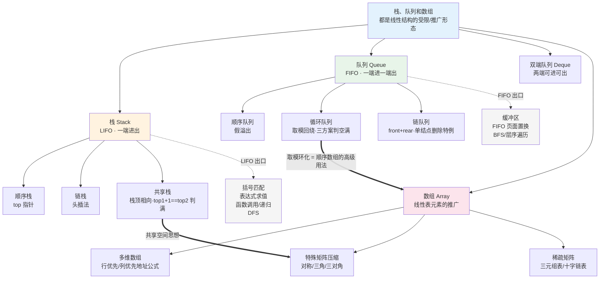

# 第三章 栈、队列和数组（2026 考纲）

> 📍 **本章定位**：🏗️ **梁柱级**——选择高频 + 应用大题。
>
> - **选择题**：合法出栈序列判断、循环队列判空/判满/元素个数、共享栈判满、数组地址计算、特殊矩阵下标映射（约 2-3 分）
> - **大题**：⭐⭐ **应用大题来源**——括号匹配、表达式求值（中缀↔后缀）、用栈/队列设计算法（约 8-10 分）
> - **2026 新增**：明确单列「**多维数组的存储**」与「**栈、队列和数组的应用**」两节，重视度上升
>
> **学这章要回答的问题**：数组、链表就能存数据，为什么还要"操作受限"的栈和队列？
> → 因为**限制换来可靠性**。数组/链表接口太多、太自由，容易用错；而"只能在一端进出"的规矩，正好匹配**后进先出**（函数调用、括号匹配、DFS）和**先进先出**（排队、BFS、缓冲区）这两类天然场景。**特定结构是特定场景的抽象**。
> → 而数组章问的是：**二维矩阵如何塞进一维内存？稀疏/对称矩阵如何省地方？**（地址计算 + 压缩存储）
>
> ⚠️ **代码作答规范**：
>
> - ✅ **C 版 = 造轮子版**：手写 `struct` + `malloc/free`，**考试要写的代码**。
> - 🧠 **C++ / Python / Java 三版 = 调库版**：直接用 `std::stack` / `list` / `deque` / `ArrayDeque` 等，**仅理解思想**。
> - ❌ 考场禁用：STL 容器、`java.util.*`、Python 高级容器代替手写结构。

---

## 一、栈、队列的基本概念

### （一）栈（Stack）——LIFO

**定义**：只允许在 **一端（栈顶）** 进行插入和删除的线性表。

- **特点**：**后进先出**（Last In First Out, LIFO）
- **术语**：栈顶（top）、栈底（bottom）、空栈
- **操作**：`Push`（入栈，栈顶插入）、`Pop`（出栈，栈顶删除）、`GetTop`（读栈顶，不删除）
- **本质**：**操作受限的线性表**——不是新结构，而是"只准在一端动"的规矩

> 💡 **为什么用栈？** 数组/链表能替代栈，但接口太自由、易出错。当问题天然符合 LIFO 时，用栈最顺理成章（如叠盘子）。

### （二）队列（Queue）——FIFO

**定义**：只允许在**一端（队尾）插入**、**另一端（队头）删除**的线性表。

- **特点**：**先进先出**（First In First Out, FIFO）
- **术语**：队头（front，删除端）、队尾（rear，插入端）、空队列
- **操作**：`EnQueue`（入队，队尾）、`DeQueue`（出队，队头）、`GetHead`（读队头）
- **本质**：也是**操作受限的线性表**

> 💡 **为什么用队列？** 匹配"公平排队"场景——缓冲区、线程池任务排队、页面置换 FIFO、BFS。

### （三）双端队列（Deque）

**定义**：允许**两端都可以插入和删除**的线性表。

| 类型 | 限制 |
| --- | --- |
| **双端队列** | 两端都可插入、都可删除 |
| **输入受限的双端队列** | **只能从一端插入**，但**两端都可删除** |
| **输出受限的双端队列** | **两端都可插入**，但**只能从一端删除** |

> ⚠️ **别记反**（对照 `快速上手C++数据结构与算法/09` 的定义）：**"输入受限"限的是插入端（一端不能插），"输出受限"限的是删除端（一端不能删）**。名字里"输入/输出"指的就是被限制的那个动作。
>
> 💡 记忆法：输入受限 = 入口只有一个、出口两个；输出受限 = 入口两个、出口只有一个。

> ⚠️ **⭐选择题高频**：给定输入序列，判断"输出受限/输入受限的双端队列"能否产生某输出序列。这类题要**逐个模拟**，注意"受限端"不能随意操作。

### （四）合法出栈序列判断（⭐选择必考）

> **问题**：输入序列 `1,2,3,4` 依次入栈，能否得到输出序列 `3,1,2,4`？

**判断要点**：

- 入栈顺序固定为 $1 \to 2 \to 3 \to 4$（每个元素"入栈/出栈"的时机可选）；
- 出栈必须遵守 **LIFO**：一个元素出栈时，它上面的元素必须先出栈。

**例析** `3,1,2,4`：要输出 3，须先压 `1,2,3` 再弹 3；此时栈内剩 `1,2`（2 在顶），**下一个必须弹 2，不可能弹 1** → 序列**非法**。

**经典结论**：$n$ 个元素依次入栈，合法出栈序列共 **卡特兰数** $C_n = \dfrac{1}{n+1}\dbinom{2n}{n}$ 种（如 $n=3$ 时有 $5$ 种）。

---

## 二、栈和队列的顺序存储结构

### （一）顺序栈

用**数组**实现，`top` 指针（下标）标示栈顶。

**核心**（`top` 从 -1 开始，指向栈顶元素）：

- 空栈：`top == -1`
- 栈满：`top == MaxSize - 1`
- 入栈：`data[++top] = e`
- 出栈：`e = data[top--]`
- 元素个数：`top + 1`

> ⚠️ **还有一套 `top` 初值为 0 的约定**（`快速上手C++/08` 明确列出，选择题常拿来当干扰项）：
>
> | | **`top = -1` 版（本章采用）** | **`top = 0` 版** |
> | --- | --- | --- |
> | 判空 / 判满 | `top == -1` / `top == MaxSize-1` | `top == 0` / `top >= MaxSize` |
> | 入栈（Push） | `data[++top] = e`（**先移后放**） | `data[top] = e; top++;`（**先放后移**） |
> | 出栈（Pop） | `e = data[top--]`（**先取后移**） | `top--; e = data[top];`（**先移后取**） |
> | 元素个数 | `top + 1` | `top` |
>
> 💡 两版只是"两行代码的顺序互换"，**逻辑等价**。做题先看题干给的初值，再决定用哪套。
>
> 💡 另外：**出栈时只把 `top` 减 1，并不抹掉原位置的值**——旧值留在那儿等下次入栈覆盖。所以 Pop 是纯粹的 $O(1)$。
> 🔎 还有个接口差异：有的实现里 `Pop` **不返回**栈顶元素（取值要另调 `GetTop`），写算法题时先声明自己的 `Pop` 语义。

#### 🔧 C 语言（造轮子版）

```c
#include <stdio.h>
#include <stdlib.h>

#define MaxSize 50
typedef int ElemType;

// 顺序栈定义
typedef struct {
    ElemType data[MaxSize];  // 静态数组存元素
    int top;                 // 栈顶指针（下标），-1 表示空栈
} SqStack;

// 初始化
void InitStack(SqStack *S) {
    S->top = -1;
}

// 判空
int StackEmpty(SqStack S) {
    return S.top == -1;
}

// 入栈，O(1)
int Push(SqStack *S, ElemType e) {
    if (S->top == MaxSize - 1) return 0;   // 栈满
    S->data[++S->top] = e;                 // 先移指针，再放元素
    return 1;
}

// 出栈，用 e 返回栈顶，O(1)
int Pop(SqStack *S, ElemType *e) {
    if (S->top == -1) return 0;            // 空栈
    *e = S->data[S->top--];                // 先取元素，再移指针
    return 1;
}

// 读栈顶（不删除），O(1)
int GetTop(SqStack S, ElemType *e) {
    if (S.top == -1) return 0;
    *e = S.data[S.top];
    return 1;
}

// 栈中元素个数
int StackLength(SqStack S) {
    return S.top + 1;
}

int main(void) {
    SqStack S;
    InitStack(&S);
    Push(&S, 10); Push(&S, 20); Push(&S, 30);
    ElemType e;
    Pop(&S, &e);
    printf("pop = %d, len = %d\n", e, StackLength(S));  // pop = 30, len = 2
    GetTop(S, &e);
    printf("top = %d\n", e);                            // top = 20
    return 0;
}
```

#### 🧠 三语言调库版

```cpp
// C++：std::stack 默认基于 deque 实现
#include <stack>
std::stack<int> st;
st.push(10); st.push(20); st.push(30);
st.top();   // 30，读栈顶 O(1)
st.pop();   // 弹出 30
st.size();  // 2
```

```python
# Python：list 当栈用，尾部即栈顶
st = []
st.append(10); st.append(20); st.append(30)   # push
st[-1]      # 30，读栈顶
st.pop()    # 弹出 30，均摊 O(1)
len(st)     # 2
```

```java
// Java：ArrayDeque 推荐用作栈（比遗留的 Stack 类更高效）
import java.util.ArrayDeque;
ArrayDeque<Integer> st = new ArrayDeque<>();
st.push(10); st.push(20); st.push(30);
st.peek();   // 30
st.pop();    // 弹出 30
st.size();   // 2
```

> 🧠 **理解点**：调库只需记 `push/pop/top` 三个操作都是 **O(1)**——对应顺序栈"只动栈顶"。
>
> 💡 **空间复杂度怎么算**：存数据的数组本身是"**本来就必须要的存储空间**"，**不算进空间复杂度**——所以顺序栈的空间复杂度是 $O(1)$（只有一两个临时变量）。这个口径在分析所有"原地"结构时都适用。

> 🔎 **扩展（非考纲 · 面试/工程向）：支持动态扩容的顺序栈与"均摊复杂度"**
> 固定大小的数组栈满了怎么办？**申请一块 2 倍大小的新数组，把旧数据搬过去**（这就是 C++ `vector` / Java `ArrayList` 的扩容机制）。
> 于是入栈出现三种时间复杂度：**最好 $O(1)$**（有空位）、**最坏 $O(n)$**（要搬 $n$ 个数据）、**均摊 $O(1)$**。
> 均摊怎么来的：栈满时（大小 $K$）扩容并搬移 $K$ 个数据，但**接下来 $K-1$ 次入栈都不再需要搬移**——把这 $K$ 次搬移摊到 $K$ 次入栈上，每次只摊到 1 次搬移 + 1 次 `simple-push`，故**均摊 $O(1)$**。
> ⛓️ 呼应第一章的**均摊时间复杂度**概念——"均摊复杂度一般等于最好情况复杂度"，这个扩容栈就是它的经典例子。面试高频追问：`vector` 为什么二倍扩容而不是每次 +1？（答：+1 会导致每次入栈都要搬移，均摊退化为 $O(n)$。）
>
> ⚠️ **反面教材——定长增量扩容**：若扩容采用**定长增量**（如初始容量 10、每次只 +5，满了就新开"+5"的空间再搬），
> 这种策略下**每 5 次入栈就要搬一次 $O(n)$** → 均摊复杂度退化成 **$O(n)$ 而不是 $O(1)$**！
> 📌 所以"扩容必须按**倍数**增长"不是风格问题，是**复杂度问题**——只有倍数扩容才能让搬移次数随规模呈对数增长。这条能反过来加固对均摊分析的理解。

### （二）共享栈（⭐选择考点）

**为什么要有共享栈**（动机，`快速上手C++数据结构与算法/08`）：顺序栈的最大毛病是**初始空间不好定**——开大了浪费，开小了要扩容（申请更大的整块空间 + 拷贝，很贵）。而如果两个同类型的栈各自开空间，完全可能出现"**栈 1 满了、栈 2 还空着一大半**"。让两栈共用一块空间，就能最大限度利用、减少浪费。

**思想**：两个顺序栈**共享一块数组空间**，栈底分别设在数组两端，**栈顶相向而行**，最大限度利用空间。

- 栈 1 栈顶：`top1`，从 -1 向右增长
- 栈 2 栈顶：`top2`，从 MaxSize 向左增长
- **判满条件**：`top1 + 1 == top2`（两栈顶相邻，中间无空位）
- 只有"整体空间满"才溢出，比各自独立分配更省空间

> ⭐ **两侧操作严格镜像**（`快速上手C++/08`，笔记原缺栈 2 侧）：
>
> | | **栈 1** | **栈 2** |
> | --- | --- | --- |
> | 判空 | `top1 == -1` | `top2 == MaxSize` |
> | 入栈 | `data[++top1] = e`（**先加后放**） | `data[--top2] = e`（**先减后放**） |
> | 出栈 | `e = data[top1--]`（**先取后减**） | `e = data[top2++]`（**先取后加**） |
>
> ✅ 上表初值（`top1=-1`、`top2=length`）与判满 `top1+1==top2` **与王道完全一致**，可放心记。

> 💡 **2026 考纲明确点出"共享栈：栈顶相向、判满条件"**——选择题常考判满条件。

### （三）循环队列（⭐⭐本章计算核心）

用数组实现队列时，单纯用 `front`/`rear++` 会导致**假溢出**（前面空着、后面却到界）。**循环队列**让首尾相接，`rear` 到界后绕回 0：

$$
\text{rear} = (\text{rear} + 1) \bmod \text{MaxSize}, \quad \text{front} = (\text{front} + 1) \bmod \text{MaxSize}
$$

**判空/判满的三种方案**（⭐考纲明确要求）：

| 方案 | 判空 | 判满 | 元素个数 | 代价 |
| --- | --- | --- | --- | --- |
| **① 牺牲一个单元** | `front == rear` | `(rear+1) % MaxSize == front` | `(rear - front + MaxSize) % MaxSize` | 浪费 1 个空间 |
| **② 设 size 变量** | `size == 0` | `size == MaxSize` | `size` | 多一个变量 |
| **③ 设 tag 标志** | `front==rear && tag==0` | `front==rear && tag==1` | 按 tag 推导 | 多一个变量 |

> ⚠️ **高频易错**：
>
> - 方案①中，**`front` 指向队头元素，`rear` 指向队尾元素的下一位置**（空位）。
> - 队列容量实际只有 `MaxSize - 1`（牺牲了一个单元）。
> - 元素个数的核心公式：$\text{count} = (\text{rear} - \text{front} + \text{MaxSize}) \bmod \text{MaxSize}$。

> ⭐ **为什么循环队列必须换判满条件**（`快速上手C++/09`）
> 先看**非循环顺序队列**：判空 `front == rear`、判满 **`rear >= MaxSize`**、长度 `rear - front`，出队后**前面的空间永久作废**（这就是"假溢出"）。
> 一旦改成**取模回绕**，`rear` 被 `%MaxSize` 约束住，**永远 $< MaxSize$** → **原来的判满条件彻底失效，队列会"永远不满"**。
> 📌 所以循环队列**必须**换成"牺牲单元 / size / tag"这三种判满方案之一——这就是三方案存在的根因，不是教材在故弄玄虚。

> ⭐ **`tag` 方案的立论依据**（`快速上手C++/09`）：**只有出队才会导致队空，只有入队才会导致队满** —— 所以 `tag` 只需 1 bit，且时机是**入队置 1、出队置 0**。笔记原来只给了条件，没讲 why。

> ⭐ **循环队列的遍历写法**：`for (i = front; i != rear; i = (i + 1) % MaxSize)`
> ⚠️ 必须用 `!=` 而不是 `<` —— 因为 `front` **可能大于** `rear`（回绕过了）。

#### 🔧 C 语言（造轮子版 · 牺牲一个单元）

```c
#include <stdio.h>
#define MaxSize 10
typedef int ElemType;

// 循环队列定义
typedef struct {
    ElemType data[MaxSize];
    int front;   // 队头指针，指向队头元素
    int rear;    // 队尾指针，指向队尾元素的下一位置
} SqQueue;

void InitQueue(SqQueue *Q) {
    Q->front = Q->rear = 0;
}

// 判空
int QueueEmpty(SqQueue Q) {
    return Q.front == Q.rear;
}

// 判满（牺牲一个单元）
int QueueFull(SqQueue Q) {
    return (Q.rear + 1) % MaxSize == Q.front;
}

// 入队，O(1)
int EnQueue(SqQueue *Q, ElemType e) {
    if ((Q->rear + 1) % MaxSize == Q->front) return 0;  // 队满
    Q->data[Q->rear] = e;
    Q->rear = (Q->rear + 1) % MaxSize;
    return 1;
}

// 出队，用 e 返回队头，O(1)
int DeQueue(SqQueue *Q, ElemType *e) {
    if (Q->front == Q->rear) return 0;                  // 队空
    *e = Q->data[Q->front];
    Q->front = (Q->front + 1) % MaxSize;
    return 1;
}

// 队列元素个数，O(1)
int QueueLength(SqQueue Q) {
    return (Q.rear - Q.front + MaxSize) % MaxSize;
}

int main(void) {
    SqQueue Q;
    InitQueue(&Q);
    EnQueue(&Q, 1); EnQueue(&Q, 2); EnQueue(&Q, 3);
    ElemType e;
    DeQueue(&Q, &e);
    printf("dequeue = %d, len = %d\n", e, QueueLength(Q));  // 1, 2
    return 0;
}
```

#### 🧠 三语言调库版

```cpp
// C++：std::queue 是适配器，底层默认 deque
#include <queue>
std::queue<int> q;
q.push(1); q.push(2); q.push(3);   // 入队
q.front();  // 1，队头
q.back();   // 3，队尾
q.pop();    // 出队
q.size();   // 2
```

```python
# Python：collections.deque 是高效的双端队列
from collections import deque
q = deque()
q.append(1); q.append(2); q.append(3)   # 入队（队尾）
q.popleft()   # 出队（队头）
q[0]          # 队头 2
len(q)        # 2
```

```java
// Java：ArrayDeque 实现了 Queue 接口，推荐用它
import java.util.ArrayDeque;
import java.util.Queue;
Queue<Integer> q = new ArrayDeque<>();
q.offer(1); q.offer(2); q.offer(3);   // 入队
q.peek();   // 队头 1
q.poll();   // 出队
q.size();   // 2
```

> 🧠 **理解点**：库把循环回绕 (取模) 藏起来了，但**循环队列的本质仍是"用取模让首尾相接"**——手写时判空判满是难点。

> 💡 **循环队列不是唯一解法**（`数据结构与算法之美/09`）：解决"假溢出"还有一条路——**数据搬移**。出队时不搬（保持 $O(1)$），等 `rear` 到数组末尾**再入队时集中搬移一次**，把 `[front, rear)` 整体挪到数组开头。
> 这条路用"偶尔一次 $O(n)$"换"大部分时候 $O(1)$"，思想上与上面动态扩容栈的**均摊分析**同源。循环队列则用取模彻底消灭了搬移——**这也正是循环队列比链式队列在工程上用得更广的原因之一**（无搬移、内存连续、Cache 友好，还能用 CAS 实现无锁并发队列）。

> 🔎 **扩展（非考纲 · 面试/工程向）：阻塞队列、并发队列与线程池**
> - **阻塞队列**：队空时取数据会**阻塞**直到有数据；队满时插数据会**阻塞**直到有空位 —— 它天然就是**生产者-消费者模型**。
> - **并发队列**：多线程安全的队列。最朴素是给 `enqueue/dequeue` 加锁（锁粒度大、并发度低）；工程上用 **CAS 原子操作 + 循环队列**实现**无锁并发队列**（Disruptor、Linux 环形缓存都是这个思路）。
> - **线程池怎么处理"没有空闲线程"**（`之美/09` 开篇问题）：两种策略——**非阻塞直接拒绝**，或**阻塞排队**等空闲。
>   - 用**链表**实现 → **无界队列**，可以无限排队，但请求响应时间长，不适合响应时间敏感的系统；
>   - 用**数组**实现 → **有界队列**，超出队列大小就拒绝，响应时间可控，但队列大小要调（太大等待多、太小浪费资源）。
> - 一句话迁移：**凡是"资源有限、需要排队"的场景（线程池、数据库连接池、打印机队列、叫号系统）底层都是队列**。

---

## 三、栈和队列的链式存储结构

### （一）链栈

用**单链表**实现栈，**只在表头操作**（表头即栈顶）——用头插法，无需头结点也可。

- 入栈：头插，`O(1)`
- 出栈：删头，`O(1)`
- 优点：**不会栈满**（除非内存耗尽），动态扩展
- ✅ **不需要头结点**：因为只在表头操作，头结点带不来任何便利（`快速上手C++/08`）

> ⭐ **顺序栈 vs 链栈怎么选**（`快速上手C++/08`）：**元素数量无法预估 → 链栈；数量比较固定 → 顺序栈**。
> 链栈每个结点多一个指针域，存储效率略低，但换来"永不栈满 + 动态扩展"。

#### 🔧 C 语言（造轮子版）

```c
#include <stdio.h>
#include <stdlib.h>
typedef int ElemType;

// 链栈结点（即单链表结点）
typedef struct StackNode {
    ElemType data;
    struct StackNode *next;
} StackNode, *LinkStack;

// 初始化（空栈，不带头结点，top 直接指向栈顶）
void InitStack(LinkStack *top) {
    *top = NULL;
}

int StackEmpty(LinkStack top) {
    return top == NULL;
}

// 入栈：头插法，O(1)
int Push(LinkStack *top, ElemType e) {
    StackNode *s = (StackNode *)malloc(sizeof(StackNode));
    s->data = e;
    s->next = *top;      // 新结点指向原栈顶
    *top = s;            // 更新栈顶
    return 1;
}

// 出栈：删头，O(1)
int Pop(LinkStack *top, ElemType *e) {
    if (*top == NULL) return 0;
    StackNode *p = *top;
    *e = p->data;
    *top = p->next;      // 栈顶下移
    free(p);             // 手动释放
    return 1;
}

int main(void) {
    LinkStack top;
    InitStack(&top);
    Push(&top, 10); Push(&top, 20);
    ElemType e;
    Pop(&top, &e);
    printf("pop = %d\n", e);   // 20
    return 0;
}
```

> 🧠 **调库版**：C++ `std::stack` / Python `list` / Java `ArrayDeque` 也可作链式栈（库自选底层），操作接口一致，此处不重复。

### （二）链队列（⚠️ 边界易错）

用**单链表 + 队头指针 `front` + 队尾指针 `rear`** 实现，**需要头结点**。

- 入队：`rear->next = s; rear = s;`，`O(1)`
- 出队：`front->next` 出队，`O(1)`
- 优点：与链栈同理，**除非内存耗尽否则不会"队满"**；**长度最大值确定 → 用顺序/循环队列，不确定 → 用链队列**（`快速上手C++/09`）

> ⚠️ **⭐易错点（考纲点名）**：**队列只剩一个结点时出队**——出队后队列变空，必须把 `rear` **重新指向头结点**，否则 `rear` 成为悬空指针！
>
> ```c
> if (front->next == rear) {   // 只有一个数据结点
>     front->next = NULL;
>     rear = front;            // ⚠️ rear 回退到头结点
> }
> ```

#### 🔧 C 语言（造轮子版）

```c
#include <stdio.h>
#include <stdlib.h>
typedef int ElemType;

typedef struct QNode {
    ElemType data;
    struct QNode *next;
} QNode;

// 链队列：front 指向头结点，rear 指向队尾结点
typedef struct {
    QNode *front;
    QNode *rear;
} LinkQueue;

// 初始化：创建头结点，front 和 rear 都指向它
void InitQueue(LinkQueue *Q) {
    Q->front = Q->rear = (QNode *)malloc(sizeof(QNode));
    Q->front->next = NULL;
}

int QueueEmpty(LinkQueue Q) {
    return Q.front == Q.rear;
}

// 入队：队尾插入，O(1)
void EnQueue(LinkQueue *Q, ElemType e) {
    QNode *s = (QNode *)malloc(sizeof(QNode));
    s->data = e;
    s->next = NULL;
    Q->rear->next = s;      // 挂到队尾
    Q->rear = s;            // 更新队尾
}

// 出队：队头删除，O(1)
int DeQueue(LinkQueue *Q, ElemType *e) {
    if (Q->front == Q->rear) return 0;   // 队空
    QNode *p = Q->front->next;           // 队头数据结点
    *e = p->data;
    Q->front->next = p->next;
    if (Q->rear == p)                    // ⚠️ 只剩一个结点，删后队列空
        Q->rear = Q->front;              //    rear 必须回退到头结点
    free(p);
    return 1;
}

int main(void) {
    LinkQueue Q;
    InitQueue(&Q);
    EnQueue(&Q, 1); EnQueue(&Q, 2);
    ElemType e;
    DeQueue(&Q, &e);
    printf("dequeue = %d\n", e);   // 1
    DeQueue(&Q, &e);
    printf("dequeue = %d, empty = %d\n", e, QueueEmpty(Q));  // 2, 1
    return 0;
}
```

> 🧠 **调库版**：C++ `std::queue` 默认底层用 `deque`，也可显式指定 `std::list`；Python `deque` 本身就是双向链表；Java `LinkedList` 实现 `Queue` 接口即是链队列。接口与顺序版一致。

---

## 四、多维数组的存储（2026 新增强调）

### （一）数组的地址计算

数组一旦定义，**维数和各维长度固定**，元素地址可由公式直接算出 → 支持**随机存取**。

**一维数组**：

$$
Loc(a_i) = Loc(a_0) + i \times L
$$

其中 $L$ 为每个元素占用字节数，$Loc(a_0)$ 为首地址（基址）。

**二维数组**（$m$ 行 $n$ 列，$L$ 为元素字节数）——两种存储顺序：

| 存储方式 | 地址公式 | 含义 |
| --- | --- | --- |
| **行优先**（行主序） | $Loc(a[i][j]) = Loc(a[0][0]) + (i \times n + j) \times L$ | 先存完一行再存下一行 |
| **列优先**（列主序） | $Loc(a[i][j]) = Loc(a[0][0]) + (j \times m + i) \times L$ | 先存完一列再存下一列 |

> ⚠️ **注意**：
>
> - **行优先**：C / C++ / Java / Python 采用；**列优先**：Fortran / MATLAB 采用。
> - 若下标从 **1** 开始，行优先公式变为 $Loc(a[i][j]) = Loc(a[1][1]) + [(i-1) \times n + (j-1)] \times L$。
> - 公式中的 $n$ 是**列数**（每行元素个数），$m$ 是**行数**——别代错！

**推广到三维**（$m_1 \times m_2 \times m_3$，行优先）：

$$
Loc(a[i][j][k]) = Loc(a[0][0][0]) + (i \cdot m_2 \cdot m_3 + j \cdot m_3 + k) \times L
$$

> 💡 **记忆法**：行优先就是"把下标当**混合进制数**展开"——最高维权重最大，最低维是 1。

---

## 五、特殊矩阵的压缩存储（⭐选择题计算题）

> **核心思想**：矩阵中**值相同的元素很多、或大量为零元素**时，只存有用的值 + 一个下标映射公式，用一维数组省空间。

### （一）对称矩阵

**定义**：$n \times n$ 矩阵满足 $a[i][j] = a[j][i]$，只需存**下三角（含对角线）**，共 $\dfrac{n(n+1)}{2}$ 个元素。

**按行优先存入一维数组 `sa`（下标从 0 起）**：

$$
k = \begin{cases}
\dfrac{i(i-1)}{2} + j - 1, & i \geq j \quad (\text{下三角，直接查}) \\[6pt]
\dfrac{j(j-1)}{2} + i - 1, & i < j \quad (\text{上三角，对称兑换})
\end{cases}
$$

> 记忆：$k = \dfrac{i(i-1)}{2} + j - 1$ 表示"第 $i$ 行之前有 $i-1$ 行，共 $\frac{(1 + i -1)(i-1)}{2}$ 个元素，再加上本行第 $j$ 个"。

### （二）三角矩阵

**下三角矩阵**：上三角（不含对角）全为**同一常数 $c$**。存储时，下三角同对称矩阵，**再额外存一个 $c$**：

$$
k = \begin{cases}
\dfrac{i(i-1)}{2} + j - 1, & i \geq j \quad (\text{下三角}) \\[6pt]
\dfrac{n(n+1)}{2}, & i < j \quad (\text{存常数 } c)
\end{cases}
$$

**上三角矩阵**：下三角全为常数，只存上三角，按行优先：

$$
k = \begin{cases}
\dfrac{(i-1)(2n - i + 2)}{2} + (j - i), & i \leq j \quad (\text{上三角}) \\[6pt]
\dfrac{n(n+1)}{2}, & i > j \quad (\text{存常数 } c)
\end{cases}
$$

> ⚠️ **上三角公式易记错**：第 $i$ 行之前共有 $\sum_{r=1}^{i-1}(n - r + 1)$ 个元素。考试若给具体 $n$，**代入小例子验证**最稳。

### （三）三对角矩阵（带状矩阵）

**定义**：只在主对角线及上下各一条次对角线上有非零元素（$|i - j| \leq 1$），共 $3n - 2$ 个非零元素。

**按行优先压缩**，一维下标 `k`（从 0 起）：

$$
k = 2i + j - 3 \quad (1 \leq i, j \leq n,\ |i-j| \leq 1)
$$

**反求**（由 `k` 求 `i, j`，⭐考纲常考反向）：

$$
i = \left\lfloor \dfrac{k + 1}{3} \right\rfloor + 1, \qquad j = k - 2i + 3
$$

> 💡 **推导**：前 $i-1$ 行每行 3 个（首行 2 个），共约 $3(i-1) - 1$ 个；本行内 $j$ 相对 $i$ 偏移 $(j - i)$，合并得 $k = 2i + j - 3$。

### （四）稀疏矩阵

**定义**：非零元素个数极少（一般 $< 5\%$）。压缩方法有两类：

**1. 三元组表**（顺序存储）

每个非零元素存 `(行下标 i, 列下标 j, 值 v)`，外加总行数、列数、非零元个数。

```c
#define MaxSize 100
typedef struct {
    int i, j;        // 行、列下标
    ElemType v;      // 值
} Triple;

typedef struct {
    Triple data[MaxSize];
    int rows, cols, nums;   // 总行数、总列数、非零元个数
} TSMatrix;
```

> ⚠️ **三元组表失去随机存取特性**——找某元素要遍历；且非零元变化时需重建，**不适合频繁插入**。

**2. 十字链表**（链式存储）

每个非零元结点含 `(行, 列, 值, 同列下一个指针 down, 同行下一个指针 right)`，横纵成十字。

```c
typedef struct OLNode {
    int i, j;                    // 行、列下标
    ElemType v;                  // 值
    struct OLNode *right, *down; // 同行右指针、同列下指针
} OLNode, *OLink;

typedef struct {
    OLink *rhead, *chead;        // 行头指针数组、列头指针数组
    int rows, cols, nums;
} CrossList;
```

> 💡 **对比**：三元组表**省空间、查改麻烦**；十字链表**结构灵活、适合频繁插删**。图一章的**十字链表**（有向图）与此同源。

---

## 六、栈、队列和数组的应用（2026 新增应用节）

### （一）栈的经典应用

**1. 括号匹配**（⭐最经典）

从左到右扫描：遇**左括号入栈**；遇**右括号**则弹出栈顶匹配。扫描完栈空 → 合法。

```c
// C 版：括号匹配（简化：仅圆括号）
int BracketMatch(char str[]) {
    char stack[100];
    int top = -1;
    for (int i = 0; str[i] != '\0'; i++) {
        if (str[i] == '(') {
            stack[++top] = str[i];           // 左括号入栈
        } else if (str[i] == ')') {
            if (top == -1) return 0;         // 右括号多余
            top--;                           // 弹出匹配
        }
    }
    return top == -1;                        // 栈空才合法
}
```

**2. 表达式求值（中缀 ↔ 后缀）**

| 概念 | 说明 |
| --- | --- |
| **中缀表达式** | 运算符在中间，如`3 + 5 * 8 - 6`（人读） |
| **后缀表达式**（逆波兰） | 运算符在后，如`3 5 8 * + 6 -`（机算） |
| **中缀→后缀** | 遇数字输出；遇运算符，弹出优先级 ≥ 它的，再入栈；遇左括号入栈，右括号弹到左括号 |
| **后缀求值** | 遇数字入栈；遇运算符弹出两个操作数运算，结果入栈 |

**中缀转后缀规则**（栈存运算符）：

- 数字 → 直接输出
- `(` → 入栈
- `)` → 弹出栈顶直到遇到 `(`，并丢弃 `(`
- 运算符 `op` → 弹出栈中优先级 **≥** `op` 的运算符输出，再把 `op` 入栈
- 扫描完 → 弹出栈中剩余运算符

**后缀求值**：数字入栈；遇运算符弹 2 个（先弹的是右操作数），算完入栈；最后栈顶即结果。

> 💡 **优先级**：`*` `/` > `+` `-`；**同级从左到右**。

**补充：中缀表达式的"双栈直接求值"**（⭐大题常考的第二种写法，`之美/08`）

不用先转后缀，用**两个栈直接算**：一个**操作数栈**、一个**运算符栈**。从左到右扫描：

1. 遇**数字** → 压入操作数栈；
2. 遇**运算符** `op` → 与运算符栈栈顶比较优先级：
   - 若 `op` **优先级更高** → 直接入栈；
   - 若 `op` **优先级更低或相等** → 弹出栈顶运算符 + 从操作数栈弹出 **2 个操作数**，计算后**结果压回操作数栈**，然后**继续拿 `op` 跟新栈顶比**（关键：可能连续弹出多次）；
3. 遇 `(` → 入栈；遇 `)` → 反复弹出运算符计算，直到弹出 `(`；
4. 扫描结束 → 把运算符栈里剩下的全部弹完计算；操作数栈最后剩下的那个数就是答案。

> 📌 **例**：`3 + 5 * 8 - 6` → 扫到 `*` 时比栈顶 `+` 高，入栈；扫到 `-` 时比栈顶 `*` 低 → 先算 `5*8=40`，再算 `3+40=43`，然后 `-` 入栈；最后算 `43-6=37`。
>
> ⚠️ **与"先转后缀再求值"的区别**：转后缀是"**先定序、后计算**"，双栈法是"**边扫边算**"。两者都考，大题要求哪种就写哪种。
>
> 🔎 **扩展（非考纲 · 面试/工程向）**：**浏览器的前进后退 = 双栈**（`之美/08`）。栈 X 存浏览历史，栈 Y 存"后退出来的页面"：后退 = X 弹出压入 Y；前进 = Y 弹出压回 X；**当在中间某页（如 b）跳去新页面 d 时，必须清空栈 Y**——这就是"后退后再访问新页面，原来后面的页面就看不到了"的原因。

**3. 函数调用 / 递归**：每次调用压入**栈帧**（局部变量、返回地址），返回时弹出——系统栈天然 LIFO。

**4. DFS（深度优先搜索）**：用**栈**（或递归）实现，类似树先序遍历。详见第五章。

### （二）队列的经典应用

- **缓冲区**：生产者-消费者模型，阻塞队列协调生产/消费速度
- **页面置换（FIFO）**：先进先出淘汰页面（OS 章）
- **BFS（广度优先搜索）**：用**队列**实现，按距离逐层扩散，可求无权图最短路（第五章）
- **层序遍历**：二叉树逐层访问（第四章）
- **CPU 调度**：就绪队列排队
- **叫号系统 / 打印队列**（`快速上手C++/09`）

> 💡 归纳成一句：**凡是"服务资源有限、需要排队"的场合，底层都是队列**（营业厅叫号、多人共用一台打印机、线程池、连接池）。

### （三）特殊矩阵压缩的应用

对称/三角矩阵的压缩存储 → 节省近一半空间；稀疏矩阵三元组/十字链表 → 大规模稀疏数据（如社交网络邻接矩阵）高效存储。

---

## 七、复习工具箱

> 本部分是正文之外的复习辅助区：知识关系图（L1 结构化）、跨科缝合（L2 关联化）、易错点清单、配套资源与自测。

### 7.1 脉络打通：知识关系图（L1 结构化）



### 7.2 跨科缝合（L2 关联化）

| 本章概念 | 缝合到 | 缝的是什么 |
| --- | --- | --- |
| **循环队列** | 计组 · 环形缓冲 / OS · 缓冲池 | 硬件环形缓冲区、OS 缓冲区都是"取模回绕"的循环队列 |
| **栈 + 函数调用** | 计组 · 调用栈 / OS · 进程栈 | 递归深度 = 栈帧层数；栈溢出 = 栈空间耗尽 |
| **FIFO 页面置换** | OS · 页面置换算法 | 队列的 FIFO 直接对应 FIFO 置换（对比 LRU 用双链表+哈希） |
| **队列 + BFS** | 数据结构 · 图/树 | BFS 层序遍历、无权最短路都靠队列的层次性 |
| **稀疏矩阵三元组** | 数据结构 · 图邻接矩阵 | 稀疏图用邻接表（≈ 稀疏矩阵压缩），稠密图用邻接矩阵 |
| **十字链表** | 数据结构 · 图 | 稀疏矩阵十字链表与有向图十字链表同源 |
| **数组地址计算** | 计组 · 存储器寻址 | `Loc(a[i][j])` 就是计组"多维数组寻址"公式 |

> ⛓️ 一句话：**栈队列是"受限的线性表"，其限制恰好对应 OS（缓冲区/调度/置换）与算法（DFS/BFS/递归）的天然需求**；数组压缩则是"用映射公式换空间"。

### 7.3 易错点

1. **栈/队列是操作受限的线性表**——逻辑结构仍是线性。
2. **合法出栈序列判断**：牢记 LIFO，出栈元素上方必须已清空；$n$ 个元素合法序列数 = 卡特兰数。
3. **共享栈判满**：`top1 + 1 == top2`（不是 `top1 == top2`）。
4. **循环队列三方案别混**：牺牲单元法判满是 `(rear+1)%MaxSize == front`，**容量只有 MaxSize-1**。
5. **循环队列元素个数**：`(rear - front + MaxSize) % MaxSize`。
6. **链队列单结点删除**：出队后 `rear` 必须回退到**头结点**，否则悬空。
7. **行优先公式中 $n$ 是列数**（每行元素数），别拿行数代入。
8. **对称矩阵上三角要"对称兑换"**：`a[i][j]`（$i<j$）存的是 `a[j][i]` 的位置。
9. **三对角矩阵**：非零元 $3n-2$ 个；反求 $i=\lfloor (k+1)/3 \rfloor + 1$。
10. **三元组表不支持随机存取**，适合静态存储；频繁插删用**十字链表**。
11. **中缀转后缀**：同级运算符**从左到右**先弹出再入栈；括号单独处理。
12. **后缀求值**：先弹出的是**右操作数**（`a b -` 是 `a - b`，不是 `b - a`）。
13. **`top` 有两套初值约定**（`-1` 与 `0`），Push/Pop 的两行代码顺序**正好互换**——先看题干给哪个。
14. **共享栈两侧严格镜像**：栈 1 入栈 `data[++top1]`、栈 2 入栈 `data[--top2]`（先减后放），别写反。
15. **循环队列遍历用 `!=` 不能用 `<`** —— `front` 可能大于 `rear`。
16. **扩容必须按倍数增长**：定长增量（如每次 +5）的均摊复杂度是 $O(n)$，不是 $O(1)$。

### 7.4 配套资源 & 练习

#### 📚 阅读材料

> 📖 **阅读状态说明**：✅ = 已通读并吸收进本章正文；🔶 = 读了关键段落；⬜ = **仅按篇名索引，尚未阅读**。

| 主题 | 位置 | 状态 · 本章吸收了什么 |
| --- | --- | --- |
| 栈：浏览器前进后退 / 函数调用 / 表达式求值 / 括号匹配 | `数据结构与算法之美/08` | ✅ **双栈中缀求值**；双栈实现浏览器前进后退；动态扩容顺序栈的均摊 $O(1)$ |
| 队列：线程池 / 循环队列 / 阻塞队列 | `数据结构与算法之美/09` | ✅ 数据搬移法 vs 循环队列；**阻塞队列 = 生产者-消费者**；并发队列 CAS；线程池有界/无界队列 |
| 栈：LIFO、共享栈、顺序栈实现 | `快速上手C++数据结构与算法/08` | ✅ ⭐**`top=0` 版约定对照表**；⭐共享栈**栈 2 侧**的判空与入出栈；⭐顺序栈/链栈选型；✅ 与王道口径一致 |
| 队列：FIFO、顺序/循环队列实现 | `快速上手C++数据结构与算法/09` | ✅ ⭐**循环队列为何必须换判满条件**（取模后 `rear` 永远 $<MaxSize$）；⭐`tag` 方案的立论依据；⭐遍历要用 `!=` 不能用 `<`；✅ `front`/`rear` 语义与长度公式与王道一致 |

#### 💻 力扣练习

**特殊矩阵/数组（7 题）**

| 题目 | 难度 |
| --- | --- |
| [最富有客户的资产总量](https://leetcode.cn/problems/richest-customer-wealth/) | 🟢 简单 |
| [矩阵对角线元素的和](https://leetcode.cn/problems/matrix-diagonal-sum/) | 🟢 简单 |
| [旋转图像](https://leetcode.cn/problems/rotate-image/) | 🟡 中等 |
| [有效的数独](https://leetcode.cn/problems/valid-sudoku/) | 🟡 中等 |
| [生命游戏](https://leetcode.cn/problems/game-of-life/) | 🟡 中等 |
| [矩阵置零](https://leetcode.cn/problems/set-matrix-zeroes/) | 🟡 中等 |
| [螺旋矩阵](https://leetcode.cn/problems/spiral-matrix/) | 🟡 中等 |

**栈、队列和数组的应用（8 题）**

| 题目 | 难度 |
| --- | --- |
| [有效的括号](https://leetcode.cn/problems/valid-parentheses/) | 🟢 简单 |
| [字符串解码](https://leetcode.cn/problems/decode-string/) | 🟡 中等 |
| [最小栈](https://leetcode.cn/problems/min-stack/) | 🟡 中等 |
| [每日温度](https://leetcode.cn/problems/daily-temperatures/) | 🟡 中等 |
| [简化路径](https://leetcode.cn/problems/simplify-path/) | 🟡 中等 |
| [逆波兰表达式求值](https://leetcode.cn/problems/evaluate-reverse-polish-notation/) | 🟡 中等 |
| [基本计算器](https://leetcode.cn/problems/basic-calculator/) | 🔴 困难 |
| [柱状图中最大的矩形](https://leetcode.cn/problems/largest-rectangle-in-histogram/) | 🔴 困难 |

> 🎯 **优先级**：`有效的括号`（括号匹配）、`逆波兰表达式求值`（后缀求值）、`最小栈`（栈设计）、`每日温度`（单调栈）直接对应考点。

#### ✅ 费曼自测

- [ ] 能默写循环队列的判空、判满、元素个数三个公式。
- [ ] 能解释共享栈为什么判满条件是 `top1 + 1 == top2`。
- [ ] 能手动把 `3 + 5 * 8 - 6` 转成后缀表达式并求值。
- [ ] 能说清链队列"只剩一个结点时出队"为什么要特殊处理。
- [ ] 能给出行优先/列优先的二维数组地址公式，并说明 $m$、$n$ 各代表什么。

---

> 整理日期：2026-09-11 ｜ 考纲依据：2026 版《计算机学科专业基础考试大纲》｜ 定级：🏗️ 梁柱（选择高频 + 应用大题）
