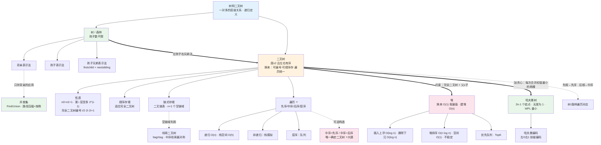

# 第四章 树和二叉树（2026 考纲）

> 📍 **本章定位**：🏗️ **梁柱级**——**每年必考大题，数据结构分值最高的一章**。
>
> - **选择题**：二叉树性质计算（结点数 / 高度 / 完全二叉树编号）、遍历序列互推、线索二叉树、树↔森林转换、哈夫曼 $WPL$、堆的调整过程（约 4-6 分）
> - **大题**：⭐⭐⭐ **最稳定出题点**——遍历算法（递归/非递归）、**由遍历序列构造二叉树**、哈夫曼编码、并查集与堆的应用（约 10-15 分）
> - **2026 新增**：「并查集及其应用」「堆及其应用」单列成节，应用权重明显上升
> - **与第六章的分工**：**BST / AVL / 红黑树**在考纲中属于「六、查找 → 树型查找」，本章只在"特殊二叉树"里点名，**详细内容见第六章**
>
> **学这章要回答的问题**：有了线性表，为什么还要树？
> → 因为线性表是**一对一**的，而现实世界大量关系是**一对多**的：文件系统目录、公司组织架构、编译器的语法树、数据库索引、DNS 命名空间。用线性表硬套层级关系，查找一个子孙要遍历全表 $O(n)$；树把"层级"直接编码进结构，顺着分支走就是 $O(h)$。
> → 那为什么又要有**二叉树**？一般的树"孩子个数不定"，结构不规则，**不好编号、不好存数组、遍历规则不统一**。二叉树是给树**降维**：限定"每个结点至多 2 个孩子且左右有序"，换来三件事——**能编号（可顺序存储）、遍历规则统一（先/中/后序）、能进一步加约束演化出堆与 BST**。
>
> ⚠️ **代码作答规范**：
>
> - ✅ **C 版 = 造轮子版**：手写 `struct` + `malloc/free` + 递归/栈/队列，**这就是考试要写的代码**。
> - 🧠 **C++ / Python / Java 三版 = 调库版**：`std::queue` / `collections.deque` / `ArrayDeque` 等，**仅为理解算法思想**。
> - ❌ 考场禁用：STL 容器、`java.util.*`、Python 高级容器代替手写结构。
> - 📌 **本章大题的三条主代码**：①四种遍历（含非递归）②由先序+中序建树 ③建堆/堆调整。这三段必须能默写。

---

## 一、树的基本概念

### （一）定义（递归定义）

**树（Tree）** 是 $n$（$n \geq 0$）个结点的有限集合：

- $n = 0$ 时称为**空树**；
- $n > 0$ 时，有且仅有一个**根（Root）** 结点，其余结点可分为 $m$（$m \geq 0$）个**互不相交**的有限集合，每个集合本身又是一棵树，称为根的**子树**。

> 💡 树的三个特征：**有且仅有一个根**、**子树互不相交**（故无环）、**递归定义**（树由子树构成，这个性质直接决定了树上的算法几乎都是递归的）。

### （二）基本术语（⭐选择题爱考概念辨析）

| 术语 | 含义 |
| --- | --- |
| **结点的度** | 该结点拥有的**孩子个数** |
| **树的度** | 树中**所有结点的度的最大值** |
| **叶子（终端结点）** | 度为$0$ 的结点 |
| **分支结点（非终端）** | 度$> 0$ 的结点 |
| **内部结点** | 除根以外的分支结点（有的教材把根也算分支结点，注意题干口径） |
| **孩子 / 双亲 / 兄弟** | 结点的子树的根 / 上层直接连接的结点 / 同一双亲的其它孩子 |
| **祖先 / 子孙** | 从根到该结点路径上的所有结点 / 该结点子树中的所有结点 |
| **堂兄弟** | 双亲在同一层但双亲不同的结点 |
| **层次 / 深度 / 高度** | 根为第 1 层；**深度**从上往下数，**高度**从下往上数（⚠️ 有的教材根的高度为 1，有的为 0，看题） |
| **结点的深度 / 高度** | 从根到该结点的层数 / 以该结点为根的子树的高度 |
| **路径 / 路径长度** | 两结点之间经过的结点序列 / 路径上所经过的**边的条数** |
| **有序树 / 无序树** | 子树**有左右次序**（不可交换）/ 无次序（可交换） |
| **森林** | $m$（$m \geq 0$）棵**互不相交**的树的集合 |

> ⚠️ **易混**：**树的度** 是"最大值"（一个数），**结点的度** 是"该结点的孩子数"。

### （三）树的性质（⭐计算题核心）

**性质 1**：结点数 $n$ = **所有结点的度数之和 + 1**。

$$
n = 1 + \sum_{i=1}^{n} degree(i)
$$

> 记忆：除根以外，每个结点都"被一条边引下来"，所以总边数 $= n - 1$，而总边数又等于总度数。

**性质 2**：度为 $m$ 的树中，第 $i$ 层至多有 $m^{i-1}$ 个结点（$i \geq 1$）。

**性质 3**：高度为 $h$ 的 $m$ 叉树至多有 $\dfrac{m^{h} - 1}{m - 1}$ 个结点（等比数列求和）。

**性质 4**：高度为 $h$、度为 $m$ 的树至少有 $h + m - 1$ 个结点（一层一串，最后一层的分支结点挂 $m$ 个孩子）。

**性质 5**：具有 $n$ 个结点的 $m$ 叉树，其**最小高度**为：

$$
h_{\min} = \left\lceil \log_m \bigl(n(m-1) + 1\bigr) \right\rceil
$$

> ⚠️ **"$m$ 叉树" vs "度为 $m$ 的树"**：$m$ 叉树只要求"每个结点至多 $m$ 个孩子"（允许全是空树、允许度为 0）；**度为 $m$ 的树**要求"至少存在一个结点度为 $m$"。所以"度为 $m$ 的树第 $i$ 层至多 $m^{i-1}$ 个结点"成立，但两者在**求最少结点数**时结论不同。

### （四）树的存储结构

树不能像线性表那样直接顺序存（孩子个数不定），考纲要求掌握三种：

#### 1. 双亲表示法（顺序存储）

每个结点存 **数据 + 双亲下标**，根的双亲为 $-1$。

```c
#define MAX_TREE_SIZE 100
typedef int ElemType;

typedef struct {
    ElemType data;    // 数据
    int parent;       // 双亲在数组中的下标，根为 -1
} PTNode;

typedef struct {
    PTNode nodes[MAX_TREE_SIZE];
    int n;            // 结点数
} PTree;
```

- ✅ 找**双亲** $O(1)$；❌ 找**孩子**要遍历整个数组 $O(n)$
- ⛓️ **这结构直接就是「并查集」的原型**（见本章四、（二））

#### 2. 孩子表示法（顺序 + 链式）

每个结点的数据存数组，再用一条**单链表**挂它所有的孩子。

```c
typedef struct CNode {
    int child;              // 孩子结点在数组中的下标
    struct CNode *next;     // 下一个孩子
} CNode;                    // 孩子链表的结点

typedef struct {
    ElemType data;
    CNode *firstchild;      // 孩子链表的头指针
} CTBox;                    // 表头结点

typedef struct {
    CTBox nodes[MAX_TREE_SIZE];
    int n, r;               // 结点数、根的下标
} CTree;
```

- ✅ 找**孩子**方便；❌ 找**双亲**要遍历所有链表（可加 `parent` 域改进成"双亲孩子表示法"）

#### 3. 孩子兄弟表示法（二叉链表）—— ⭐最重要

每个结点设两个指针：**第一个孩子 `firstchild`** 和 **下一个兄弟 `nextsibling`**。

```c
typedef struct CSNode {
    ElemType data;
    struct CSNode *firstchild;    // 第一个孩子
    struct CSNode *nextsibling;   // 右兄弟
} CSNode, *CSTree;
```

> 💡 **这是本章的枢纽结构**：任何一棵树/森林，用孩子兄弟表示法表示后，**形态上就是一棵二叉树**——它正是"森林 ↔ 二叉树转换"（左孩子右兄弟法）的实现基础。

---

## 二、二叉树

### （一）二叉树的定义与主要特性

#### 1. 定义

**二叉树（Binary Tree）** 是 $n$（$n \geq 0$）个结点的有限集合：

- 或者为**空二叉树**（$n = 0$）；
- 或者由一个**根结点**和**互不相交**的**左子树**和**右子树**组成，**左、右子树次序不能颠倒**。

> ⚠️ **二叉树 ≠ 度为 2 的树**（⭐选择题高频辨析）：
>
> |                 | 二叉树                                 | 度为 2 的树      |
> | --- | --- | --- |
> | 能否为空        | ✅ 可以                                | ❌ 至少 3 个结点 |
> | 子树次序        | **有序**（左右不能换）           | 无序（可换）     |
> | 只有 1 个孩子时 | 必须指明是**左**还是**右** | 无左右之分       |

#### 2. 几种特殊的二叉树

| 名称 | 定义 |
| --- | --- |
| **满二叉树** | 高度为$h$，结点数为 $2^h - 1$（每层都填满） |
| **完全二叉树** | 高度为$h$ 时，前 $h-1$ 层全满，第 $h$ 层的结点**从左到右连续排列**（只允许最后一层右边缺） |
| **正则（严格）二叉树** | 不存在度为 1 的结点（每个分支结点都有 0 或 2 个孩子） |
| **二叉搜索树 BST** | 左子树所有结点值 < 根 < 右子树所有结点值 →**详见第六章** |
| **平衡二叉树 AVL** | 任一结点的左右子树高度差$\leq 1$ → **详见第六章** |

> 💡 **满二叉树一定是完全二叉树，反之不成立。**

#### 3. 二叉树的性质（⭐⭐本章计算题主力）

**性质 1**：第 $i$ 层至多有 $2^{i-1}$ 个结点（$i \geq 1$）。

**性质 2**：深度为 $k$ 的二叉树至多有 $2^{k} - 1$ 个结点（$k \geq 1$）。

**性质 3**（⭐必考）：对任何一棵二叉树，若叶子数为 $n_0$、度为 2 的结点数为 $n_2$，则

$$
n_0 = n_2 + 1
$$

> 推导：设总结点 $n = n_0 + n_1 + n_2$，总边数 $= n - 1 = n_1 + 2n_2$，两式联立即得。

**性质 4**：具有 $n$ 个结点的**完全二叉树**，其深度为

$$
h = \lfloor \log_2 n \rfloor + 1 = \lceil \log_2 (n+1) \rceil
$$

> ⭐ **性质 4 的推导**（`之美/24`，应对"推导型"小题）：设层数为 $L$，则结点数满足
> $$2^{L-1} \leq n \leq 2^{L} - 1 \;\Longrightarrow\; \log_2(n+1) \leq L \leq \log_2 n + 1$$
> 取整即得 $h = \lfloor \log_2 n \rfloor + 1$。

> ⭐ **二叉树的 5 种基本形态**（`快速上手C++/10`）：空 / 只有根 / 只有左子树 / 只有右子树 / 左右都有。
> 📌 由此可数：**3 个结点的二叉树共有 5 种形态**（选择题直接考）。
>
> ⭐ **斜树**（笔记原来没有这个名字）：所有结点都**只有左孩子** = **左斜树**，都只有右孩子 = **右斜树**。
> 特征：**每层仅 1 个结点，结点数 = 深度**，形态**退化成线性表**（这正是 $BST$ 退化、顺序存储最浪费的极端情形）。

**性质 5**（⭐编号性质，完全二叉树按**层序从 1 开始编号**）：

| 关系 | 公式（$i$ 为结点编号） |
| --- | --- |
| 双亲 | $\lfloor i/2 \rfloor$（$i > 1$；$i=1$ 为根无双亲） |
| 左孩子 | $2i$（若 $2i > n$ 则无左孩子） |
| 右孩子 | $2i + 1$（若 $2i+1 > n$ 则无右孩子） |
| 所在层次 | $\lfloor \log_2 i \rfloor + 1$ |
| 是否为叶子 | $i > \lfloor n/2 \rfloor$ 即为叶子 |
| 度为 1 的结点数 | $n$ 为偶数时有 $1$ 个，为奇数时有 $0$ 个 |

> ⚠️ **编号从 0 起时公式要改**：左孩子 $= 2i+1$，右孩子 $= 2i+2$，双亲 $= \lfloor (i-1)/2 \rfloor$（这是**堆的数组实现**用的口径，别混）。

> 📌 **完全二叉树的判断技巧**：给结点数 $n$ 求叶子数 → 叶子编号从 $\lfloor n/2 \rfloor + 1$ 到 $n$，故叶子数 $= n - \lfloor n/2 \rfloor = \lceil n/2 \rceil$。

> ⭐ **已知完全二叉树结点数 $n$，求 $n_0 / n_1 / n_2$ 的完整步骤**（选择题高频，`快速上手C++/10`）
> ① **先定 $n_1$**：$n$ 为**偶数 → $n_1 = 1$**；$n$ 为**奇数 → $n_1 = 0$**（完全二叉树度为 1 的结点最多一个，且只有左孩子）；
> ② 由 $n = n_0 + n_1 + n_2$ 与 $n_0 = n_2 + 1$ 联立，得 $n_2 = \dfrac{n - 1 - n_1}{2}$；
> ③ 再由 $n_0 = n_2 + 1$ 得叶子数。
>
> 📌 **例**：$n = 1000$（偶）→ $n_1 = 1$，$n_2 = (1000-1-1)/2 = 499$，$n_0 = 500$。

> ⭐ **判"是不是完全二叉树"的两把尺子**（`快速上手C++/10`）
> ① **编号填空法**：按满二叉树逐层编号，**出现空缺就不是**；等价说法——**满二叉树删去编号最大的若干个结点即得完全二叉树**；
> ② **特征清单**：叶子只出现在**最下两层**，且 $n_1 \leq 1$；若有度为 1 的结点，它**只有左孩子**（由 ① 的连续编号性推出）。

### （二）二叉树的存储结构

#### 1. 顺序存储结构

用**一维数组**按**层序**存放，结点下标对应性质 5 的编号（通常从 **1** 开始，0 号位空着或存结点数）。

```c
#define MAX_TREE_SIZE 100
typedef ElemType SqBiTree[MAX_TREE_SIZE];  // 0 号单元存根（或空着）
```

- ✅ 适合**完全二叉树**和**满二叉树**：下标即亲子关系，无需指针，省空间
- ❌ 适合一般二叉树时**必须补空结点**（把缺失位置填成"空"），**最坏情况**：高度为 $h$ 的单支树需要 $2^h - 1$ 个单元存 $h$ 个结点 → **空间严重浪费**

> 💡 **这就是为什么"堆"（完全二叉树）能用数组实现，而一般二叉树用链表**。

> ⭐ **浪费到什么程度——给个具体数字**（`快速上手C++/12`）：高度 $h=4$ 的**右斜树**，最坏要开 $2^4 = 16$ 个单元（含空出的 0 号位），而实际只有 4 个结点 → **浪费 11 个位置**。斜树越深浪费越指数级。

#### 2. 链式存储结构（⭐主要方式）

**二叉链表**：每个结点含 `data` + `lchild` + `rchild`；**三叉链表**再加一个 `parent` 指针（方便找双亲，代价是多一个指针域）。

```c
// 二叉链表（考试默认用这个）
typedef struct BiTNode {
    ElemType data;
    struct BiTNode *lchild, *rchild;
} BiTNode, *BiTree;

// 三叉链表
typedef struct TriTNode {
    ElemType data;
    struct TriTNode *lchild, *rchild, *parent;
} TriTNode, *TriTree;
```

> 📌 **空链域数量**：$n$ 个结点的二叉链表共有 $2n$ 个孩子指针域，其中 $n-1$ 个指向实际结点，故有 **$n+1$ 个空链域** —— 这正是**线索二叉树**能利用的资源（见本章二、（四））。

#### 🧠 三语言调库版（仅理解思想）

```cpp
// C++：一般二叉树用 struct + 智能指针/裸指针，与 C 版写法一致
struct TreeNode {
    int val;
    TreeNode *left, *right;
    TreeNode(int x) : val(x), left(nullptr), right(nullptr) {}
};
```

```python
# Python：用类模拟二叉链表
class TreeNode:
    def __init__(self, val=0, left=None, right=None):
        self.val = val
        self.left = left
        self.right = right
```

```java
// Java：同样用类表示结点
class TreeNode {
    int val;
    TreeNode left, right;
    TreeNode(int x) { val = x; }
}
```

> 🧠 **理解点**：工程里"树"没有标准库容器（不像栈/队列），因为树的形态千变万化——**树必须自己造结点，这跟考纲要求"手写实现"完全对上**。

### （三）二叉树的遍历（⭐⭐⭐本章大题第一主力）

**遍历**：按某种次序**访问每个结点恰好一次**，把非线性结构"拍扁"成线性序列。

四种遍历由"**访问根结点的时机**"区分：

| 遍历 | 次序 | 记忆 |
| --- | --- | --- |
| **先序（PreOrder）** | 根 → 左 → 右 | 根在最前 |
| **中序（InOrder）** | 左 → 根 → 右 | 根在中间 |
| **后序（PostOrder）** | 左 → 右 → 根 | 根在最后 |
| **层序（LevelOrder）** | 从上到下、从左到右逐层 | 用**队列** |

#### 1. 递归实现（⭐必须默写）

```c
void visit(BiTNode *p) { printf("%d ", p->data); }

// 先序：根左右
void PreOrder(BiTree T) {
    if (T == NULL) return;
    visit(T);
    PreOrder(T->lchild);
    PreOrder(T->rchild);
}

// 中序：左根右
void InOrder(BiTree T) {
    if (T == NULL) return;
    InOrder(T->lchild);
    visit(T);
    InOrder(T->rchild);
}

// 后序：左右根
void PostOrder(BiTree T) {
    if (T == NULL) return;
    PostOrder(T->lchild);
    PostOrder(T->rchild);
    visit(T);
}
```

> 💡 **复杂度**：三种递归遍历时间都是 $O(n)$（每个结点访问一次），空间 $O(h)$（递归栈 = 树高，最坏 $O(n)$）。

#### 2. 非递归实现（⭐⭐大题常考，用栈模拟递归）

**中序非递归**（最经典：一路向左入栈，弹栈访问，转向右子树）：

```c
void InOrder2(BiTree T) {
    BiTNode *stack[100];
    int top = -1;
    BiTNode *p = T;
    while (p != NULL || top != -1) {
        if (p != NULL) {                 // ① 一路向左，沿途入栈
            stack[++top] = p;
            p = p->lchild;
        } else {                         // ② 到最左，弹栈访问
            p = stack[top--];
            visit(p);
            p = p->rchild;               // ③ 转向右子树
        }
    }
}
```

**先序非递归**（入栈前就访问，与中序只差访问时机）：

```c
void PreOrder2(BiTree T) {
    BiTNode *stack[100];
    int top = -1;
    BiTNode *p = T;
    while (p != NULL || top != -1) {
        if (p != NULL) {
            visit(p);                    // ⚠️ 入栈时就访问
            stack[++top] = p;
            p = p->lchild;
        } else {
            p = stack[top--];
            p = p->rchild;
        }
    }
}
```

**后序非递归**（最难：需判断"右子树是否已访问过"，用 `last` 记录上一次访问的结点）：

```c
void PostOrder2(BiTree T) {
    BiTNode *stack[100];
    int top = -1;
    BiTNode *p = T, *last = NULL;
    while (p != NULL || top != -1) {
        if (p != NULL) {                     // 一路向左入栈
            stack[++top] = p;
            p = p->lchild;
        } else {
            BiTNode *q = stack[top];         // 读栈顶（不弹）
            if (q->rchild != NULL && last != q->rchild)
                p = q->rchild;               // 右子树还没访问 → 转右
            else {
                visit(q);                    // 右子树已访问或为空 → 访问根
                last = q;
                top--;
            }
        }
    }
}
```

**层序遍历**（用**队列**，第三章队列的典型应用）：

```c
void LevelOrder(BiTree T) {
    if (T == NULL) return;
    BiTNode *q[100];               // 循环队列
    int front = 0, rear = 0;
    q[rear++] = T;                 // 根入队
    while (front < rear) {
        BiTNode *p = q[front++];   // 出队
        visit(p);
        if (p->lchild != NULL) q[rear++] = p->lchild;
        if (p->rchild != NULL) q[rear++] = p->rchild;
    }
}
```

> 💡 **层序的空间复杂度**：队列长度不超过树的最大宽度，最坏 $O(n)$（满二叉树最后一层）。

#### 3. 由遍历序列构造二叉树（⭐⭐⭐大题必考）

**核心结论**：

| 组合 | 能否唯一确定二叉树 |
| --- | --- |
| **先序 + 中序** | ✅ 能 |
| **后序 + 中序** | ✅ 能 |
| **层序 + 中序** | ✅ 能 |
| 先序 + 后序 | ❌**不能**（无法区分左右子树） |

**为什么必须有中序？** 因为中序序列中，**根结点把序列切成左子树和右子树两段**，这是唯一能确定"左右分界"的信息。

> ⭐ **完整矩阵**（`快速上手C++/11`）：**任何单独一种遍历序列都不能唯一确定二叉树**（先序 / 中序 / 后序 / 层序，单独都不行），**先序 + 后序也不行**。
> ✅ 能唯一确定的组合只有：**先序+中序、后序+中序、层序+中序** —— **中序是必要条件**。

> ⭐ **扩展二叉树（扩充二叉树）**（`快速上手C++/11`，笔记原缺，常考）
> 把二叉树中**所有空指针补成一个特殊结点**（如标记 `#`），就得到扩展二叉树。
> 结论：**扩展二叉树的"先序序列"或"后序序列"可唯一确定二叉树，但它的"中序序列"不能**。
> - 例：两棵不同的树，中序扩展序列都可能是 `#C#B#A#`。
> - 📌 这正是"用 `"ABD###C#E##"` 这样的**带空标记先序串**直接递归建树"的依据（遇 `#` 即置空指针），也是面试"**二叉树的序列化/反序列化**"的原型。

> ⭐ **"层序 + 中序"的手推实例**（`快速上手C++/11`）：层序的**第一个**元素是根 → 在中序中切出左右子树 → 回到层序，**按出现顺序**把剩余元素分派给左右子树 → 递归。
> 💡 关键差异：先序/后序靠"连续区段"切分，**层序要靠"顺序扫描 + 归属判断"**来分派。

**手推方法（以先序 + 中序为例）**：

1. 先序的**第一个**元素 = 根；
2. 在中序中找到该根，**左边是左子树的中序**，**右边是右子树的中序**；
3. 由左子树结点个数 $k$，在先序中切出"根之后的 $k$ 个元素" = 左子树的先序，其余 = 右子树的先序；
4. 对左右子树**递归**重复 1-3。

> 💡 **后序 + 中序**同理，只是根在**后序的最后一个**；**层序 + 中序**是根在**层序的第一个**（层序按层给出根的顺序）。

#### 🔧 C 语言：由先序 + 中序建树

```c
// pre[preL..preR] 为先序，in[inL..inR] 为中序
BiTree PreInCreate(ElemType pre[], ElemType in[],
                   int preL, int preR, int inL, int inR) {
    if (preL > preR) return NULL;                     // 递归出口：空子树

    BiTNode *root = (BiTNode *)malloc(sizeof(BiTNode));
    root->data = pre[preL];                           // ① 先序首元素 = 根

    int k = inL;
    while (in[k] != root->data) k++;                  // ② 中序中定位根
    int leftLen = k - inL;                            // ③ 左子树结点数

    root->lchild = PreInCreate(pre, in, preL + 1, preL + leftLen, inL, k - 1);
    root->rchild = PreInCreate(pre, in, preL + leftLen + 1, preR, k + 1, inR);
    return root;
}
```

#### 4. 遍历的应用（大题套路）

| 需求 | 做法 |
| --- | --- |
| 求树的高度 | 后序：$h = 1 + \max(h_L, h_R)$ |
| 求叶子个数 | 后序：无左右孩子则 +1 |
| 求某层结点数 / 树宽 | 层序：按层统计 |
| 复制二叉树 | 后序：先复制左右子树，再造根 |
| 判断两树相同 | 先序：同时比较根与左右子树 |
| 表达式树 | 后序 =**后缀表达式**；先序 = 前缀表达式；中序 = 中缀（需加括号） |
| 求二叉树深度 / 判平衡 | 后序返回高度，边返回边判断 |
| **判断是否完全二叉树** | 层序：**遇到第一个"孩子不满"的结点之后，其后所有结点必须全是叶子**，否则不是 |

> ⚠️ **一个不充分的判断条件**：只凭"出队结点出现**左空且右不空** ⇒ 非完全二叉树"就下结论是不够的——
> 反例：左斜树（每个结点都只有左孩子）永远触发不了这个条件，但它**不是**完全二叉树。
> ✅ **正确充分条件**：层序遍历中，**一旦遇到第一个"孩子不满"的结点（左空 或 右空），它后面出队的结点必须全是叶子**；否则（后面还有结点带非空孩子）就不是完全二叉树。

```c
// 后序求高度（递归模型，大题常用）
int TreeDepth(BiTree T) {
    if (T == NULL) return 0;
    int l = TreeDepth(T->lchild);
    int r = TreeDepth(T->rchild);
    return (l > r ? l : r) + 1;
}

// 后序求叶子数
int LeafCount(BiTree T) {
    if (T == NULL) return 0;
    if (T->lchild == NULL && T->rchild == NULL) return 1;
    return LeafCount(T->lchild) + LeafCount(T->rchild);
}
```

### （四）线索二叉树（⭐选择 + 大题可能考构造）

#### 1. 为什么要线索化

二叉链表有 $n+1$ 个**空链域**——浪费。同时，遍历得到的序列中，结点的**前驱/后继**信息在链表里**没有存**（要再遍历一次才知道）。

**线索二叉树**把这些空链域利用起来：

- `lchild` 为空 → 指向该结点在**某种遍历序列中的前驱**
- `rchild` 为空 → 指向**后继**

为了区分"这个指针到底指向孩子还是线索"，加两个标志域：

| 标志 | 值 | 含义 |
| --- | --- | --- |
| `ltag` | 0 | `lchild` 指向**左孩子** |
| `ltag` | 1 | `lchild` 指向**前驱**（线索） |
| `rtag` | 0 | `rchild` 指向**右孩子** |
| `rtag` | 1 | `rchild` 指向**后继**（线索） |

#### 2. 存储结构

```c
typedef struct ThreadNode {
    ElemType data;
    struct ThreadNode *lchild, *rchild;
    int ltag, rtag;            // 0 = 孩子，1 = 线索
} ThreadNode, *ThreadTree;
```

#### 3. 中序线索化的构造（递归，⭐会写）

```c
ThreadNode *pre = NULL;        // 全局变量：指向刚刚访问过的结点（当前结点的前驱）

void InThread(ThreadTree T) {
    if (T != NULL) {
        InThread(T->lchild);                       // ① 线索化左子树
        if (T->lchild == NULL) {                   // ② 左空 → 建前驱线索
            T->lchild = pre;
            T->ltag = 1;
        }
        if (pre != NULL && pre->rchild == NULL) {  // ③ 给前驱建后继线索
            pre->rchild = T;
            pre->rtag = 1;
        }
        pre = T;                                   // ④ 更新前驱
        InThread(T->rchild);                       // ⑤ 线索化右子树
    }
}

// 入口：建中序线索二叉树
void CreateInThread(ThreadTree T) {
    pre = NULL;
    if (T != NULL) {
        InThread(T);
        if (pre->rchild == NULL) pre->rtag = 1;    // 处理最后一个结点
    }
}
```

> ⚠️ **关键顺序**：`pre = T` 必须在"给前驱建后继线索"之后、递归右子树之前——`pre` 始终表示"中序序列中上一个被访问的结点"。

#### 4. 中序线索二叉树的遍历（不用栈，⭐理解价值 > 代码价值）

```c
// 求 p 为根的子树中，中序序列的第一个结点（最左下）
ThreadNode *FirstNode(ThreadNode *p) {
    while (p->ltag == 0) p = p->lchild;
    return p;
}

// 求中序序列中 p 的后继
ThreadNode *NextNode(ThreadNode *p) {
    if (p->rtag == 1) return p->rchild;     // 有后继线索 → 直接拿
    return FirstNode(p->rchild);            // 否则是右子树的最左下结点
}

// 中序遍历线索二叉树：O(n) 时间，O(1) 空间（不用栈！）
void InOrder(ThreadTree T) {
    for (ThreadNode *p = FirstNode(T); p != NULL; p = NextNode(p))
        visit(p);
}
```

#### 5. 三种线索化对比（⭐选择题）

| 类型 | 找前驱 | 找后继 | 说明 |
| --- | --- | --- | --- |
| **先序线索** | ❌ 麻烦（需知道双亲，用三叉链表） | ✅ 容易 | 先序中"根在前"，前驱可能是双亲或左兄弟子树 |
| **中序线索** | ✅ 容易 | ✅ 容易 | **最对称、最常考**：前驱 = 左子树最右下；后继 = 右子树最左下 |
| **后序线索** | ✅ 容易 | ❌ 麻烦（需三叉链表） | 后序中"根在后" |

> 💡 **记忆**：**中序线索**最完美（前后继都能直接找）；先序能找后继难找前驱，后序相反。原因是"根的位置"——先序根在最前，后序根在最后。

> ⭐ **可遍历方向**（`快速上手C++/13`）：**中序线索树既能正着走也能倒着走**；**先序线索树只能正向遍历**（找后继 OK）；**后序线索树只能逆向遍历**（找前驱 OK）。另外两个好用的边界结论：**先序线索树的第一个结点就是根**、**后序线索树的最后一个结点也是根**。

> ⚠️ **先序线索化的代码陷阱**（`快速上手C++/13`，最容易写错的地方）
> 先序是"根左右"，**根先被处理，它的 `lchild`/`rchild` 可能已经被改成了线索**。所以递归进入子树之前**必须先判标志位**：
> ```c
> if (T->ltag == 0) InThread(T->lchild);   // 只有确实是孩子才递归
> if (T->rtag == 0) InThread(T->rchild);
> ```
> 否则会**顺着线索递归下去，报错或死循环**。同理，**线索树的销毁/递归遍历也必须先判 tag**。中序线索化没有这个问题（左子树递归发生在建线索之前）。
>
> 📌 **带头结点的线索链表**（408 常考结构，本篇未涉及）：头结点的 `lchild` 指向根、`rchild` 指向**中序最后一个结点**，并让首尾互指**成环** —— 这样"第一个结点的前驱"和"最后一个结点的后继"都有落脚点，遍历条件可统一成 `p != head`。

---

## 三、树、森林

### （一）树的存储结构

三种表示法见本章一、（四）：**双亲表示法**、**孩子表示法**、**孩子兄弟表示法**。

> ⭐ **考纲重点关注「孩子兄弟表示法」**——它是树与二叉树之间的桥梁。

### （二）森林与二叉树的转换（左孩子右兄弟法）

**规则（一句话）**：**第一个孩子 → 左孩子；右兄弟 → 右孩子。**

```
树（森林）                        对应二叉树
     A                               A
   / | \                            /
  B  C  D          ==>             B
     / \                            \
    E   F                            C
                                    / \
                                   E   D
                                    \
                                     F
```

> 读图：A 的第一个孩子 B 变左孩子，B 的右兄弟 C 变 B 的右孩子，C 的右兄弟 D 变 C 的右孩子；C 的第一个孩子 E 变 C 的左孩子，E 的右兄弟 F 变 **E** 的右孩子（注意 F 挂在 E 下，不是 D 下）。

**转换步骤**：

1. **树 → 二叉树**：对每个结点，只保留**第一个孩子**作左孩子，**兄弟之间用右指针串起来**；
2. **森林 → 二叉树**：先把每棵树转成二叉树，再把**后一棵二叉树的根**作为**前一棵二叉树根的右孩子**串起来（因为森林中各树根互为"兄弟"）；
3. **二叉树 → 树/森林**：逆过程——**右孩子**变成**右兄弟**，**左孩子**变成**第一个孩子**。

> ⚠️ **易错**：转换后**根结点一定没有右子树吗？** —— 一棵树转成的二叉树，根**没有右子树**（根没有兄弟）；而**森林**转成的二叉树，根**有右子树**（后面还有树）。

### （三）树和森林的遍历

| 结构 | 遍历方式 | 定义 |
| --- | --- | --- |
| **树** | 先根遍历 | 先访问根，再依次先根遍历每棵子树 |
| **树** | 后根遍历 | 先后根遍历每棵子树，再访问根 |
| **树** | 层序遍历 | 按层从左到右 |
| **森林** | 先序遍历 | 依次对每棵树做先根遍历 |
| **森林** | 中序遍历 | 依次对每棵树做后根遍历（⚠️ 名称叫"中序"，实际对树是后根） |

> ⭐⭐ **必背对应关系**（选择题 + 大题高频）：
>
> | 树 / 森林                | 对应二叉树                 |
> | --- | --- |
> | 树的**先根**遍历   | 二叉树的**先序**遍历 |
> | 树的**后根**遍历   | 二叉树的**中序**遍历 |
> | 森林的**先序**遍历 | 二叉树的**先序**遍历 |
> | 森林的**中序**遍历 | 二叉树的**中序**遍历 |
>
> 记忆：左孩子右兄弟法中，"孩子"变左子树、"兄弟"变右子树，所以根的访问时机从"子树全部之前"变成"左子树之后、右子树之前"，故**后根 ↔ 中序**。

---

## 四、树和二叉树的应用

### （一）哈夫曼（Huffman）树和哈夫曼编码（⭐大题常客）

#### 1. 基本概念

| 术语 | 定义 |
| --- | --- |
| **结点的权** | 赋给结点的一个有实际意义的数值（如字符出现频率） |
| **结点的带权路径长度** | 从**根**到该结点的**路径长度（边数）× 该结点的权** |
| **树的带权路径长度 $WPL$** | 树中**所有叶子结点**的带权路径长度之和 |
| **哈夫曼树（最优二叉树）** | 给定$n$ 个权值作叶子，构造出的 **$WPL$ 最小**的二叉树 |

$$
WPL = \sum_{i=1}^{n} w_i \times l_i \quad (w_i = 权值,\ l_i = 根到叶子的路径长度)
$$

#### 2. 构造算法（⭐会手算）

给定 $n$ 个权值 $\{w_1, w_2, \dots, w_n\}$：

1. 把每个权值看作**一棵单结点二叉树**，构成森林 $F$；
2. 每次从 $F$ 中选出**根结点权值最小的两棵**树，合并成一棵新树：新根权值 = 两子树根权之和，左/右子树任意（通常小的放左边）；
3. 把新树放回 $F$，**重复直到只剩一棵树**。

> 💡 **本质**：贪心——**权重小的放更深，权重大的放更浅**，从而让 $WPL$ 最小。这就是之美 `37-贪心算法` 讲的思想。

#### 3. 哈夫曼树的性质（⭐选择题）

1. 没有**度为 1** 的结点（每次合并都是"两个变一个"，故为正则二叉树）；
2. 若有 $n$ 个叶子（初始权值），则**总结点数 $= 2n - 1$**（合并了 $n-1$ 次，每次多一个结点）；
3. 哈夫曼树**不唯一**（左右子树可交换，或有权值相同时选择不同），但**$WPL$ 一定相同且最小**；
4. $WPL$ 的另一算法：**$WPL$ = 所有"合并产生的新根权值"之和**（每次合并的权和累加）。

> ⭐ **两个可直接用的数值算例**
> ① **两算法互验**（`之美/37` 留言）：权值 $[2,3,4,4,5,7]$，合并出的新根依次为 $5,8,10,15,25$。
> 逐叶子算：$WPL = 5\cdot2+2\cdot3+3\cdot3+7\cdot2+4\cdot3+4\cdot3 = 63$；新根之和：$5+8+10+15+25 = 63$ —— **完全相等**，正好验证性质 4。
> ② **候选树比较**：$\{1,3,5,10\}$ 四棵候选树 $WPL$ 分别为 $38/32/50/51$ → 最小 $32$ 即哈夫曼树。

#### 4. 哈夫曼编码

- **前缀编码**：任一字符的编码都**不是**另一个字符编码的前缀 → 解码无二义；
- 构造：把字符频次作权值建哈夫曼树，**左分支记 0，右分支记 1**（或反之），从根到叶子的 0/1 序列即该字符编码；
- **压缩率**：平均编码长度 $= WPL / \sum w_i$（每位权重看作频次）。

> ⚠️ **注意**：哈夫曼编码是**变长编码**，出现的字符频次越高编码越短，这正是压缩的来源；编码长度不固定，所以解码必须靠树/前缀性质。

> ⭐ **两个压缩率的数值锚点**（`之美/37`、`快速上手C++/21`）
> ① 1000 个字符、只有 6 种：定长需 3 bit/字符 = **3000 bit**；哈夫曼变长后只需 **2100 bit**（平均码长 2.1 bit）。
> ② 频率 A12 B15 C9 D24 E8 F32 时，传 `"AFDBCFBDEFDF"`：定长 3 bit → **36 bit**，哈夫曼编码后 **29 bit**，**省约 19%**。

> 🔎 **扩展（非考纲 · 易错）：哈夫曼不是"无条件更省"**
> 反例（`之美/37` 留言）：4 个字符频率**全相等**时，定长编码 $(00,01,10,11)$ 共 800 bit，而哈夫曼 $(1,01,001,000)$ 反需 **900 bit**。
> 💡 结论：**哈夫曼的压缩能力来自"频率悬殊"，不是结构本身**——频率越接近，变长编码的优势越小，甚至为负。
>
> 📌 另外两个常见说法澄清：**"左子树权值必须小于右子树"是误解**（左右交换不改变 $WPL$，这正是树形不唯一的原因）；**哈夫曼树不能归入 $BST$**（它只保证"父权 = 子权之和 / $WPL$ 最小"，**左右无序**）。

#### 🔧 C 语言：哈夫曼树的存储与构造骨架

```c
typedef struct {
    int weight;              // 权值
    int parent, lchild, rchild;   // 双亲与左右孩子（用下标，0 表示无）
} HTNode, *HuffmanTree;

// 构造：n 个权值，共 2n-1 个结点
void CreateHuffman(HuffmanTree HT, int w[], int n) {
    int m = 2 * n - 1;
    for (int i = 1; i <= m; i++) {           // 初始化
        HT[i].parent = HT[i].lchild = HT[i].rchild = 0;
        HT[i].weight = (i <= n) ? w[i] : 0;
    }
    for (int i = n + 1; i <= m; i++) {       // 做 n-1 次合并
        int s1, s2;
        Select(HT, i - 1, &s1, &s2);         // 选出 parent==0 且权值最小的两个
        HT[s1].parent = HT[s2].parent = i;
        HT[i].lchild = s1;
        HT[i].rchild = s2;
        HT[i].weight = HT[s1].weight + HT[s2].weight;
    }
}
// 注：Select 用两趟扫描即可，考试允许直接写"选出最小两个"的伪代码
```

> ⭐ **工程实现口径：用优先队列（小根堆）**（`之美/37`）
> 原文的构造算法是"把各字符按频率放进**优先级队列** → 每次弹出频率最小的两个 A、B → 新建父结点 C（权 = A+B）→ 把 C 压回队列 → 重复至队空"。
> 💡 用**小根堆**可把每次"选最小两个"从 $O(n)$ 降到 $O(\log n)$，整体 **$O(n\log n)$** —— 与本章四（三）的堆/优先队列**互链**。

> ⭐ **哈夫曼编码怎么"从树生成出来"**（`快速上手C++/21`，笔记只有建树骨架）
> 从每个**叶子**出发沿 `parent` **往上溯**，一路判断"我是双亲的左孩子还是右孩子"：是左孩子则在编码串**前插 `"0"`**，是右孩子**前插 `"1"`**，直到根（`parent == 0`）为止。
> 💡 因为是从叶到根，所以要用**前插**（或先入栈再弹出）才能得到正确的从根到叶的 0/1 序列。

### （二）并查集及其应用（2026 新增，⭐应用大题新宠）

#### 1. 是什么

**并查集（Union-Find / Disjoint Set Union）** 用**双亲表示法**的树（森林）来维护若干个**互不相交的集合**，只支持两个核心操作：

- **Find(x)**：查 $x$ 属于哪个集合（返回**根结点**）
- **Union(x, y)**：把 $x$、$y$ 所在的两个集合**合并**

> 💡 **它其实就是"树的双亲表示法"的一个应用**——森林中每棵树 = 一个集合，**根结点是集合代表**。这正是 `Relations.md` 里画的"树的双亲表示法 → 并查集"那条线。

#### 2. 两种优化（决定复杂度）

| 优化 | 做法 | 效果 |
| --- | --- | --- |
| **路径压缩** | `Find` 时把沿途所有结点**直接挂到根下** | 树变扁，后续查询接近$O(1)$ |
| **按秩/按大小合并** | `Union` 时把**小树挂到大树下**（或按树高） | 控制树高不超过$O(\log n)$ |

两者同时使用时，单次操作**平摊复杂度 $O(\alpha(n))$**（$\alpha$ 为反阿克曼函数，实际 $\leq 4$，可视作**常数**）。

#### 🔧 C 语言（造轮子版 · 路径压缩 + 按秩合并）

```c
#define MAXN 1000
int parent[MAXN];      // 双亲下标，根结点的 parent 指向自己
int rk[MAXN];          // 秩（树高的上界）

// 初始化：每个元素自成一个集合
void Init(int n) {
    for (int i = 0; i < n; i++) { parent[i] = i; rk[i] = 0; }
}

// 查找（带路径压缩）：递归把路径上所有结点直接挂到根
int Find(int x) {
    if (parent[x] != x)
        parent[x] = Find(parent[x]);    // ⭐ 压缩：一步到位指向根
    return parent[x];
}

// 合并（按秩）：小秩挂到大秩下
void Union(int x, int y) {
    int rx = Find(x), ry = Find(y);
    if (rx == ry) return;               // 已在同一集合
    if (rk[rx] < rk[ry])      parent[rx] = ry;
    else if (rk[rx] > rk[ry]) parent[ry] = rx;
    else { parent[ry] = rx; rk[rx]++; }
}

// 判断是否同一集合
int Same(int x, int y) { return Find(x) == Find(y); }
```

#### 3. 典型应用

| 应用 | 怎么用 |
| --- | --- |
| **判连通 / 求连通分量数** | 遍历所有边做`Union`，最后统计 `parent[i]==i` 的个数 |
| **Kruskal 最小生成树** | 按权值从小到大取边，取之前`Find` 判断两端**是否已连通**（已连通则取了会成环，跳过）→ 见第五章 |
| **冗余连接检测** | 出现一条边使两端已连通 → 该边多余（形成环） |
| **朋友圈 / 亲戚关系** | 关系合并 + 查询 |

> ⛓️ **跨章缝合**：并查集是**树的应用**，但主要战场在**第五章图**（Kruskal、连通分量）。

### （三）堆及其应用（2026 新增）

#### 1. 定义

**堆（Heap）**：满足"**完全二叉树** + **堆序性**"的树，用**数组顺序存储**：

- **大根堆**：任一结点的值 $\geq$ 其左右孩子的值（堆顶最大）
- **小根堆**：任一结点的值 $\leq$ 其左右孩子的值（堆顶最小）

> ⚠️ **堆 ≠ 二叉搜索树**：堆只保证"根最值"，**左右子树之间无大小关系**，故堆**不支持查找某个值 / 不支持有序遍历**。

#### 2. 数组表示（下标从 1 起）

因为是完全二叉树，直接用数组按层序存放，亲子关系用下标算：

- 结点 $i$ 的左孩子 $= 2i$，右孩子 $= 2i+1$，双亲 $= \lfloor i/2 \rfloor$
- $n$ 个元素的堆，最后一个分支结点 $=\lfloor n/2 \rfloor$

#### 3. 两个核心调整操作（⭐必考过程题）

**向下调整（SiftDown / 筛选）**：用于**删除堆顶**和**建堆**。把结点 $k$ 与其**更大的孩子**比较，若孩子更大则交换，一路下沉。

```c
// 大根堆：对 a[k] 向下调整，a[0] 作暂存哨兵，堆大小为 n
void SiftDown(int a[], int k, int n) {
    a[0] = a[k];                               // 暂存根
    for (int i = 2 * k; i <= n; i *= 2) {      // i 指向 k 的左孩子
        if (i < n && a[i] < a[i + 1]) i++;     // 选出更大的那个孩子
        if (a[0] >= a[i]) break;               // 已满足堆序，停止
        a[k] = a[i];                           // 孩子上移
        k = i;                                 // 继续往下
    }
    a[k] = a[0];                               // 原根落位
}
```

**向上调整（SiftUp）**：用于**插入**。新元素放末尾，与双亲比较，比双亲大则交换，一路上浮。

```c
// 大根堆：在 a[n] 处插入后向上调整
void SiftUp(int a[], int n) {
    a[0] = a[n];                               // 暂存新元素
    int i = n;
    while (i > 1 && a[0] > a[i / 2]) {         // 比双亲大就上浮
        a[i] = a[i / 2];
        i /= 2;
    }
    a[i] = a[0];
}
```

#### 4. 建堆（⭐复杂度是考点）

```c
// 从最后一个分支结点开始，自下而上对每个结点做向下调整
void BuildMaxHeap(int a[], int n) {
    for (int i = n / 2; i >= 1; i--)
        SiftDown(a, i, n);
}
```

> ⭐ **建堆时间复杂度是 $O(n)$，不是 $O(n \log n)$**（选择题高频陷阱）。
> 直观原因：**越靠近底层，结点越多但调整高度越小**。求和 $\sum h \cdot \frac{n}{2^{h+1}} = O(n)$。

> ⭐ **建堆有两种方式，复杂度差一个量级**（`之美/28`）
>
> | 方式 | 做法 | 复杂度 |
> | --- | --- | --- |
> | **从前往后（插入式）** | 把 $a[2..n]$ 依次"插入"，每个都**从下往上**堆化 | $O(n\log n)$ |
> | **从后往前（本笔记采用）** | 从 $\lfloor n/2 \rfloor$ 到 $1$，每个结点**从上往下**堆化 | **$O(n)$** |
>
> 💡 为什么从 $\lfloor n/2 \rfloor$ 开始：下标 $\lfloor n/2 \rfloor + 1 \sim n$ 全是**叶子**，叶子本身就是合法堆，无需堆化。
> 📌 考试若问"建堆的时间复杂度"，答 **$O(n)$**（指的是第二种、也是标准建堆法）。

> 🔎 **扩展（非考纲 · 理解向）：删除堆顶为什么必须用"末尾元素补位"**
> 若按"把第二大元素提到堆顶、再递归处理"的思路，最后堆化出的结构**不再满足完全二叉树性质**；改用"**末尾元素补到堆顶 + 向下调整**"，全程只做交换、**不产生数组空洞**，才能保住"完全二叉树可用数组表示"这一点。
> 💡 口诀组合：**插入 = 末尾 + 上浮；删除 = 末尾补位 + 下沉**。

#### 5. 堆的插入与删除

| 操作 | 步骤 | 复杂度 |
| --- | --- | --- |
| **插入** | 新元素放**末尾** → 向上调整 | $O(\log n)$ |
| **删除堆顶** | 堆顶与**末尾元素交换** → 堆大小减 1 → 对**新堆顶向下调整** | $O(\log n)$ |
| **取最值** | 直接读$a[1]$ | $O(1)$ |
| **建堆** | 自下而上调整 | $O(n)$ |

#### 6. 堆排序（⭐第七章内容，此处先建立联系）

```c
void HeapSort(int a[], int n) {
    BuildMaxHeap(a, n);                        // ① 建大根堆
    for (int i = n; i > 1; i--) {              // ② n-1 趟
        int t = a[1]; a[1] = a[i]; a[i] = t;   //    堆顶（最大）换到末尾
        SiftDown(a, 1, i - 1);                 //    对剩余部分调整
    }
}
```

- 时间：**$O(n \log n)$**（建堆 $O(n)$ + $n-1$ 次调整 $O(n\log n)$）
- 空间：**$O(1)$**
- **不稳定**；大根堆排**升序**，小根堆排**降序**

#### 7. 优先队列与 TopK

- **优先队列（Priority Queue）**：基于堆，**每次出队的是最值**（不是先进先出）；
- **TopK 问题**（"前 K 个高频元素""第 K 大"）：维护一个**大小为 $K$ 的小根堆**，遍历数据，比堆顶大就替换并调整 → $O(n \log K)$。

> ⚠️ 求"第 $K$ **大**"用**小根堆**（堆顶是当前 K 个中最小者，新元素比它大才有资格进）；求"第 $K$ **小**"用**大根堆**。
>
> ⚠️ **TopK 的实现易错点**（`之美/29`）：**必须先用前 $K$ 个元素把堆填满**，之后新元素才与堆顶比较、**比堆顶大才替换堆顶**。若还没填满就去比，会把元素弄丢。

> ⭐ **动态数据求中位数：两个堆**（`之美/29`，笔记原缺，对应 LeetCode 295）
> 维护**一个大根堆存较小的一半、一个小根堆存较大的一半**，且保证**小根堆的所有元素 > 大根堆的所有元素**：
> - 个数约定：$n$ 为偶时各 $\frac n2$；$n$ 为奇时**大根堆 $\frac n2 + 1$**、小根堆 $\frac n2$；
> - 插入规则：新元素 $\leq$ 大根堆堆顶则入大根堆，否则入小根堆；若两堆个数破坏约定，就从多的那堆**移动堆顶**到另一堆；
> - **求中位数 = 大根堆堆顶，$O(1)$**；**插入 $O(\log n)$**（完全免去排序）。
>
> 🔎 **同一思路的推广**：求 **99 百分位 / 99% 响应时间** → 大根堆存 99%、小根堆存 1%，查 $O(1)$、插入 $O(\log n)$。

> 🔎 **优先队列的三个落地例子**（`之美/29`）
> ① **合并 100 个各 100MB 的有序文件**：用**大小 100 的小根堆**，每次取堆顶（最小）写入大文件，并从它所属的小文件补一个入堆，每次 $O(\log n)$；
> ② **高性能定时器**：按任务执行时间建**小根堆**，堆顶就是最先到期的任务，定时器直接 `sleep` 到该时刻，**免去每秒轮询整个任务表**；
> ③ **10 亿关键词、1GB 内存求 Top10**：先**哈希取模分片**到 10 个文件（同词必落同一文件），每片用散列表计数 + 大小为 10 的小根堆求 Top10，再汇总。

#### 🧠 三语言调库版（仅理解思想）

```cpp
// C++：priority_queue 默认是大根堆
#include <queue>
#include <vector>
std::priority_queue<int> maxHeap;                                  // 大根堆
std::priority_queue<int, std::vector<int>, std::greater<int>> minHeap; // 小根堆
maxHeap.push(3); maxHeap.top(); maxHeap.pop();
```

```python
# Python：heapq 只实现小根堆，大根堆用取负数模拟
import heapq
h = []
heapq.heappush(h, 3)
heapq.heappop(h)        # 弹出最小值
h[0]                    # 堆顶（最小）
heapq.heapify([3, 1, 2])  # 原地建堆，O(n)
```

```java
// Java：PriorityQueue 默认是小根堆
import java.util.PriorityQueue;
PriorityQueue<Integer> minHeap = new PriorityQueue<>();
PriorityQueue<Integer> maxHeap = new PriorityQueue<>((a, b) -> b - a);
minHeap.offer(3); minHeap.peek(); minHeap.poll();
```

> 🧠 **理解点**：三个库的默认堆序各不相同（C++ 大根、Python/Java 小根），但底层都是"**完全二叉树的数组 + 上浮/下沉**"这一套。考场上要写的正是这一套。

---

## 五、复习工具箱

> 本部分是正文之外的复习辅助区：知识关系图（L1 结构化）、跨科缝合（L2 关联化）、易错点清单、配套资源与自测。

### 5.1 脉络打通：知识关系图（L1 结构化）



### 5.2 跨科缝合（L2 关联化）

| 本章概念 | 缝合到 | 缝的是什么 |
| --- | --- | --- |
| **递归遍历 / 递归栈** | 计组 · 函数调用栈 / OS · 进程栈 | 遍历的递归深度 = 栈帧层数；树退化为链时递归$O(n)$ 可能爆栈 |
| **层序遍历（队列）** | 数据结构 · 图 BFS | 同一套队列思想搬到图上，只多一个`visited` 数组 |
| **先序遍历（栈/递归）** | 数据结构 · 图 DFS | DFS 就是"树先序 + visited 防兜圈" |
| **并查集** | 数据结构 · 图 Kruskal | 加边前`Find` 判两端是否已连通，防成环 |
| **堆 / 优先队列** | OS · 进程调度 / 计网 · 定时器 | 优先级调度、定时器队列都是优先队列 |
| **哈夫曼编码** | 计组 · 数据表示 / 计网 · 压缩 | 前缀编码是数据压缩基础；计网中 HTTP/2 的 HPACK 也用 Huffman |
| **树形结构** | 计组 · 指令译码 / 编译原理 | 语法树、决策树都是树；目录树（OS 文件系统）也是树 |
| **B+ 树（外延）** | MySQL · 索引 | 见`数据结构与算法之美/48`，考纲在第六章，属于"树+索引"思想外延 |
| **完全二叉树的顺序存储** | 计组 · Cache 局部性 | 数组存堆 → 内存连续 → 空间局部性好，Cache 命中率高（这也是"堆排序快于链式结构"的原因之一） |

> ⛓️ 一句话：**本章是"栈与队列"的直接下游**——遍历把栈/队列当成工具；也是"图"和"查找"的上游——DFS/BFS、BST/红黑树都是二叉树的加约束版本。

### 5.3 易错点

1. **二叉树 ≠ 度为 2 的树**：二叉树**可以为空**、且**左右有序**；度为 2 的树至少 3 个结点、子树无序。
2. **$n_0 = n_2 + 1$ 只对二叉树成立**，对一般树是 $n_0 = 1 + \sum (degree - 1)$（按度数加权）。
3. **完全二叉树编号从 1 起**：双亲 $\lfloor i/2 \rfloor$、左孩 $2i$、右孩 $2i+1$；**从 0 起**（堆的数组实现）则是 $2i+1$、$2i+2$、$\lfloor(i-1)/2\rfloor$——**两套公式别混用**。
4. **结点数 $n$ 求完全二叉树高度**：$\lfloor \log_2 n \rfloor + 1$，别写成 $\lceil \log_2 n \rceil$（$n$ 恰为 $2^k$ 时会错）。
5. **$n$ 个结点的二叉链表有 $n+1$ 个空链域**（不是 $n-1$）。
6. **先序+后序不能唯一确定二叉树**；**必须中序参与**（或能区分左右的其它信息）。
7. **后序非递归**需要 `last` 指针判断"右子树是否已访问"，否则会在右子树上来回兜圈。
8. **中序线索化中 `pre = T` 的位置**：必须在给前驱建线索之后、递归右子树之前。
9. **中序线索找前驱/后继最方便**；先序难找前驱、后序难找后继（需三叉链表）。
10. **树的后根遍历 = 对应二叉树的中序遍历**（不是后序）——因为"兄弟变右孩子"。
11. **森林转二叉树后，根有右子树**；单棵树转二叉树后，根**没有**右子树。
12. **哈夫曼树没有度为 1 的结点**；$n$ 个叶子 → $2n-1$ 个结点；$WPL$ 唯一但**树形不唯一**。
13. **$WPL$ 的两种算法**：逐叶子算 $w_i l_i$ 求和，或把所有"合并产生的新根权值"累加——结果相同，后者更快。
14. **建堆复杂度是 $O(n)$**，不是 $O(n \log n)$（结点多但高度低，加权求和收敛）。
15. **堆排序不稳定**；大根堆得到**升序**序列（堆顶最大，换到末尾）。
16. **堆不支持查找任意值**，也不支持有序遍历——它只保证"根是最值"。
17. **并查集单次操作是 $O(\alpha(n))$**（近似常数），只在**同时使用路径压缩 + 按秩合并**时成立；只用路径压缩时最坏 $O(\log n)$ 级别。
18. **TopK 用堆的口径**：求第 $K$ 大用**小根堆**，求第 $K$ 小用**大根堆**。
19. **"树的度"是最大值，"结点的度"是孩子数**；"深度"从上往下、"高度"从下往上（注意有的教材根高度为 0）。
20. **BST / AVL / 红黑树属于第六章查找**，不要在这章花大量时间（本章只要求知道定义）。
21. **3 个结点的二叉树有 5 种形态**（空的不算，含斜树两种）；**斜树**的结点数 = 深度，会退化成线性表。
22. **判完全二叉树不能只看"左空右不空"**——正确条件是"遇到第一个孩子不满的结点后，其余必须全是叶子"（否则左斜树会漏判）。
23. **任何单独一种遍历序列都不能唯一确定二叉树**，**先序+后序也不行**；必须有**中序**参与（先序+中序 / 后序+中序 / 层序+中序）。
24. **扩展二叉树**（补 `#` 空结点）的性质：**前序或后序可唯一确定，中序不能** —— 别和普通二叉树搞反。
25. **先序线索化的递归必须先判 `ltag`/`rtag`**，否则会顺着线索递归、死循环；**中序线索化没有这个问题**。
26. **建堆是 $O(n)$，但从前往后逐个插入式建堆是 $O(n\log n)$** —— 问"建堆复杂度"答 $O(n)$（从后往前、从 $\lfloor n/2\rfloor$ 开始那一种）。
27. **TopK 用堆：必须先用前 $K$ 个元素把堆填满**，之后再与新元素比较替换，否则会丢元素。
28. **哈夫曼编码不是无条件更省**：字符频率接近甚至相等时，变长编码可能比定长编码更长（压缩来自"频率悬殊"）。
29. **哈夫曼树左右无序**（左右交换 $WPL$ 不变），所以"左子树权值必须小于右子树"是错的。
30. ⚠️ **术语口径**：有的资料把"先序"叫"前序"，把"森林的后序遍历"叫"森林的中序遍历"（王道用后者）——**对应关系不变**，但答题按王道术语。

### 5.4 配套资源 & 练习

#### 📚 阅读材料

> 📖 **阅读状态说明**：✅ = 已通读并吸收进本章正文；🔄 = 已在第六章那一轮读过并整合进 ch06。

| 主题 | 位置 | 状态 · 本章吸收了什么 |
| --- | --- | --- |
| 二叉树基础（上）：什么样的二叉树适合用数组存储 | `数据结构与算法之美/23` | ✅ 🔎 高度/深度/层的**三套计数口径**（LeetCode 与教材不同，读题先判口径）；其余无新增 |
| 二叉树基础（下）：有了散列表为什么还需要二叉树 | `数据结构与算法之美/24` | ✅ ⭐性质 4 的**推导**；🔎 "散列表 vs 有序树"5 点对比 |
| 堆和堆排序：为什么说堆排序没有快排快 | `数据结构与算法之美/28` | ✅ ⭐**堆排慢的两条理由**（跳着访问缓存不友好 + 建堆降低有序度）→ 已同步补进 **ch07**；⭐建堆**两种方式**（$O(n\log n)$ vs $O(n)$）；🔎 删除堆顶为何用末尾补位 |
| 堆的应用：Top 10 热门搜索关键词 | `数据结构与算法之美/29` | ✅ ⭐**两堆求动态中位数**（含 99 百分位推广）；⭐TopK 必须"先填满堆"；🔎 三个落地例（合并有序文件/定时器/分片求 Top10） |
| 贪心算法：Huffman 压缩编码 | `数据结构与算法之美/37` | ✅ ⭐**用优先队列实现构造**（$O(n\log n)$）；⭐两个数值算例 + 压缩率锚点；🔎 频率相等时哈夫曼反而不省 |
| Trie 树（外延） | `数据结构与算法之美/35` | ✅ 🔎 TRIE 的应用与内存优化（详见 **ch06**，非考纲） |
| B+ 树：MySQL 索引（外延） | `数据结构与算法之美/48` | 🔄 已在 **ch06** 轮读 |
| 二叉树：二叉树到底长什么样 | `快速上手C++数据结构与算法/10` | ✅ ⭐**5 种基本形态**（3 结点共 5 种）；⭐**斜树**；⭐$n$ 求 $n_0/n_1/n_2$ 完整步骤；⭐判完全二叉树的两把尺子；⭐**满二叉树不存在度为 1 的结点** |
| 二叉树：深度优先和广度优先遍历 | `快速上手C++数据结构与算法/11` | ✅ ⭐**遍历唯一性完整矩阵**（单种都不行、先序+后序也不行）；⭐**扩展二叉树**（前序/后序可唯一、中序不可）；⭐层序+中序手推 |
| 二叉树：如何存储二叉树 | `快速上手C++数据结构与算法/12` | ✅ ⭐顺序存储浪费量化（高 4 右斜树要 16 个单元、浪费 11）；🔎 非递归后序的标志位写法 |
| 线索二叉树 | `快速上手C++数据结构与算法/13` | ✅ ⭐三种线索树的**可遍历方向**；⚠️ **先序线索化的代码陷阱**（进子树前必须判 tag）；📌 补齐"带头结点线索链表"结构 |
| 哈夫曼树 | `快速上手C++数据结构与算法/21` | ✅ ⭐**编码生成代码**（沿 `parent` 上溯、前插 0/1）；⭐压缩率算例（36→29 bit）；🔎 前缀编码反例、哈夫曼不能归入 BST |
| 树、森林、二叉树：相互之间的转换 | `快速上手C++数据结构与算法/22` | ✅ ⭐**转换三步操作法**（加线/去线/调整）；⭐遍历对应实例；⭐孩子表示法两方案；📌 术语：**"前序"=王道"先序"**、森林**"后序"=王道"中序"** |
| 红黑树（上/下） | `数据结构与算法之美/25`、`/26` | 🔄 已在 **ch06** 轮读 |
| BST / AVL / 红黑树实现 | `快速上手C++数据结构与算法/14` ~ `/20` | 🔄 已在 **ch06** 轮读 |

> 📌 说明：考纲把 **BST / AVL / 红黑树**放在「六、查找 → 树型查找」，相关内容统一在 ch06 整合；本章只做概念铺垫。

#### 💻 力扣练习

**树的基本概念（4 题）**

| 题目 | 难度 |
| --- | --- |
| [实现 Trie (前缀树)](https://leetcode.cn/problems/implement-trie-prefix-tree/) | 🟡 中等 |
| [建立四叉树](https://leetcode.cn/problems/construct-quad-tree/) | 🟡 中等 |
| [添加与搜索单词 - 数据结构设计](https://leetcode.cn/problems/design-add-and-search-words-data-structure/) | 🟡 中等 |
| [单词搜索 II](https://leetcode.cn/problems/word-search-ii/) | 🔴 困难 |

**二叉树的定义与特性（2 题）**

| 题目 | 难度 |
| --- | --- |
| [平衡二叉树](https://leetcode.cn/problems/balanced-binary-tree/) | 🟢 简单 |
| [完全二叉树的节点个数](https://leetcode.cn/problems/count-complete-tree-nodes/) | 🟡 中等 |

**二叉树的遍历（21 题）**

| 题目 | 难度 |
| --- | --- |
| [二叉树的层平均值](https://leetcode.cn/problems/average-of-levels-in-binary-tree/) | 🟢 简单 |
| [二叉树的所有路径](https://leetcode.cn/problems/binary-tree-paths/) | 🟢 简单 |
| [二叉树的最大深度](https://leetcode.cn/problems/maximum-depth-of-binary-tree/) | 🟢 简单 |
| [二叉树的最小深度](https://leetcode.cn/problems/minimum-depth-of-binary-tree/) | 🟢 简单 |
| [对称二叉树](https://leetcode.cn/problems/symmetric-tree/) | 🟢 简单 |
| [左叶子之和](https://leetcode.cn/problems/sum-of-left-leaves/) | 🟢 简单 |
| [相同的树](https://leetcode.cn/problems/same-tree/) | 🟢 简单 |
| [翻转二叉树](https://leetcode.cn/problems/invert-binary-tree/) | 🟢 简单 |
| [路径总和](https://leetcode.cn/problems/path-sum/) | 🟢 简单 |
| [二叉树展开为链表](https://leetcode.cn/problems/flatten-binary-tree-to-linked-list/) | 🟡 中等 |
| [二叉树的右视图](https://leetcode.cn/problems/binary-tree-right-side-view/) | 🟡 中等 |
| [二叉树的层序遍历](https://leetcode.cn/problems/binary-tree-level-order-traversal/) | 🟡 中等 |
| [二叉树的最近公共祖先](https://leetcode.cn/problems/lowest-common-ancestor-of-a-binary-tree/) | 🟡 中等 |
| [二叉树的锯齿形层序遍历](https://leetcode.cn/problems/binary-tree-zigzag-level-order-traversal/) | 🟡 中等 |
| [从中序与后序遍历序列构造二叉树](https://leetcode.cn/problems/construct-binary-tree-from-inorder-and-postorder-traversal/) | 🟡 中等 |
| [从前序与中序遍历序列构造二叉树](https://leetcode.cn/problems/construct-binary-tree-from-preorder-and-inorder-traversal/) | 🟡 中等 |
| [填充每个节点的下一个右侧节点指针 II](https://leetcode.cn/problems/populating-next-right-pointers-in-each-node-ii/) | 🟡 中等 |
| [找树左下角的值](https://leetcode.cn/problems/find-bottom-left-tree-value/) | 🟡 中等 |
| [求根节点到叶节点数字之和](https://leetcode.cn/problems/sum-root-to-leaf-numbers/) | 🟡 中等 |
| [路径总和 II](https://leetcode.cn/problems/path-sum-ii/) | 🟡 中等 |
| [二叉树中的最大路径和](https://leetcode.cn/problems/binary-tree-maximum-path-sum/) | 🔴 困难 |

**并查集（2 题）**

| 题目 | 难度 |
| --- | --- |
| [冗余连接](https://leetcode.cn/problems/redundant-connection/) | 🟡 中等 |
| [省份数量](https://leetcode.cn/problems/number-of-provinces/) | 🟡 中等 |

**堆（3 题）**

| 题目 | 难度 |
| --- | --- |
| [前 K 个高频元素](https://leetcode.cn/problems/top-k-frequent-elements/) | 🟡 中等 |
| [数组中的第K个最大元素](https://leetcode.cn/problems/kth-largest-element-in-an-array/) | 🟡 中等 |
| [数据流的中位数](https://leetcode.cn/problems/find-median-from-data-stream/) | 🔴 困难 |

> 🎯 **优先级**：`从前序与中序遍历序列构造二叉树`（大题原型）、`二叉树的层序遍历`（队列应用）、`完全二叉树的节点个数`（性质计算）、`数组中的第K个最大元素`（堆）、`冗余连接`（并查集）直接对应考点。

#### ✅ 费曼自测

- [ ] 能默写先序/中序/后序的递归代码，并手写出中序与后序的**非递归**版本。
- [ ] 能解释为什么"先序+后序"无法唯一确定二叉树，而"中序+先序"可以。
- [ ] 能从"孩子兄弟表示法"推出"树的后根遍历 = 二叉树的中序遍历"。
- [ ] 能说清 $n$ 个结点的二叉链表为什么有 $n+1$ 个空链域，以及线索二叉树怎么用掉它们。
- [ ] 能手工构造哈夫曼树（给 5 个权值），算出 $WPL$，并给出每个字符的哈夫曼编码。
- [ ] 能手写大根堆的向下调整，并解释建堆为什么是 $O(n)$。
- [ ] 能写出并查集的 `Find`（含路径压缩）与 `Union`（含按秩），并说清它在 Kruskal 里防成环的用法。

---

> 整理日期：2026-09-11 ｜ 考纲依据：2026 版《计算机学科专业基础考试大纲》｜ 定级：🏗️ 梁柱（每年必考大题 · 分值最高）
