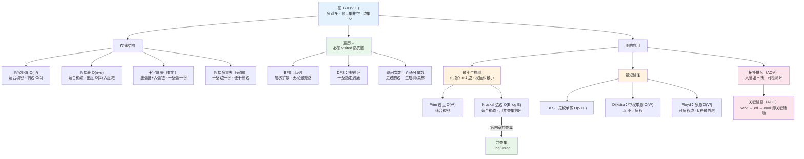

# 第五章 图（2026 考纲）

> 📍 **本章定位**：🏗️ **梁柱级**——大题 + 选择双高频。
>
> - **选择题**：图的性质（度与边数关系、完全图边数、连通分量）、存储结构时空对比、遍历序列、拓扑序列、Prim/Kruskal/Dijkstra 的中间过程、关键路径（约 4-6 分）
> - **大题**：⭐⭐ **图的遍历算法 + 存储结构**是主力；最小生成树/最短路的**过程推演**、拓扑排序、关键路径也常出（约 8-12 分）
> - **与第四章的关系**：**树是"无环连通图"**——去掉"无环"这条约束，就得到图。这条约束一放，麻烦全来了（要 `visited`、要判环、路径不再唯一）
>
> **学这章要回答的问题**：树能表达层级（一对多），但现实世界还有大量**多对多**关系——社交网络的好友、道路交通网、任务之间的依赖、网络路由。这些没法用树表示（一个结点有多个"前驱"），所以需要图。
> → 那代价是什么？**约束一放，问题就变难**：
> ① 遍历可能兜圈子 → 必须加 `visited` 数组；
> ② 顶点间边数相差极大（稀疏 vs 稠密）→ 存储结构必须分两套（邻接矩阵 / 邻接表）；
> ③ 两点间路径不再唯一 → 才有"最短路径、最小生成树、关键路径"这三类**优化问题**。
>
> ⚠️ **代码作答规范**：
>
> - ✅ **C 版 = 造轮子版**：手写 `struct` + 数组/链表 + 栈/队列，**这就是考试要写的代码**。
> - 🧠 **C++ / Python / Java 三版 = 调库版**：仅为理解算法思想，**考场上写 `queue<int>` 不得分**。
> - ❌ 考场禁用：STL 容器、`java.util.*`、Python 高级容器代替手写结构。
> - 📌 **本章要默写的四段代码**：①邻接矩阵/邻接表定义 ②BFS 与 DFS ③Dijkstra ④拓扑排序（入度法）。

---

## 一、图的基本概念

### （一）定义

**图（Graph）** $G$ 由**顶点集 $V$（Vertex）** 和 **边集 $E$（Edge）** 组成，记为 $G = (V, E)$。

- $V = \{v_1, v_2, \dots, v_n\}$：顶点的**有穷非空**集合，$|V|$ 为顶点数
- $E = \{(u, v)\ |\ u, v \in V\}$：顶点之间关系的集合，$|E|$ 为边数

> ⚠️ **图与线性表、树的本质区别**：
>
> | 结构         | 数据元素       | 元素间关系                           |
> | --- | --- | --- |
> | 线性表       | 元素           | 一对一（前驱后继唯一）               |
> | 树           | 结点           | 一对多（双亲唯一）                   |
> | **图** | **顶点** | **多对多（前驱后继都不唯一）** |
>
> 所以：**线性表可以是空表，树可以是空树，但图不能没有顶点**（顶点集非空，边集可以为空）。

### （二）基本术语（⭐选择题概念辨析高频）

| 术语 | 定义 |
| --- | --- |
| **无向边 / 无向图** | 边$(u,v)$ 无方向，$(u,v)=(v,u)$；全部是无向边的图 |
| **有向边（弧）/ 有向图** | 弧$\langle u,v\rangle$ 有方向，$u$ 为**弧尾**、$v$ 为**弧头** |
| **简单图** | ① 不存在**重复边**；② 不存在**顶点到自身的边（自环）** |
| **多重图** | 允许重复边或自环（与简单图相对） |
| **完全图** | 无向：任意两顶点间都有边，共$\frac{n(n-1)}{2}$ 条；有向：任意两顶点间有**方向相反的两条弧**，共 $n(n-1)$ 条 |
| **子图** | $V' \subseteq V$ 且 $E' \subseteq E$ 的图 $G'$（注意并非任意子集都能构成子图，$E'$ 中的边必须两端都在 $V'$ 中） |
| **连通 / 连通图** | 无向图中两顶点间**有路径**则连通；任意两点都连通的图叫连通图 |
| **连通分量** | 无向图的**极大连通子图** |
| **强连通 / 强连通图** | 有向图中$u \to v$ **且** $v \to u$ 都有路径；任意两点都强连通 |
| **强连通分量** | 有向图的**极大强连通子图** |
| **生成树** | 连通图的**包含全部顶点的极小连通子图**，$n$ 个顶点 **$n-1$ 条边** |
| **生成森林** | 非连通图中，每个连通分量一棵生成树 |
| **度 / 入度 / 出度** | 无向图：与该顶点相连的边数；有向图：**入度** = 指向该顶点的弧数，**出度** = 从该顶点出发的弧数，度 = 入度 + 出度 |
| **路径 / 路径长度** | 顶点序列 / 路径上**边的条数**（带权图则是权之和） |
| **简单路径 / 回路** | 顶点不重复的路径 / 第一个顶点与最后一个顶点相同的路径 |
| **简单回路** | 除首尾外顶点不重复的回路 |
| **带权图（网）** | 边（弧）上带权值的图 |
| **稠密图 / 稀疏图** | $\lvert E\rvert$ 接近 $\lvert V\rvert^2$ / $\lvert E\rvert \ll \lvert V\rvert^2$（一般认为 $\lvert E\rvert < \lvert V\rvert\log\lvert V\rvert$ 为稀疏） |

> 💡 **"极大/极小"的判读**：**连通分量**是"极大的"（再加点就不连通了），**生成树**是"极小的"（再删边就不连通了）。

### （三）图的性质（⭐⭐选择题计算题主力）

**性质 1（握手定理）**：无向图中，**所有顶点的度数之和 = 边数的 2 倍**：

$$
\sum_{i=1}^{n} TD(v_i) = 2|E|
$$

- 推论：无向图中**度为奇数的顶点必有偶数个**。

**性质 2**：有向图中，**所有顶点的入度之和 = 出度之和 = 边数**：

$$
\sum ID(v_i) = \sum OD(v_i) = |E|
$$

**性质 3（完全图边数）**：

| 类型 | 边数 |
| --- | --- |
| 无向完全图 | $\dfrac{n(n-1)}{2}$ |
| 有向完全图 | $n(n-1)$ |

**性质 4（顶点数与边数的范围）**：

- 无向图：$0 \leq |E| \leq \dfrac{n(n-1)}{2}$
- 有向图：$0 \leq |E| \leq n(n-1)$

**性质 5（连通性所需的最少边数）** ⭐：

| 场景 | 最少边数 | 说明 |
| --- | --- | --- |
| 无向**连通**图（$n$ 个顶点） | $n - 1$ | 即生成树 |
| 无向**非连通**图的最多边数 | $\dfrac{(n-1)(n-2)}{2}$ | $n-1$ 个点构成完全图 + 1 个孤立点 |
| 有向**强连通**图（$n$ 个顶点） | $n$ | $n$ 个点构成一个环 |

> 📌 **推论（高频）**：一个 $n$ 顶点的无向图，若 $|E| > \dfrac{(n-1)(n-2)}{2}$，则**一定连通**。

> 📌 **推论（高频）**：一个 $n$ 顶点的无向图，若 $|E| > \dfrac{(n-1)(n-2)}{2}$，则**一定连通**。（`快速上手C++/23` 补充的**三条"$n-1$ 条边"推论**同样常用）
> - $|E| < n-1$ ⇒ **必然不连通**；
> - $|E| > n-1$ ⇒ **必然有回路**；
> - $|E| = n-1$ ⇒ **不一定是生成树**（还得**连通**）。

**性质 6（生成树）**：连通图的生成树含有**全部 $n$ 个顶点**和 **$n-1$ 条边**；加一条边必成回路，减一条边必不连通。

> ⭐ **三个术语补充**（`快速上手C++/23`）
> - **生成子图**：含原图**全部顶点**、只删边的子图。它是"生成树"的**上位概念**——区别在**不要求连通**（生成树额外要求连通且 $n-1$ 条边）；
> - **有向树**：恰有 **1 个入度为 0** 的顶点、**其余顶点入度均为 1** 的有向图，入度 0 的那个就是根；
> - **两顶点间的距离**：从 $v_m$ 到 $v_n$ 的**最短路径长度**；两顶点间无路径则记为 **$\infty$** —— 这正是后面 BFS / Dijkstra / Floyd 讨论同一个量的口径来源。
> 🔎 "**阶（order）** = $|V|$"（顶点个数）是英文文献/面试常用词，408 不考。

---

## 二、图的存储及基本操作

> **为什么图需要多种存储？** 因为图的**边数跨度极大**——$n$ 个顶点可以只有 $n-1$ 条边（稀疏），也可以有 $\frac{n(n-1)}{2}$ 条（稠密）。用同一套存法必然在某一种情况下浪费，所以分两套主方案 + 两套改进方案。

### （一）邻接矩阵（顺序存储）

用一个**二维数组** `Edge[n][n]` 表示顶点间的相邻关系：

$$
Edge[i][j] = \begin{cases}
1 \text{（或权值 } w_{ij}），& (v_i, v_j) \in E \\[4pt]
0 \text{（或 } \infty），& \text{否则}
\end{cases}
$$

```c
#define MaxVertexNum 100
#define INF 0x3f3f3f3f
typedef char VertexType;
typedef int EdgeType;

typedef struct {
    VertexType Vex[MaxVertexNum];                    // 顶点表
    EdgeType Edge[MaxVertexNum][MaxVertexNum];       // 邻接矩阵（带权图存权值，无边存 INF）
    int vexnum, arcnum;                              // 顶点数、边数
} MGraph;
```

| 特点 | 说明 |
| --- | --- |
| **空间** | $O(n^2)$（与边数无关）→ **适合稠密图** |
| **判边 $(i,j)$ 是否存在** | $O(1)$ |
| **求顶点的度** | 无向：第$i$ 行（或列）非 0 元素个数，$O(n)$；有向：出度 = 第 $i$ 行之和，入度 = 第 $i$ 列之和 |
| **找邻接点** | 要扫描一整行$O(n)$ |
| **无向图的矩阵** | **对称**（可只存上/下三角压缩） |

> ⚠️ **带权图两点间"无边"用 $\infty$ 表示，自己到自己通常记 0**（Dijkstra/Floyd 初始化时要区分）。

### （二）邻接表（链式存储）

对每个顶点建一条**单链表**，挂在它所有的**邻接点**上；顺序存顶点，链式存边。

```c
typedef struct ArcNode {              // 边（弧）结点
    int adjvex;                       // 该弧指向的顶点下标
    struct ArcNode *nextarc;          // 下一条弧
    // int weight;                    // 带权图的权值
} ArcNode;

typedef struct VNode {                // 顶点结点
    VertexType data;
    ArcNode *firstarc;                // 第一条弧
} VNode, AdjList[MaxVertexNum];

typedef struct {
    AdjList vertices;
    int vexnum, arcnum;
} ALGraph;
```

| 特点 | 说明 |
| --- | --- |
| **空间** | 无向图$O(n + 2e)$，有向图 $O(n + e)$ → **适合稀疏图** |
| **求顶点的出度** | $O(1)$ 数链表长度即可 |
| **求顶点的入度** | ❌ 要遍历**整个**邻接表 $O(n+e)$ → 可建**逆邻接表**解决（见下） |
| **判边是否存在** | 要扫描该顶点的链表，$O($该顶点的度$)$ |
| **无向图** | 每条边存**两次**（冗余，删除时要改两处） |

> ⚠️ **序列不唯一**：邻接表中各结点的**链接次序取决于建表时的输入顺序**，所以同一个图可以有多种邻接表表示 → **遍历序列不唯一**（选择题常考）。

> ⭐ **逆邻接表**（`之美/30`）：**第 $i$ 条链表存的是"指向顶点 $i$ 的顶点"**（即入边）。
> - 邻接表存**出边**（类比"我关注的人"→ 出度 $O(1)$）；逆邻接表存**入边**（类比"关注我的人（粉丝）"→ **入度 $O(1)$**）；
> - 💡 **十字链表就是"邻接表 + 逆邻接表"的融合**（见下一节）。

> 🔎 **扩展（非考纲 · 但对应大纲"图的存储及基本操作"）：遍历所依赖的两个基本操作**
> - `FirstNeighbor(G, v)`：取顶点 $v$ 的**第一个**邻接点下标；
> - `NextNeighbor(G, v, w)`：取 $v$ 的邻接点 $w$ 之后的**下一个**邻接点下标。
>
> BFS/DFS 都是靠这两个操作枚举邻居的。⚠️ 另外：用**头插法**建邻接表时，链表顺序与输入顺序**相反**，所以遍历必须靠 `NextNeighbor` 而不能直读数组——这正是"遍历序列不唯一"的底层机制。

**解决什么**：邻接表存有向图"求出度易、求入度难"，要同时方便两者怎么办？

**做法**：把**弧结点**同时串在"出弧链"和"入弧链"两条链上，顶点结点同时记 `firstout` 和 `firstin`。

```c
typedef struct ArcBox {
    int tailvex, headvex;               // 弧尾、弧头顶点的下标
    struct ArcBox *tlink, *hlink;       // 同弧尾的下一条弧、同弧头的下一条弧
    // int weight;
} ArcBox;

typedef struct VexNode {
    VertexType data;
    ArcBox *firstin, *firstout;         // 第一条入弧、第一条出弧
} VexNode;

typedef struct {
    VexNode xlist[MaxVertexNum];
    int vexnum, arcnum;
} OLGraph;
```

> ✅ 一条弧**只存一份**，但既能顺着出弧链走出度，也能顺着入弧链走**入度** → 空间 $O(n + e)$。

> ⛓️ **与稀疏矩阵的十字链表（第三章）同源**：一个是"行链+列链"挂非零元，一个是"出弧链+入弧链"挂弧，思路完全一致。

### （四）邻接多重表（无向图的链式存储）

**解决什么**：邻接表存无向图时，一条边存**两份**，删除一条边要改两处，容易出错。

**做法**：**边结点只存一份**，但它同时挂在两个顶点的边链上（`ilink` 挂 `ivex`，`jlink` 挂 `jvex`）。

```c
typedef struct EBox {
    int ivex, jvex;                     // 该边依附的两个顶点下标
    struct EBox *ilink, *jlink;         // 依附于 ivex 的下一条边、依附于 jvex 的下一条边
    // int weight;
} EBox;

typedef struct VexBox {
    VertexType data;
    EBox *firstedge;                    // 第一条依附于该顶点的边
} VexBox;

typedef struct {
    VexBox adjmulist[MaxVertexNum];
    int vexnum, edgenum;
} AMLGraph;
```

> ⭐ **十字链表的"两遍画法"**（`快速上手C++/24`，手绘/答题步骤）
> 弧结点字段：`tailidx`（弧尾下标）/ `headidx`（弧头下标）/ `taillink`（**弧尾相同**的下一条弧）/ `headlink`（**弧头相同**的下一条弧）；顶点结点：`data` / `firstout`（出度口）/ `firstin`（入度口）。
> **第一遍**：按顶点找"**以它为弧尾**"的弧，用 `firstout` 串起 `taillink` 链（这是出度链，等价邻接表）；
> **第二遍**：找"**以它为弧头**"的弧，用 `firstin` 串起 `headlink` 链（这是入度链，等价逆邻接表）。
> 💡 **同一个弧结点同时挂在两条链上** —— 这就是"一条弧只存一份"却能同时求出/入度的原因。
> 📌 与王道命名对照：`taillink ↔ tlink`、`headlink ↔ hlink`；文中下标是 **0-based**（A=0…），考场代码更常用。

> ⭐ **邻接多重表"一条边只存一份"是怎么做到的**（`快速上手C++/25`，画法关键）
> 边结点 `iidx`+`ilink` 一组、`jidx`+`jlink` 一组；顶点结点 `data`+`firstedge`。
> 按顶点下标顺序处理时，**遇到已经画过的边就直接复用同一结点**——例如处理 B 时，边 `<A,B>` 已为 A 画过，而 B 是该结点的 `jidx`，于是**从 `jlink` 这一侧继续串下去**。
> 💡 这正是无向边只存一份、**删边只需改一处**（邻接表要改两处）的原因。

### （五）五种存储结构对比（⭐选择题必考）

| 存储 | 适合 | 空间 | 求出度 | 求入度 | 判边 | 删边/删点 |
| --- | --- | --- | --- | --- | --- | --- |
| **邻接矩阵** | **稠密图** | $O(n^2)$ | $O(n)$ | $O(n)$ | $O(1)$ | 删边易、**删点难**（要动行列，$O(n^2)$；可用"末行末列覆盖"降到 $O(n)$，或只打删除标记） |
| **邻接表** | **稀疏图** | $O(n+e)$ | $O(1)$ | $O(n+e)$ | $O(d)$ | 删无向边/点**麻烦**（一条边两处） |
| **十字链表** | **有向图** | $O(n+e)$ | $O(1)$ | **$O(1)$** | — | 删边方便 |
| **邻接多重表** | **无向图** | $O(n+e)$ | — | — | — | **删边方便**（一条边只存一份） |
| **边集数组** | 按边处理 | $O(n+e)$ | — | — | — | 删边方便；**求顶点度要扫全表** |

> ⭐ **边集数组**（`快速上手C++/25`）：两个一维数组——**顶点表 + 边表**，边表元素存 `{beginidx, endidx, weight}`（无向图一条边只存一次）。
> ⚠️ **求某顶点的度要扫全表**，所以它**只适合"按边依次处理"**的场景 —— **Kruskal 就是排序后的边集数组**（见本章四（一））。
> 📌 邻接矩阵的另一优化：**无向图的矩阵是对称的，可只存上/下三角**，空间从 $n^2$ 压到 $\frac{n(n-1)}{2}$（省近一半）。

---

## 三、图的遍历

**遍历**：从某一顶点出发，访问图中**所有顶点且每个顶点仅访问一次**。

> ⚠️ **为什么树不需要 `visited`，图必须要有？** 树从根出发路径唯一，不会走回头路；图里有**回路**，从 $u$ 走到 $v$ 再走回 $u$ 就死循环了。所以图遍历必须设 **`visited[]` 数组**标记已访问顶点。

### （一）广度优先搜索（BFS）—— 用队列

**思想**：从起点 $v$ 出发，先访问 $v$，再**依次访问 $v$ 的所有未访问邻接点**，然后从这些邻接点出发继续**逐层扩散**——对应第三章队列的"层次性"。

```c
bool visited[MaxVertexNum];

void BFS(ALGraph G, int v) {
    visit(v);
    visited[v] = true;
    int q[MaxVertexNum], front = 0, rear = 0;      // 循环队列
    q[rear++] = v;
    while (front < rear) {
        int u = q[front++];                        // 出队
        for (ArcNode *p = G.vertices[u].firstarc; p != NULL; p = p->nextarc) {
            int w = p->adjvex;
            if (!visited[w]) {
                visit(w);
                visited[w] = true;
                q[rear++] = w;                     // 入队
            }
        }
    }
}

// 对非连通图：逐个顶点兜底调用
void BFSTraverse(ALGraph G) {
    for (int i = 0; i < G.vexnum; i++) visited[i] = false;
    for (int i = 0; i < G.vexnum; i++)
        if (!visited[i]) BFS(G, i);                // 调用次数 = 连通分量数
}
```

| 项目 | 邻接矩阵 | 邻接表 |
| --- | --- | --- |
| **时间复杂度** | $O(n^2)$（每个顶点扫一整行） | $O(n + e)$ |
| **空间复杂度** | $O(n)$（`visited` + 队列，队列长度 $\leq n$） | 同 |

> 💡 **BFS 的重要性质**：在**无权图**（或边权相同）中，BFS 从 $v$ 首次到达 $u$ 所经过的边数 = **$v$ 到 $u$ 的最短距离**。这就是"无权图单源最短路"的解法（LeetCode 蛇梯棋、单词接龙）。

**BFS 生成树**：BFS 过程中走过的边（每个顶点首次被访问时经过的那条边）构成一棵**生成树**；非连通图得到**生成森林**。

> ⭐ **生成树/生成森林唯不唯一**（`快速上手C++/26`，笔记原来只说了"遍历序列不唯一"）
> - **邻接矩阵**表示**唯一** → 固定起点下 **BFS/DFS 生成树唯一**；
> - **邻接表**因**头插/尾插次序不同** → **生成树、生成森林都不唯一**。
> 📌 考试问"生成树是否唯一"，就按"**矩阵唯一、链表不唯一**"判断。
>
> ⭐ **$O(V+E)$ 是怎么来的**（`快速上手C++/31`）：BFS 中每个顶点**进队/出队各一次** → $O(V)$；每条边经邻接表**被访问一次** → $O(E)$；连通图里 $E \geq V-1$，所以**常简写成 $O(E)$**。
> 📌 顺带补一个 BFS 代码里的关键数组：**`prev[w]` 记录 $w$ 的前驱**（反向存储）。有了它才能**还原路径**——否则只知道"最短距离"，不知道"怎么走"。这是"BFS 求无权图最短路"真正落地所需的第三个辅助变量。
> 🔎 **DFS 得到的路径不是最短路**（DFS 只保证"走到"，不保证"最短"）；另 DFS 可加全局 `found` 标志剪枝：找到目标立即 `return`，避免剩余邻居空跑递归。

### （二）深度优先搜索（DFS）—— 用栈 / 递归

**思想**：从 $v$ 出发，访问 $v$ 后**沿着一条路走到黑**（访问第一个未访问邻接点并递归下去），走不通了就**回退**到上一个顶点换一条路。

```c
void DFS(ALGraph G, int v) {
    visit(v);
    visited[v] = true;
    for (ArcNode *p = G.vertices[v].firstarc; p != NULL; p = p->nextarc) {
        int w = p->adjvex;
        if (!visited[w])
            DFS(G, w);                 // 递归 = 隐式栈
    }
}

void DFSTraverse(ALGraph G) {
    for (int i = 0; i < G.vexnum; i++) visited[i] = false;
    for (int i = 0; i < G.vexnum; i++)
        if (!visited[i]) DFS(G, i);
}
```

- 复杂度同 BFS：邻接矩阵 $O(n^2)$、邻接表 $O(n+e)$；空间 $O(n)$（递归栈最深 $n$）
- **DFS 生成树/生成森林**：递归路径上的边构成

> ⛓️ **与第四章缝合**：DFS 就是"**树的先序遍历 + visited**"；BFS 就是"**树的层序遍历 + visited**"。同一套栈/队列思想，从树搬到图上，只多一个防兜圈的数组。

### （三）遍历与连通性的关系（⭐选择题）

| 结论 | 内容 |
| --- | --- |
| **一次遍历能否访问全部顶点** | 能 ⇔ 该图**连通**（有向图则要求从该点可达全部） |
| **`Traverse` 中调用 BFS/DFS 的次数** | =**连通分量数**（无向图） |
| **无向图判连通** | 从任一顶点 BFS/DFS，若访问数$= n$ 则连通 |
| **有向图判强连通** | 从任一顶点 DFS 得顶点集$S_1$；把所有边反向再 DFS 得 $S_2$；$S_1 = S_2 = V$ 则强连通 |
| **无向图判是否有环** | DFS 时若遇到"已访问且不是父顶点"的邻接点 → 有环 |

### （四）遍历序列不唯一性（⚠️易错）

同一张图，以下三个因素都会改变遍历序列：

1. **出发点不同**；
2. **存储结构不同**（邻接矩阵按顶点编号从小到大；邻接表按建表输入次序）；
3. **同一顶点的多个邻接点次序不同**。

> 📌 **做题规则**：题目若问"BFS/DFS 序列可能是" → 给的是**选项**，要逐个模拟；若问"唯一的序列" → 通常只有**邻接矩阵 + 固定起点**时序列才确定。

#### 🧠 三语言调库版（仅理解思想）

```cpp
// C++：BFS 用 std::queue，DFS 用递归或 std::stack
#include <queue>
#include <vector>
void bfs(int s, std::vector<std::vector<int>>& g, std::vector<bool>& vis) {
    std::queue<int> q; q.push(s); vis[s] = true;
    while (!q.empty()) {
        int u = q.front(); q.pop();
        for (int w : g[u]) if (!vis[w]) { vis[w] = true; q.push(w); }
    }
}
```

```python
# Python：list 当队列（BFS）/ 递归或显式栈（DFS）
from collections import deque

def bfs(s, g, vis):
    q = deque([s]); vis[s] = True
    while q:
        u = q.popleft()
        for w in g[u]:
            if not vis[w]:
                vis[w] = True; q.append(w)

def dfs(u, g, vis):
    vis[u] = True
    for w in g[u]:
        if not vis[w]:
            dfs(w, g, vis)
```

```java
// Java：ArrayDeque 实现队列（BFS）
import java.util.*;
void bfs(int s, List<List<Integer>> g, boolean[] vis) {
    Queue<Integer> q = new ArrayDeque<>();
    q.offer(s); vis[s] = true;
    while (!q.isEmpty()) {
        int u = q.poll();
        for (int w : g.get(u)) if (!vis[w]) { vis[w] = true; q.offer(w); }
    }
}
```

> 🧠 **理解点**：三版都是"队列 + visited"，但考场上要写的是 C 版那个**用数组手搓的循环队列**。

---

## 四、图的基本应用

### （一）最小（代价）生成树 MST

#### 1. 问题与性质

**问题**：在**带权连通无向图**中，选 $n-1$ 条边把全部 $n$ 个顶点连起来（构成生成树），使**边权之和最小**。

**最小生成树的性质**：

1. 含有 $n$ 个顶点和 $n-1$ 条边；
2. **MST 不一定唯一**，但**最小权值之和是唯一的**；
3. 若图中**各边权值互不相同**，则 MST **唯一**；
4. MST 的权值和 = 所有生成树中最小的那个。

#### 2. Prim 算法（选点，$O(V^2)$，适合稠密图）

**思想**：从某顶点开始，每次从"已在树中的顶点"到"树外顶点"的**所有边中选一条权值最小的**，把对应的新顶点拉进树里，重复 $n-1$ 次。

```c
// 邻接矩阵版，从 v0 出发，返回 MST 权值之和
int Prim(MGraph G, int v0) {
    int lowcost[MaxVertexNum];     // 树外各顶点到"当前生成树"的最小边权
    int adjvex[MaxVertexNum];      // 该最小边对应的树内顶点
    for (int i = 0; i < G.vexnum; i++) {
        lowcost[i] = G.Edge[v0][i];
        adjvex[i] = v0;
    }
    lowcost[v0] = -1;              // -1 表示该顶点已并入生成树

    int sum = 0;
    for (int k = 1; k < G.vexnum; k++) {          // 还需选 n-1 个顶点
        int min = INF, u = -1;
        for (int i = 0; i < G.vexnum; i++)        // ① 选最小边
            if (lowcost[i] != -1 && lowcost[i] < min) { min = lowcost[i]; u = i; }
        sum += min;
        lowcost[u] = -1;                          // ② u 并入生成树
        for (int i = 0; i < G.vexnum; i++)        // ③ 用 u 更新 lowcost
            if (lowcost[i] != -1 && G.Edge[u][i] < lowcost[i]) {
                lowcost[i] = G.Edge[u][i];
                adjvex[i] = u;
            }
    }
    return sum;
}
```

- **时间 $O(V^2)$**（与边数无关）→ **适合稠密图**
- **空间 $O(V)$**
- 结果**依赖于起点**但权值总和相同

> ⭐ **可照抄的快速推演例**（`快速上手C++/27`，6 顶点、从 A 出发）
> 初值 `lowcost = [0,100,15,20,∞,∞]`，`adjvex` 全为 A；
> 第 1 轮选最小非零 **15（C）** → 得边 A–C；用 C 的行更新，**A–B 原为 100，因 C–B = 40 更小被覆盖**（→40/来源 C）；
> 依次得边 **A–D 20、D–F 30、C–B 40、F–E 40**，权值和 $15+20+30+40+40 = \mathbf{145}$。
> 💡 推演时只要盯住"**每轮选最小 lowcost，然后用新顶点刷新 lowcost**"这两步。
>
> ⚠️ **实现口径提醒**：用 `lowcost = 0` 表示"已入树"是常见写法，但**若图中存在 0 权边会误判** —— 考试统一用 **`-1`（或另设 `inTree` 数组）** 更稳。
> 💡 另：朴素的"每轮遍历树内所有顶点"是 $O(V^3)$，**正是 `lowcost` 数组把它降到了 $O(V^2)$**。

#### 3. Kruskal 算法（选边，$O(E\log E)$，适合稀疏图）

**思想**：把所有边按**权值从小到大排序**，依次考察：若该边两端**不在同一连通分量**（取了不会成环）就选中，否则跳过；直到选够 $n-1$ 条边。

> ⛓️ **这里正是第四章「并查集」的战场**：判断"两端是否已连通"= `Find(u) == Find(v)`；"合并"= `Union(u, v)`。

```c
typedef struct { int u, v, w; } Edge;   // 边集数组

// e[] 已按 w 升序排好；n 顶点、m 边；返回 MST 权值之和
int Kruskal(Edge e[], int n, int m) {
    Init(n);                            // 并查集初始化（见第四章）
    int sum = 0, cnt = 0;
    for (int i = 0; i < m; i++) {
        if (Find(e[i].u) != Find(e[i].v)) {   // 两端不连通 → 不会成环
            Union(e[i].u, e[i].v);
            sum += e[i].w;
            if (++cnt == n - 1) break;        // 已选够 n-1 条边
        }
    }
    return sum;
}
```

- **时间 $O(E \log E)$**（瓶颈在**排序**）→ **适合稀疏图**
- **空间 $O(E)$**（边集数组）

> ⭐ **Kruskal 的"判环"就是最朴素的并查集**（`快速上手C++/28`）：用**静态链表的父指针数组**实现——初值全 `-1`，`findHead` 沿 parent 一路找到根：
> **两端根相同 ⇒ 会成环，弃边；根不同 ⇒ 合并**（`LinkSign[root2] = root1`）。本质上就是**无路径压缩的并查集**。
>
> 📌 **推演例**：边权排序后为 `1,2,3,4,5,5,5,6,6,6`，依次取 **A–C(1)、D–F(2)、B–E(3)、C–F(4)**；权为 5 的三条中 **C–D 弃（C、D 根相同）、A–D 弃、B–C 取** → 凑满 $n-1=5$ 条，权和 **15**。
>
> ⚠️ **复杂度口径澄清**：有的资料写 $O(E\log E + V\log V)$，与王道 $O(E\log E)$ **不矛盾**（连通图 $E \ge V-1$，$E\log E$ 主导）。另有两点注意：
> ① 并查集"最坏 $O(\log V)$"**只在有按秩合并或路径压缩时成立**，朴素父指针最坏可达 $O(V)$；
> ② 若用自写的**冒泡**排序排边，会退化成 $O(E^2)$ —— 考试只记 **qsort/快排版 $O(E\log E)$**。
> 📌 实现上 Kruskal 要先把图落成**边集数组**再排序（从邻接矩阵抽边是 $O(V^2)$）。

#### 4. Prim vs Kruskal（⭐选择题）

| | **Prim** | **Kruskal** |
| --- | --- | --- |
| 策略 | **选点**：每次拉一个顶点进树 | **选边**：每次取最小权边 |
| 时间复杂度 | $O(V^2)$ | $O(E \log E)$ |
| 适合 | **稠密图**（边多，$\log E$ 反而吃亏） | **稀疏图**（边少，排序便宜） |
| 辅助结构 | `lowcost` 数组 | 排序 +**并查集** |
| 中间结果 | 始终是一棵树 | 中间是森林，最后合并成树 |

### （二）最短路径

#### 1. BFS 求无权图单源最短路

无权图（或所有边权相同）中，BFS 首次到达即最短。$O(V + E)$。

#### 2. Dijkstra —— 单源最短路径（⭐⭐必考）

**思想（贪心）**：维护集合 $S$（已确定最短路径的顶点）。每步从 $V - S$ 中选 **$dist$ 最小**的顶点 $u$ 加入 $S$，然后用 $u$ **松弛**它的所有邻接点。

```c
void Dijkstra(MGraph G, int v0, int dist[], int path[]) {
    bool s[MaxVertexNum];                       // s[i]=true 表示 i 的最短路径已确定
    for (int i = 0; i < G.vexnum; i++) {
        s[i] = false;
        dist[i] = G.Edge[v0][i];                // 初始化为 v0 直达的距离
        path[i] = (dist[i] < INF) ? v0 : -1;    // path[i] 记录最短路径上 i 的前驱
    }
    s[v0] = true; dist[v0] = 0; path[v0] = -1;

    for (int i = 1; i < G.vexnum; i++) {        // 还要确定 n-1 个顶点
        int min = INF, u = -1;
        for (int j = 0; j < G.vexnum; j++)      // ① 选 dist 最小的 u
            if (!s[j] && dist[j] < min) { min = dist[j]; u = j; }
        s[u] = true;
        for (int j = 0; j < G.vexnum; j++)      // ② 用 u 松弛邻接点
            if (!s[j] && dist[u] + G.Edge[u][j] < dist[j]) {
                dist[j] = dist[u] + G.Edge[u][j];
                path[j] = u;
            }
    }
}
```

| 项目 | 值 |
| --- | --- |
| 时间 | $O(V^2)$（朴素）；堆优化 $O(E \log V)$ |
| 空间 | $O(V)$ |
| ⚠️**限制** | **边权必须非负**！有负权边结果可能错误 |
| 适用 | 单源最短路径 |

> ❗ **为什么不能有负权？** Dijkstra 基于"当前 $dist$ 最小的顶点，其最短路已不可能再被更新"这个贪心结论；一旦有负边，后面可能出现的负权路径会让它变小，该结论失效（此时用 Bellman-Ford，考纲不要求）。
>
> ⭐ **正确的"终止条件"表述**（`之美/44`）：算法可以**在"终点出队（被选入 $S$）时立即停止"**——此时终点的 $dist$ 已是全队列最小值，不可能再被更新，故一定最优。这就是"选最小 $dist$ 即定局"的严格理由。
>
> ⭐ **一个逐步推演例**（`快速上手C++/29`，源点 A，邻接矩阵 A 行为 `{0,22,∞,6,∞,∞}`）
>
> | 步骤 | 选中的顶点 | dist 变化 |
> | --- | --- | --- |
> | 初值 | — | `{0,22,∞,6,∞,∞}`，`path = {-1,A,-1,A,-1,-1}` |
> | ① 选 6（D） | D | 松弛 B=6+10=16、C=6+20=26 → `{0,16,26,6,∞,∞}` |
> | ② 选 16（B） | B | E = 6+10+100 = 116 |
> | ③ 选 26（C） | C | E = 6+20+40 = 66（更小，覆盖）、F = 6+20+10 = 36 |
> | ④ 选 36（F） | F | 经 F 到 E = 71 > 66，忽略 |
> | ⑤ 选 66（E） | E | 结束 |
>
> **路径还原**：`path[1]=D → path[D]=A` 得 **A→D→B**；`path[4]=C → path[C]=D → A` 得 **A→D→C→E**。`path` 存的是**前驱**，一路倒推回源点。
>
> 🔎 **堆优化落地细节**（`之美/44`）：小顶堆里存 `(顶点, dist)`；**改了 dist 后必须显式做 `update`（重新堆化）**——堆不会自动重排（这是常见 bug）；再用 `inqueue` 数组避免同一个顶点重复入堆。总复杂度 **$O(E\log V)$**。
> 🔎 **超大图（北京↔上海）怎么办**：① 只在覆盖两点的**局部区块**内跑 Dijkstra（分治/剪枝）；② 远距离把"城市"当**超级顶点**先规划主干、再细化（**分层**）。

#### 3. Floyd —— 各顶点间最短路径（⭐必考）

**思想（动态规划）**：三重循环，逐步允许把顶点 $k$ 作为中间点：

$$
D^{(k)}[i][j] = \min\bigl(D^{(k-1)}[i][j],\ D^{(k-1)}[i][k] + D^{(k-1)}[k][j]\bigr)
$$

```c
void Floyd(MGraph G, int D[][MaxVertexNum], int path[][MaxVertexNum]) {
    for (int i = 0; i < G.vexnum; i++)          // 初始化
        for (int j = 0; j < G.vexnum; j++) {
            D[i][j] = G.Edge[i][j];
            path[i][j] = (i != j && D[i][j] < INF) ? i : -1;
        }

    for (int k = 0; k < G.vexnum; k++)          // ⚠️ k 必须在最外层
        for (int i = 0; i < G.vexnum; i++)
            for (int j = 0; j < G.vexnum; j++)
                if (D[i][k] + D[k][j] < D[i][j]) {
                    D[i][j] = D[i][k] + D[k][j];
                    path[i][j] = path[k][j];    // 中转点 k 后，i 到 j 的前驱 = k 到 j 的前驱
                }
}
```

| 项目 | 值 |
| --- | --- |
| 时间 | $O(V^3)$ |
| 空间 | $O(V^2)$ |
| 权值 | **允许负权边**，但**不允许含负权回路**（否则最短路 $-\infty$） |
| 适用 | **多源**（一次算出任意两点间的最短路） |

> ⭐ **`path` 矩阵有两套口径，都能用但别混**（`快速上手C++/30`）
>
> | 口径 | `path[i][j]` 存什么 | 初值 | 更新 | 还原方式 |
> | --- | --- | --- | --- | --- |
> | **前驱口径**（本书代码） | $i \to j$ 最短路上 $j$ 的**前驱** | $i$（有边时） | `path[i][j] = path[k][j]` | 一路倒推 |
> | **中间点口径** | 最短路上用到的**中间点 $k$** | $-1$ | `path[i][j] = v` | **递归** `(i, mid)`、`(mid, j)` |
>
> 📌 还原例（中间点口径）：B→A，`path[1][0] = D`、`path[1][3] = -1`、`path[3][0] = C`、其余为 $-1$ → 路径 **B, D, C, A**。
> 💡 两套都对，**答题时任选一套写到底**即可。
> 🔎 可选优化：`i==j || v==i || v==j` 时跳过更新（剪枝，不影响结果）。注意 **Floyd 本质是 all-pairs**（求所有点对），与"Dijkstra 求单源"分工不同，别被"Floyd 求一对"的不严谨说法带偏。

#### 4. 三种最短路对比

| 算法 | 问题 | 时间 | 负权 | 备注 |
| --- | --- | --- | --- | --- |
| **BFS** | 无权图单源 | $O(V+E)$ | ✅ | 首次到达即最短 |
| **Dijkstra** | 带权单源 | $O(V^2)$ | ❌ | 贪心选最小 dist |
| **Floyd** | 带权多源 | $O(V^3)$ | ✅（不可有负权回路） | DP 三重循环，**k 在最外层** |

### （三）拓扑排序（⭐应用大题）

#### 1. AOV 网

**AOV 网（Activity on Vertex Network）**：用**顶点表示活动**、**有向边 $\langle i,j\rangle$ 表示 $i$ 必须先于 $j$ 发生**的有向无环图（DAG）。

**拓扑排序**：把 AOV 网中所有顶点排成一个**线性序列**，使得对每条弧 $\langle i,j\rangle$，$i$ 都排在 $j$ 之前。

> 💡 **应用场景**：课程先修关系、编译依赖（之美 `43` 讲的就是"源文件编译依赖"）、任务调度。

#### 2. 算法（入度法，⭐必写）

1. 从图中选一个**入度为 0** 的顶点，输出它；
2. 删除该顶点及**所有以它为尾的弧**（即把它指向的顶点入度减 1）；
3. 重复 1-2，直到**无入度为 0 的顶点**（若此时还有顶点未输出 → **图中存在环**）。

```c
// 邻接表版；topo[] 存拓扑序列；返回 true 表示无环
bool TopologicalSort(ALGraph G, int topo[]) {
    int indegree[MaxVertexNum] = {0};
    for (int i = 0; i < G.vexnum; i++)                       // ① 统计入度
        for (ArcNode *p = G.vertices[i].firstarc; p != NULL; p = p->nextarc)
            indegree[p->adjvex]++;

    int stack[MaxVertexNum], top = -1;
    for (int i = 0; i < G.vexnum; i++)                       // ② 入度为 0 的入栈
        if (indegree[i] == 0) stack[++top] = i;

    int count = 0;
    while (top != -1) {
        int u = stack[top--];                                // ③ 输出
        topo[count++] = u;
        for (ArcNode *p = G.vertices[u].firstarc; p != NULL; p = p->nextarc) {
            int w = p->adjvex;
            if (--indegree[w] == 0) stack[++top] = w;        // ④ 入度减 1，为 0 则入栈
        }
    }
    return count == G.vexnum;                                // ⑤ 输出的顶点数 < n 则有环
}
```

- **时间**：邻接表 $O(V + E)$；邻接矩阵 $O(V^2)$
- **空间**：$O(V)$（栈 + 入度数组）

#### 3. 重要结论（⭐选择题）

1. **拓扑序列不唯一**（入度为 0 的顶点有多个时任选，或用队列代替栈则顺序不同）；
2. **有环 ⇔ 无法生成包含所有顶点的拓扑序列** → 拓扑排序可**检测有向环**；
3. **有向无环图（DAG）才存在拓扑序列**；
4. 若图中存在 $\langle i,j\rangle$，则 $i$ 一定在 $j$ 之前（反之不成立，序列里靠前不代表有边）；
5. 若要求**字典序最小**的拓扑序列 → 每次选入度为 0 中**编号最小**的（用**优先队列/小根堆**代替栈）。

> 💡 **DFS 法**：DFS 的**逆后序**（顶点结束访问的顺序倒过来）即拓扑序列——因为 DFS 保证"后继先完成"。
>
> ⭐ **用队列还是用栈**（`之美/43`）：**Kahn 算法原版用队列（FIFO）**，本笔记用栈——两者都正确但语义不同：
> **队列版得到"逐层扩散"的序列（本质就是 BFS）**，栈版得到"一条路走到底"的序列；**只有要求字典序最小时才换优先队列**。
>
> ⭐ **DFS 法的可落地实现**（`之美/43`）：先由邻接表建**逆邻接表**，再 DFS，并**在递归返回之后才输出自己**（后序），输出即拓扑序 —— **不需要再"翻转逆后序"**。
>
> ⭐ **复杂度精算**：Kahn = 每顶点出队一次 + 每边访问一次 = **$O(V+E)$**；DFS 法 = 每顶点被回看 2 次 + 每边 1 次，仍是 **$O(V+E)$**。⚠️ 强调：**图可以不连通，$E$ 与 $V$ 没有必然大小关系**，所以必须按 $V+E$ 计。
>
> 🔎 **逆拓扑排序**（`快速上手C++/31`）：每次选"**出度为 0**"的顶点输出，并删除以它为终点的入边。找入边时**邻接表要扫全表，邻接矩阵扫一列，逆邻接表最优**。
> 🔎 **更强的刻画**："若 $v_i$ 在拓扑序列中排在 $v_j$ 之前，则图中**不存在** $v_j \to v_i$ 的路径"（笔记原来只写了"有边 ⇒ 靠前"这一半）。

### （四）关键路径（⭐大题常客）

#### 1. AOE 网

**AOE 网（Activity on Edge Network）**：**顶点表示事件**，**有向边表示活动**，边上的**权值表示活动持续的时间**。

- 只有一个**入度为 0 的顶点**叫**源点**（工程开始）；
- 只有一个**出度为 0 的顶点**叫**汇点**（工程结束）。

**关键路径**：从源点到汇点的**最长路径**（路径长度 = 各活动时间之和），它决定工程的**最短完成时间**。

> ⚠️ **注意"最长路径 = 最短工期"**：关键路径越长，工期越久；而工程只有在**所有活动都完成**后才结束，所以**工期 = 最长路径长度**。

#### 2. 两组四个时间量（⭐大题要会算）

**事件（顶点）**：

- **$ve(k)$**：事件 $k$ 的**最早**发生时间——从源点**顺着**拓扑序取**最大值**
- **$vl(k)$**：事件 $k$ 的**最晚**发生时间——从汇点**逆着**拓扑序取**最小值**

**活动（弧 $\langle i, j\rangle$，权 $w$）**：

- **$e(i,j)$**：活动**最早**开始时间 $= ve(i)$
- **$l(i,j)$**：活动**最晚**开始时间 $= vl(j) - w(i,j)$
- **时间余量** $= l - e$；**$l = e$ 的活动即关键活动**（无缓冲，一拖就拖累工期）

#### 3. 计算步骤（记这个顺序就不会错）

1. 对 AOE 网做**拓扑排序**，得到拓扑序列；
2. 置 $ve(源点) = 0$，按**拓扑序**推：$ve(j) = \max\{ve(i) + w(i,j)\}$；
3. 置 $vl(汇点) = ve(汇点)$（= 工期），按**逆拓扑序**推：$vl(i) = \min\{vl(j) - w(i,j)\}$；
4. 对每条弧计算 $e = ve(i)$、$l = vl(j) - w(i,j)$，判断 $e \stackrel{?}{=} l$；
5. **关键活动**组成的从源点到汇点的路径 = **关键路径**。

> ⭐ **完整算例（⭐大题可直接对照）**（`快速上手C++/32`）
> 9 个事件，弧及权：A→B 6、A→C 4、A→D 5、B→E 1、C→E 1、D→F 2、E→G 9、E→H 7、F→H 4、G→I 2、H→I 4。
>
> | 量 | 值 |
> | --- | --- |
> | 拓扑序 | A B C E G D F H I |
> | **$ve$**（顺拓扑序取 max） | $\{0, 6, 4, 5, 7, 7, 16, 14, 18\}$ |
> | **$vl$**（逆拓扑序取 min） | $\{0, 6, 6, 8, 7, 10, 16, 14, 18\}$ |
> | **关键活动**（$e = l$） | **AB、BE、EG、EH、GI、HI** |
> | **关键路径 / 工期** | 两条：A→B→E→G→I 与 A→B→E→H→I，**工期 18** |
>
> 💡 注意 $ve[I] = \max(ve[G]+2,\ ve[H]+4) = \max(16, 18) = 18$，$vl[D] = vl[F] - 2 = 8$ —— **顺取大、逆取小**的算例。
>
> ⭐ **两个补充考点**
> ① **复杂度 $O(V+E)$**（笔记原来未给）；
> ② **AOE 网的合法性**：必须**恰有 1 个源点（入度 0）、1 个汇点（出度 0）**。
>
> ⭐ **作者的真知灼见**（`快速上手C++/32`）：$ve$/$vl$ **必须借拓扑序递推**——若偷懒按"顶点创建/插入顺序"算，改变插入顺序就会算错。（这实证了第 1 步"先拓扑排序"不是形式主义。）
> ⚠️ **命名陷阱**：有的资料把最早/最晚发生时间记作 **`ee` / `el`**，王道用 **`e` / `l`**，含义完全相同（$ee = e = ve(\text{弧尾})$，$el = l = vl(\text{弧头}) - w$），别被字母带偏。

```c
void CriticalPath(ALGraph G) {
    int topo[MaxVertexNum], ve[MaxVertexNum], vl[MaxVertexNum];
    TopologicalSort(G, topo);                     // ① 拓扑序列

    for (int i = 0; i < G.vexnum; i++) ve[i] = 0; // ② 顺拓扑序推 ve
    for (int k = 0; k < G.vexnum; k++) {
        int u = topo[k];
        for (ArcNode *p = G.vertices[u].firstarc; p != NULL; p = p->nextarc)
            if (ve[u] + p->weight > ve[p->adjvex])
                ve[p->adjvex] = ve[u] + p->weight;
    }

    int finish = ve[topo[G.vexnum - 1]];          // 工期
    for (int i = 0; i < G.vexnum; i++) vl[i] = finish;   // ③ 逆拓扑序推 vl
    for (int k = G.vexnum - 1; k >= 0; k--) {
        int u = topo[k];
        for (ArcNode *p = G.vertices[u].firstarc; p != NULL; p = p->nextarc)
            if (vl[p->adjvex] - p->weight < vl[u])
                vl[u] = vl[p->adjvex] - p->weight;
    }

    for (int u = 0; u < G.vexnum; u++)            // ④ 逐弧判断关键活动
        for (ArcNode *p = G.vertices[u].firstarc; p != NULL; p = p->nextarc) {
            int v = p->adjvex;
            int e = ve[u], l = vl[v] - p->weight;
            if (e == l) printf("关键活动 <%d,%d>\n", u, v);
        }
}
```

#### 4. 缩短工期的分析（⭐选择题/大题小问）

1. 只有**缩短关键活动**的时间才能缩短工期；
2. 缩短某一个关键活动，可能使它**不再是关键活动**（其它路径变成新的关键路径）；
3. 若关键路径有**多条**，只缩短其中一条**不能**缩短工期——必须**同时缩短所有关键路径上的公共活动**；
4. 缩短"过多"可能反而使关键路径发生**转移**。

---

## 五、复习工具箱

> 本部分是正文之外的复习辅助区：知识关系图（L1 结构化）、跨科缝合（L2 关联化）、易错点清单、配套资源与自测。

### 5.1 脉络打通：知识关系图（L1 结构化）



### 5.2 跨科缝合（L2 关联化）

| 本章概念 | 缝合到 | 缝的是什么 |
| --- | --- | --- |
| **BFS（队列）** | 数据结构 · 树层序遍历 | 同一套队列思想搬到图上，只多一个`visited` |
| **DFS（栈/递归）** | 数据结构 · 树先序遍历 | DFS 逆后序还能直接得到**拓扑序列** |
| **并查集（Kruskal 判环）** | 数据结构 · 第四章 | 树的应用在图上落地：加边前`Find` 判两端是否已连通 |
| **堆（Dijkstra 优化）** | 数据结构 · 第四章堆 / 第七章排序 | Dijkstra 用**小根堆**选最小 dist → 复杂度降到 $O(E\log V)$ |
| **拓扑排序** | OS · 死锁检测 / 编译原理 | 资源分配图化简判死锁、Makefile 依赖分析都是拓扑排序 |
| **关键路径** | 软件工程 · 项目管理 | AOE 网的最长路 = 项目最短工期，与"甘特图/关键链"同源 |
| **最短路/路由表** | 计网 · 路由协议 | OSPF 本质是**Dijkstra**（链路状态算法），RIP 是距离向量（Bellman-Ford 思想） |
| **图的连通性** | 计网 · 网络拓扑 / 分布式 | 判断网络是否分区（脑裂）就是判连通分量 |
| **邻接矩阵的 $O(n^2)$ 空间** | 计组 · 存储器 / Cache | 稠密矩阵遍历**空间局部性好**，稀疏图用邻接表则指针跳跃、Cache 不友好 |

> ⛓️ 一句话：**图是树的"松绑版"**——去掉无环约束换来表达能力，代价是遍历要 `visited`、存储要分稠密稀疏、路径要专门求最优。而**最短路直接被计网的路由协议拿去用了**。

### 5.3 易错点

1. **图不能没有顶点**（顶点集非空），但**可以没有边**；线性表和树可以为空。
2. **无向图度数和 $= 2|E|$**；**有向图入度和 = 出度和 = $|E|$**（不是 $2|E|$）。
3. **完全图边数**：无向 $\frac{n(n-1)}{2}$、有向 $n(n-1)$——不要混。
4. **$n$ 顶点无向连通图最少 $n-1$ 条边**；**非连通图最多 $\frac{(n-1)(n-2)}{2}$ 条边**（$n-1$ 个点的完全图 + 1 个孤立点）。
5. **$n$ 顶点强连通图最少 $n$ 条边**（构成一个环）。
6. **邻接表表示不唯一** → 遍历序列不唯一；**邻接矩阵表示唯一**，但**遍历序列仍可能因起点不同而不同**。
7. **图遍历一定要 `visited`**，否则有回路时死循环。
8. **BFS 时间复杂度**：邻接矩阵是 $O(n^2)$（不是 $O(n+e)$）——每个顶点要扫一整行。
9. **DFS 递归栈最深 $n$**，空间 $O(n)$。
10. **Prim 适合稠密图、Kruskal 适合稀疏图**；Prim $O(V^2)$ 与**边数无关**。
11. **MST 不一定唯一，但最小权值和唯一**；各边权互异时 MST 唯一。
12. **Kruskal 判环用并查集**，不是 DFS。
13. **Dijkstra 不能处理负权边**（贪心结论失效）；Floyd **可以处理负权边但不能有负权回路**。
14. **Floyd 三重循环中 $k$（中转点）必须在最外层**——顺序写错结果全错。
15. **Floyd 初始 $D[i][i] = 0$、无边为 $\infty$**；`path[i][j]` 初值为 $i$（有边）或 $-1$。
16. **拓扑序列不唯一**；**输出顶点数 $< n$ 说明有环**。
17. **有环图没有拓扑序列**；拓扑排序因此可用来**判断 DAG**。
18. **关键路径是最长路径**，但它是**工程的最短完成时间**——这个"最长 = 最短"的辩证关系必考。
19. **只有缩短关键活动才能缩短工期**，且缩短过多会导致**关键路径转移**。
20. **关键路径可能不止一条**，此时必须缩短**所有关键路径的公共活动**才有效。
21. **$ve$ 顺着拓扑序取 $\max$，$vl$ 逆着拓扑序取 $\min$**——口诀"**顺取大、逆取小**"。
22. **十字链表用于有向图、邻接多重表用于无向图**——不要记反。
23. **$n$ 顶点、$n-1$ 条边 ≠ 生成树**（还得连通）；**$|E|>n-1$ 必有回路**、**$|E|<n-1$ 必不连通**。
24. **生成树是否唯一**：邻接矩阵表示唯一 ⇒ 固定起点下生成树唯一；**邻接表不唯一**（头插/尾插不同）。
25. **DFS 走的路径不是最短路**；求无权图最短路必须用 **BFS**（且要配 `prev[]` 才能还原路径）。
26. **Prim 里用 `lowcost = 0` 标记"已入树"有坑**（存在 0 权边时误判），**用 `-1` 或另设 `inTree` 数组**。
27. **Kruskal 的判环就是并查集**；朴素父指针最坏 $O(V)$，"$O(\log V)$"需有按秩合并或路径压缩。
28. **Floyd 的 `path` 矩阵有两套口径**（前驱 / 中间点），**答题任选一套写到底**，别中途换口径。
29. **Dijkstra 可以在"终点出队时立即停止"**（此时终点 dist 已是最小）；堆优化时**改了 dist 必须显式 `update` 重新堆化**。
30. **关键路径的 $ve$/$vl$ 必须借拓扑序递推**，不能按顶点编号/插入顺序算。
31. ⚠️ **命名口径**：有的资料关键路径用 `ee`/`el`（= 王道的 `e`/`l`）；有的资料把"两点间距离"定义为最短路径长度——**含义一致，别被字母吓到**。

### 5.4 配套资源 & 练习

#### 📚 阅读材料

> 📖 **阅读状态说明**：✅ = 已通读并吸收进本章正文。

| 主题 | 位置 | 状态 · 本章吸收了什么 |
| --- | --- | --- |
| 图的表示：存储社交网络好友关系 | `数据结构与算法之美/30` | ✅ ⭐**逆邻接表**（= 粉丝列表），与邻接表配对；🔎 邻接矩阵三角压缩、分片存储 |
| 深度和广度优先搜索：三度好友 | `数据结构与算法之美/31` | ✅ ⭐$O(V+E)$ 的**推导** + **`prev[]` 路径还原**；🔎 六度分割、DFS 剪枝（DFS 路径不是最短路） |
| 拓扑排序：代码源文件的编译依赖 | `数据结构与算法之美/43` | ✅ ⭐**Kahn 队列版本质是 BFS**；⭐DFS 法用逆邻接表 + 后序输出；⭐$O(V+E)$ 精算；🔎 出度法、三色标记判环 |
| 最短路径：地图软件的最优出行路径 | `数据结构与算法之美/44` | ✅ ⭐**"终点出队才停"的严格理由**；🔎 堆优化的 `update` 细节；🔎 超大图的分治/分层优化 |
| A\* 搜索：游戏寻路（外延） | `数据结构与算法之美/49` | ✅ 🔎 $f = g + h$、曼哈顿距离、**$h \equiv 0$ 时退化为 Dijkstra**、open/closed 表 |
| 图：如何用图表达错综复杂的数据 | `快速上手C++数据结构与算法/23` | ✅ ⭐**生成子图 / 有向树 / 两点间距离**三个术语；⭐"$n-1$ 条边"三条推论；✅ 术语与王道一致 |
| 图的存储（上）：邻接矩阵、邻接表、十字链表 | `快速上手C++数据结构与算法/24` | ✅ ⭐**十字链表"两遍画法"** + 字段与王道命名对照；🔎 `FirstNeighbor`/`NextNeighbor`（大纲的"基本操作"）；🔎 头插法导致序列不唯一 |
| 图的存储（下）：邻接多重表、边集数组 | `快速上手C++数据结构与算法/25` | ✅ ⭐**邻接多重表"复用边结点"的画法**；⭐**边集数组**（Kruskal 的底座）；⭐对比表补"删边/删点"一列 |
| 图：DFS 与 BFS | `快速上手C++数据结构与算法/26` | ✅ ⭐**生成树唯一性**（矩阵唯一、链表不唯一）；无冲突 |
| 最小生成树：Prim | `快速上手C++数据结构与算法/27` | ✅ ⭐**可照抄的 lowcost/adjvex 推演例**（权和 145）；📌 实现细节：**用 `-1` 而非 `0` 标记已入树**（0 权边会误判） |
| 最小生成树：Kruskal | `快速上手C++数据结构与算法/28` | ✅ ⭐**判环 = 最朴素并查集**（静态链表父指针）+ 推演例（权和 15）；⚠️ 复杂度口径澄清（$O(E\log E+V\log V)$ 与王道不矛盾） |
| 最短路径：Dijkstra | `快速上手C++数据结构与算法/29` | ✅ ⭐**逐步 dist/path 推演表** + 路径还原 |
| 最短路径：Floyd | `快速上手C++数据结构与算法/30` | ✅ ⭐**`path` 矩阵两套口径对照**（前驱 vs 中间点）+ 递归还原例；✅ `k` 在最外层一致 |
| 图的应用：拓扑排序 | `快速上手C++数据结构与算法/31` | ✅ 🔎 **逆拓扑排序**（选出度为 0）；拓扑序的更强刻画 |
| 图的应用：关键路径 | `快速上手C++数据结构与算法/32` | ✅ ⭐**9 顶点完整算例**（ve/vl/关键活动/两条关键路径/工期 18）；⭐复杂度 $O(V+E)$；⭐AOE 合法性校验；📌 术语：有的资料把最早/最晚记作 `ee`/`el`（= 王道的 `e`/`l`） |

> 🎯 **重点推荐**：`之美/43`（拓扑排序的工程场景）、`之美/44`（最短路的直观解释）、`快速上手/32`（关键路径的完整计算过程，大题直接用得上）。

#### 💻 力扣练习

**DFS（3 题）**

| 题目 | 难度 |
| --- | --- |
| [岛屿数量](https://leetcode.cn/problems/number-of-islands/) | 🟡 中等 |
| [被围绕的区域](https://leetcode.cn/problems/surrounded-regions/) | 🟡 中等 |
| [除法求值](https://leetcode.cn/problems/evaluate-division/) | 🟡 中等 |

**BFS（4 题）**

| 题目 | 难度 |
| --- | --- |
| [克隆图](https://leetcode.cn/problems/clone-graph/) | 🟡 中等 |
| [最小基因变化](https://leetcode.cn/problems/minimum-genetic-mutation/) | 🟡 中等 |
| [蛇梯棋](https://leetcode.cn/problems/snakes-and-ladders/) | 🟡 中等 |
| [单词接龙](https://leetcode.cn/problems/word-ladder/) | 🔴 困难 |

**拓扑排序（2 题）**

| 题目 | 难度 |
| --- | --- |
| [课程表](https://leetcode.cn/problems/course-schedule/) | 🟡 中等 |
| [课程表 II](https://leetcode.cn/problems/course-schedule-ii/) | 🟡 中等 |

> 🎯 **优先级**：`岛屿数量`（DFS 模板）、`课程表`（拓扑排序模板）、`单词接龙`（BFS 无权最短路）直接对应考点。
>
> ⚠️ 说明：LeetCode 上**最小生成树/最短路/关键路径**的题目偏少且多为困难题，这部分**以手算过程题为主**（408 的考法），刷题只作为辅助。

#### ✅ 费曼自测

- [ ] 能默写邻接矩阵与邻接表的结构体定义，并说清各自适合稠密还是稀疏、为什么。
- [ ] 能手写 BFS（队列）与 DFS（递归），并解释为什么图必须有 `visited` 而树不需要。
- [ ] 能说清"调用 BFS/DFS 的次数 = 连通分量数"为什么成立。
- [ ] 能手推 Prim 与 Kruskal 的中间过程，并解释为什么 Prim 适合稠密、Kruskal 适合稀疏。
- [ ] 能默写 Dijkstra 的两步（选最小 + 松弛），并解释为什么它不能处理负权边。
- [ ] 能默写 Floyd 的三重循环，说清 $k$ 为什么必须在最外层、以及 `path` 怎么更新。
- [ ] 能手写拓扑排序（入度法 + 栈），并解释为什么"输出顶点数 < n"就说明有环。
- [ ] 能完整算一遍 AOE 网的 $ve$、$vl$、$e$、$l$，找出关键活动与关键路径，并说明"缩短哪些活动能缩短工期"。

---

> 整理日期：2026-09-11 ｜ 考纲依据：2026 版《计算机学科专业基础考试大纲》｜ 定级：🏗️ 梁柱（大题 + 选择双高频）
