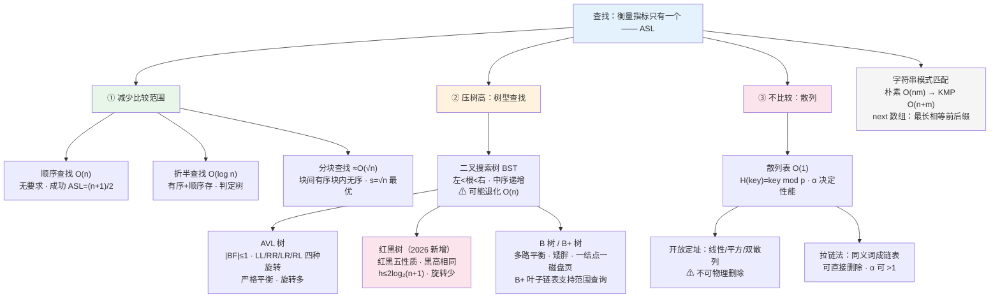

# 第六章 查找（2026 考纲）

> 📍 **本章定位**：🏗️ **梁柱级**——**选择高频 + $ASL$ 计算题 + 树型查找大题**。
>
> - **选择题**：$ASL$ 计算（顺序/折半/分块/散列）、BST 删除与构造、AVL 旋转类型判断、红黑树性质、$B$/$B^+$ 树、散列表冲突处理（约 6-8 分）
> - **大题**：⭐ 折半查找的**判定树与比较次数**、$BST$/$AVL$ 的构造与旋转、散列表 $ASL$、$KMP$ 的 $next$ 数组手算（约 6-10 分）
> - **2026 变动**：新增「**红黑树**」；「二叉排序树」正式更名为「**二叉搜索树**」
> - **全章主线**：**$ASL$（平均查找长度）**——这一章所有结构的好坏，最终都用这一个指标衡量
>
> **学这章要回答的问题**：前面五章都在解决"数据怎么存"，本章解决"**怎么找得快**"。
> → 最朴素的办法是**挨个比**（顺序查找 $O(n)$）。要更快，只有三条路：
> ① **减少比较范围**（折半 $O(\log n)$、分块折中）；
> ② **把数据组织成树**，让查找沿着一条路径下行（$BST$ → $AVL$ → 红黑树 → $B$/$B^+$ 树，一路都在**压树高**）；
> ③ **彻底不比较**，用**函数直接算出地址**（散列表 $O(1)$）。
> → 而衡量它们的统一标尺，就是 $ASL = \sum p_i c_i$。
>
> ⚠️ **代码作答规范**：
>
> - ✅ **C 版 = 造轮子版**：手写 `struct` + 指针/数组，**考试要写的代码**。
> - 🧠 **C++ / Python / Java 三版 = 调库版**：仅为理解思想，考场上写 `map` / `dict` / `HashMap` 不得分。
> - ❌ 考场禁用：STL 容器、`java.util.*`、Python 高级容器代替手写结构。
> - 📌 **本章要默写的代码**：①折半查找 ②$BST$ 插入与**删除** ③$AVL$ 四种旋转 ④$KMP$ 的 `get_next` 与匹配过程。

---

## 一、查找的基本概念

### （一）基本术语

| 术语 | 含义 |
| --- | --- |
| **查找表** | 同一类型数据元素（记录）构成的集合 |
| **静态查找表** | 只做**查找**、不做插入删除（顺序、折半、分块、散列） |
| **动态查找表** | 查找的同时可能**插入/删除**（$BST$、$AVL$、红黑树、$B$ 树） |
| **关键字（Key）** | 标识数据元素的数据项；能唯一标识的叫**主关键字**，否则叫**次关键字** |
| **查找成功 / 失败** | 表中存在 / 不存在待查关键字的记录 |
| **平均查找长度 $ASL$** | 查找过程中**关键字比较次数的期望值** |

### （二）$ASL$ —— 全章唯一标尺（⭐必背公式）

$$
ASL = \sum_{i=1}^{n} p_i \times c_i
$$

- $p_i$：查找第 $i$ 个记录的概率（**等概率时 $p_i = \frac{1}{n}$**）
- $c_i$：找到第 $i$ 个记录所需的**关键字比较次数**

> ⚠️ **做题默认"等概率"**，即 $ASL = \frac{1}{n}\sum c_i$（成功）；失败时 $ASL = \frac{1}{n+1}\sum c_i$ 或按失败位置数取分母，**具体看题目给的口径**。
>
> 💡 **$ASL$ 分两种**：**查找成功的 $ASL$** 与 **查找失败的 $ASL$**，两者都要会算，考纲明确都考。

---

## 二、顺序查找法（Sequential Search）

**思想**：从表的一端开始，逐个比较关键字，直到找到或扫完。

### （一）一般线性表（无序）

```c
typedef struct {
    ElemType *elem;    // 0 号单元作"哨兵"
    int length;
} SSTable;

// 带哨兵的顺序查找：从后往前，0 号位放待查值作为哨兵
int Search_Seq(SSTable ST, ElemType key) {
    ST.elem[0] = key;                      // ⭐ 哨兵：省去每次判越界
    int i = ST.length;
    while (ST.elem[i] != key) i--;         // 一定能停下（哨兵保证）
    return i;                              // 返回 0 表示查找失败
}
```

| 指标 | 值 |
| --- | --- |
| **成功 $ASL$** | $\dfrac{n+1}{2}$（等概率） |
| **失败 $ASL$** | $n + 1$（每次都比完 $n$ 个元素 + 1 次哨兵） |
| 时间复杂度 | $O(n)$ |
| 适用 | **顺序存储和链式存储都可以**；对**有序性无要求** |

> ⚠️ 哨兵的作用：把循环里的"$\text{i} \geq 1$ 且 $\text{elem[i]} \neq key$"简化为一次比较，是**以空间换常数时间**的经典技巧。

### （二）有序表的顺序查找

可以**提前终止**：若当前元素已大于 $key$，后面都更大，不必再比。

| 指标 | 值 |
| --- | --- |
| **成功 $ASL$** | $\dfrac{n+1}{2}$（与无序相同） |
| **失败 $ASL$** | $\dfrac{n}{2} + \dfrac{n}{n+1}$（比无序的 $n+1$ **小一半**） |

> 推导（失败）：失败位置有 $n+1$ 个（$n$ 个元素之间的 $n-1$ 个间隙 + 两端），比较次数依次为 $1,2,\dots,n,n$，故 $ASL_{失败} = \dfrac{1+2+\cdots+n+n}{n+1} = \dfrac{n}{2} + \dfrac{n}{n+1}$。

### （三）判定（⭐选择题）

| 场景 | 选用 |
| --- | --- |
| $n$ 很小 / 无序 / 链式存储 | **顺序查找** |
| 有序 + 顺序存储 +$n$ 较大 | **折半查找** |
| 表需频繁插入删除 | 顺序查找（链式）或树型结构 |

---

## 三、分块查找法（Blocking Search）

**思想**：把表分成若干**块**，要求 **块间有序（第 $i$ 块的最大关键字 < 第 $i+1$ 块的最小关键字）、块内无序**；另建一张**索引表**记录每块的最大关键字与起始地址。

```
索引表：  [22 → 块1首址]  [48 → 块2首址]  [86 → 块3首址]
原表：     块1(22,12,9,20)   块2(33,42,48,30)   块3(60,86,72,55)
            ↑ 块内无序            块间递增 ↑
```

**查找两步走**：① 在索引表中查块（可顺序可折半）→ ② 在块内顺序查找。

### $ASL$ 计算（⭐必考）

设表长 $n$、均匀分成 $b$ 块、每块 $s$ 个记录（$b = \lceil n/s \rceil$）：

$$
ASL = L_b + L_s
$$

| 索引表查法 | 公式 |
| --- | --- |
| **顺序查索引 + 顺序查块内** | $ASL = \dfrac{b+1}{2} + \dfrac{s+1}{2}$ |
| **折半查索引 + 顺序查块内** | $ASL = \lceil \log_2 (b+1) \rceil + \dfrac{s+1}{2}$ |

> ⭐ **最优块长**：当 $s = \sqrt{n}$ 时，$ASL$ 最小，约 $\sqrt{n} + 1$。

| 指标 | 值 |
| --- | --- |
| 优点 | 插入删除只需在**块内**移动，比全表有序好维护 |
| 缺点 | 需额外索引表空间 |
| 适用 | **既要较快查找、又要动态变化**的场景 |

---

## 四、折半查找法（Binary Search）

**前提（两个都要满足）**：① **有序**；② **顺序存储**。

### （一）算法

```c
// 有序顺序表的折半查找，返回下标（0 起），-1 表示失败
int Binary_Search(SSTable L, ElemType key) {
    int low = 0, high = L.length - 1, mid;
    while (low <= high) {
        mid = (low + high) / 2;                // ⭐ 王道默认向下取整
        if (L.elem[mid] == key) return mid;
        else if (L.elem[mid] > key) high = mid - 1;
        else low = mid + 1;
    }
    return -1;
}
```

> ⚠️ **`mid` 取整方向会影响结果**：$mid = \lfloor (low+high)/2 \rfloor$ 时，若个数为偶数取**靠左**的那个；有的教材取 $\lceil \cdot \rceil$。**做题先看题干约定**，没有就默认向下取整。

### （二）判定树（⭐⭐分析工具）

把每次 $mid$ 的比较画成一棵二叉树，叫**判定树（比较树）**：

- 每个**内部结点**对应一次成功比较（一个记录）；
- 每个**外部结点（方形）**对应一次失败位置；
- **查找成功的比较次数** = 该结点在判定树上的**层数**；
- **查找失败的比较次数** = 外部结点父结点的层数。

**判定树的性质**：

1. $n$ 个记录的判定树**高度** $h = \lceil \log_2 (n+1) \rceil$（即最大比较次数，与完全二叉树同高）；
2. 判定树是**最接近平衡的二叉树**——除最底层外全满；
3. 失败结点（外部结点）共 $n+1$ 个。

### （三）$ASL$（⭐必背）

$$
ASL_{成功} = \frac{1}{n}\sum_{i=1}^{h} i \times (\text{第 } i \text{ 层结点数}) \approx \log_2 (n+1) - 1
$$

- **时间复杂度** $O(\log_2 n)$；
- 当 $n$ 较大时 $ASL \approx \log_2(n+1) - 1$（这个近似式选择题直接考）。

> 📌 **例**：$n = 11$ 时判定树高 $4$，各层结点数 $1,2,4,4$，则
> $ASL = \frac{1\times1 + 2\times2 + 3\times4 + 4\times4}{11} = \frac{33}{11} = 3$，而 $\log_2 12 - 1 \approx 2.58$（近似式偏小，选择填空用近似，大题按判定树精确算）。

### （四）顺序查找 vs 折半查找

| | 顺序查找 | 折半查找 |
| --- | --- | --- |
| 有序要求 | 无 | **必须有序** |
| 存储要求 | 顺序 / 链式均可 | **必须顺序存储** |
| $ASL$ | $\frac{n+1}{2}$ | $\approx \log_2(n+1)-1$ |
| 复杂度 | $O(n)$ | $O(\log n)$ |
| 链式可用 | ✅ | ❌（链表不能随机访问） |

> ⚠️ **"对链表可以用折半查找"是错的**——链表无法 $O(1)$ 定位 $mid$。
>
> ⭐ **链表中点定位的定量结论**（`之美/15`）：即使"用指针跳着找中点"，指针移动次数也是 $\frac{n}{2} + \frac{n}{4} + \frac{n}{8} + \cdots + 1 = n - 1$，即 **$O(n)$**——与顺序查找同阶，常数还更大。所以"链表上套二分"完全不划算。

> ⭐ **折半查找的"两头"边界**（选型时用得上，`之美/15`）：
> ① **$n$ 太小不必用**——但**例外**：当单次比较极其耗时（如比较两个长度 300+ 的字符串），无论 $n$ 多大都该用二分；
> ② **$n$ 太大也不适合**——二分依赖数组，数组要**连续内存**，1GB 数据就要 1GB 连续空间，剩 2GB 碎片也申请不出来。

> 🔎 **扩展（非考纲 · 面试向）：`mid` 的写法与两个致命细节**
> - `mid = (low+high)/2` 有**溢出风险** → 改 `low + (high-low)/2` → 极致写法 `low + ((high-low)>>1)`。⚠️ **不能写成 `low + (high-low) >> 1`**（`>>` 优先级低于 `+`，会先加后移）。考场按王道写 `(low+high)/2` 即可，面试按后者写。
> - **`low = mid + 1` / `high = mid - 1` 的 $\pm1$ 不能省**：当 `low == high == 3` 且 $a[3] \neq key$ 时，写 `low = mid` 会**死循环**。
> - 🔎 **四种常见变形**（LeetCode 高频，考研不考）：第一个等于 / 最后一个等于 / 第一个 $\geq$ / 最后一个 $\leq$。核心写法是"**命中不立刻返回，先做边界自证**"（检查 `mid==0 || a[mid-1] != value` 之类）。
> - 🔎 **循环有序数组**（`4,5,6,1,2,3`）：以 `mid` 为界必有一半有序，判断 target 落在哪半 → $O(\log n)$（先找分界点再二分的做法是 $O(n)$，不够）。

---

## 五、树型查找

### （一）二叉搜索树（$BST$，原"二叉排序树"）

#### 1. 定义

**二叉搜索树**：或者为空树，或者满足——**左子树上所有结点的值 < 根结点的值 < 右子树上所有结点的值**，且**左右子树也分别是二叉搜索树**。

> 💡 **推论**：对 $BST$ 做**中序遍历**，得到一个**递增的有序序列**——这是判断一棵树是否为 $BST$ 的最快方法（LeetCode 98）。

#### 2. 查找

```c
// 递归查找（也可用非递归，非递归空间 O(1)）
BiTNode *BST_Search(BiTree T, ElemType key) {
    if (T == NULL) return NULL;
    if (key == T->data) return T;
    else if (key < T->data) return BST_Search(T->lchild, key);
    else return BST_Search(T->rchild, key);
}
```

- 查找**沿一条路径下行**，比较次数 = 该结点**层数**；
- **$ASL$ 与树高 $h$ 直接相关**，最好（平衡）时 $O(\log n)$，**最坏退化成单支链表时 $O(n)$**。

#### 3. 插入

新结点**一定作为叶子插入**：从根比下去，小往左、大往右，直到空位。

```c
int BST_Insert(BiTree *T, ElemType key) {
    if (*T == NULL) {                                  // 找到空位 → 插入
        *T = (BiTNode *)malloc(sizeof(BiTNode));
        (*T)->data = key;
        (*T)->lchild = (*T)->rchild = NULL;
        return 1;
    }
    if (key == (*T)->data) return 0;                   // 已存在，不插入
    else if (key < (*T)->data) return BST_Insert(&(*T)->lchild, key);
    else return BST_Insert(&(*T)->rchild, key);
}
```

> ⚠️ **插入顺序不同 → 树形不同 → $ASL$ 不同**。同一个关键字集合，**输入有序时会退化成单支树**（这就是需要 $AVL$ 的原因）。

#### 4. 删除（⭐⭐大题高频，三种情况）

| 情况 | 处理 |
| --- | --- |
| ①**叶子结点** | 直接删除，双亲对应指针置`NULL` |
| ②**只有一棵子树** | 用该子树替代被删结点（"子承父业"） |
| ③**左右子树都有** | 用**中序直接后继**（右子树中最小者 = 右子树最左下结点）或**中序直接前驱**（左子树最右下）**顶替**其值，再**递归删除那个后继结点**（它必为情况①或②） |

```c
int BST_Delete(BiTree *T, ElemType key) {
    if (*T == NULL) return 0;
    if (key < (*T)->data)      return BST_Delete(&(*T)->lchild, key);
    else if (key > (*T)->data) return BST_Delete(&(*T)->rchild, key);
    else {                                             // 找到了，分三种情况
        if ((*T)->lchild && (*T)->rchild) {            // ③ 双子树：中序后继顶替
            BiTNode *q = (*T)->rchild;
            while (q->lchild) q = q->lchild;           // 右子树最左下 = 中序后继
            (*T)->data = q->data;                      // 值顶替
            return BST_Delete(&(*T)->rchild, q->data); // 转为删除那个后继
        } else {                                       // ①② 单子树或叶子
            BiTNode *old = *T;
            *T = ((*T)->lchild) ? (*T)->lchild : (*T)->rchild;
            free(old);
            return 1;
        }
    }
}
```

> 💡 **性质**：删除后再中序遍历**仍是递增序列**——这是"顶替法"能保证有序性的原因。

> ⭐ **同一批关键字，树形不同 → $ASL$ 差一倍**（现成算例，`快速上手C++/14`）
> 7 个结点（关键字相同、插入顺序不同）：
>
> | 树形 | 成功 $ASL$ | 失败 $ASL$ |
> | --- | --- | --- |
> | 满二叉树 | $\dfrac{1\times1 + 2\times2 + 3\times4}{7} = 2.42$ | $\dfrac{3\times8}{8} = 3$ |
> | 单支斜树 | $\dfrac{1+2+\cdots+7}{7} = 4$ | $\dfrac{1+2+3+4+5+6+7\times2}{8} = 4.375$ |
>
> ⚠️ **失败 $ASL$ 的分母是 $n+1$**（$n$ 个结点的二叉链表有 $n+1$ 个空链域，每个空链域对应一个失败位置），这与第四章"空链域 $n+1$ 个"是同一件事。
> 📌 这就是"**$BST$ 的 $ASL$ 与树形强相关、必须防退化**"的定量证据。

> 🔎 **扩展（非考纲 · 面试向）**：
> ① **重复关键字**怎么处理：结点内挂链表/动态数组，或统一塞右子树（此时**查找命中不能停、要一路走到叶子；删除要删光所有同值结点**）；
> ② **惰性删除**：只打删除标记不物理删（与散列表的逻辑删除同一思路）；
> ③ **没有 `parent` 指针时**，找中序前驱/后继要从根走 $O(h)$（LeetCode 285/510）。

### （二）平衡二叉树（$AVL$ 树）

#### 1. 定义

**平衡二叉树**：或者为空树，或者满足——**任一结点的左、右子树高度差（平衡因子 $BF$）的绝对值 $\leq 1$**，且左右子树都是平衡二叉树。

$$
BF(node) = h_L - h_R \in \{-1, 0, 1\}
$$

> 💡 **$AVL$ 是"加了平衡约束的 $BST$"**——先在 $BST$ 里插出树，再用旋转把树高压回去，保证 $h = O(\log n)$。

#### 2. 平衡旋转（⭐⭐必考四种）

插入/删除后**自下而上**找到**第一个失衡结点（最小不平衡子树的根）**，按其"失衡方向"分四类：

| 类型 | 形态 | 操作 |
| --- | --- | --- |
| **LL** | 失衡结点的**左孩子的左子树**插入导致 | **右单旋**（顺时针） |
| **RR** | **右孩子的右子树**插入导致 | **左单旋**（逆时针） |
| **LR** | **左孩子的右子树**插入导致 | 先**左旋**左孩子，再**右旋**根 |
| **RL** | **右孩子的左子树**插入导致 | 先**右旋**右孩子，再**左旋**根 |

```c
typedef struct AVLNode {
    ElemType data;
    int bf;                            // 平衡因子
    struct AVLNode *lchild, *rchild;
} AVLNode, *AVLTree;

// LL 型：右单旋（顺时针）—— 左孩子上位，根降为它的右孩子
void LL_Rotate(AVLTree *p) {
    AVLTree lc = (*p)->lchild;
    (*p)->lchild = lc->rchild;         // ① lc 的右子树过继给根当左子树
    lc->rchild = *p;                   // ② 根降为 lc 的右孩子
    *p = lc;                           // ③ lc 成为新的根
}

// RR 型：左单旋（逆时针）—— 右孩子上位，根降为它的左孩子
void RR_Rotate(AVLTree *p) {
    AVLTree rc = (*p)->rchild;
    (*p)->rchild = rc->lchild;         // ① rc 的左子树过继给根当右子树
    rc->lchild = *p;                   // ② 根降为 rc 的左孩子
    *p = rc;                           // ③ rc 成为新的根
}

// LR 型：先对左孩子左旋，再对根右旋
void LR_Rotate(AVLTree *p) {
    RR_Rotate(&(*p)->lchild);
    LL_Rotate(p);
}

// RL 型：先对右孩子右旋，再对根左旋
void RL_Rotate(AVLTree *p) {
    LL_Rotate(&(*p)->rchild);
    RR_Rotate(p);
}
```

> 💡 **记忆口诀**：**"类型名的第一个字母 = 失衡发生在哪一侧；旋转方向 = 把高的那侧转上去"**。LR 就是"先处理左边（左旋），再处理根（右旋）"。

#### 3. 最少结点数（⭐选择题）

高度为 $h$ 的 $AVL$ 树**至少**需要的结点数 $N(h)$ 满足：

$$
N(1) = 1,\quad N(2) = 2,\quad N(h) = 1 + N(h-1) + N(h-2)
$$

即 $N = 1, 2, 4, 7, 12, 20, 33, \dots$（$h = 1,2,3,\dots$）。

> 📌 由此可反推：**$n$ 个结点的 $AVL$ 树最大高度约 $1.44 \log_2 n$**，查找 $O(\log n)$。

#### 4. 插入与删除的调整

> ⭐ **为什么插入只需一次旋转**（高度复原论证，`快速上手C++/15`）
> 关键结论：**失衡前的子树有多高，旋转后就恢复多高** → 上层结点的 $BF$ 保持原值、不必再改 → **插入调整一次即可终止**。
> 例：`95, 60, 40, 20` 插入后结点 60 的 $BF$ 由 1 变 2，右旋后新根 40 的 $BF = 0$，而 **95 的 $BF$ 仍是 1，不用动**。
> 📌 推论：**插入调整后，新子树的根 $BF$ 必为 0**（仅插入成立，删除不成立）。

> ⭐ **用 $BF$ 符号直接判旋转类型**（比"看插入位置"更通用，`快速上手C++/16`）
>
> | 失衡结点 $A$ 的 $BF$ | 看哪个孩子 | 孩子的 $BF$ | 处理 |
> | --- | --- | --- | --- |
> | $+2$（左高） | 左孩子 | $+1$ / $-1$ / $0$ | 右单旋（LL）/ **左右双旋（LR）** / 两者皆可 |
> | $-2$（右高） | 右孩子 | $-1$ / $+1$ / $0$ | 左单旋（RR）/ **右左双旋（RL）** / 两者皆可 |
>
> ⚠️ 孩子 $BF = 0$ 的情形**插入时不会出现**（插入后失衡点的孩子 $BF$ 必为 $\pm1$），**删除时才会出现**，且旋转后**必须手工置 $BF$**（如左旋分支设 `parent->bf = 1; parent->lchild->bf = -1;`）——这是删除代码最易漏的一行。

- **插入**：插入后**自下而上**更新 $BF$，找到第一个 $|BF| > 1$ 的结点，做一次旋转即可恢复（**旋转后子树高度不变**，故上层不用再调）。
- **删除**：删除后同样更新 $BF$，但**可能要多次旋转**（删除可能使子树高度减 1，失衡会向上传递）。

> ⭐ **删除回溯的终止条件**（"为什么要多次旋转"的根因，`快速上手C++/16`）
> 自下而上更新 $BF$（$BF =$ 左高 $-$ 右高；**删左则 $BF--$，删右则 $BF++$**）：
>
> | 更新后的 $BF$ | 动作 | 原因 |
> | --- | --- | --- |
> | $\lvert BF \rvert = 1$ | **立即停止** | 原 $BF=0$，子树高度没变，不影响上层 |
> | $BF = 0$ | **继续向上** | 原 $\lvert BF\rvert=1$，子树矮了 1 |
> | $\lvert BF \rvert = 2$ | 旋转，**旋转后仍继续向上** | 旋转不改变整棵子树的高度变化事实 |
>
> 📌 **多次旋转的范例**：$\{60,31,65,15,42,62,75,12,25,37,50,63,69,85,2,32,38,48,56,82,34\}$ 建树后删除 65 → 先对以 63 为根的子树**左旋**（其高度由 4 变 3）→ 导致根 60 的 $BF$ 由 1 变 2 → 再对整树做 **LR 双旋**，最终根变成 **42**。
>
> ✅ **口径确认**：本章的 $BF$ 定义（左子树高 $-$ 右子树高）与 LL=右单旋 的命名，**与王道教材完全一致**，可放心按本章记。
> 🔎 另有"用**结点高度**取代 $BF$、LR/RL 直接调两次单旋"的写法，面试白板更常见。想手验旋转可用 USFCA 可视化：<https://www.cs.usfca.edu/~galles/visualization/AVLtree.html>

| 指标 | 值 |
| --- | --- |
| 查找 / 插入 / 删除 | $O(\log n)$ |
| 空间 | $O(n)$ |
| 代价 | 每次插入删除**可能旋转**，维护成本高 |

### （三）红黑树（2026 新增，⭐性质题）

#### 1. 五条性质（⭐必背）

1. 每个结点**要么是红色，要么是黑色**；
2. **根结点是黑色**；
3. 所有**叶子结点（NIL 空结点）是黑色**；
4. **红色结点不能有红色孩子**（不存在连续的两个红结点）；
5. 从任一结点到其所有后代 $NIL$ 结点的路径上，**黑色结点数目相同**（**黑高 $bh$ 相同**）。

#### 2. 由性质推出的结论

| 结论 | 内容 |
| --- | --- |
| **高度上界** | $h \leq 2\log_2 (n+1)$ |
| **最长路径 $\leq 2 \times$ 最短路径** | 由性质 4+5 推出 |
| **根到叶的最长路径** | 不超过最短路径的 2 倍（"**近似平衡**"） |
| **查找复杂度** | $O(\log n)$ |

> 💡 **$n$ 个内部结点的红黑树高度 $h \leq 2\log_2(n+1)$** —— 这个式子选择题直接考。

> ⭐ **这个上界是怎么推出来的**（`之美/25`，对应费曼自测第 6 条）
> ① 把红黑树中所有**红结点删掉**，子结点直接认祖父 → 二叉树变成**四叉树**；
> ② 由性质 5（各路径黑结点数相同），这棵"黑树"的高度 **$< \log_2 n$**；
> ③ 把红结点加回去，因**红色不能相邻**，每加一个红至少配一个黑 → **最长路径 $\leq 2\log_2 n$**。
> 💡 一句话理解：红黑树 = "**删掉红结点后高度对数的树，再往里塞一层红结点**"，所以只比 $AVL$ 高一点点。

> ⭐ **判一棵树是不是红黑树——先把 NIL 补出来**（`快速上手C++/17`）
> 三步：**① 根是黑 → ② 无连续红 → ③ 补上黑色 NIL 空结点，数各路径黑高是否相同**。
> 很多"看着像红黑树"的图，把 NIL 画出来立刻暴露黑高不一致——尤其是"某黑结点只有单分支"这种最容易漏看。

> ⚠️ **两处口径报警**（读其他资料时别被带偏）：
> ① 有的资料只列 **4 条性质**（把"非红即黑"与"根黑"合并了）——**考研按本章五条记**；
> ② 有的资料**黑高把起点自身也算进去**，比主流口径多 1；主流（王道 / CLRS）的 $bh(x)$ **不含 $x$ 自身**（NIL 计黑）。判合法无影响，**计算题会差 1**。

#### 3. 插入调整原则（⭐理解即可，代码不要求）

**新插入结点初始为红色**——为什么必须是红？（`快速上手C++/18`）

> ⭐ **插红不增加黑高**，只可能违反性质 4；**若插黑**，则该分支黑高 $+1$，**必然违反性质 5**，且每次插入都要调整。所以新结点一律先涂红。

然后分三种情况：

| 情况 | 条件 | 处理 |
| --- | --- | --- |
| ①**叔叔是红色** | 父红 + 叔红 | 父、叔**变黑**，祖父**变红**，再把祖父当作新结点继续向上调整 |
| ②**叔叔是黑色，且同向（LL/RR）** | 父红 + 叔黑 + 自己是父的左（父为祖父左）/ 右（父为祖父右） | 对祖父做**单旋**（右旋/左旋），父变黑、祖父变红 |
| ③**叔叔是黑色，且反向（LR/RL）** | 父红 + 叔黑 + 方向与父相反 | 先对父做**一次旋转**变成情况②，再按②处理 |

- 最后**强制根为黑色**。

> ⭐ **情况①（叔红）会"循环上溯"，但旋转最多 2 次即停**（`快速上手C++/18`）
> 父、叔变黑 + 祖父变红后，**若祖父的父亲也是红色，就把整棵已平衡的子树当作"一个新红结点"继续向上调整**，直到遇到黑色前辈或根。
> 📌 终止条件：**一旦发生旋转，上溯立即结束** → 插入调整 = $O(\log n)$ 次变色 + **最多 2 次旋转**。

#### 3'. 删除调整（了解级，⭐三句话概括）

> ① **删红结点 → 无需调整；删黑结点 → 黑高变化，必须调整**（是否需要调整只看"最终被删结点的颜色"）。
> ② **删单分支的黑结点时，它的孩子必为红色**（否则违反性质 4）——处理办法：红孩子顶替上位并**染黑**，补回损失的黑高。
> ③ **删除为什么比插入难**：插入的"红红冲突"是**局部的**，而删除的"**黑高亏空**"会**向根方向传递**——这就是"删除最多 3 次旋转"这个上界的来源。

> 🔎 **扩展（非考纲 · 面试向）**
> - **NIL 哨兵的真正作用**：不是为了定义好看，而是**让所有情况都能归入固定的少数 case**（如"父红且父无兄弟"时，补上黑色 NIL 后立刻满足 CASE 2，否则规则要写成"叔叔是黑色**或不存在**"，规则变脏）。实现上所有 NIL **共用一个哨兵结点**，不浪费空间——与第二章顺序查找的哨兵是同一手法：**用哨兵消除边界特判**。
> - **删除的两步框架**：初步调整（恢复黑高，被顶替结点记"红-黑/黑-黑"双色）+ 二次调整（恢复不连红），共 7 种 case。"**红-黑/黑-黑**"是个**记账技巧**（先把黑高补齐，最后再销账），比死记 case 有用。
> - **面试定位**：作者原话——"手写红黑树代码对面试几乎没用，靠谱的面试官也不会让你手撕"，学到"能看懂过程、没有知识盲点"即可。工程上**常不做物理删除，只打删除标记（惰性删除）**。
> - ⚠️ 注意区分：有的资料把"删黑色叶子"分成 **7 种情况**（记号 D/S/P），王道/CLRS 用"**双黑 + 兄弟四种情况**"——两套记法**不是一套**，**考研按王道的记**。
> - 🔎 **应用补充**：除 C++ `map/set`、Java `TreeMap`、Linux CFS 外，还有 **epoll 用红黑树保存客户端 TCP 连接**、Linux 的**文件描述符、内存管理**、定时器/时间轮。

#### 4. $AVL$ vs 红黑树（⭐选择题高频）

| | **$AVL$ 树** | **红黑树** |
| --- | --- | --- |
| 平衡标准 | 严格：$\lvert BF \rvert \leq 1$ | 宽松：最长路径$\leq 2\times$ 最短 |
| 树高 | 更矮，$O(\log n)$ | 稍高，$\leq 2\log_2(n+1)$ |
| **查找** | **更快**（树更矮） | 略慢 |
| **插入/删除** | 旋转**多**（维护严格平衡） | 旋转**少**（插入最多 2 次旋转、删除最多 3 次） |
| 适用 | **查多改少** | **频繁插入删除** |
| 典型应用 | 数据库（读密集） | **C++ `map`/`set`、Java `TreeMap`、Linux CFS 调度** |

```c
// 红黑树结点（含颜色标记，考纲不要求实现，仅理解结构）
typedef struct RBNode {
    ElemType data;
    struct RBNode *lchild, *rchild, *parent;   // 需要 parent 指针便于回溯调整
    int color;                                  // 0 = 黑，1 = 红
} RBNode, *RBTree;
```

---

## 六、$B$ 树及其基本操作、$B^+$ 树的基本概念

### （一）为什么要 $B$ 树

$BST$/$AVL$/红黑树都是**二叉**的，结点只能存一个关键字。当数据量大到**必须放磁盘**时，每访问一层就要一次磁盘 $I/O$，树高 $O(\log_2 n)$ 意味着几十次 $I/O$——太慢。

**$B$ 树的思路**：让**一个结点存多个关键字、有多个分支**（多路平衡查找树），把树变得**矮胖**，使树高降到 $O(\log_m n)$（$m$ 为阶数，可上百），从而把磁盘 $I/O$ 次数压到 3-4 次。

> ⭐ **两组数字，说明"为什么非用 $B$ 树不可"**（`之美/48`）
> ① **内存不够**：一亿条数据建二叉索引 ≈ 1 亿个结点 $\times$ 16B ≈ **1GB 内存**，十张表就撑不住；
> ② **速度差太远**：内存访问是**纳秒级**，磁盘是**毫秒级**，相差上万到几十万倍 → **树高 = 磁盘 $I/O$ 次数**是唯一要紧的指标。
>
> ⭐ **$m$ 取多大是有依据的**（`之美/48`）：让**一个结点 = 一个磁盘页**，则
> $(m-1)\times 4[\text{key}] + m \times 8[\text{child}] = 4096 \Rightarrow m \approx 341$ —— 所以"阶数可上百"不是随口说的，是**按页大小算出来的**。
>
> ⭐ **术语澄清**：**"$B$-树"就是 $B$ 树**（$B$-Tree 里的 "-" 是连字符，**不是减号**），不存在 $B^- < B < B^+$ 的大小关系。

### （二）$m$ 阶 $B$ 树的定义（⭐背诵）

一棵 $m$ 阶 $B$ 树，或者为空树，或者满足：

1. 每个结点**至多 $m$ 棵子树**、**至多 $m-1$ 个关键字**；
2. 若**根结点不是叶子**，则**至少 2 棵子树**（至少 1 个关键字）；
3. 除根以外的**非叶结点**，**至少 $\lceil m/2 \rceil$ 棵子树**、**至少 $\lceil m/2 \rceil - 1$ 个关键字**；
4. 所有**叶结点都在同一层**（不带任何信息，即"失败结点"，通常用 $NULL$ 表示）；
5. 结点内关键字**递增有序**，且第 $i$ 个关键字把子树 $i$ 与子树 $i+1$ 分开（类似 $BST$ 的划分）。

$$
\text{结点关键字数} \in \bigl[\lceil m/2 \rceil - 1,\ m-1\bigr],\qquad
\text{子树数} = \text{关键字数} + 1
$$

> ⚠️ **"$m$ 阶"指"最多 $m$ 个分支"**，不是"最多 $m$ 个关键字"。

### （三）$B$ 树的基本操作

- **查找**：在结点内顺序（或折半）查找，命中则结束；否则沿对应子树下行，直到叶子（$NULL$）则失败。
- **插入**：先查到应插入的**叶子层**位置 → 若插入后关键字数 $> m-1$ 则**分裂**：把中间关键字 $\lceil m/2 \rceil$ **上移**到双亲，结点一分为二 → 双亲也可能溢出，**向上递归分裂**，直到根分裂则**树高 +1**。
- **删除**：删非叶结点时用其**前驱/后继**顶替（同 $BST$）→ 若删除后关键字数 $< \lceil m/2 \rceil - 1$，则先向**兄弟借**（旋转），借不到就与兄弟**合并**，合并可能**向上传递**，直到根合并则**树高 -1**。

> ⭐ **"终端结点" ≠ "叶结点"**（易混，`快速上手C++/47`）
> 王道口径下，$B$ 树的**叶结点是不带信息的失败结点（NULL）**；而"插入/删除最终落到的那一层"是**终端结点**（最底层有关键字的结点）。很多资料把终端结点也叫叶结点，读的时候要按上下文分辨——否则"删除最终落到叶子"这句话按王道读会变成"落到 NULL"。

> ⭐ **分裂时中间关键字的位置是唯一的**：一律取第 **$\lceil m/2 \rceil$** 个上移（`快速上手C++/47`）。虽然取第 $\lceil m/2 \rceil$ 或 $\lceil m/2 \rceil + 1$ 个都满足约束，但**树形不同**，考试按王道取 $\lceil m/2 \rceil$。

> ⭐ **删除的"借"怎么借——父子换位法**（`快速上手C++/47`）
> ① **先查紧邻的左兄弟**，不行再查右兄弟；
> ② 从左兄弟借：取左兄弟的**最大**关键字上移到双亲，双亲的对应关键字**下移**到被删结点；
> ③ 从右兄弟借：取右兄弟的**最小**关键字上移，同理；
> ④ 借不到就**合并**：双亲调一个关键字下来参与合并，**双亲关键字数 $-1$**；若根被掏空则删根、**树高 $-1$**。

> 📌 **现成的纸笔推演题**（`快速上手C++/47`，建议手推一遍）：
> 4 阶 $B$ 树依次插入 `11,12,6,5,13,7,3,4,2,1,9,8,10` → 最终根为 **6**；继续插入 `14,15,16,17` → 叶结点分裂出 15，双亲再分裂出 11，**根分裂、树高由 3 变 4**。

### （四）$B$ 树的高度（⭐计算题）

对含 $n$ 个关键字的 $m$ 阶 $B$ 树：

$$
\log_m (n + 1) \;\leq\; h \;\leq\; \log_{\lceil m/2 \rceil} \frac{n+1}{2} + 1
$$

> 下界对应"每个结点关键字数都取满 $m-1$"（最矮胖）；上界对应"每个结点取最少"（最高瘦）。

### （五）$B^+$ 树（⭐与 $B$ 树的差异是必考点）

**$m$ 阶 $B^+$ 树**与 $B$ 树的区别：

| 差异点 | **$B$ 树** | **$B^+$ 树** |
| --- | --- | --- |
| **关键字与子树数** | $n$ 个关键字 → $n+1$ 棵子树 | **$n$ 个关键字 → $n$ 棵子树**（一一对应） |
| **关键字是否重复** | 各结点关键字**不重复** | **非叶结点是叶结点关键字的副本**（根到叶能查到全部） |
| **数据存储位置** | **每个结点都存记录地址** | **只有叶子存记录地址**，非叶只作**索引** |
| **叶子之间** | 彼此独立 | **叶子用链表串起来**，支持**顺序查找 / 范围查询** |
| **查找终点** | 命中即可返回（可能在中途） | **一定要走到叶子**（查到非叶不算完） |
| **查找次数** | 不稳定（$1 \sim h$ 次） | **稳定**（都是 $h$ 次） |

> 💡 **为什么数据库索引用 $B^+$ 树**：① 非叶不存数据 → 一个磁盘页能装更多关键字 → 树更矮；② 叶子链表 → **范围查询、全表扫描**只需顺着链表走，不用回溯树。

> ⚠️⚠️ **头号报警：不同资料对 $B^+$ 树"阶"的定义可能相反**
> `快速上手C++/48` 采用"**非叶结点子树数 = 关键字数 + 1**"（作者自己也说另一种"也对"），导致它书里所有数字都比王道**少一位**（它说 4 阶最多 3 个关键字，王道是 4 阶最多 **4** 个）。
> **408/王道口径（必须按这个记）**：$m$ 阶 $B^+$ 树，**$n$ 个关键字 $\leftrightarrow$ $n$ 棵子树**，关键字数范围是
> $$[\lceil m/2 \rceil,\ m] \quad \text{（不是 } B \text{ 树的 } [\lceil m/2\rceil-1,\ m-1]\text{）}$$

> ⭐ **$B^+$ 树插入删除的两个特殊点**（笔记原缺，`快速上手C++/48`）
> ① **分裂时，上移做索引的关键字在叶层保留一份副本**——这是 $B^+$ 分裂区别于 $B$ 分裂的唯一要点；
> ② **删除时**：若被删的是该叶结点的**最小值**，须**向根回溯**，把上层索引里的同值副本替换成它的**后继**（如删 70 → 根中的 70 换成 75）；若合并后该值不再是任何叶段的最小值，则上层索引项**直接删除**（如合并后 18 不再是段首，父结点索引由 `18,20,30,50` 变为 `20,30,50`）。

> ⭐ **"为什么用 $B^+$ 不用 $B$" —— 再补两条理由**（`快速上手C++/49`）
> ③ $B$ 树**每个结点（含非叶）都要额外挂一根指向数据记录的指针**，比 $B^+$ 树多占空间 → 扇出变小 → 树更高、$I/O$ 更多；
> ④ $B$ 树范围查询要反复回溯做中序遍历，没有链表。
> 💡 反过来 **$B$ 树的唯一优点**也值得记：命中非叶即可返回，因此可把**高频访问的数据挪到离根更近的位置**——"查找次数不稳定"反而是可调优的特性。

> 🔎 **扩展（非考纲 · 面试必背数字，`快速上手C++/49`）**
> InnoDB 一页 **16KB** = $B^+$ 树一个结点；非叶存"主键 8B + 指针 6B = 14B" → 一页约 **1170** 个分叉；叶页按 1KB/行 → 约 16 行/页。
> 树高 3 时可存 $1170 \times 1170 \times 16 \approx 2.19 \times 10^7$ 行 —— 这就是"**MySQL 索引一般不超过 2 级、树高 $\leq 3$**"的来处。
> 另：$B^+$ 树的叶子链表工程上通常实现为**双向**链表（便于 `ORDER BY DESC` 反向扫描）；考试按单向画即可。

> 🔎 **扩展（非考纲）：跳表 vs $B^+$ 树**（`快速上手C++/44`）
> 同样 2100 多万条数据：$B^+$ 树 **3 层 → 3 次磁盘 $I/O$**；跳表约 **24 层 → 最坏 24 次 $I/O$**，差 8 倍。
> 所以 **MySQL（磁盘）选 $B^+$ 树，Redis（内存、无磁盘 $I/O$）选跳表**——核心差异就是**内存 vs 磁盘**。

---

## 七、散列（Hash）表

### （一）基本概念

**散列表（哈希表）**：根据**关键字**直接算出存储地址的数据结构，不经过比较。

- **散列函数** $H(key)$：把关键字映射到地址；
- **冲突（碰撞）**：不同关键字映射到同一地址，即 $key_1 \neq key_2$ 但 $H(key_1) = H(key_2)$；
- **同义词**：发生冲突的不同关键字；
- **装填因子** $\alpha = \dfrac{\text{表中记录数 } n}{\text{散列表长度 } m}$ —— $\alpha$ 越大越容易冲突，**是决定散列表性能的关键参数**。

### （二）散列函数的构造方法

| 方法 | 公式 / 做法 | 适用 |
| --- | --- | --- |
| **直接定址法** | $H(key) = a \cdot key + b$ | 关键字分布基本连续 |
| **除留余数法** ⭐ | $H(key) = key \bmod p$，$p$ 取**不大于 $m$ 的最大素数** | **最常用、最通用** |
| **数字分析法** | 取关键字中分布均匀的若干位 | 关键字位数多且已知分布 |
| **平方取中法** | 取$key^2$ 的中间几位 | 关键字各位分布不均 |
| **折叠法** | 把关键字分段后叠加 | 关键字位数很多 |

> ⚠️ **除留余数法中 $p$ 取素数的原因**：减少关键字分布规律与表长产生的**周期性冲突**。
>
> ⭐ **$p$ 取素数的具体反例**（`快速上手C++/45`，能复述的例子比抽象结论管用）：
> 关键字 `12, 24, 36, 48, 60`，若取 $p = 12$ → 哈希值**全为 0**，全挤在一个位置；改取 $p = 11$（素数）→ 冲突大幅减少。

> ⭐ **评价一个散列函数好坏，只看三条**（`之美/18`、`之美/21`）
> ① 散列值必须是**非负整数**（要当数组下标用）；
> ② $key_1 = key_2 \Rightarrow H(key_1) = H(key_2)$（同一 key 必须稳定映射到同一位置）；
> ③ 不同 key **尽量**映射到不同位置 —— ⚠️ 但**第③条实际不可达**（见下）。
>
> ⭐ **为什么"无冲突散列函数"不存在——鸽巢原理**（`之美/21`）
> 以 MD5 为例：哈希值定长 128 bit，最多只有 $2^{128} \approx 3.4\times10^{38}$ 种取值，而**输入是无限的** ⇒ **必然存在冲突**（单次冲突概率 $< 1/2^{128}$，极低但不为零）。
> 📌 所以：**冲突不可避免，只能处理**——这就是"必须有冲突处理策略"的根本原因，考试若问"能否设计出无冲突的散列函数"，答案是**不能**。
>
> ⭐ **辨析：散列函数 ≠ 加密哈希算法**（极易混，`快速上手C++/45·46`）
>
> | | **散列函数（散列表用）** | **哈希算法（MD5/SHA/CRC）** |
> | --- | --- | --- |
> | 目的 | key → 数组下标 | 任意长 → 固定长摘要 |
> | 核心要求 | ① 分布**均匀** ② **执行效率高** | ① **不可逆** ② **抗碰撞** ③ 雪崩效应 |
> | 是否需要"不可逆" | ❌ **不重要** | ✅ 必需 |
>
> 💡 一句话：**加密哈希要求"算不出原文"，散列表的散列函数只要求"撒得均匀、算得快"** —— 目的不同 ⇒ 要求不同。用 MD5 当散列表的散列函数是**杀鸡用牛刀**（还慢）。

### （三）处理冲突的方法（⭐⭐必考）

#### 1. 开放定址法（Open Addressing）

冲突时，按某种探测序列去找下一个空位：$H_i = (H(key) + d_i) \bmod m$

| 方法 | 增量序列$d_i$ | 特点 |
| --- | --- | --- |
| **线性探测** | $d_i = 1, 2, 3, \dots, m-1$ | 简单，但会产生**聚集（堆积）**现象 |
| **平方探测（二次探测）** | $d_i = 1^2, -1^2, 2^2, -2^2, \dots$ | 缓解聚集；⚠️**表长 $m$ 必须是 $4k+3$ 的素数**才能探测到全表 |
| **双散列法** | $d_i = i \times H_2(key)$ | 用第二个散列函数作步长，聚集最少 |
| **伪随机探测** | $d_i = $ 伪随机序列 | 与平方探测性能相近 |

```c
// 线性探测的插入与查找（m 为表长，HT 初始化为 EMPTY）
#define EMPTY -1
int Hash(int key, int m) { return key % m; }

void HashInsert(int HT[], int m, int key) {
    int addr = Hash(key, m);
    int d = 0;
    while (d < m && HT[(addr + d) % m] != EMPTY) d++;   // 找下一个空位
    if (d < m) HT[(addr + d) % m] = key;
}

int HashSearch(int HT[], int m, int key) {
    int addr = Hash(key, m);
    for (int d = 0; d < m; d++) {
        int pos = (addr + d) % m;
        if (HT[pos] == EMPTY) return -1;      // 遇空位说明不存在（前提：不能物理删除）
        if (HT[pos] == key) return pos;
    }
    return -1;
}
```

> ⚠️ **开放定址法不能"物理删除"元素**——删掉会截断后面的探测链，导致后续元素查不到。做法是**逻辑删除**（打"墓碑"标记，查找时跳过、插入时可复用）。

#### 2. 拉链法（链地址法 / Chaining）

把所有同义词用**单链表**串起来，散列表存**链表头指针**。

```c
typedef struct HNode {
    ElemType key;
    struct HNode *next;
} HNode;

HNode *HT[M];                                  // 指针数组

void HashInsert(HNode *HT[], ElemType key) {
    int addr = Hash(key, M);
    HNode *s = (HNode *)malloc(sizeof(HNode)); // 头插
    s->key = key;
    s->next = HT[addr];
    HT[addr] = s;
}

HNode *HashSearch(HNode *HT[], ElemType key) {
    int addr = Hash(key, M);
    for (HNode *p = HT[addr]; p != NULL; p = p->next)
        if (p->key == key) return p;
    return NULL;
}
```

| 对比 | **开放定址法** | **拉链法** |
| --- | --- | --- |
| 空间 | 表内解决，**无额外指针** | 需**指针域**，但表可不满 |
| 删除 | ❌ 只能逻辑删除 | ✅**可直接物理删除** |
| 聚集 | 有（尤其线性探测） | **无** |
| $\alpha > 1$ | ❌ 不可能（表会满） | ✅ 可以（链表变长） |

> ⭐ **拉链法桶长 $k = \dfrac{n}{m} = \alpha$**（`之美/18`）：**装填因子 $\alpha$ 就是"平均每条链有多长"**，所以拉链法查找是 $O(k) = O(\alpha)$。这正是"$\alpha$ 为何是散列表第一参数"的来源。
>
> ⭐ **第三种冲突处理：公共溢出区法**（`快速上手C++/46`，笔记原缺）
> 另设一张溢出表，冲突的关键字**顺序**放入其中；查找先查基础表，未命中再**顺序**查溢出表。冲突不多时性能尚可——**不考 $ASL$ 计算，但常作选择题干扰项**，要认得。
>
> ⭐ **扩容阈值**（`快速上手C++/46`）：经验值 **$\alpha > 70\%$（有的到 100%）即扩容**，新表取 2 倍，并**按新表长重算所有元素位置**（⚠️ 不能 memcpy，因为位置依赖 $m$），单次 $O(n)$。
>
> ⚠️ **双散列的口径冲突**：有的资料把双散列说成"依次换用第二个、第三个散列函数重试"；**王道/408 的口径是 $d_i = i \times H_2(key)$**（第二个函数当**步长**）。**考试按教材口径**。

> 🔎 **扩展（非考纲 · 面试高频）：渐进式扩容**
> 大表一次性扩容太慢 → **先只申请新表、不搬数据**，此后**每插入一个新元素，顺带从老表搬一个过来**；查询时**先查新表、miss 再查老表**。
> 效果：把一次性 $O(n)$ 的搬移**均摊**到多次插入上，**单次插入稳定 $O(1)$**（不再是"均摊 $O(1)$、最坏 $O(n)$"）。Redis dict rehash、Go map、Java ConcurrentHashMap 都是这套。频繁删除时还可**缩容**。
>
> 🔎 **扩展（非考纲 · 工程取舍，补上面那张薄表）**
> - **开放定址**：数据全在数组里 → **CPU 缓存友好、易序列化**；但删除要墓碑、冲突代价高、**必须压低 $\alpha$** → 更费内存。适合**小数据量 + 低 $\alpha$**（Java `ThreadLocalMap` 用线性探测）。
> - **拉链法**：结点按需创建、内存利用率高、**容忍大 $\alpha$**（$\alpha$ 到 10 也只是链变长）；但**指针开销大**（存小对象时内存可能翻倍）+ 结点内存离散、**缓存不友好**。适合**大对象、大数据量**，链过长时可升级为树。
>
> 🔎 **扩展（非考纲 · 安全）：散列碰撞攻击**
> 攻击者构造大量 key 使它们**全部落进同一个桶** → 拉链法退化成单链表，查询由 $O(1)$ 变 $O(n)$，CPU 被耗尽（DoS）。**把桶内链表换成红黑树/跳表**可把最坏压到 $O(\log n)$ —— 这正是 JDK 8 "链表树化"的真正动因。

### （四）$ASL$ 计算（⭐⭐⭐散列表必考）

> **做题步骤**：① 用 $H(key) = key \bmod p$ 逐个算出地址；② 冲突按规则探测，**数出每个关键字的比较次数**；③ 成功 $ASL = \frac{1}{n}\sum c_i$；④ 失败 $ASL$ 通常按"**从 $0 \sim p-1$ 每个地址探测到空位为止**"算平均（分母为 $p$）。

**近似公式**（已知 $\alpha$ 时，选择与填空直接用）：

| 方法 | 成功$ASL$ | 失败$ASL$ |
| --- | --- | --- |
| **线性探测** | $\dfrac{1}{2}\left(1 + \dfrac{1}{1-\alpha}\right)$ | $\dfrac{1}{2}\left(1 + \dfrac{1}{(1-\alpha)^2}\right)$ |
| **平方探测 / 双散列** | $-\dfrac{1}{\alpha}\ln(1-\alpha)$ | $\dfrac{1}{1-\alpha}$ |
| **拉链法** | $1 + \dfrac{\alpha}{2}$ | $\alpha$ |

> 💡 **记忆**：拉链法最简单（成功 $1+\alpha/2$，失败 $\alpha$）；线性探测因为**聚集**，$\alpha \to 1$ 时性能急剧恶化（分母 $1-\alpha$ 趋于 0）。

### （五）散列表的适用边界（⭐选型依据，`快速上手C++/45`）

**不适合散列表的四类操作**：① **范围查找**；② **排序**；③ 找**最大/最小**；④ 按条件**一次取一堆记录**（如"性别 = 男"）。

> 💡 **根源**：散列表的数据被散列函数**打乱后无规律存放**，因此**无法按任何顺序遍历**；要顺序遍历只能拷到数组再排序，而动态表随时增删，每次排序不可接受。
> 📌 **适合的判据**：**查找性能要求高 + 被查数据之间彼此没有关系**（按学号 / 身份证号定位单个人）。

### （六）扩展：工业级散列表长什么样（🔎 非考纲 · 面试向，`之美/19`）

| 要素 | Java `HashMap` 的具体取值 |
| --- | --- |
| 初始大小 | **16** |
| 装填因子阈值 | **0.75**（元素数 $> 0.75 \times$ capacity 触发扩容） |
| 扩容倍数 | **2 倍**（$\alpha$ 由 0.75 降到 0.375） |
| 冲突处理 | **拉链法**；JDK 8 起**链表长度 $> 8$ 转红黑树**，结点 $< 6$ 退回链表（留间隔是为了防止在阈值附近反复树化/退化抖动） |

> 💡 **为什么容量必须是 2 的幂**（把考纲公式和工业实现对上）：$B = 2^k$ 时 $A \bmod B = A \mathrel{\&} (B-1)$，所以 `index = (h ^ (h>>>16)) & (capacity-1)` 里的位运算**本质就是除留余数法**；异或右移 16 位是让高 16 位也参与运算（高位扰动，让分布更均匀）。
>
> 🔎 **面试答题框架**：工业级散列表 = **三特性**（查插删快 / 内存合理 / **极端情况不退化为不可接受**）× **三要素**（散列函数 / 装填因子阈值与扩容策略 / 冲突解决法）。

### （七）扩展：散列表 + 链表 = $LRU$ 缓存（🔎 非考纲 · 面试手撕，`之美/20`）

**结构**：**散列表 + 双向链表**。每个结点同时挂两条链——`prev/next` 串的是**按访问时间排序的双向链表**，`hnext` 串的是**散列表某个桶的拉链**。

| 操作 | 做法 | 复杂度 |
| --- | --- | --- |
| 查 | 散列表 $O(1)$ 定位 → 移到链尾 | $O(1)$ |
| 删 | 散列表 $O(1)$ 定位 + 双向链表 $O(1)$ 摘除 | $O(1)$ |
| 插 | 满了删链头，新结点插链尾 | $O(1)$ |

> ⚠️ **为什么必须双向链表**：摘除结点要 $O(1)$ 拿到**前驱**，单链表找前驱得 $O(n)$ 遍历。
> 📌 **`LinkedHashMap` 的 "Linked" 是双向链表，不是拉链法**（常见误解）。它默认按**插入序**遍历；构造时传 `accessOrder = true` 则按**访问序** —— **按访问序的 `LinkedHashMap` 本身就是一个 LRU 缓存**。
> 📌 同理，**Redis 有序集合**给成员同时建了跳表（按 score）和散列表（按 key 查删 $O(1)$）两套索引 —— 因为"按 key 查"和"按 score 区间查"是两个维度。

---

## 八、字符串模式匹配

### （一）朴素模式匹配（$BF$，$O(nm)$）

**思想**：主串 $S$ 的每个位置都试着与模式串 $T$ 从头比，失败则主串后移一位，**模式串回退到开头**。

```c
// 返回 T 在 S 中首次出现的位置（0 起），-1 表示未找到
int Index_BF(char S[], char T[]) {
    int i = 0, j = 0;
    while (S[i] != '\0' && T[j] != '\0') {
        if (S[i] == T[j]) { i++; j++; }        // 匹配，双双前进
        else { i = i - j + 1; j = 0; }         // ⚠️ i 回退、j 归零
    }
    return (T[j] == '\0') ? i - j : -1;
}
```

- 时间复杂度 **$O(n \times m)$**（$n$、$m$ 为主串、模式串长度）
- 问题：**主串指针 $i$ 频繁回退**，做了大量重复比较

> ⭐ **$BF$ 的三种情形**（`快速上手C++/40`，大题问"分析复杂度"时要分情形答）
>
> | 情形 | 复杂度 | 触发条件 |
> | --- | --- | --- |
> | **成功 · 最好** | $O(m)$ | 模式串正好在主串开头一次命中 |
> | **失败 · 最好** | $O(n-m+1) = O(n)$ | 每个候选位置**首字符就不匹配** |
> | **最坏** | $O\big((n-m+1)\times m\big) = O(nm)$ | 每个位置都**前 $m-1$ 个字符全匹配、第 $m$ 个才失配** |
>
> 📌 最坏情况的**构造式例子**：主串 `aaaa…a`、模式串 `aaaab`。
> 💡 回退量的准确表述：$i = i - j + 1$，即**回退 $j-1$ 位 = 已匹配字符数 $-1$**（不是"回退子串长度 +1"）。

### （二）$KMP$ 算法（⭐⭐必考 $next$ 手算，$O(n+m)$）

#### 1. 核心思想

匹配失败时，**主串指针 $i$ 不回退**，只把**模式串 $j$ 回退到 $next[j]$ 的位置**。

> ⭐ **为什么"可以不回退"——三步论证**（`快速上手C++/41`，比教材讲得清楚，建议用这个讲法）
> ① **先说清前后缀的定义**：**前缀 = 含首字符、不含尾字符**的所有子串；**后缀 = 含尾字符、不含首字符**的所有子串。（⚠️ 千万不能把整个串自己当前缀或后缀！）
> ② 失配时做的是「**把公共前缀平移到公共后缀的位置**」。
> ③ **为什么安全**：移动前 $j$ 左侧已与主串逐位相等 ⇒ 而"公共前后缀"本身相等 ⇒ 平移后前缀自动对齐 ⇒ **已比对过的主串信息一个都不用重看** —— 所以 $i$ 不必回退。
>
> 💡 一句话：**KMP 省掉的不是"比较"，而是"回过头去比较已知的东西"**。

#### 2. $next$ 数组（⭐手算是考点）

**定义**：$next[j]$ = 模式串 $T$ 中**前 $j-1$ 个字符**构成的串的**最长相等真前缀与真后缀的长度**，再 $+1$（王道约定 $T[0]$ 存长度、字符从 $T[1]$ 开始）。

$$
next[j] = \max\{k \mid 1 < k < j \text{ 且 } T[1..k-1] = T[j-k+1..j-1]\}
$$

**手算口诀**：对每个位置 $j$，看它前面的串，**最长的"前后缀相等"有多长 $L$，则 $next[j] = L + 1$**；规定 $next[1] = 0$。

> 📌 **例**：$T =$ `"ababaaababaa"`
>
> 💡 **"$+1$"不是规定的，是算出来的**（`快速上手C++/41`）：若失配位置左侧的最长公共前后缀长度为 $L$，那么下一步**该拿模式串的第 $L+1$ 个字符去和主串当前位比** —— 这就是 $next[j] = L + 1$ 的物理意义。手算时先想"下一步拿第几个字符去比"，自然带上 $+1$，不会再漏。

> 📌 **完整例**（补全到 12 位，`快速上手C++/41`）
>
> | $j$           | 1 | 2 | 3 | 4 | 5 | 6 | 7 | 8 | 9 | 10 | 11 | 12 |
> | --- | --- | --- | --- | --- | --- | --- | --- | --- | --- | --- | --- | --- |
> | $T[j]$        | a | b | a | b | a | a | a | b | a | b  | a  | a  |
> | $next[j]$     | 0 | 1 | 1 | 2 | 3 | 4 | 2 | 2 | 3 | 4  | 5  | 6  |
> | $nextval[j]$  | 0 | 1 | 0 | 1 | 0 | 4 | 2 | 1 | 0 | 1  | 0  | 4  |
>
> ⚠️ 第 7、8 位那两个 **2、2** 是最容易算错的拐点，务必手推一遍。

> ⭐ **两套 `next` 口径的换算**（防混淆，非常重要）
>
> | 体系 | 下标起点 | 值的含义 | 换算 |
> | --- | --- | --- | --- |
> | **王道 / 本笔记** | 1-based，$next[1]=0$ | 最长公共前后缀长度 $L$ **$+1$** | ——（408 按这个） |
> | **本专栏作者** | 0-based，$next[0]=0$ | **同样是 $L+1$** | $\text{next}_{\text{作者}}[p] \equiv \text{next}_{\text{王道}}[p+1]$，**数值全同、只是下标左移一格** |
> | **LeetCode 前缀表 $pi$** | 0-based | 长度 $L$（**不 $+1$**） | $pi[p-1] = \text{next}_{\text{王道}}[p] - 1$，**这个才真需要换算** |
>
> 📌 结论：**王道口径与"0-based 且值为长度+1"这一派完全一致，不用换算**；只有 LeetCode 那种"前缀表"口径才差 1。答题前先声明口径。

#### 3. 求 $next$ 与 $KMP$ 主过程

```c
// 求 next 数组（T[0] 存长度，字符从 T[1] 起）
void get_next(char T[], int next[]) {
    int i = 1, j = 0;
    next[1] = 0;
    while (i < T[0]) {                        // T[0] 为串长
        if (j == 0 || T[i] == T[j]) {
            ++i; ++j;
            next[i] = j;                      // 若 T[i]==T[j]，next[i+1] 由长度 +1 得来
        } else {
            j = next[j];                      // ⭐ 失配时 j 回退（自己匹配自己）
        }
    }
}

// KMP：返回 T 在 S 中首次出现的位置下标（1 起），0 表示失败
int Index_KMP(char S[], char T[], int next[]) {
    int i = 1, j = 1;
    while (i <= S[0] && j <= T[0]) {
        if (j == 0 || S[i] == T[j]) { ++i; ++j; }   // 继续比较
        else j = next[j];                            // ⭐ i 不动，只挪 j
    }
    return (j > T[0]) ? i - T[0] : 0;
}
```

#### 4. $nextval$（优化版 $next$，⭐选择题）

**为什么要优化**：若 $T[j] = T[next[j]]$，那么回退到 $next[j]$ 后**必定再次失配**（那个字符和刚才的一样），白比一次。

```c
void get_nextval(char T[], int nextval[]) {
    int i = 1, j = 0;
    nextval[1] = 0;
    while (i < T[0]) {
        if (j == 0 || T[i] == T[j]) {
            ++i; ++j;
            if (T[i] != T[j]) nextval[i] = j;   // 字符不同 → 正常取
            else nextval[i] = nextval[j];       // ⭐ 字符相同 → 继续往前跳
        } else {
            j = nextval[j];
        }
    }
}
```

| 项目 | 值 |
| --- | --- |
| 时间复杂度 | **$O(n + m)$**（主串指针永不回退） |
| 空间复杂度 | $O(m)$（`next` 数组） |
| 适用 | 主串与模式串**有大量部分匹配**时优势明显 |

> ⭐ **为什么是 $O(n+m)$ —— 分两段答**（大题"说明理由"的标准答法）
> ① 求 $next$ 是 **$O(m)$**；② 用 $next$ 匹配是 **$O(n)$**（主串指针永不回退）。合计 $O(n+m)$，空间 $O(m)$。
> ⚠️ 更严格的论证用"**总量守恒**"：$j$ 的累积增加量不超过 $m$，而 `j = next[j]` 只会减小、绝不增加 ⇒ **回退总次数也不超过 $m$** ⇒ 整体线性。

> ⭐ **`get_next` 里 `else j = next[j];` 为什么这么写**（`快速上手C++/42`，默写代码时唯一易错处）
> 已知 $next[15] = 8$，即 $T[1..7] = T[9..15]$。求 $next[16]$ 时比 $T[8]$ 与 $T[15]$：
> - 相等 → $next[16] = next[15] + 1 = 9$；
> - 不等 → 问题转化为"求 $T[1..15]$ 的**次长**可匹配后缀"，而次长后缀必包含在最长后缀里 ⇒ 退到 $next[8]$ 继续试，这就是 `j = next[j]`；一路退到 $j = 0$ 则 $next[16] = 1$。
>
> 💡 一句话：**求 $next$ 就是"用模式串自己对自己做 KMP"**。

> ⭐ **`nextval` 的黄金例子**（`快速上手C++/43`，比抽象说明强得多）
> 主串 `"aaacaaaabeg"`、模式串 `"aaaab"`，$next = 0,1,2,3,4$。
> 模式串第 4 位的 `'a'` 与主串 `'c'` 失配后，用 $next$ 会让 `'c'` **连比 4 次**（$j: 4\to3\to2\to1$），**后 3 次完全多余**——因为模式串前 4 个字符全是 `'a'`。
> 用 $nextval = 0,0,0,0,4$ 则**一次跳到位**。
>
> 📌 **$nextval$ 手算规则**（作者原话叫"**保留不同**"）：比较 $T[j]$ 与 $T[next[j]]$ —— **不等则 $nextval[j] = next[j]$（保留）；相等则 $nextval[j] = nextval[next[j]]$（继续往前跳）**。

### （三）扩展：另外两种单模式串匹配算法（🔎 非考纲 · 面试向）

| 算法 | 匹配方向 | 预处理 | 时间复杂度 | 备注 |
| --- | --- | --- | --- | --- |
| **$BF$** | 前 → 后 | 无 | $O(nm)$ | 短串场景**工程上最常用**（代码简单不易错，KISS 原则） |
| **$RK$（Rabin-Karp）** | 前 → 后 | 哈希打表 | 理想 $O(n)$，冲突多则退化 $O(nm)$ | 把子串当作 **$K$ 进制数**，滚动哈希 |
| **$KMP$** | 前 → 后 | $next$：$O(m)$ | $O(n+m)$ | **考研主体** |
| **$BM$（Boyer-Moore）** | **后 → 前** | 坏字符表 + 好后缀表 | 最好 $O(n/m)$，最坏比较次数 $\leq 3n$ | **工程上最快**，Word 查找替换就用它 |

> 🔎 **$RK$ 的滚动哈希**（`之美/32`）：把子串当作 $K$ 进制数（a~z → 0~25，即 26 进制），相邻子串 $O(1)$ 递推
> $$h[i] = \big(h[i-1] - c(s[i-1])\cdot K^{\,m-1}\big)\cdot K + c(s[i+m-1])$$
> - $K^{m-1}$ 要**预先打表**，否则每次算幂就不是 $O(1)$；
> - 溢出要取模 → **从此允许冲突** ⇒ 哈希相等时**必须再逐字符比对一次本体**。
>
> 🔎 **$BM$ 的两条规则**（`之美/33`，取两者 $\max$ 作为滑动位数）
> ① **坏字符**：失配字符在模式串中**最靠后**的出现位置 $x_i$（不存在记 $-1$）→ 后移 $s_i - x_i$；
> ② **好后缀**：用已匹配后缀在模式串中找另一段相同子串，或找"能匹配模式串前缀的最长后缀子串"，都没有则整段移 $m$ 位。
> ⚠️ 只用坏字符**可能算出负数**（主串 `aaaaaaaa`、模式串 `baaa`），必须与好后缀取 $\max$。
>
> 💡 **反直觉的事实**：$KMP$ 名气最大，但**工程上 $BM$ 更常用**（实测快 3~4 倍），实际开发中"几乎不可能手写 $KMP$"。面试被问"为什么不用 KMP"时，这是有出处的回答。

---

## 九、查找算法的分析及应用

### （一）总对比表（⭐⭐必背，选择题直接考）

| 查找方法 | 存储要求 | 查找$ASL$ | 插入/删除 | 特点 |
| --- | --- | --- | --- | --- |
| **顺序查找** | 顺序 / 链式，无需有序 | $O(n)$，成功 $\frac{n+1}{2}$ | $O(1)$（尾部）/ $O(n)$ | 最通用，$n$ 小时够用 |
| **折半查找** | **有序 + 顺序** | $O(\log n)$ | $O(n)$（要移动） | 静态查找首选 |
| **分块查找** | 块间有序 + 索引 | $O(\sqrt{n})$ 量级 | 块内移动即可 | 折中方案 |
| **$BST$** | 链式 | $O(h)$，最坏 $O(n)$ | $O(h)$ | 动态查找，可能退化 |
| **$AVL$** | 链式 | $O(\log n)$ 严格 | $O(\log n)$，旋转**多** | 查多改少 |
| **红黑树** | 链式 | $O(\log n)$（高度 $\leq 2\log_2(n+1)$） | $O(\log n)$，旋转**少** | **改多查少**，STL 首选 |
| **$B$ / $B^+$ 树** | 磁盘多路 | $O(\log_m n)$，树矮 | $O(\log_m n)$ | **数据库索引** |
| **散列表** | 数组 + 处理冲突 | **$O(1)$**（取决于 $\alpha$ 与冲突处理） | $O(1)$ | 最快，**但无序、不支持范围查询** |

### （二）如何选型（⭐综合题）

```
关键字是否需要有序 / 范围查询？
├── 需要 → 树型结构（BST/AVL/红黑树/B+ 树），不要用散列表
└── 不需要，只求等值查找快 → 散列表 O(1)

数据量是否大到要放磁盘？
├── 是 → B / B+ 树（一个结点一页，树高 3-4）
└── 否（全在内存）
    ├── 静态（不增删）→ 有序数组 + 折半查找
    └── 动态（频繁增删）
        ├── 改多于查 → 红黑树
        └── 查多于改 → AVL 树

n 很小（< 50）？ → 顺序查找足够，常数小、实现简单
```

---

## 十、复习工具箱

> 本部分是正文之外的复习辅助区：知识关系图（L1 结构化）、跨科缝合（L2 关联化）、易错点清单、配套资源与自测。

### 10.1 脉络打通：知识关系图（L1 结构化）



### 10.2 跨科缝合（L2 关联化）

| 本章概念 | 缝合到 | 缝的是什么 |
| --- | --- | --- |
| **红黑树** | OS · Linux CFS 调度 / 语言标准库 | CFS 用红黑树组织就绪队列；C++`map/set`、Java `TreeMap` 底层都是红黑树 |
| **$B^+$ 树** | MySQL · InnoDB 索引 | 数据库的**聚簇索引/二级索引**就是 $B^+$ 树；叶子链表 → 范围扫描 |
| **散列表** | 计组 · Cache 映射 / OS · 页表 | Cache 的"直接映射/组相联"本质就是**除留余数法**的硬件实现；快表 TLB 也是哈希思想 |
| **散列 + 链表** | OS · LRU 缓存 | LRU = 哈希表（$O(1)$ 定位）+ 双向链表（$O(1)$ 移动），见第二章 |
| **折半查找** | 算法 · 二分答案 | 二分不只是查找，更是"**在单调区间上找临界点**"的通用范式（第七章、附录 DP 优化都用到） |
| **$KMP$ 的 $next$** | 编译原理 · 词法分析 | 模式匹配是词法分析器的基础；$next$ 的思想 ≈ **有限状态自动机的失配转移** |
| **$ASL$ 与树高** | 第四章 · 树高与平衡 | 树型查找的$ASL$ 本质上就是"**判定树的平均深度**"，与第四章的树高分析同一套工具 |
| **散列表冲突** | 计组 · Cache 冲突失效 | Cache 中"不同主存块映射到同一 Cache 行"就是**冲突**，替换算法对应冲突处理策略 |

**读完材料后新增的缝合点**：

| 本章概念 | 缝合到 | 缝的是什么 |
| --- | --- | --- |
| **折半查找 → 二分答案** | 算法 · 在单调区间上找临界点 | 实例（`之美/16`）：**IP 归属地** —— 把 12 万条区间的起始 IP 转成 32 位整数排序，问题变成"找**最后一个起始 IP $\leq$ 目标 IP**"，再检查是否落在该区间内 |
| **散列表 + 双向链表** | OS · LRU / Redis | $LRU$ = 散列表（$O(1)$ 定位）+ 双向链表（$O(1)$ 移动）；**按访问序的 `LinkedHashMap` 本身就是一个 LRU 缓存** |
| **红黑树的 NIL 哨兵** | 第二章 · 顺序查找的哨兵 | 同一手法：**用哨兵消除边界特判**；红黑树里所有 NIL **共用一个结点**，不费空间 |
| **$B^+$ 树 ↔ InnoDB** | MySQL · 索引（量化版） | 页 16KB、非叶每分叉 14B → **约 1170 分叉**；叶页约 16 行/页；树高 3 → 约 $2.19\times10^7$ 行 ⇒ "MySQL 索引树高 $\leq 3$" |
| **跳表 ↔ Redis / $B^+$ 树 ↔ MySQL** | 数据库 · 索引选型 | 同量级数据：$B^+$ 树 3 层 = 3 次磁盘 $I/O$，跳表 24 层 = 24 次 → **核心差异是内存 vs 磁盘** |
| **一致性哈希** | 分布式 · 缓存分片 | 取模分片在扩缩容时会**全量 rehash 引发缓存雪崩**；一致性哈希把值域切成 $m \gg k$ 个区间，加机器只搬其中几个（可加虚拟节点缓解倾斜） |
| **散列碰撞攻击** | 安全 · DoS | 构造大量同桶 key → 拉链退化成单链表，$O(1)\to O(n)$；桶内链表换红黑树可压到 $O(\log n)$（JDK 8 树化的动因） |
| **MD5 / 加盐** | 安全 · 口令存储 | 只 hash 密码挡不住**字典攻击**；加随机 salt 后再 hash，使彩虹表失效 |

> ⛓️ 一句话：**查找这一章是"用约束换速度"的极致展示**——有序换折半、平衡换 $O(\log n)$、函数换 $O(1)$。而"**散列 = 除留余数**"这条线索，直接把数据结构和计组的 Cache 映射缝在了一起。

### 10.3 易错点

1. **$ASL$ 必须分清成功与失败**——两者算法不同、结果不同，题目问哪个算哪个。
2. **顺序查找失败 $ASL$**：无序表是 $n+1$；**有序表**是 $\frac{n}{2} + \frac{n}{n+1}$（能提前终止）。
3. **折半查找要求"有序 + 顺序存储"**——**链表不能用折半查找**。
4. **折半查找的 $mid$ 取整方向**会影响比较次数与判定树形态，题干没说就默认**向下取整**。
5. **分块查找要求"块间有序、块内无序"**——不是全表有序；最优块长 $s = \sqrt{n}$。
6. **$BST$ 中序遍历是递增序列**，这是判断 $BST$ 与做删除"顶替"的依据。
7. **$BST$ 删除双子树结点**时，用**中序后继**（右子树最左下）顶替**值**，再递归删除那个后继——被删的永远是①或②类结点。
8. **插入顺序不同 → $BST$ 形态不同**，有序输入会退化成 $O(n)$ 的单支树。
9. **$AVL$ 的四种旋转**：LL 右单旋、RR 左单旋、**LR 先左后右、RL 先右后左**（类型名第一个字母表示失衡侧）。
10. **$AVL$ 插入只需一次旋转**（旋转后子树高度不变）；**删除可能多次旋转**。
11. **$N(h) = 1 + N(h-1) + N(h-2)$**，序列 $1,2,4,7,12,20,33\dots$（高度 $h$ 的 $AVL$ 最少结点数）。
12. **红黑树高度为 $h \leq 2\log_2(n+1)$**；新插入结点**初始为红色**；**根必为黑色**；**红色不能连红**。
13. **红黑树 vs $AVL$**：$AVL$ 查得快（树更矮），红黑树**插入删除旋转少**（适合频繁修改）。
14. **$m$ 阶 $B$ 树**："阶"指**最多 $m$ 个分支**（不是 $m$ 个关键字）；关键字数范围 $\lceil m/2 \rceil -1 \sim m-1$。
15. **$B$ 树所有叶子同层且不带信息**（是失败结点）；$B^+$ 树**只有叶子存数据**且**叶子有链表**。
16. **$B^+$ 树查找一定走到叶子**；$B$ 树命中即可返回，故 $B$ 树查找次数不稳定。
17. **除留余数法 $p$ 取不大于 $m$ 的最大素数**——为减少周期性冲突。
18. **开放定址法不能物理删除**（会截断探测链），只能**逻辑删除**；**拉链法可以直接删**。
19. **线性探测有"聚集"现象**，$\alpha \to 1$ 时性能急剧恶化；平方探测要求表长 $m$ 为 $4k+3$ 型素数。
20. **拉链法的 $\alpha$ 可以大于 1**（链表继续变长）；开放定址法 $\alpha$ 必须 $<1$。
21. **$KMP$ 中主串指针 $i$ 永不回退**——这正是它 $O(n+m)$ 的原因。
22. **$next$ 数组手算**：$next[j] =$ 前 $j-1$ 个字符的最长相等真前后缀长度 $+1$；$next[1] = 0$。
23. **$nextval$ 优化**：当 $T[i] = T[j]$ 时令 $nextval[i] = nextval[j]$（跳过必然失配的那一步）。
24. **散列表不支持范围查询、不保序**——需要有序/范围查询时必须用树型结构。
25. **$m$ 阶 $B^+$ 树的关键字数范围是 $[\lceil m/2\rceil,\ m]$**（不是 $B$ 树的 $[\lceil m/2\rceil-1,\ m-1]$），且 **$n$ 个关键字 $\leftrightarrow$ $n$ 棵子树**。⚠️ 不少资料（含 `快速上手C++/48`）用的是"子树数 = 关键字数 + 1"的相反口径，**数字会差一位**。
26. **"$B$-树"就是 $B$ 树**，"-"是连字符不是减号，不存在 $B^- < B < B^+$。
27. **$B$ 树的"叶结点"是不带信息的失败结点**，"插入删除最终落到的一层"叫**终端结点**——两者不是一回事。
28. **分裂时上移的是第 $\lceil m/2\rceil$ 个关键字**（唯一取法）；删除的"借"用**父子换位法**，先查左兄弟再查右兄弟。
29. **红黑树黑高 $bh(x)$ 不含 $x$ 自身**（NIL 计黑）；有的资料把起点也算进去，**计算题会差 1**。
30. **`next` 有两套口径**：王道（1-based、值为长度 $+1$）与"0-based 且值为长度 $+1$"**数值一致不用换算**；**LeetCode 前缀表 $pi$ 才是"不 $+1$"那套**，需要换算。
31. **$nextval$ 的规则**：$T[j] \neq T[next[j]]$ 则**保留** $next[j]$；相等则**继续往前跳**取 $nextval[next[j]]$。
32. **冲突不可避免**（鸽巢原理：MD5 定长 128 bit，输入无限）→ 不存在"无冲突的散列函数"。
33. **散列函数 ≠ 加密哈希算法**：前者只要"均匀 + 快"，后者才要求"不可逆 + 抗碰撞"。
34. **$AVL$ 删除的回溯终止**：$|BF|=1$ 立即停、$BF=0$ 继续向上、$|BF|=2$ 旋转后**仍要继续向上**（这是删除可能多次旋转的根因）。

### 10.4 配套资源 & 练习

#### 📚 阅读材料

> 📖 **阅读状态说明**：✅ = 已通读并吸收进本章正文；🔶 = 读了关键段落；⬜ = 仅按篇名索引，尚未阅读。

| 主题 | 位置 | 状态 · 本章吸收了什么 |
| --- | --- | --- |
| 二分查找（上） | `数据结构与算法之美/15` | ✅ ⭐链表中点定位 $O(n)$ 定量；⭐折半的"两头"边界；🔎 `mid` 溢出/死循环 |
| 二分查找（下） | `数据结构与算法之美/16` | ✅ 🔎 四种二分变形、"命中不立刻返回"写法；🔎 IP 归属地（二分答案建模） |
| 跳表 | `数据结构与算法之美/17` | ✅ 🔎 $O(\log n)$ 推导、空间 $O(n)$、Redis 不用红黑树的三条理由 |
| 散列表（上） | `数据结构与算法之美/18` | ✅ ⭐散列函数三条要求；⭐拉链法桶长 $k=\alpha$；⚠️ 双散列口径与教材不同 |
| 散列表（中） | `数据结构与算法之美/19` | ✅ 🔎 HashMap 的 16/0.75/2 倍/树化阈值；🔎 位运算取模；🔎 渐进式扩容；🔎 碰撞攻击 |
| 散列表（下） | `数据结构与算法之美/20` | ✅ 🔎 散列表为何不能顺序遍历；🔎 **LRU = 散列表 + 双向链表**；🔎 LinkedHashMap / Redis 双索引 |
| 哈希算法（上/下） | `数据结构与算法之美/21`、`/22` | ✅ ⭐鸽巢原理（冲突不可避免）；🔎 加盐；🔎 一致性哈希；🔎 分片容量估算 |
| 红黑树（上） | `数据结构与算法之美/25` | ✅ ⭐**高度上界 $2\log_2 n$ 的完整推导**；⭐为什么工程选红黑树 |
| 红黑树（下） | `数据结构与算法之美/26` | ✅ 🔎 删除两步框架（"红-黑/黑-黑"记账法）；🔎 NIL 哨兵的真正作用 |
| 字符串匹配（上/中/下） | `数据结构与算法之美/32`、`/33`、`/34` | ✅ 🔎 **RK 滚动哈希**（含公式纠错）；🔎 **BM 两规则**；⭐单模式串算法对比表 |
| B+ 树：MySQL 索引 | `数据结构与算法之美/48` | ✅ ⭐$m$ 按页大小算出 $\approx 341$；⭐内存纳秒 vs 磁盘毫秒；⭐"B-树 = B 树" |
| $BST$ | `快速上手C++数据结构与算法/14` | ✅ ⭐**7 结点 $ASL$ 算例**（满树 2.42 vs 斜树 4）；🔎 重复 key / 惰性删除 |
| $AVL$（插入/删除调整） | `快速上手C++数据结构与算法/15`、`/16` | ✅ ⭐**插入一次旋转的高度复原论证**；⭐**由 $BF$ 符号判旋转类型**；⭐删除回溯终止条件；✅ 口径与王道一致 |
| 红黑树（4 篇） | `快速上手C++数据结构与算法/17 ~ /20` | ✅ ⭐判合法三步法；⭐新结点为何必红；⭐上溯与"旋转最多 2 次即停"；⭐删除三句话 |
| 串的朴素模式匹配 | `快速上手C++数据结构与算法/40` | ✅ ⭐$BF$ 三种情形 + 最坏构造；🔎 回退量是 $j-1$ |
| $KMP$（3 篇）  | `快速上手C++数据结构与算法/41、/42、/43` | ✅ ⭐**"主串不回退"三步论证**；⭐$next[j]=L+1$ 的物理意义；⭐**完整 12 位 $next$/$nextval$ 表**；⭐两套口径换算；⭐`j=next[j]` 的递推；⭐$nextval$ 黄金例子 |
| 跳表 vs $B^+$ 树 | `快速上手C++数据结构与算法/44` | ✅ 🔎 24 层 vs 3 层的 $I/O$ 对比（内存 vs 磁盘） |
| 哈希表与哈希算法 | `快速上手C++数据结构与算法/45、/46` | ✅ ⭐**散列函数 ≠ 加密哈希算法**；⭐$p$ 取素数反例；⭐公共溢出区法；⭐扩容阈值 70% |
| $B$ 树在数据库中的应用 | `快速上手C++数据结构与算法/47` | ✅ ⭐终端结点 ≠ 叶结点；⭐分裂取第 $\lceil m/2\rceil$ 个；⭐删除父子换位法；📌 4 阶 $B$ 树推演题 |
| $B^+$ 树插入删除详解 | `快速上手C++数据结构与算法/48` | ✅ ⭐分裂保留副本；⭐删除回溯替换索引项 |
| $B$ 树 vs $B^+$ 树 | `快速上手C++数据结构与算法/49` | ✅ ⭐"为什么用 $B^+$ 不用 $B$"补两条；$B$ 树的唯一优点；🔎 InnoDB 16KB/1170 分叉/$2.19\times10^7$ 行 |

#### 💻 力扣练习

**折半查找（8 题）**

| 题目 | 难度 |
| --- | --- |
| [搜索插入位置](https://leetcode.cn/problems/search-insert-position/) | 🟢 简单 |
| [在排序数组中查找元素的第一个和最后一个位置](https://leetcode.cn/problems/find-first-and-last-position-of-element-in-sorted-array/) | 🟡 中等 |
| [寻找峰值](https://leetcode.cn/problems/find-peak-element/) | 🟡 中等 |
| [寻找旋转排序数组中的最小值](https://leetcode.cn/problems/find-minimum-in-rotated-sorted-array/) | 🟡 中等 |
| [搜索二维矩阵](https://leetcode.cn/problems/search-a-2d-matrix/) | 🟡 中等 |
| [搜索二维矩阵 II](https://leetcode.cn/problems/search-a-2d-matrix-ii/) | 🟡 中等 |
| [搜索旋转排序数组](https://leetcode.cn/problems/search-in-rotated-sorted-array/) | 🟡 中等 |
| [寻找两个正序数组的中位数](https://leetcode.cn/problems/median-of-two-sorted-arrays/) | 🔴 困难 |

**二叉搜索树（5 题）**

| 题目 | 难度 |
| --- | --- |
| [二叉搜索树的最小绝对差](https://leetcode.cn/problems/minimum-absolute-difference-in-bst/) | 🟢 简单 |
| [二叉搜索树中第 K 小的元素](https://leetcode.cn/problems/kth-smallest-element-in-a-bst/) | 🟡 中等 |
| [二叉搜索树迭代器](https://leetcode.cn/problems/binary-search-tree-iterator/) | 🟡 中等 |
| [删除二叉搜索树中的节点](https://leetcode.cn/problems/delete-node-in-a-bst/) | 🟡 中等 |
| [验证二叉搜索树](https://leetcode.cn/problems/validate-binary-search-tree/) | 🟡 中等 |

**平衡二叉树（1 题）**

| 题目 | 难度 |
| --- | --- |
| [将有序数组转换为二叉搜索树](https://leetcode.cn/problems/convert-sorted-array-to-binary-search-tree/) | 🟢 简单 |

**散列（10 题）**

| 题目 | 难度 |
| --- | --- |
| [两数之和](https://leetcode.cn/problems/two-sum/) | 🟢 简单 |
| [单词规律](https://leetcode.cn/problems/word-pattern/) | 🟢 简单 |
| [同构字符串](https://leetcode.cn/problems/isomorphic-strings/) | 🟢 简单 |
| [存在重复元素](https://leetcode.cn/problems/contains-duplicate/) | 🟢 简单 |
| [存在重复元素 II](https://leetcode.cn/problems/contains-duplicate-ii/) | 🟢 简单 |
| [快乐数](https://leetcode.cn/problems/happy-number/) | 🟢 简单 |
| [有效的字母异位词](https://leetcode.cn/problems/valid-anagram/) | 🟢 简单 |
| [赎金信](https://leetcode.cn/problems/ransom-note/) | 🟢 简单 |
| [字母异位词分组](https://leetcode.cn/problems/group-anagrams/) | 🟡 中等 |
| [最长连续序列](https://leetcode.cn/problems/longest-consecutive-sequence/) | 🟡 中等 |

**字符串模式匹配（1 题）**

| 题目 | 难度 |
| --- | --- |
| [找出字符串中第一个匹配项的下标](https://leetcode.cn/problems/find-the-index-of-the-first-occurrence-in-a-string/) | 🟢 简单 |

> 🎯 **优先级**：`删除二叉搜索树中的节点`（三种情况全考）、`验证二叉搜索树`（中序递增）、`两数之和`（散列思想的入门）、`找出字符串中第一个匹配项的下标`（$KMP$ 实现）直接对应考点。
>
> ⚠️ **注意**：$AVL$ 旋转、红黑树、$B$/$B^+$ 树、散列表 $ASL$、$next$ 数组**在 LeetCode 上练不到**，这些是 408 的**纸笔考点**，要**手算 + 默写**。

#### ✅ 费曼自测

- [ ] 能默算顺序查找（无序/有序）、折半查找的成功与失败 $ASL$，并说清差别。
- [ ] 能手画 $n$ 个元素的**折半查找判定树**，标出各结点比较次数与外部失败结点。
- [ ] 能说清分块查找"块间有序、块内无序"的含义，并推导最优块长 $s = \sqrt{n}$。
- [ ] 能手写 $BST$ 的插入与**删除**（三种情况），并解释删除双子树结点为什么要用中序后继顶替。
- [ ] 遇到失衡的 $AVL$ 能立刻判断是 LL/RR/LR/RL 中的哪一种，并画出旋转后的树。
- [ ] 能背出红黑树五条性质，并解释"为什么高度 $\leq 2\log_2(n+1)$"。
- [ ] 能说清 $B$ 树与 $B^+$ 树的 4 点区别，以及数据库为什么用 $B^+$ 树。
- [ ] 给定关键字序列与 $H(key) = key \bmod p$，能手算线性探测/拉链法的成功与失败 $ASL$。
- [ ] 能手算模式串的 $next$ 与 $nextval$ 数组，并解释 $KMP$ 为什么主串指针不回退。

---

> 整理日期：2026-09-11 ｜ 考纲依据：2026 版《计算机学科专业基础考试大纲》｜ 定级：🏗️ 梁柱（选择高频 + $ASL$ 计算 + 树型查找大题）
