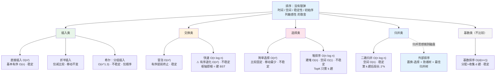

# 第七章 排序（2026 考纲）

> 📍 **本章定位**：🏗️ **梁柱级**——**选择必考 + 大题**。
>
> - **选择题**：各算法的**复杂度/稳定性/比较移动次数**、**给中间状态判断是哪种排序**、快排的递归深度与趟数、归并第 $k$ 趟后的状态、堆的调整过程（约 4-6 分）
> - **大题**：⭐ **给出一趟排序的结果判断算法**、快排**划分过程**、堆排序的**建堆与调整**、外部排序（归并段、败者树、最佳归并树）（约 8-12 分）
> - **全章主线**：**没有银弹**——每种排序都在"时间 / 空间 / 稳定性 / 对初始序列的敏感性"上做出不同取舍
>
> **学这章要回答的问题**：排序不就是"把一串数排好"吗，为什么要有十种算法？
> → 因为场景各不相同：**$n$ 很小**时插入排序的常数优势胜过 $O(n\log n)$；**基本有序**时冒泡 $O(n)$ 比快排快；**要求稳定**时快排/堆排直接出局；**内存紧张**时归并用不了；**数据是整数且位数固定**时基数排序 $O(dn)$ 碾压比较类算法。
> → 三个 $O(n\log n)$ 算法还各自对应一种**二叉树视角**：**快排的划分 = 建 $BST$（枢轴即根）**、**堆 = 完全二叉树**、**归并 = 自底向上合并的二叉树**。
>
> ⚠️ **代码作答规范**：
>
> - ✅ **C 版 = 造轮子版**：手写循环与递归，**考试要写的代码**。
> - 🧠 **C++ / Python / Java 三版 = 调库版**：仅为理解工业界的实现取舍，**考场上写 `sort()` 不得分**。
> - ❌ 考场禁用：STL 算法、`java.util.Arrays.sort`、Python `sorted` 代替手写。
> - 📌 **本章要默写的四段代码**：①直接插入排序（带哨兵）②快排的 `Partition` ③堆的 `SiftDown` + `HeapSort` ④归并的 `Merge`。

---

## 一、排序的基本概念

### （一）定义

**排序（Sort）**：把一组**无序**的记录序列，按**关键字**重新排列成**有序**（递增或递减）序列的过程。

### （二）稳定性（⭐必考）

**稳定排序**：若待排序列中有**关键字相同的多个记录**，排序后它们的**相对次序保持不变**，则称该排序算法**稳定**；否则**不稳定**。

> 📌 **例**：序列 `(5₁, 3, 5₂)` 排序后若得到 `(3, 5₁, 5₂)` 则**稳定**；若得到 `(3, 5₂, 5₁)` 则**不稳定**。
>
> ⚠️ **判稳定的口诀**：**"跳跃式交换必不稳定"**——相邻比较交换（插入、冒泡、归并）天然稳定；**跨距离交换**（简单选择、快排）和**堆的父子交换**（堆排）就容易把相等元素的次序打乱。

### （三）内部排序与外部排序

| | 内部排序 | 外部排序 |
| --- | --- | --- |
| 数据量 | 全部可装入内存 | 太大，必须分批进出内外存 |
| 主要开销 | 比较与移动 | **磁盘 $I/O$ 次数** |
| 代表算法 | 本章前九种 | 多路归并 + 置换-选择 + 败者树 |

### （四）内部排序的分类（⭐记忆框架）

| 类别 | 核心思想 | 算法 |
| --- | --- | --- |
| **插入类** | 把元素插入已排好的有序段 | 直接插入、折半插入、**希尔** |
| **交换类** | 发现逆序就交换 | **冒泡**、**快速** |
| **选择类** | 每趟选最值放到位 | 简单选择、**堆排序** |
| **归并类** | 合并两个有序段 | **二路归并** |
| **基数类**（不比较） | 按关键字各位分配收集 | **基数排序** |

### （五）排序的两个基本操作

- **比较**：比较关键字大小；
- **移动**：移动记录（用链表存储时改为改指针，称"**改链**"）。

> 💡 分析算法时要分开统计**比较次数**与**移动次数**——比如折半插入减少了比较次数，**移动次数却一点没少**。

### （六）分析一个排序算法的三个维度（⭐方法论，`之美/11`）

拿到任何一种排序算法，都从这三问入手：

| 维度 | 具体问什么 |
| --- | --- |
| **执行效率** | ① 最好 / 最坏 / 平均复杂度各是多少，**各自对应什么样的初始数据**？ ② **系数、常数、低阶**如何（$n$ 小时不能忽略）？ ③ **比较次数**与**交换（移动）次数**各是多少？ |
| **内存消耗** | 空间复杂度是多少？是否为**原地排序**（in-place，指空间 $O(1)$）？ |
| **稳定性** | 相等关键字的相对次序是否保持？ |

> 💡 **为什么不能只看大 $O$**：大 $O$ 描述 $n$ 很大时的增长趋势，**省略了系数、常数和低阶**。而实际排序常常只排几十、几百个元素，此时 $O(n^2)$ 的插入排序**完全可能比 $O(n\log n)$ 的快排更快**——这正是"小规模切换插入排序"这一工业优化的依据（见本章十二、（三））。

### （七）有序度、逆序度、满有序度（⭐分析移动次数的利器）

- **有序度**：数组中满足 $i < j$ 且 $a[i] \leq a[j]$ 的**元素对个数**（已经"排好"的对子）；
- **满有序度**：完全有序时的有序度 $= \dfrac{n(n-1)}{2}$；
- **逆序度**：满足 $i < j$ 且 $a[i] > a[j]$ 的元素对个数。

$$
\text{逆序度} = \text{满有序度} - \text{有序度}
$$

> ⭐ **核心结论**：**冒泡排序的交换次数 = 插入排序的移动次数 = 逆序度**——这是**数据的固有属性**，跟算法怎么优化无关。排序的本质就是"**增加有序度，把逆序度降到 0**"。
>
> 平均情况取逆序度 $\approx \dfrac{n(n-1)}{4}$，这是绕开复杂概率推导、快速判断"平均 $O(n^2)$"的实用方法。

---

## 二、直接插入排序（Insertion Sort）

### （一）思想

把序列分为"**已排好的有序段**"和"**未处理段**"，每次取未处理段的第一个元素，**在有序段中从后往前找位置插入**，插完后有序段长度 +1。

### （二）算法（带哨兵）

```c
// a[0] 作哨兵，数据存于 a[1..n]
void InsertSort(int a[], int n) {
    for (int i = 2; i <= n; i++) {
        if (a[i] < a[i - 1]) {                 // 只有逆序才需要插入
            a[0] = a[i];                       // 哨兵暂存，同时免去 j>=1 的越界判断
            int j;
            for (j = i - 1; a[0] < a[j]; j--)  // 比它大的统统后移
                a[j + 1] = a[j];
            a[j + 1] = a[0];                   // 落到空位
        }
    }
}
```

> 💡 **哨兵为什么能免掉越界判断**（机制，`快速上手C++/33`）：内层循环写作 `for (j = i-1; a[0] < a[j]; j--)`，因为 $a[0]$ 已被赋成待插元素本身，**当 $j$ 减到 0 时条件变成 $a[0] < a[0]$，恒假，循环自动停下**——不需要 `j >= 1` 判断。代价：数据必须从 $a[1]$ 起存，$a[0]$ 不能放有效数据。

### （三）性能分析

| 项目 | 值 |
| --- | --- |
| **最好**（已有序） | 比较$n-1$ 次、**移动 0 次** → **$O(n)$** |
| **最坏**（逆序） | 比较$\frac{(n+2)(n-1)}{2}$、移动 $\frac{(n+4)(n-1)}{2}$ → $O(n^2)$ |
| **平均** | $O(n^2)$ |
| **空间** | $O(1)$（哨兵 1 个单元） |
| **稳定性** | ✅**稳定**（从后往前找，相等时不后移） |
| **适用性** | **顺序存储和链式存储都可以** |

> 🔬 **为什么"插入排序比冒泡排序更受欢迎"**（同为 $O(n^2)$、都稳定、都原地，`之美/11`）：
> 在同样的逆序度 $K$ 下，**冒泡要做 $K$ 次"交换"（每次 3 条赋值语句），插入只做 $K$ 次"移动"（每次 1 条赋值语句）**——常数整整差 3 倍。实测 10000 个长度为 200 的随机数组：冒泡约 700ms，插入约 100ms。
>
> 💡 **为什么"基本有序"时特别快**：**从尾到头**在有序段里找位置，每趟只需比较 1 次、移动 0 次，整体退化成一次线性扫描 $O(n)$。（若改成"从头到尾"找位置，就享受不到这个优势了。）

---

## 三、折半插入排序（Binary Insertion Sort）

**改进点**：直接插入中"在有序段里找位置"是**顺序**找，改成**折半查找**找位置，再统一移动。

```c
// a[0] 暂存，数据 a[1..n]
void BInsertSort(int a[], int n) {
    for (int i = 2; i <= n; i++) {
        a[0] = a[i];
        int low = 1, high = i - 1;
        while (low <= high) {                  // ① 折半找插入位置
            int mid = (low + high) / 2;
            if (a[mid] > a[0]) high = mid - 1;
            else low = mid + 1;                // ⭐ 相等时继续向右 → 保证稳定
        }
        for (int j = i - 1; j >= high + 1; j--) // ② 整体后移（次数没减少！）
            a[j + 1] = a[j];
        a[high + 1] = a[0];
    }
}
```

| 项目 | 值 |
| --- | --- |
| **比较次数** | $O(n \log n)$ —— **减少了** |
| **移动次数** | **$O(n^2)$ —— 与直接插入相同，没有改善** |
| **时间复杂度** | 仍为**$O(n^2)$**（瓶颈在移动） |
| **空间 / 稳定性** | $O(1)$ / ✅ 稳定 |
| **适用性** | ⚠️**只能顺序存储**（要折半定位） |

> ⚠️ **高频考点**：折半插入排序**并没有把时间复杂度降到 $O(n\log n)$**，它只减少了**比较**次数，**移动**次数不变。选择题常在这里挖坑。
>
> 💡 注意代码里 `a[mid] > a[0]` 才左移、**相等时 `low = mid + 1` 继续往右找**——这一处决定了折半插入**仍然稳定**（相等元素插到后面）。

### （附）另外两种插入类变体（`快速上手C++/50`，了解）

| 变体 | 做法 | 评价 |
| --- | --- | --- |
| **2-路插入排序** | 开一个**等长辅助数组当作环形空间**，用 `head`/`tail` 两个指针：比 `head` 小的从头前面插入，比 `tail` 大的从尾后面插入，只有落在**中间**才需要移动元素 | 移动次数降到约$\dfrac{n^2}{8}$，但**空间 $O(n)$**；仍稳定 |
| **表插入排序** | 用**静态链表**（数组 + 游标）存储，**不移动记录，只改指针** | 移动代价为零，但比较次数不变，**时间仍 $O(n^2)$**、空间 $O(n)$；仍稳定 |

> 📌 两者都是"**用空间换移动次数**"的思路，考纲未单列，但常作为"插入类排序"的选项出现，知道它们的代价是什么即可。

---

## 四、起泡排序（Bubble Sort）

### （一）思想

从前往后**两两比较相邻元素**，逆序就交换；一趟下来**最大的元素"沉"到末尾**。重复 $n-1$ 趟，或**某趟没有发生交换就提前结束**。

```c
void BubbleSort(int a[], int n) {
    for (int i = 0; i < n - 1; i++) {
        int flag = 0;                                  // 本趟是否发生交换
        for (int j = 0; j < n - 1 - i; j++)            // 尾部 i 个已就位
            if (a[j] > a[j + 1]) {
                int t = a[j]; a[j] = a[j + 1]; a[j + 1] = t;
                flag = 1;
            }
        if (flag == 0) return;                         // ⭐ 已有序，提前终止
    }
}
```

| 项目 | 值 |
| --- | --- |
| **最好**（已有序） | 比较$n-1$ 次、移动 0 次 → **$O(n)$** |
| **最坏**（逆序） | 比较$\frac{n(n-1)}{2}$、移动 $\frac{3n(n-1)}{2}$ → $O(n^2)$ |
| **平均** | $O(n^2)$ |
| **空间 / 稳定性** | $O(1)$ / ✅ **稳定**（只有 $a[j] > a[j+1]$ 才换，相等不换） |
| **适用性** | 顺序、链式均可 |

> ⭐ **结论 1**：每趟冒泡都能把**一个元素（当前的"最大者"）送到最终位置**——这是"给中间状态判断算法"的关键特征之一。
>
> ⭐ **结论 2**：冒泡的**交换次数恒等于逆序度**（每交换一次，有序度 +1），**怎么优化都改不了这个数**；平均约 $\dfrac{n(n-1)}{4}$ 次交换。这正是它虽然与插入排序同阶、实际却慢 3 倍的原因。

> 🔎 **扩展（非考纲 · 面试向）：冒泡还能再优化吗**（`快速上手C++/35`）
> 内层循环每趟只比较到 `n-1-i`（尾部已就位部分不再扫描），这是最基础的优化。更进一步的做法是**记录本趟最后一次发生交换的位置**，把它作为下一趟的右边界——因为该位置之后的部分已经有序，不必再比。
> ⚠️ 注意：这些优化**都不改变 $O(n^2)$ 的量级**，也**不减少交换次数**（交换次数恒等于逆序度），只是砍掉多余的比较。别指望靠优化把冒泡救回来。

---

## 五、简单选择排序（Selection Sort）

### （一）思想

第 $i$ 趟在待排区间里**选出最小的元素**，与**第 $i$ 个位置交换**——"选最值，一次到位"。

```c
void SelectSort(int a[], int n) {
    for (int i = 0; i < n - 1; i++) {
        int min = i;                                   // 记录最小元素下标
        for (int j = i + 1; j < n; j++)
            if (a[j] < a[min]) min = j;
        if (min != i) {                                // ⚠️ 跨距离交换 → 不稳定
            int t = a[i]; a[i] = a[min]; a[min] = t;
        }
    }
}
```

| 项目 | 值 |
| --- | --- |
| **比较次数** | 恒为$\frac{n(n-1)}{2}$ —— **与初始序列无关**，$O(n^2)$ |
| **移动次数** | 最少$0$、最多 $3(n-1)$ → **$O(n)$（比较类里最少）** |
| **时间** | 恒$O(n^2)$（**没有最好情况**） |
| **空间 / 稳定性** | $O(1)$ / ❌ **不稳定** |
| **适用性** | 顺序、链式均可 |

> ❗ **不稳定的原因（必记）**：跨距离交换。例：`(5₁, 5₂, 2)` → 第一趟选最小 `2` 与 `5₁` 交换 → `(2, 5₂, 5₁)`，$5₁$ 跑到 $5₂$ 后面了。

---

## 六、希尔排序（Shell Sort）

### （一）思想

**什么叫"基本有序"**（判据，`快速上手C++/34`）：**小关键字基本在前、大关键字基本在后**，只有少量元素错位。例如 `{1, 2, 10, 16, 18, 45, 23, 99, 42, 67}` —— 大体递增，只有 45 与 23、99 与 42/67 几处错位。

**直接插入排序在"基本有序"时接近 $O(n)$**——那就先想办法把序列变得"**基本有序**"：

1. 取一个**增量 $d$**，把相距 $d$ 的元素分成一组（共 $d$ 组），**组内做直接插入排序**；
2. **缩小增量 $d$**（常见 $d = n/2, n/4, \dots, 1$），重复；
3. $d = 1$ 时就是最后一次直接插入排序，此时序列已基本有序。

```c
void ShellSort(int a[], int n) {
    for (int d = n / 2; d >= 1; d /= 2)                // ① 增量逐趟减半
        for (int i = d; i < n; i++) {                  // ② 各组交替做插入排序
            int t = a[i], j;
            for (j = i - d; j >= 0 && a[j] > t; j -= d)  // 组内步长为 d
                a[j + d] = a[j];
            a[j + d] = t;
        }
}
```

| 项目 | 值 |
| --- | --- |
| **时间** | 约**$O(n^{1.3}) \sim O(n^2)$**，取决于增量序列（尚无定论） |
| **最坏**（常用增量） | $O(n^2)$ |
| **空间 / 稳定性** | $O(1)$ / ❌ **不稳定**（相同关键字可能被分到不同组，各自移动） |
| **适用性** | ⚠️**只能顺序存储**（要按步长跳跃访问） |

> 💡 **代码里最容易看错的一处**（`快速上手C++/34`）：`for (int i = d; i < n; i++)` 表示一趟之内 $d$ 个分组**交替推进**（每组各推进一步），而不是"排完第 1 组再排第 2 组"。手推中间状态时必须按"**下标递增、组间轮转**"的顺序走。

> ⭐ **3 个元素的不稳定反例**（考场可直接默写，`快速上手C++/34`）：
> 序列 `{99, 10₁, 10₂}`，增量序列 $d = 2 \to 1$。
> ① $d=2$ 趟：$a[2]=10₂$ 与同组的 $a[0]=99$ 比较，逆序 → 交换，得 `{10₂, 10₁, 99}`；
> ② $d=1$ 趟：已是递增，**无交换**；
> ③ 结果 `{10₂, 10₁, 99}` —— $10₂$ 跑到了 $10₁$ 前面 → **不稳定**。

> 🔎 **扩展（非考纲 · 面试向）：增量序列是个"坑"**
> 希尔排序的复杂度依赖具体增量序列：网传"平均可达 $O(n\log_2 n)$"**并非主流结论**，面试别照背；严谨的结论要绑定具体序列（如 **Hibbard / Sedgewick** 增量），被追问时需另查资料。

> ⚠️ **考纲要求**：知道"分组插入 + 增量递减"的思想、会手推**一趟**的结果、知道**不稳定且只适顺序存储**即可；**不要求**分析具体增量序列的复杂度。

---

## 七、快速排序（Quick Sort）⭐⭐

### （一）思想（分治）

1. 在序列中选一个元素作**枢轴（pivot）**；
2. **划分（Partition）**：把比枢轴小的放左边、大的放右边，枢轴落到它的**最终位置**；
3. **递归**地对左右两个子序列重复 1-2，直到子序列长度 $\leq 1$。

### （二）一趟划分（⭐必考过程）

用**双指针交替扫描 + 填坑法**（$low$ 取枢轴）：

```c
// 一趟划分：返回枢轴的最终位置
int Partition(int a[], int low, int high) {
    int pivot = a[low];                                // 取首元素为枢轴（"挖坑"）
    while (low < high) {
        while (low < high && a[high] >= pivot) high--;  // ① 从右找比枢轴小的
        a[low] = a[high];                               //    填到左边的坑
        while (low < high && a[low] <= pivot) low++;    // ② 从左找比枢轴大的
        a[high] = a[low];                               //    填到右边的坑
    }
    a[low] = pivot;                                     // ③ 枢轴落位
    return low;
}

void QuickSort(int a[], int low, int high) {
    if (low < high) {
        int pivotpos = Partition(a, low, high);         // 划分
        QuickSort(a, low, pivotpos - 1);                // 递归左半
        QuickSort(a, pivotpos + 1, high);               // 递归右半
    }
}
```

> ⚠️ **划分的两个细节**：① 必须先从**右**往左扫（因为枢轴取自 $low$，左边是坑）；② 比较时取 `>=` 和 `<=`，相等元素也移动，这正是快排**不稳定**的原因之一。

### （三）性能分析（⭐⭐）

| 项目 | 值 |
| --- | --- |
| **平均 / 最好** | $O(n \log n)$（每次划分较均衡） |
| **最坏** | $O(n^2)$ —— **初始序列已有序或逆序时**，每次划分只分出 $n-1$ 与 $0$ |
| **空间** | $O(\log n)$（递归栈，平均）；**最坏 $O(n)$** |
| **稳定性** | ❌**不稳定**（例：`(3, 2₁, 2₂)` 划分后 $2₂$ 可能跑到 $2₁$ 前面） |
| **适用性** | 顺序存储 |

**递归深度**（⭐选择/大题小问）—— 用**一个公式统摄时间和空间**（`快速上手C++/36`）：

$$
\boxed{\text{时间复杂度} = O(n \times \text{递归深度}),\qquad \text{空间复杂度} = O(\text{递归深度})}
$$

**为什么**：每趟 `Partition` 都要把当前区间**扫一遍**，代价 $O(\text{当前区间长度}) \leq O(n)$；而划分过程组织起来就是**一棵二叉树**（枢轴是根、左右段是左右子树），**递归深度 = 这棵树的高度**。$n$ 个结点的二叉树最小高度 $\lfloor\log_2 n\rfloor + 1$、最大高度 $n$（斜树），于是：

| | 递归深度 | 时间（$n\times$深度） | 空间（$=$深度） |
| --- | --- | --- | --- |
| **最好** | $\lfloor\log_2 n\rfloor + 1$ | $O(n\log n)$ | $O(\log n)$ |
| **平均** | $O(\log n)$ | $O(n\log n)$ | $O(\log n)$ |
| **最坏** | $n$（斜树） | **$O(n^2)$** | **$O(n)$** |

> 💡 **这个框架的好处**：考"递归深度""递归次数""空间复杂度"都能用它一把算出来，不用分别记。
> 📌 实测示例（`快速上手C++/36`）：$n=10$ 的有序序列 `{1,2,…,10}`，递归深度达到 **9 层**（$=n-1$）；而随机序列同样 10 个元素只用 5 层。
> 📌 **"第 $k$ 趟快排后"** 的表述：快排是递归的，严格说没有"趟"；题目若这么问，通常指**递归树第 $k$ 层划分完成**后的状态。

> 🔎 **扩展（非考纲 · 理解向）：为什么叫"填坑法"**
> 划分过程中枢轴元素**不必真的跟着来回交换**——只把它的值记在 `pivot` 变量里，把它原来的位置当"坑"，后续用另一侧的元素来回填，**最后一趟结束时把 `pivot` 放进 `low == high` 的位置**。这既省了交换，也解释了为什么"必须先从右往左扫"（因为最初的坑在 `low` 这一侧）。
> 实现细节：两侧的扫描循环里各有一个 `if (low == high) break;`——**这正是为了应对"原始序列已经有序/逆序"**（一路扫到底、指针相遇）的情况，否则会出现越界或死循环。

#### 归并 vs 快排：同样是分治，方向正好相反（⭐理解要点，`之美/12`）

| | **归并排序** | **快速排序** |
| --- | --- | --- |
| 处理方向 | **自下而上**：先递归分解到最小，再逐层合并 | **自上而下**：先划分（枢轴落位），再递归处理子区间 |
| 核心操作 | `Merge()`：合并两个有序段 —— **必须借辅助数组** | `Partition()`：**原地**分区 —— 只需 $O(1)$ |
| 是否原地 | ❌ 非原地，$O(n)$ | ✅ 原地，空间$O(\log n)$（递归栈） |

> 💡 一句话：**归并用"辅助空间"换"时间稳定 + 稳定性"，快排用"原地"换"平均最快"，代价是最坏 $O(n^2)$ 与不稳定**。这也是为什么工业界排序函数的主力是快排而非归并。

#### 用快排的划分思想 $O(n)$ 求第 $K$ 大（⭐思想迁移，`之美/12`）

划分后枢轴落在位置 $p$，左边都比它小、右边都比它大。若 $p+1 = K$，枢轴就是答案；否则**只在包含目标的那一侧继续递归，另一侧整段丢弃**：

$$
\text{总比较次数} = n + \frac{n}{2} + \frac{n}{4} + \cdots + 1 = 2n - 1 = O(n)
$$

> ⚠️ 这是**平均** $O(n)$（划分较均衡的前提下）；划分极不均衡时仍会退化到 $O(n^2)$。
> 对比：朴素做法"取 $K$ 次最小值"是 $O(Kn)$，$K$ 小时还行，$K = n/2$ 时就成了 $O(n^2)$。
> ⛓️ 与第四章堆的 TopK 对照：**快排划分平均 $O(n)$ 但不保证最坏；堆 $O(n\log K)$ 有最坏保证**（LeetCode 215 / 剑指 40）。

### （四）优化手段（了解）

| 优化 | 做法 |
| --- | --- |
| **枢轴选择** | 随机取 /**三数取中**（首、中、尾取中值），避免有序序列退化 |
| **小规模切换** | 子序列长度 $< $ 阈值（如 10）时改用**插入排序**（常数小） |
| **减少递归** | 对较短的子序列先处理 / 尾递归优化 |

### （五）一道"给中间状态判断算法"的典型

> ⭐ **快排的识别特征**：每趟划分后，**枢轴元素一定落在其最终位置**，且它**左边全部 $\leq$ 它、右边全部 $\geq$ 它**——注意这个位置**不一定是"当前未排区间的最小值/最大值"**（这是与选择排序、冒泡的关键区别）。

> ⛓️ **与第六章缝合**：快排的划分过程 = **建一棵 $BST$ 的过程**——枢轴就是根，左半段是左子树，右半段是右子树。所以"有序序列 → 快排退化" 与 "有序序列 → $BST$ 退化成链表" 是**同一件事的两种表现**。

---

## 八、堆排序（Heap Sort）⭐

### （一）思想

利用**堆**（见第四章）的性质：

1. **建堆**：把待排序列建成**大根堆**（$O(n)$）；
2. **$n-1$ 趟**：把**堆顶（最大值）与堆尾交换**（最大值就位），再对剩余 $n-1$ 个元素**向下调整**；
3. 最终得到**升序**序列。

### （二）算法

```c
// 大根堆：对 a[k] 向下调整，堆大小为 n；a[0] 作暂存
void SiftDown(int a[], int k, int n) {
    a[0] = a[k];
    for (int i = 2 * k; i <= n; i *= 2) {          // i 为 k 的左孩子
        if (i < n && a[i] < a[i + 1]) i++;         // 取更大的孩子
        if (a[0] >= a[i]) break;                   // 已满足堆序
        a[k] = a[i]; k = i;                        // 孩子上移，继续下沉
    }
    a[k] = a[0];
}

void BuildMaxHeap(int a[], int n) {                // 建堆 O(n)
    for (int i = n / 2; i >= 1; i--)               // 自下而上调整
        SiftDown(a, i, n);
}

void HeapSort(int a[], int n) {                    // 数据 a[1..n]
    BuildMaxHeap(a, n);
    for (int i = n; i > 1; i--) {
        int t = a[1]; a[1] = a[i]; a[i] = t;       // 堆顶（最大）换到末尾
        SiftDown(a, 1, i - 1);                     // 调整剩余部分
    }
}
```

| 项目 | 值 |
| --- | --- |
| **时间** | **恒 $O(n \log n)$**（建堆 $O(n)$ + $(n-1)$ 次调整 $O(n\log n)$） |
| **空间** | **$O(1)$** |
| **稳定性** | ❌**不稳定**（父子跨层交换） |
| **适用性** | 顺序存储 |

> 💡 **堆排序的独特优势**：空间 $O(1)$ 且**时间恒为 $O(n\log n)$**（不像快排有最坏情况）。

> ⭐ **那为什么实测堆排序往往还是不如快排？**（`之美/28`，这是很经典的面试追问）
> 作者给出的两条理由，**都不是"比较次数多"**：
> ① **访问方式不友好**：快排是**顺序访问**；堆排序是**跳着访问**——堆化时会依次访问下标 $1,2,4,8,\dots$（沿一条树路径上下走），**对 CPU 缓存极不友好**（对照第二章"顺序存储空间局部性好"那条缝合线）；
> ② **数据交换次数更多**：堆排序第一步**建堆会把原本的次序打乱、降低有序度**——**对一组本已基本有序的数据，建堆后反而变得更无序**；而快排的交换次数**不会超过逆序度**（见本章一（七））。
>
> 💡 一句话：**同为 $O(n\log n)$，快排赢在"顺序访问 + 交换次数少"**；堆排赢在"最坏保证 + 空间 $O(1)$"。
> 💡 **TopK 场景**：只取前 $k$ 个最大元素时，**只需做 $k$ 趟**，时间 $O(n + k\log n)$——比全排序快得多。

> ⚠️ **建堆的两个易错点**：① 建堆是**从 $\lfloor n/2 \rfloor$ 开始**倒着调整（最后一个分支结点）；② **建堆复杂度是 $O(n)$ 不是 $O(n\log n)$**（详见第四章）。

> ⭐ **建堆为什么是 $O(n)$——给一个能写的证明**（`快速上手C++/37`）
> 第 $i$ 层的结点最多 $2^{i-1}$ 个，每个结点向下调整时**最多下落 $h-i$ 层**，而**每下落一层最多比较 2 次**（左右孩子比 1 次 + 与其中较大者比 1 次）。所以总比较次数：
>
> $$
> \sum_{i=1}^{h} 2^{i-1} \times 2 \times (h-i) \;<\; 4n
> $$
>
> 即**建堆的比较次数上界是 $4n$**，量级 $O(n)$。直观理解：**结点多但下沉得浅**（底层结点占了一半以上，却几乎不用动）。

> ⭐ **堆调整的精确比较次数**（会考"比较了多少次"时用得上）：
> **插入**：每上升一层比较 **1** 次（只跟双亲比）；
> **删除（下沉）**：每下降一层比较 **1** 次（只有一个孩子）或 **2** 次（有两个孩子，先比两个孩子、再跟较大的比）。

> ⭐ **堆排序不稳定的最小反例**（`快速上手C++/37`）：`{10, 1, 10}` → 建大根堆后反复交换堆顶与堆尾，最终 `{1, 10, 10}`，**两个 10 的相对次序已经反转**。

> 🔎 **扩展（非考纲 · 工程向）：什么时候才值得用堆排序**
> 原文提示：**记录数比较多时**才用。因为建堆本身有固定开销（最多 $4n$ 次比较），**记录少时这笔开销摊不薄**，反而不如直接插入。这也是"小规模数据切插入排序"这一优化思路的又一佐证。

#### 两种数组下标的写法别混（`快速上手C++/37`）

ch04 用的是 **1-based**（$a[1..n]$），但很多教材与代码用 **0-based**（$a[0..n-1]$），考场上**按题干给的下标规则写**：

| | **1-based** | **0-based** |
| --- | --- | --- |
| 左孩子 / 右孩子 | $2i$ / $2i+1$ | $2i+1$ / $2i+2$ |
| 双亲 | $\lfloor i/2 \rfloor$ | $\lfloor (i-1)/2 \rfloor$ |
| 最后一个分支结点（建堆起点） | $\lfloor n/2 \rfloor$ | $\lfloor n/2 \rfloor - 1$ |

> 💡 **堆的两条操作口诀**（插入/删除都由此展开）：
> **插入 → 放到末尾 → 向上调整（与双亲比）**；**删除 → 用末尾元素补位 → 向下调整（与更大的孩子比）**。下标口径不同，逻辑完全一致。

---

## 九、二路归并排序（Merge Sort）

### （一）思想（分治）

把序列分成两半 → **分别排序** → **合并两个有序段**。合并时用两个指针，每次取较小者放入结果。

### （二）算法

```c
// 合并 a[low..mid] 与 a[mid+1..high] 两个有序段
void Merge(int a[], int low, int mid, int high) {
    int *b = (int *)malloc((high - low + 1) * sizeof(int));
    int i = low, j = mid + 1, k = 0;
    while (i <= mid && j <= high)
        b[k++] = (a[i] <= a[j]) ? a[i++] : a[j++];   // ⭐ 取 <= 保证稳定
    while (i <= mid) b[k++] = a[i++];                // 剩余部分直接拷
    while (j <= high) b[k++] = a[j++];
    for (int t = 0; t < k; t++) a[low + t] = b[t];   // 拷回原数组
    free(b);
}

void MergeSort(int a[], int low, int high) {
    if (low < high) {
        int mid = (low + high) / 2;
        MergeSort(a, low, mid);                      // 左半排序
        MergeSort(a, mid + 1, high);                 // 右半排序
        Merge(a, low, mid, high);                    // 合并
    }
}
```

| 项目 | 值 |
| --- | --- |
| **时间** | **恒 $O(n \log n)$**（最好最坏平均都一样） |
| **空间** | ❗**$O(n)$**（辅助数组） |
| **稳定性** | ✅**稳定**（合并时相等取左边那个） |
| **趟数** | $\lceil \log_2 n \rceil$ |
| **适用性** | 顺序、链式均可（链式归并空间可做到$O(1)$） |

#### 非递归（自底向上）写法 ⭐（`快速上手C++/38`）

递归版之外，还有一种**迭代版**，思路是"两两配对相邻的有序段"：

```c
// 自底向上归并：jianGe = 当前有序段的长度，每趟翻倍
void MergeSort_Iter(int a[], int n) {
    for (int jianGe = 1; jianGe < n; jianGe *= 2) {         // 段长 1,2,4,...
        for (int i = 0; i < n; i += jianGe * 2) {           // 相邻两段配对
            int low = i, mid = i + jianGe - 1, high = i + jianGe * 2 - 1;
            if (mid >= n) break;                            // ⚠️ 边界①：没有右段，跳过
            if (high >= n) high = n - 1;                    // ⚠️ 边界②：右段不足，截断
            Merge(a, low, mid, high);
        }
    }
}
```

> ⚠️ **三个边界坑**（手撕代码常栽）：① `mid >= n` → 这一对根本凑不齐，**直接 break**；② `high >= n` → 右段被截断，取 `n-1`；③ 落单的最后一段不参与合并，**原样保留**。

> ⭐⭐ **"第 $k$ 趟后段长 $2^k$" 只对迭代版严格成立**（重要辨析，`快速上手C++/38`）
>
> - **迭代版（自底向上）**：每一趟确实把所有相邻段两两配对，故第 $k$ 趟后是若干个长度 $2^k$ 的有序段 —— **教材说的"第 $k$ 趟后段长 $2^k$"指的是这一种**。
> - **递归版（自顶向下）**：**深度优先**，先一路递归到最左下的最小段再往回合，所以一趟之内各段长度**参差不齐**。实测 $n=10$ 时会出现 `[1,16]` 与 `[45]` 归并，而不是想当然的 `[1,16]` 与 `[45,23]`。
>
> 📌 **做题对策**：题目给的是"归并排序第 $k$ 趟后的中间状态"，**先看它用的是哪种写法**（多数教材按迭代版的层次来说）；若题目自己给了中间序列，就按序列特征判断（出现了长短不一的段 → 递归版）。

> ⭐ **空间的精确写法**：$O(n + \log n) = O(n)$ —— 辅助数组 $O(n)$ 加上递归栈 $\lceil\log_2 n\rceil$，取 $\max$ 后仍是 $O(n)$。答题时写 $O(n)$ 即可，心里清楚还有一份栈开销（`快速上手C++/38`）。

> ❓ **为什么归并的空间是 $O(n)$ 而不是 $O(n\log n)$？**（高频疑问，`之美/12`）
> 归并共 $\log n$ 层，每层都要辅助数组，看起来要 $O(n\log n)$。但**递归是深度优先**——任意时刻**只有一层的一个 `Merge` 在执行**，合并完这块临时空间就释放（实践中通常复用同一块空间），**同一时刻存在的临时空间最大不超过 $n$**。
> ⚠️ 记住这条通用规则：**递归代码的空间复杂度不能像时间复杂度那样逐层累加**。

---

## 十、基数排序（Radix Sort）

### （一）思想（不基于比较）

按关键字的**每一位**进行"**分配 + 收集**"，共 $d$ 趟（$d$ 为关键字位数）：

- 从**最低位**开始（**LSD，最低位优先**）：第 $i$ 趟按第 $i$ 位把元素分到 $r$ 个桶（$r$ 为基数，十进制 $r=10$），再按桶序**收集**回来；
- $d$ 趟后即有序。

> 📌 **例**：`[170, 45, 75, 90, 802, 24, 2, 66]`
> 按个位 → 按十位 → 按百位，三趟后得到 `[2, 24, 45, 66, 75, 90, 170, 802]`。

| 项目 | 值 |
| --- | --- |
| **时间** | $O(d \times (n + r))$（$d$ 位、$r$ 个桶、每趟分配 $O(n)$ 收集 $O(r)$） |
| **空间** | ⚠️**通常是 $O(n+r)$**（见下方辨析，$r$ 为桶数） |
| **稳定性** | ✅**稳定**（按桶序收集，同桶保持先进先出） |
| **适用性** | ⚠️ 要求关键字**可分解为固定位数**（整数、定长字符串） |

> ⭐ **空间到底是 $O(r)$ 还是 $O(n+r)$**（`快速上手C++/53`）：教材常写 $O(r)$，那是**用链表桶、复用原结点**（只需 $r$ 个头/尾指针）的理想实现。但**顺序实现每趟还要另开一个长度 $n$ 的结果数组来收集** → 实际是 **$O(n+r)$**。答题时看题干给的实现方式，两种口径都要能说清。

> ⭐ **多关键字排序实例**（`快速上手C++/53`，理解"**权重最低者先排**"）
> 5000 名学生按**年龄**排序，年龄拆成 **年 / 月 / 日**，权重 年 > 月 > 日。
> 做法：**从权重最低的"日"开始排**，依次 日 → 月 → 年共 3 趟；由于"日期数值越大年龄越小"，三趟**都按降序**排。每趟桶数可以不同（日 31、月 12、年 21，$r$ 取最大 31）。
> 代价对比：$O(d(n+r)) \approx 15093$，而 $n^2 = 2.5\times10^7$、$n\log_2 n \approx 60000$ —— **基数排序约快 4 倍**。

> ⭐ **适用场合三条**（判断"该不该用基数排序"）：① 关键字**能拆成少数几组**（$d$ 小）；② **每组取值范围不大**（$r$ 小）；③ **$n$ 越大越划算**（记录少时"杀鸡焉用牛刀"）。

> 💡 **核心对比**：基数排序**不基于比较**，因此**不受 $O(n \log n)$ 的比较排序下界限制**——当 $d$ 很小、$n$ 很大时（如 100 万个 6 位整数），它可能比快排还快。

> ⚠️ **基数排序要求"按位排序"的那一步必须是稳定排序**（⭐易错，`之美/13`）：
> 若中间某趟用了不稳定排序，**最后一趟只按最高位排，前面低位排好的相对次序会被打乱**，整个算法失效。这是"稳定性"这个抽象指标第一次真正决定算法正确性——它不只是概念题。
>
> 📌 **数据不等长怎么办**：把短的**后面补 "0"**（ASCII 里所有字母都大于 '0'），补齐到相同长度即可，不影响原有大小顺序。

**同属"线性排序（非基于比较）"的另外两种**（考纲未单列，但常混在选项里，`之美/13`）：

| 算法 | 思想 | 适用 |
| --- | --- | --- |
| **桶排序** | 把数据分到$m$ 个**有序的桶**，桶内各自排序，再按桶序依次取出 | 数据**易分桶且分布均匀**；⭐**非常适合外部排序**（见本章十一） |
| **计数排序** | 桶排序的特例：最大值为$k$ 时分成 $k+1$ 个桶，**桶内元素值相同无需排序**；用计数数组 $C$ 做累加得到"$\leq i$ 的个数"，直接定位 | **范围不大的整数**（如 50 万考生成绩 0-900 分） |

> 💡 计数排序的两个关键细节：① $C[i]$ 累加后含义变成"**小于等于 $i$ 的元素个数**"，据此直接算出落位；② **从后往前扫描原数组**并在放置后把 $C[a[i]]$ 减 1 —— 这两步正是它**稳定**的来源。

> 🔎 **扩展（非考纲 · 面试向）：计数排序的三个追问**（`快速上手C++/52`）
>
> 1. **复杂度精确式**：时间 $O(n+k)$（$k$ 为计数数组大小）；**非稳定版空间只要 $O(k)$**，但**改成稳定版后升到 $O(n+k)$**（多开一个等长辅助数组）——这是"**稳定性要用空间买**"的又一例证（另一个是归并）。
> 2. **有负数怎么办**：计数数组大小取 **`max - min + 1`**，下标 0 对应最小值（如 $-10 \sim 10$ 取 21 个）。
> 3. **要降序怎么办**：把累加循环反着写 `for (i = max-1; i > 0; --i) C[i-1] += C[i];`，**仍然是稳定的**。
>
> 🔎 **桶排序的复杂度**（`快速上手C++/53`）：$O\left(n + n\log\frac{n}{k}\right)$（$k$ 个桶）。当 $k$ 接近 $n$ 且分布均匀 → $\log\frac{n}{k}$ 趋近 0 → **$O(n)$**；极端情况全落进一个桶 → **退化为 $O(n\log n)$**。桶排序的**稳定性取决于桶内用什么算法**（桶内用快排则不稳定，用归并则稳定）。

---

## 十一、外部排序

### （一）为什么需要

数据量太大，**内存装不下**，必须分批读入内存、排序后写回磁盘，再归并成有序文件。此时**瓶颈是磁盘 $I/O$**，不是 CPU 比较。

> 🔎 **扩展（非考纲 · 量化依据，`快速上手C++/33`）**：**磁盘与内存的读写速度往往相差数十甚至数百倍**。这就是外部排序一切优化（增大归并路数、败者树、置换-选择拉长归并段）都在**拼命减少 $I/O$ 次数**的原因——省一次读盘，比省一万次比较都值。

### （二）基本方法：归并排序法

```
① 生成初始归并段：把大文件分段读入内存 → 内部排序 → 写回磁盘
   （得到若干个"有序的归并段"，可用【置换-选择排序】生成更长的段）
② 多路归并：把 k 个归并段同时读入内存缓冲 → k 路归并 → 输出
   （可多趟归并，直到剩下一个有序文件）
```

**总时间** = 内部排序时间 + **外存读写时间（主导）** + 内部归并时间

### （三）三个关键技术（⭐考纲近年重点）

| 技术 | 解决什么 | 要点 |
| --- | --- | --- |
| **置换-选择排序** | 生成**更长**的初始归并段 | 利用堆（小根堆）边读边输出，可产生**平均长度为 $2M$**（$M$ 为内存容量）的段，减少归并趟数 |
| **败者树** | 减少$k$ 路归并时的**比较次数** | $k$ 路归并每次选最小，朴素要 $k-1$ 次比较；用**败者树**只需 $O(\log_2 k)$ 次，且**与 $k$ 无关地减少 $I/O$** |
| **最佳归并树** | 让归并的**总 $I/O$ 最小** | 把归并段长度当权值，构造**$k$ 叉哈夫曼树**（第四章）；带权路径长度最小 = 总读写量最小 |

**归并趟数**（⭐计算）：

$$
\text{归并趟数} = \lceil \log_k m \rceil \quad (m = 归并段个数,\ k = 归并路数)
$$

> 📌 **增大 $k$ 的取舍**：$k$ 越大 → 归并趟数越少 → **$I/O$ 次数减少**；但 $k$ 越大 → 缓冲区越多（内存压力大）、每次选最小的比较越多 → 需要**败者树**把比较压到 $O(\log k)$。

### （四）最佳归并树的虚段问题（⭐可能考）

构造 $k$ 叉哈夫曼树时，若归并段数 $m$ 不满足 $(m - 1) \bmod (k - 1) = 0$，需要**补充若干个长度为 0 的"虚段"**：

$$
\text{需补虚段数} = \bigl((k - 1) - (m - 1) \bmod (k - 1)\bigr) \bmod (k - 1)
$$

> 💡 **记忆**：$k=2$（二叉哈夫曼树）时条件恒成立，所以**二路归并不需要虚段**；只有 $k \geq 3$ 才需要补。

### （五）树形选择排序（锦标赛排序）—— 败者树的思想原型（`快速上手C++/51`）

**思想**：对 $n$ 个关键字**两两比较**，胜者（较小者）进入上一层继续比，直到选出最小值（树根）。把选出的元素改成 $\infty$，则**只需沿"它到树根"的那一条路径重新比较**，其余子树的结果全部复用。

- **比较次数**：首趟建树需 $n-1$ 次；此后**每选一个最小值只需 $\lceil\log_2 n\rceil$ 次**（只重走冠军到根的那条路径）→ 总计 $O(n\log n)$。
- **空间代价**（⭐可量化）：树高 $h = \lceil\log_2 n\rceil + 1$，下标数组要开 **$2^h - 1$** 个结点（$n=10$ 时 $h=5$ → 开 **31** 个，多余叶子填 `INT_MAX`）。一般界约 **$2n-1 \sim 4n-1$**，再加结果数组 $n$ → **辅助空间约 $3n \sim 5n$**。
- **稳定性**：该实现**是稳定的**（相等时取左孩子）——这是它相对堆排序**唯一的**优势。
- ⛓️ 这正是**败者树**的原型：外部排序 $k$ 路归并时，用它把"每次选最小"从 $O(k)$ 压到 $O(\log k)$。

> ⭐ **树形选择排序 vs 堆排序**（为什么堆排序更常用）：两者同属选择类、同为 $O(n\log n)$。但树形选择要多花 $O(n)$ 辅助空间（还浪费 $2n\sim4n$ 个空结点），换来的是"稳定"；而堆排序**空间 $O(1)$**、无空结点浪费，代价是不稳定 → **综合下来堆排序更常用**。
> 🔎 补充：原文提到该算法"**在面试中也偶有出现**"；考研属了解级，重点是把它的**锦标赛思想**迁移到败者树上。

> 💡 **另一招：用桶排序做外部排序**（`之美/13`）。先扫描一遍确定数据范围，按范围把大文件切成若干**能装进内存**的小文件（如 10GB 订单按金额切成 100 个文件），各自内部排序后**按文件编号顺序拼接**即可。若某个区间数据特别多、切完还是太大，就**继续细分那个桶**，直到每个文件都能进内存。比多路归并更直观，缺点是依赖数据分布均匀。

---

## 十二、排序算法的分析与应用

### （一）核心记忆表（⭐⭐⭐必背，选择 + 大题都用）

| 算法 | 最坏 | 平均 | 最好 | 空间 | 稳定 | 备注 |
| --- | --- | --- | --- | --- | --- | --- |
| **直接插入** | $O(n^2)$ | $O(n^2)$ | **$O(n)$** | $O(1)$ | ✅ | 基本有序时最快；顺序/链式均可 |
| **折半插入** | $O(n^2)$ | $O(n^2)$ | $O(n \log n)$比较 | $O(1)$ | ✅ | 只减比较不减移动；仅顺序 |
| **冒泡** | $O(n^2)$ | $O(n^2)$ | **$O(n)$** | $O(1)$ | ✅ | 有序可提前终止；每趟沉一个最大 |
| **简单选择** | $O(n^2)$ | $O(n^2)$ | $O(n^2)$ | $O(1)$ | ❌ | **比较次数固定**；移动最少 $O(n)$ |
| **希尔** | $O(n^2)$ | $\approx O(n^{1.3})$ | $O(n)$ | $O(1)$ | ❌ | 分组插入；仅顺序存储 |
| **快速** | **$O(n^2)$** | **$O(n \log n)$** | $O(n \log n)$ | $O(\log n)$ | ❌ | 平均最快；有序时退化；空间最坏$O(n)$ |
| **堆** | $O(n \log n)$ | $O(n \log n)$ | $O(n \log n)$ | **$O(1)$** | ❌ | 时间稳定；适合 TopK |
| **归并** | $O(n \log n)$ | $O(n \log n)$ | $O(n \log n)$ | **$O(n)$** | ✅ | 唯一稳定的$O(n\log n)$ |
| **基数** | $O(d(n+r))$ | $O(d(n+r))$ | $O(d(n+r))$ | $O(r)$ | ✅ | 不基于比较；需定长关键字 |

**一句话总结**：

- 时间上——快排**平均最快**、堆排**无最坏**、归并**时间稳定但吃空间**；
- 稳定性——**插入、冒泡、归并、基数稳定**；**选择、希尔、快排、堆排不稳定**；
- 空间上——除**归并 $O(n)$**、**快排 $O(\log n)$** 外，其余都是 **$O(1)$**。

### （二）选型指南（⭐综合题）

```
要求稳定？
├── 是 → 归并（O(n log n) 唯一稳定）；n 小 → 插入/冒泡
└── 否
    ├── n 很小 / 基本有序 → 直接插入（常数小，最好 O(n)）
    ├── 内存极紧（不能有 O(n) 辅助空间）→ 堆排序（空间 O(1)，无最坏）
    ├── 追求平均最快 → 快排（注意有序序列会退化，可三数取中）
    ├── 只需前 K 个最值 → 堆（O(n + k log n)）
    ├── 关键字是定长整数/字符串，n 很大 → 基数排序 O(d(n+r))
    └── 数据放磁盘 → 外部排序（多路归并 + 败者树 + 最佳归并树）
```

### （三）"给中间状态判断算法"速查（⭐大题/选择）

| 观察点 | 指向的算法 |
| --- | --- |
| 每趟后**尾部**多一个已就位的最大元素，且前部**部分有序** | **冒泡** |
| 每趟后**前部**多一个已就位的最小元素 | **简单选择** |
| 前$i$ 个**已经有序**（是一个完整的递增段），后部未动 | **直接插入** |
| 某个元素**落在最终位置**，且**左全 ≤ 它、右全 ≥ 它** | **快排（一趟划分）** |
| 序列整体呈现**大根堆**形态（$a_i \geq a_{2i}, a_{2i+1}$） | **堆排序（建堆阶段）** |
| 序列被分成若干**等长（$2^k$）的有序段** | **归并排序（第 $k$ 趟后）** |

#### 🧠 三语言调库版（理解工业界取舍）

```cpp
// C++：std::sort 是 introsort（快排 + 堆排 + 插入排序的混合）
#include <algorithm>
std::sort(a, a + n);                 // 不稳定
std::stable_sort(a, a + n);          // 稳定：归并排序
```

```python
# Python：sorted / list.sort 用 Timsort（归并 + 插入的混合），稳定
sorted([3, 1, 2])                    # [1, 2, 3]
sorted([3, 1, 2], reverse=True)
```

```java
// Java：基本类型用双轴快排（不稳定）；对象数组用 Timsort（稳定）
import java.util.Arrays;
int[] a = {3, 1, 2};
Arrays.sort(a);                      // 原始类型：快排，不稳定
// Integer[] boxed → Arrays.sort 用 Timsort，稳定
```

> 🧠 **理解点**：工业界的排序函数**从来不是单一算法**。以 C 库 `qsort()` 为例（`之美/14`）：
>
> | 情况                           | 用什么                                           | 为什么                                              |
> | --- | --- | --- |
> | 数据量**小**（1KB、2KB） | **归并排序**                               | 多占一点内存无所谓，**用空间换时间**          |
> | 数据量**大**             | **快速排序**（枢轴用**三数取中法**） | 避免非原地带来的内存翻倍                            |
> | 子区间元素$\leq 4$           | **插入排序**                               | $n$ 小时 $O(n^2)$ 的常数优势胜过 $O(n\log n)$ |
> | 递归**过深**             | 在**堆上自己模拟调用栈**                   | 防止系统栈溢出                                      |
>
> 这也解释了为什么"**$O(n^2)$ 不一定比 $O(n\log n)$ 慢**"：设 $O(n\log n)$ 的实际代价是 $kn\log n + c$，$k=1000,\ c=200,\ n=100$ 时远远大于 $n^2 = 10000$。
>
> 一句话：**没有银弹，只有按数据规模分层组合**。

---

## 十三、复习工具箱

> 本部分是正文之外的复习辅助区：知识关系图（L1 结构化）、跨科缝合（L2 关联化）、易错点清单、配套资源与自测。

### 13.1 脉络打通：知识关系图（L1 结构化）



### 13.2 跨科缝合（L2 关联化）

| 本章概念 | 缝合到 | 缝的是什么 |
| --- | --- | --- |
| **快排的划分** | 第六章 ·$BST$ 建树 | 枢轴即根、左右段即左右子树；"有序序列 → 快排退化" 与 "$BST$ 退化成链表"是同一件事 |
| **堆排序** | 第四章 · 堆 | 完全二叉树的顺序存储 + 上浮/下沉；TopK 就是堆的应用 |
| **最佳归并树** | 第四章 · 哈夫曼树 | 把归并段长度当权值构造**$k$ 叉哈夫曼树**，总 $I/O$ = 带权路径长度 |
| **败者树** | 第四章 · 树形结构 | 锦标赛思想（$O(\log k)$ 选最值）；也可看作**完全二叉树上的归并** |
| **置换-选择排序** | 第四章 · 堆 | 用小根堆边读边输出，把归并段拉长到平均$2M$ |
| **外部排序的 $I/O$ 优化** | OS · 磁盘调度 / 缓冲 | 缓冲区数量与磁盘读写块大小直接决定外部排序性能 |
| **归并排序的分治** | 计网/分布式 · MapReduce | 分治 + 归并是 MapReduce 的 shuffle 阶段的核心思想 |
| **稳定排序** | 数据库 · 多关键字排序 | 先按次要关键字排、再按主要关键字排，只有**稳定排序**才能得到正确结果 |
| **$O(n\log n)$ 下界** | 算法 · 决策树模型 | 基于比较的排序，决策树叶结点$\geq n!$ → 高度 $\geq \log_2 n! = O(n\log n)$，故快排/堆排/归并已是最优 |

> ⛓️ 一句话：**排序这一章是前面所有结构的"总验收"**——堆（第四章）、$BST$（第六章）、哈夫曼树（第四章）全部在这里变成算法；而外部排序则把问题从内存搬到了磁盘，与 OS 的文件/缓冲管理无缝缝合。

### 13.3 易错点

1. **稳定性判据**：**跨距离交换（选择、快排）和父子交换（堆排）必不稳定**；相邻交换（插入、冒泡、归并）稳定。
2. **折半插入排序的复杂度仍是 $O(n^2)$**——只减比较不减移动。
3. **简单选择排序没有"最好情况"**，比较次数恒为 $\frac{n(n-1)}{2}$，恒 $O(n^2)$；但**移动次数最少 $O(n)$**。
4. **冒泡排序最好 $O(n)$**（有序时一趟走完就退出），不是 $O(n^2)$。
5. **插入排序在"基本有序"时是 $O(n)$**，这是它比冒泡更受欢迎的原因。
6. **希尔排序不稳定**，且**只能用顺序存储**（要按增量跳跃访问）。
7. **快排最坏 $O(n^2)$** 出现在**初始序列有序或逆序**时；**空间最坏 $O(n)$**（递归栈），平均 $O(\log n)$。
8. **快排"每趟"的说法不严谨**——它是递归的；若题目说"第 $k$ 趟"，通常指递归树第 $k$ 层。
9. **快排识别特征**：枢轴落在**最终位置**，且左全 $\leq$ 它、右全 $\geq$ 它——**不是**"最小的放最前"。
10. **堆排序建堆是 $O(n)$**，不是 $O(n\log n)$；排序总时间 $O(n\log n)$。
11. **建堆从 $\lfloor n/2 \rfloor$ 开始**倒着调整；堆的数组下标通常**从 1 起**。
12. **堆排序不稳定**；大根堆排**升序**。
13. **归并排序空间是 $O(n)$**（辅助数组），这是它唯一的硬伤；但它**时间恒为 $O(n\log n)$ 且稳定**。
14. **第 $k$ 趟归并后**，有序段长度为 $2^k$（最后一趟可能不足），总趟数 $\lceil \log_2 n \rceil$。
15. **基数排序不基于比较**，故不受 $O(n\log n)$ 下界限制；时间 $O(d(n+r))$，空间 $O(r)$。
16. **外部排序的瓶颈是磁盘 $I/O$**，不是比较；增大归并路数 $k$ 可减少趟数（$\lceil\log_k m\rceil$）。
17. **败者树把 $k$ 路归并的比较次数从 $O(k)$ 降到 $O(\log k)$**。
18. **最佳归并树 = $k$ 叉哈夫曼树**；$k \geq 3$ 时若 $(m-1)\bmod(k-1) \neq 0$ 需补**虚段**。
19. **二路归并不需要虚段**（$k=2$ 时条件恒成立）。
20. **"稳定排序" ≠ "排序结果唯一"**：稳定指的是**相等关键字的相对次序**保持，与序列本身是否有重复元素无关。
21. 比较排序的**下界是 $O(n\log n)$**，所以"比 $O(n\log n)$ 还快的比较排序"一定不存在（基数排序是非比较类，不受此限）。
22. **归并排序空间是 $O(n)$ 而非 $O(n\log n)$**——递归是深度优先，同一时刻只有一个 `Merge` 在执行；⚠️ **递归代码的空间复杂度不能逐层累加**。
23. **基数排序"按位排序"那一步必须是稳定排序**——否则最后一趟只按最高位排，前面低位排好的相对次序全被打乱，算法直接失效。
24. **2-路插入排序要 $O(n)$ 辅助空间**（环形数组 + `head`/`tail` 指针），换来的是移动次数降到约 $\dfrac{n^2}{8}$。
25. **冒泡的交换次数、插入的移动次数都恒等于逆序度**，与实现细节无关；两者常数差 3 倍（交换 3 条赋值 vs 移动 1 条赋值）。
26. **"第 $k$ 趟归并后段长 $2^k$" 只对自底向上迭代版严格成立**；递归版深度优先，一趟内各段长度参差。做题先看题目用的是哪种写法。
27. **希尔排序的反例记 3 个元素就够**：`{99, 10₁, 10₂}`、增量 $2\to1$ → 结果 `{10₂, 10₁, 99}` → 不稳定。
28. **堆排序不稳定的最小反例**：`{10, 1, 10}` → `{1, 10, 10}`，两个 10 的相对次序反转。
29. **基数排序的空间要看实现**：链表桶复用结点是 $O(r)$，顺序实现每趟另开结果数组是 **$O(n+r)$**——两种口径都要会说。

### 13.4 配套资源

#### 📚 阅读材料

> 📖 **阅读状态说明**：✅ = 已通读并吸收进本章正文；🔶 = 读了关键段落；⬜ = **仅按篇名索引，尚未阅读**。

| 主题 | 位置 | 状态 · 本章吸收了什么 |
| --- | --- | --- |
| 排序（上）：为什么插入排序比冒泡更受欢迎 | `数据结构与算法之美/11` | ✅ 三个分析维度；**有序度/逆序度**；插入 vs 冒泡"3 条赋值 vs 1 条赋值" |
| 排序（下）：如何用快排思想$O(n)$ 求第 $K$ 大  |  `数据结构与算法之美/12`  |  ✅ 归并空间为何是$O(n)$；**归并自下而上 vs 快排自上而下**；$O(n)$ 求第 $K$ 大  |
| 线性排序：桶 / 计数 / 基数 | `数据结构与算法之美/13` | ✅**基数排序必须稳定**；不等长补 0；桶排序做外部排序；计数排序的累加与稳定来源 |
| 排序优化：通用高性能排序函数 | `数据结构与算法之美/14` | ✅`qsort()` 内幕：小数据用归并、大数据用快排、$\leq 4$ 退化插入、三数取中、堆上模拟栈 |
| 简单选择排序与堆排序 | `快速上手C++数据结构与算法/37` | ✅ 0-based 堆下标公式；⭐**建堆比较次数上界 $4n$ 的证明**；调整比较次数（插入 1/层、删除 1~2/层）；不稳定反例 `{10,1,10}` |
| 折半插入、2 路插入、表插入排序 | `快速上手C++数据结构与算法/50` | ✅ 2-路插入（环形辅助数组 + head/tail）；表插入（静态链表只改指针） |
| 树形选择排序：锦标赛思想 | `快速上手C++数据结构与算法/51` | ✅ 败者树原型；⭐**空间量化（$2^h-1$，约 $3n\sim5n$）**；与堆排序的取舍对比 |
| 直接插入排序 | `快速上手C++数据结构与算法/33` | ✅ 🔎**哨兵免越界的机制**（$a[0]<a[0]$ 恒假）；🔎 磁盘与内存速度差数十到数百倍 |
| 希尔排序：通过部分有序逼近全局有序 | `快速上手C++数据结构与算法/34` | ✅ ⭐**"基本有序"判据**；⭐**3 元素不稳定反例**；🔎 各组交替推进；🔎 增量序列说法存疑 |
| 冒泡排序：大数下沉，小数上浮 | `快速上手C++数据结构与算法/35` | ✅ 🔎 记录最后交换位置的优化（**不改量级、不减交换次数**） |
| 快速排序：如何通过基准元素改进冒泡排序 | `快速上手C++数据结构与算法/36` | ✅ ⭐**时间 $=n\times$递归深度、空间 $=$递归深度** 的统一框架；递归深度 $=$ 二叉树高度；🔎 "填坑法"由来与两个 `low==high` 提前 break |
| 归并排序：多个有序序列两两合并 | `快速上手C++数据结构与算法/38` | ✅ ⭐**非递归（迭代）写法 + 三个边界坑**；⭐**"第 $k$ 趟段长 $2^k$" 的适用口径修正**；空间 $O(n+\log n)$ |
| 计数排序 | `快速上手C++数据结构与算法/52` | ✅ 🔎 复杂度$O(n+k)$；**稳定性要用空间买**（$O(k)\to O(n+k)$）；负数取 `max-min+1` |
| 基数排序与桶排序 | `快速上手C++数据结构与算法/53` | ✅ ⭐**空间是 $O(n+r)$ 而非 $O(r)$**；⭐多关键字排序（**权重最低者先排**，5000 学生按年龄）；适用场合三条 |

#### 💻 力扣练习

**排序（4 题）**

| 题目 | 难度 |
| --- | --- |
| [颜色分类](https://leetcode.cn/problems/sort-colors/) | 🟡 中等 |
| [最大数](https://leetcode.cn/problems/largest-number/) | 🟡 中等 |
| [查找和最小的 K 对数字](https://leetcode.cn/problems/find-k-pairs-with-smallest-sums/) | 🟡 中等 |
| [IPO](https://leetcode.cn/problems/ipo/) | 🔴 困难 |

> 🎯 **优先级**：`颜色分类`（荷兰国旗，一趟三指针，与快排划分思想同源）、`查找和最小的 K 对数字`（堆的应用）、`IPO`（排序 + 堆贪心）。
>
> ⚠️ **重要说明**：LeetCode 的排序题**几乎不考"排序过程"**——408 的考法是**纸笔推演**：给中间状态判断算法、数比较/移动次数、画快排递归树、算归并趟数、推堆的调整过程。这些**只能靠手算练习**，刷题无法覆盖。

#### ✅ 费曼自测

- [ ] 能默写核心记忆表：9 种算法的**最坏/平均/最好复杂度、空间、稳定性**。
- [ ] 能解释"稳定排序"的含义，并各举一个"为什么不稳定"的反例（选择、快排、堆排各一个）。
- [ ] 给一个中间状态序列，能判断它是哪种排序的哪一趟（用 12.3 的速查表）。
- [ ] 能手写快排的 `Partition`，并说清为什么"必须先从右往左扫"。
- [ ] 能解释"快排有序序列退化"与"$BST$ 退化成链表"是同一件事。
- [ ] 能默写 `SiftDown` + `BuildMaxHeap` + `HeapSort`，并解释建堆为什么是 $O(n)$。
- [ ] 能说出"第 $k$ 趟归并后有序段长度是 $2^k$"，并算 $n=10$ 时各趟的状态。
- [ ] 能解释外部排序为什么要"增大归并路数"，以及败者树和最佳归并树各自解决什么问题。
- [ ] 能解释"基于比较的排序下界是 $O(n\log n)$"，以及为什么基数排序不受此限。

---

> 整理日期：2026-09-11 ｜ 考纲依据：2026 版《计算机学科专业基础考试大纲》｜ 定级：🏗️ 梁柱（选择必考 + 大题）
