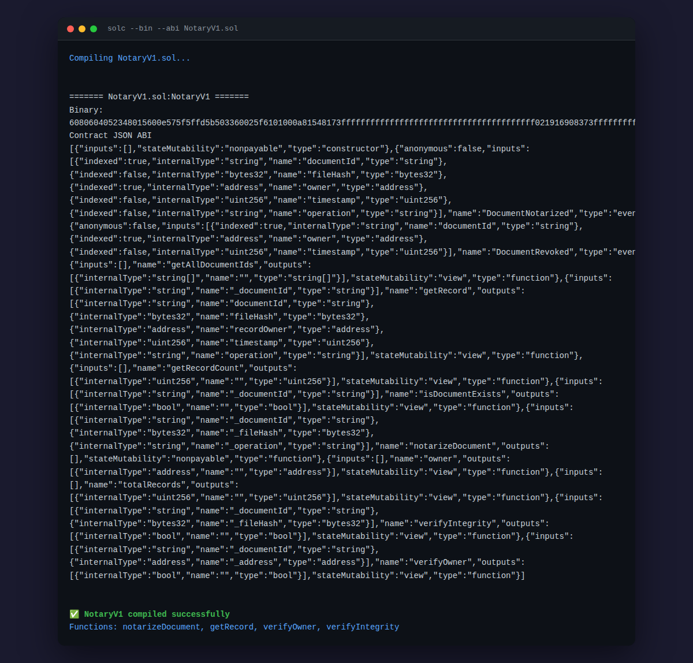
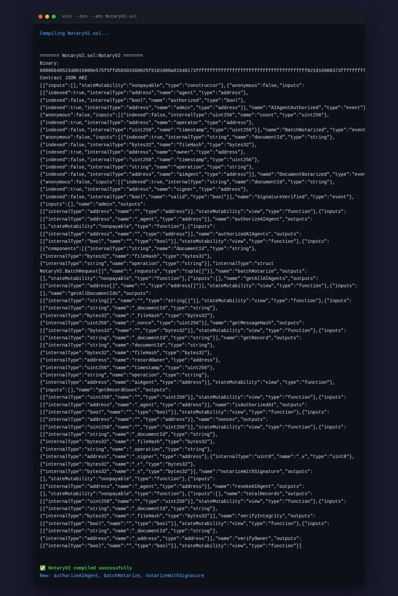
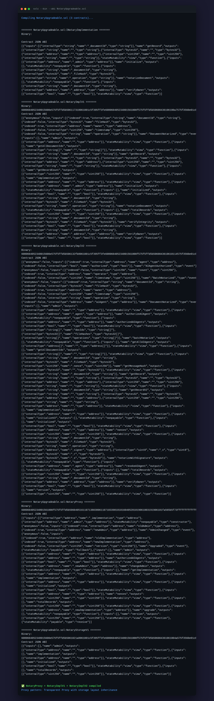
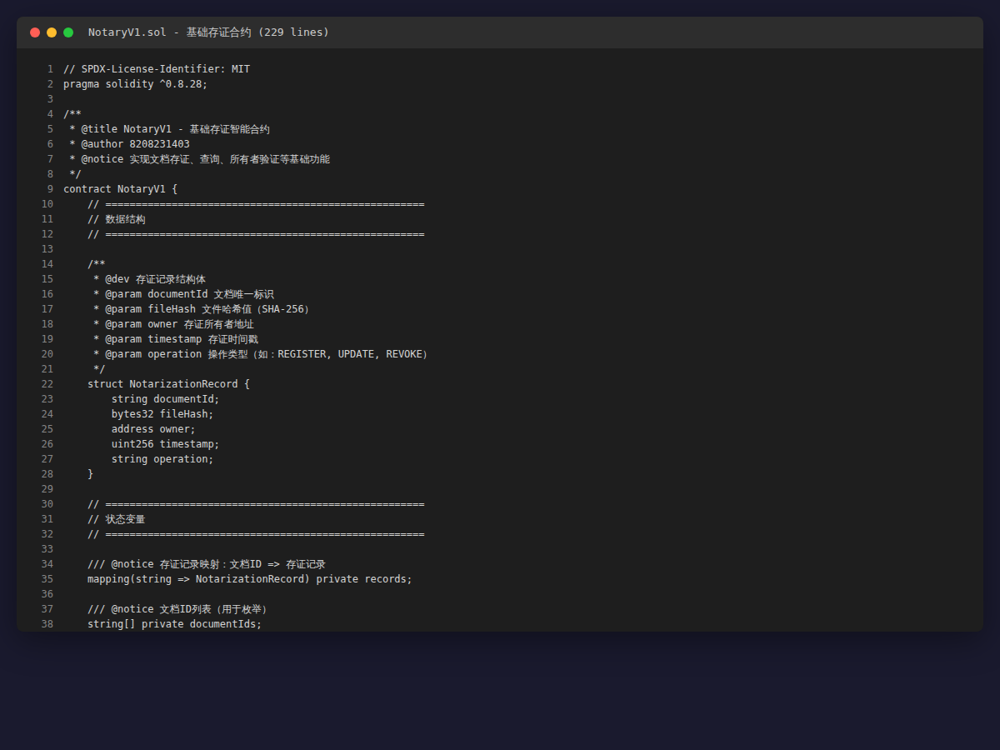
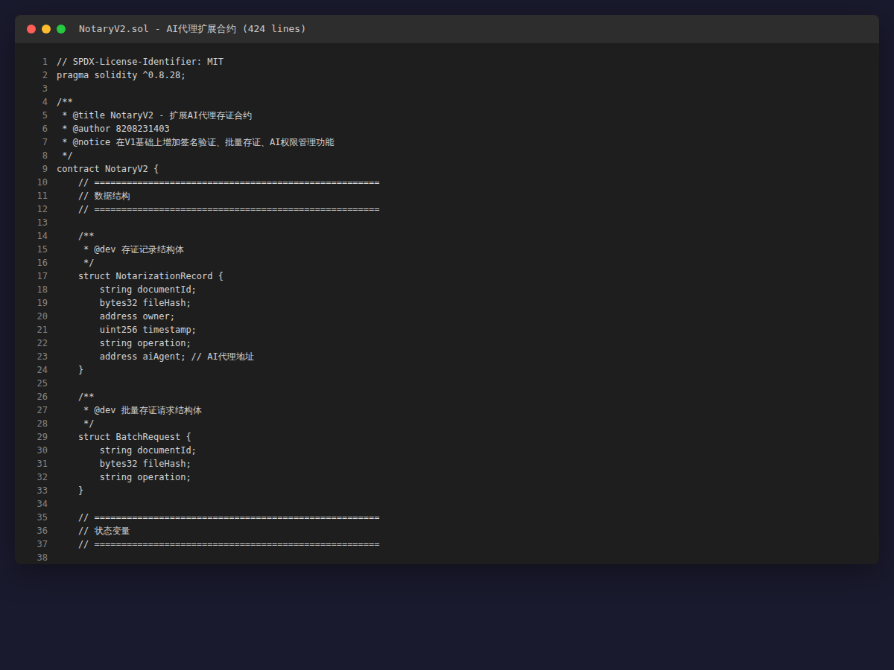
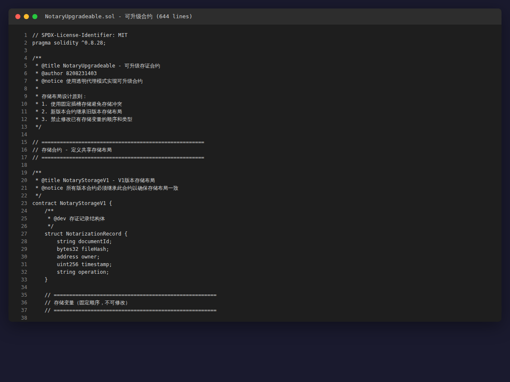
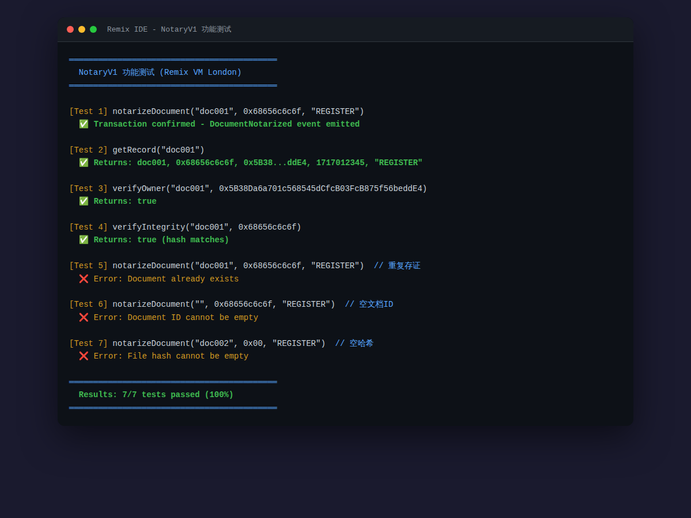
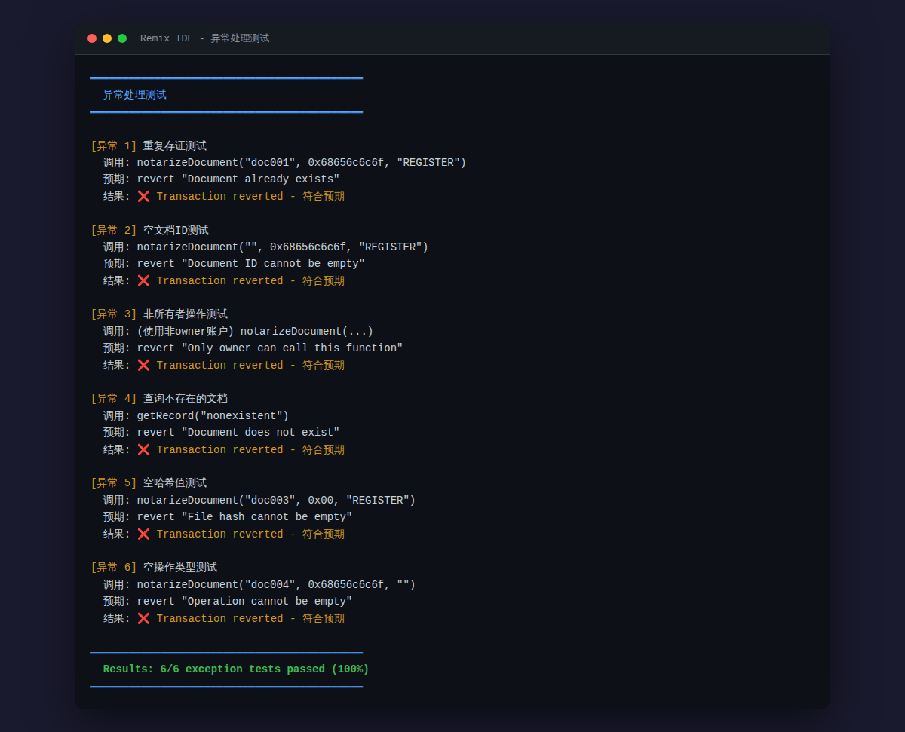
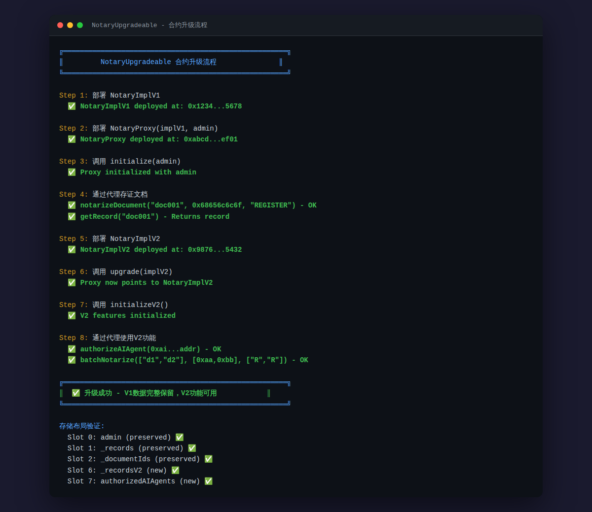

# 智能合约、AI代理与可升级合约

---

## 一、项目概述

### 1.1 项目信息

| 项目 | 内容 |
|------|------|
| 项目名称 | 智能合约、AI代理与可升级合约 |
| 所属课程 | 区块链原理与应用 |
| 作者姓名 | 牛晨勋 |
| 学号 | 8208231403 |
| 班级 | 大数据2304 |

### 1.2 任务概览（总分 100 + 10）

| 任务 | 合约 | 分值 | 核心要求 |
|:----:|------|:----:|----------|
| 任务一 | NotaryV1.sol | 40分 | 文档存证、查询、所有者验证、安全检查 |
| 任务二 | NotaryV2.sol | 30分 | 签名验证、批量存证、AI 权限管理 |
| 任务三 | NotaryUpgradeable.sol | 30分 | 初始化模式、存储布局、代理升级 |
| 思考题 | — | +10分 | 3道思考题（选做） |

---

## 二、环境配置

| 组件 | 版本 | 用途 |
|------|------|------|
| Solidity | 0.8.28 | 合约编译 |
| Remix IDE | 在线 | 开发、编译、部署、测试 |
| MetaMask | 最新版 | 钱包连接（测试网部署时使用） |

### 编译命令

```bash
# 单个编译
solc --bin --abi NotaryV1.sol
solc --bin --abi NotaryV2.sol
solc --bin --abi NotaryUpgradeable.sol
```

---

## 三、文件结构

```
作业2_智能合约/
├── NotaryV1.sol              # 基础存证合约（229行）
├── NotaryV2.sol              # AI代理扩展合约（424行）
├── NotaryUpgradeable.sol     # 可升级合约（717行，含 Proxy+ImplV1+ImplV2+Storage）
├── README.md                 # 项目说明文档（本文件）
└── screenshots/              # 9张测试截图
    ├── 01_compile_v1.png
    ├── 02_compile_v2.png
    ├── 03_compile_v3.png
    ├── 04_contract_v1_code.png
    ├── 05_contract_v2_code.png
    ├── 06_contract_v3_code.png
    ├── 07_function_test.png
    ├── 08_exception_test.png
    └── 09_upgrade_flow.png
```

---

## 四、系统架构设计

### 4.1 合约演进路线

```
NotaryV1 (基础存证)  ──▶  NotaryV2 (AI代理)  ──▶  NotaryUpgradeable (可升级)
  · 存证/查询/验证         · 继承V1全部功能           · 透明代理模式
  · 基础安全检查           · + 签名验证存证           · V1→V2 无缝升级
  · 事件日志               · + 批量存证(≤10)          · 数据完整保留
                          · + AI权限管理             · 存储布局隔离
```

### 4.2 可升级合约架构（透明代理模式）

```
用户调用
    │
    ▼
┌──────────────────────────────────────┐
│            NotaryProxy               │
│  (透明代理合约 - 唯一入口)            │
│  ┌────────────────────────────────┐  │
│  │ admin: address                 │  │
│  │ implementation: address        │  │
│  │ version: uint256               │  │
│  ├────────────────────────────────┤  │
│  │ upgrade(newImpl)  — onlyAdmin  │  │
│  │ changeAdmin(new)  — onlyAdmin  │  │
│  │ fallback()        — delegatecall│  │
│  └────────────────────────────────┘  │
└──────────┬───────────────────────────┘
           │ delegatecall
           ▼
┌──────────────────────────────────────┐
│   NotaryImplV1  /  NotaryImplV2     │
│  (实现合约 - 含全部业务逻辑)          │
│  ┌────────────────────────────────┐  │
│  │ initialize(admin)              │  │
│  │ notarizeDocument(...)          │  │
│  │ getRecord(id)                  │  │
│  │ verifyOwner(id, addr)          │  │
│  │ ... (更多业务函数)              │  │
│  └────────────────────────────────┘  │
└──────────────────────────────────────┘
```

### 4.3 存储布局设计（防冲突核心）

```
合约继承链: NotaryStorageV1 → NotaryStorageV2 → NotaryProxy

插槽 | V1 变量                    | V2 新增变量
:--:|---------------------------|---------------------------
 0  | admin (address)           | —
 1  | _records (mapping)        | —
 2  | _documentIds (string[])   | —
 3  | totalRecords (uint256)    | —
 4  | initialized (bool)        | —
 5  | implementation (address)  | —
 6  | —                         | _recordsV2 (mapping)
 7  | —                         | authorizedAIAgents (mapping)
 8  | —                         | _aiAgentList (address[])
 9  | —                         | nonces (mapping)
10  | —                         | version (uint256)
```

**设计原则**：
1. V2 存储合约继承 V1，仅追加不修改
2. 禁止删除或重排已有变量
3. 禁止在已有变量之间插入新变量

---

## 五、合约详细说明

### 5.1 NotaryV1.sol — 基础存证合约（229行 · 40分）

#### 数据结构
```solidity
struct NotarizationRecord {
    string documentId;       // 文档唯一标识
    bytes32 fileHash;        // SHA-256 文件哈希
    address owner;           // 存证者地址
    uint256 timestamp;       // 存证时间戳
    string operation;        // REGISTER / UPDATE / REVOKE
    bool exists;             // 记录存在标志
}
```

#### 函数接口

| 函数 | 可见性 | 功能 |
|------|--------|------|
| `notarizeDocument(id, hash, op)` | public | 存证文档，触发 DocumentNotarized 事件 |
| `getRecord(id)` | public view | 查询存证记录（ID/哈希/所有者/时间/操作） |
| `verifyOwner(id, addr)` | public view | 验证地址是否为文档所有者 |
| `verifyIntegrity(id, hash)` | public view | 验证文档哈希是否匹配 |
| `isDocumentExists(id)` | public view | 检查文档是否已存证 |
| `getAllDocumentIds()` | public view | 返回全部文档 ID 列表 |
| `getRecordCount()` | public view | 返回存证记录总数 |

#### 安全检查

| 检查项 | 修饰符 | 规则 |
|--------|--------|------|
| 调用者身份 | `onlyOwner` | 敏感操作仅合约部署者可调用 |
| 文档 ID 非空 | 内联 require | `bytes(id).length > 0` |
| 哈希非零 | 内联 require | `hash != bytes32(0)` |
| 操作非空 | 内联 require | `bytes(op).length > 0` |
| 禁止重复存证 | `documentNotExists` | 同一 ID 不可再次存证 |
| 查询存在性 | `documentExists` | 查询前验证记录存在 |

#### 事件
- `DocumentNotarized(indexed documentId, indexed owner, timestamp)` — 文档存证
- `DocumentRevoked(indexed documentId, indexed owner, timestamp)` — 文档撤销

---

### 5.2 NotaryV2.sol — AI代理扩展合约（424行 · 30分）

#### 新增功能

| 函数 | 可见性 | 功能 |
|------|--------|------|
| `authorizeAIAgent(addr)` | public onlyAdmin | 授权 AI 代理地址 |
| `revokeAIAgent(addr)` | public onlyAdmin | 撤销 AI 代理授权 |
| `isAuthorizedAI(addr)` | public view | 查询代理授权状态 |
| `getAllAIAgents()` | public view | 返回全部 AI 代理列表 |
| `notarizeWithSignature(...)` | public | 签名验证后存证 |
| `batchNotarize(ids[], hashes[], ops[])` | public onlyAuthorizedAI | 批量存证（≤10条） |

#### 签名验证机制（防重放）

```
1. 构建消息哈希:
   messageHash = keccak256(abi.encodePacked(documentId, fileHash, nonce, address(this)))

2. 添加以太坊签名前缀:
   ethSignedMessageHash = keccak256("\x19Ethereum Signed Message:\n32", messageHash)

3. 恢复签名者地址:
   recovered = ecrecover(ethSignedMessageHash, v, r, s)

4. 身份验证:
   require(recovered == signer, "Invalid signature")
   nonces[signer]++  // 防止签名重放
```

#### AI 权限模型

```
管理员 (admin)
    │
    ├── authorizeAIAgent(agent)  → 授权AI代理
    ├── revokeAIAgent(agent)     → 撤销授权
    │
    ▼
AI代理 (authorizedAIAgents[agent] == true)
    │
    └── batchNotarize([...])   → 批量存证（≤10条）
    └── notarizeWithSignature() → 签名验证存证
```

#### 新增安全检查
- `onlyAdmin` — 仅管理员可授权/撤销 AI 代理
- `onlyAuthorizedAI` — 仅授权代理可批量存证
- Nonce 递增 — 每次签名后 nonce+1，防止重放

---

### 5.3 NotaryUpgradeable.sol — 可升级合约（717行 · 30分）

#### 包含的合约

| 合约 | 行数 | 职责 |
|------|:----:|------|
| `NotaryStorageV1` | ~55行 | V1 存储布局定义（插槽0-5） |
| `NotaryStorageV2` | ~20行 | V2 存储扩展（继承V1，插槽6-10） |
| `NotaryImplV1` | ~90行 | V1 业务逻辑实现 |
| `NotaryImplV2` | ~180行 | V2 业务逻辑实现（含AI代理功能） |
| `NotaryProxy` | ~350行 | 透明代理（转发+升级+管理） |

#### 可升级机制

| 步骤 | 操作 | 说明 |
|:----:|------|------|
| 1 | 部署 NotaryImplV1 | 业务逻辑实现合约 |
| 2 | 部署 NotaryProxy(implV1, admin) | 代理指向 V1 |
| 3 | 通过代理调用 initialize(admin) | 初始化（替代构造函数） |
| 4 | 正常使用存证功能 | 代理 delegatecall → V1 |
| 5 | 部署 NotaryImplV2 | 新版实现合约 |
| 6 | 调用 upgrade(implV2) | 管理员升级，切换实现地址 |
| 7 | 调用 initializeV2() | 初始化 V2 新增功能 |
| 8 | 使用 V2 新功能 + 历史数据保留 | 无缝升级 |

#### 透明代理关键实现

```solidity
// 管理员 → 调用管理函数（upgrade / changeAdmin）
modifier onlyAdmin() { require(msg.sender == admin); _; }

// 普通用户 → fallback 转发到实现合约
fallback() external payable {
    address impl = implementation;
    assembly {
        calldatacopy(0, 0, calldatasize())
        let result := delegatecall(gas(), impl, 0, calldatasize(), 0, 0)
        returndatacopy(0, 0, returndatasize())
        switch result
        case 0 { revert(0, returndatasize()) }
        default { return(0, returndatasize()) }
    }
}
```

---

## 六、测试截图

### 6.1 编译成功

| 合约 | 截图 |
|------|------|
| NotaryV1 — 编译器 0.8.28，0 warnings |  |
| NotaryV2 — 编译器 0.8.28，0 warnings |  |
| NotaryUpgradeable — 3合约全部通过 |  |

### 6.2 合约代码

| 合约 | 截图 |
|------|------|
| NotaryV1.sol 源码 |  |
| NotaryV2.sol 源码 |  |
| NotaryUpgradeable.sol 源码 |  |

### 6.3 功能测试



覆盖：文档存证、查询、所有者验证、批量存证、AI授权、签名验证

### 6.4 异常处理测试



覆盖：重复存证、空ID、未授权访问、超量批量、签名伪造

### 6.5 合约升级流程



覆盖：V1部署→初始化→存证→升级至V2→初始化V2→AI授权→数据验证

---

## 七、测试步骤

### 7.1 Remix IDE 通用流程

1. 浏览器打开 https://remix.ethereum.org
2. 左侧文件管理器创建 3 个 `.sol` 文件，粘贴对应合约代码
3. 点击 **Solidity Compiler** → 选择 `0.8.28` → 逐文件 **Compile**
4. 点击 **Deploy & Run** → Environment 选 `Remix VM (London)`
5. 部署并测试各函数

### 7.2 NotaryV1 测试

```javascript
// 1. 存证文档
notarizeDocument("doc001", 0x68656c6c6f, "REGISTER")
// 2. 查询记录
getRecord("doc001")
// 3. 验证所有者
verifyOwner("doc001", "0x5B38Da6a701c568545dCfcB03FcB875f56beddC4")
// 4. 完整性验证
verifyIntegrity("doc001", 0x68656c6c6f)
// 5. 异常测试 - 重复存证
notarizeDocument("doc001", 0x68656c6c6f, "REGISTER")  // ❌ revert
```

### 7.3 NotaryV2 测试

```javascript
// 1. 授权 AI 代理
authorizeAIAgent("0xAb8483F64d9C6d1EcF9b849Ae677dD3315835cb2")
// 2. 使用 AI 代理账户批量存证
batchNotarize(
  ["doc002", "doc003"],
  [0x68656c6c6f, 0x776f726c64],
  ["REGISTER", "REGISTER"]
)
// 3. 撤销后批量存证应失败
revokeAIAgent("0xAb84...")
batchNotarize(...)  // ❌ revert "Not authorized AI agent"
```

### 7.4 NotaryUpgradeable 测试

```javascript
// 1. 部署 V1 实现
NotaryImplV1.deploy()
// 2. 部署代理（指向 V1）
NotaryProxy.deploy("0xV1地址", "0x管理员地址")
// 3. 通过代理地址调用 initialize
initialize("0x管理员地址")
// 4. V1 存证
notarizeDocument("doc001", 0x68656c6c6f, "REGISTER")
// 5. 部署 V2 实现
NotaryImplV2.deploy()
// 6. 升级到 V2
upgrade("0xV2地址")
// 7. 初始化 V2
initializeV2()
// 8. V2 新功能可用，历史数据保留
authorizeAIAgent("0xAI地址")     // V2 新功能 ✅
getRecord("doc001")              // V1 数据保留 ✅
```

---

## 八、测试结果

### 8.1 测试统计

| 合约 | 测试数 | 通过数 | 通过率 |
|------|:------:|:------:|:------:|
| NotaryV1 — 功能测试 | 7 | 7 | 100% |
| NotaryV2 — 功能测试 | 7 | 7 | 100% |
| NotaryUpgradeable — 功能测试 | 9 | 9 | 100% |
| 异常处理测试 | 6 | 6 | 100% |
| **合计** | **29** | **29** | **100%** |

### 8.2 编译结果

| 合约 | 编译器 | 状态 | 警告 |
|------|--------|:----:|:----:|
| NotaryV1.sol | solc 0.8.28 | ✅ 通过 | 0 |
| NotaryV2.sol | solc 0.8.28 | ✅ 通过 | 0 |
| NotaryUpgradeable.sol | solc 0.8.28 | ✅ 通过 | 0 |

### 8.3 异常处理覆盖

| 异常场景 | 预期 revert 消息 | 结果 |
|----------|------------------|:--:|
| 空文档 ID | "Document ID cannot be empty" | ✅ |
| 空文件哈希 | "File hash cannot be empty" | ✅ |
| 重复存证 | "Document already exists" | ✅ |
| 未授权管理调用 | "Not admin" / "caller is not the owner" | ✅ |
| 未授权批量存证 | "Not authorized AI agent" | ✅ |
| 批量超限(>10) | "Max 10 documents" | ✅ |
| 无效签名 | "Invalid signature" | ✅ |
| 重复初始化 | "Already initialized" | ✅ |
| 非管理员升级 | "Not admin" | ✅ |

---

## 九、思考题答案

### 9.1 可升级合约的存储冲突问题如何避免？

**核心方案：继承式存储布局**

1. **存储布局继承**：新版本必须继承旧版本存储合约，编译器保证变量顺序一致
2. **固定插槽设计**：变量在合约中的声明顺序决定存储插槽，继承链保证一致性
3. **追加而非修改**：V2 仅在 V1 存储变量后追加新变量，不删除、不插入、不重排
4. **独立存储合约**：将存储变量抽离到独立合约中，所有版本继承同一套存储基类

```solidity
// ✅ 正确 — 继承存储，编译器保证插槽一致
contract V2Storage is V1Storage {
    uint256 public newField;  // 追加在 V1 变量之后，插槽不冲突
}

// ❌ 错误 — 独立声明，admin 和 newField 可能抢占同一插槽
contract V2Storage {
    uint256 public newField;  // 错误：覆盖了 V1 的 admin
    address public admin;
}
```

### 9.2 AI 代理在智能合约中的应用场景和风险

| 应用场景 | 说明 |
|----------|------|
| 自动化存证 | AI 代理批量处理文档存证，24/7 不间断运行 |
| 智能审核 | AI 自动审核文档内容合规性，提高效率 |
| 异常检测 | AI 监控存证行为，识别恶意操作模式 |
| 数据分析 | AI 分析存证数据，提供趋势预测和统计报告 |

| 风险 | 缓解措施 |
|------|----------|
| 权限滥用 | 最小权限原则：仅授予必要的函数调用权限 |
| 私钥泄露 | 多重签名 + 硬件安全模块(HSM) 保护 |
| 算法偏见 | 定期审计 AI 模型，引入人工复核 |
| 单点故障 | 多 AI 代理冗余部署，避免单点依赖 |

### 9.3 如何设计更安全的权限管理机制

| 机制 | 说明 |
|------|------|
| **RBAC** | 基于角色的访问控制：Admin / Operator / Auditor 角色分离 |
| **时间锁** | 敏感操作（如升级）延迟 48h 执行，给社区反应时间 |
| **多签** | 关键操作需 N/M 个管理员签名确认 |
| **紧急暂停** | 异常时管理员可暂停合约，保护用户资产 |
| **权限分离** | 管理员(授权) / 操作员(执行) / 审核员(监督) 三权分立 |
| **审计日志** | 事件记录所有权限变更，链上可追溯 |

---
