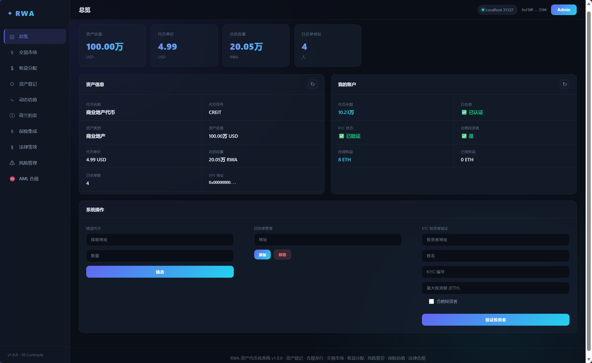
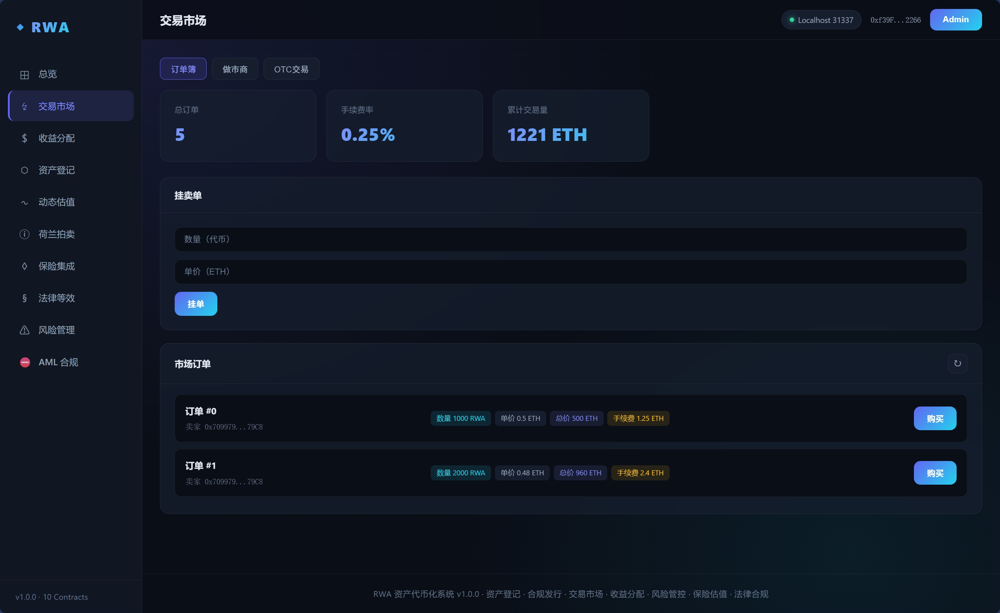
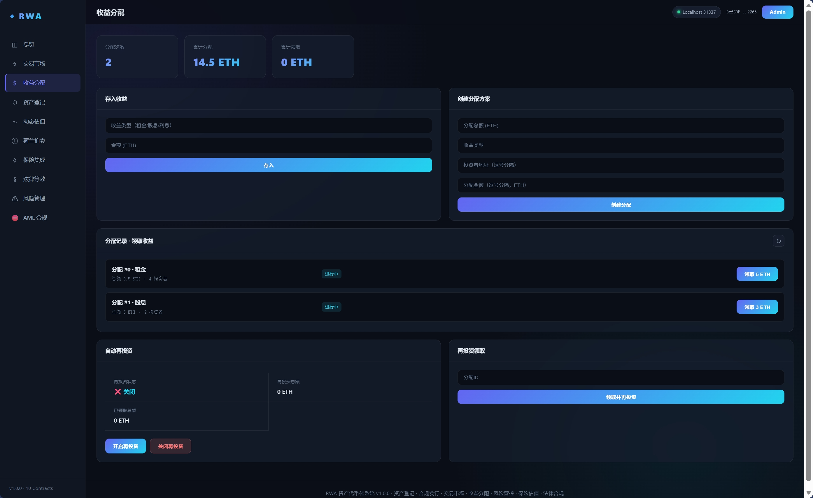
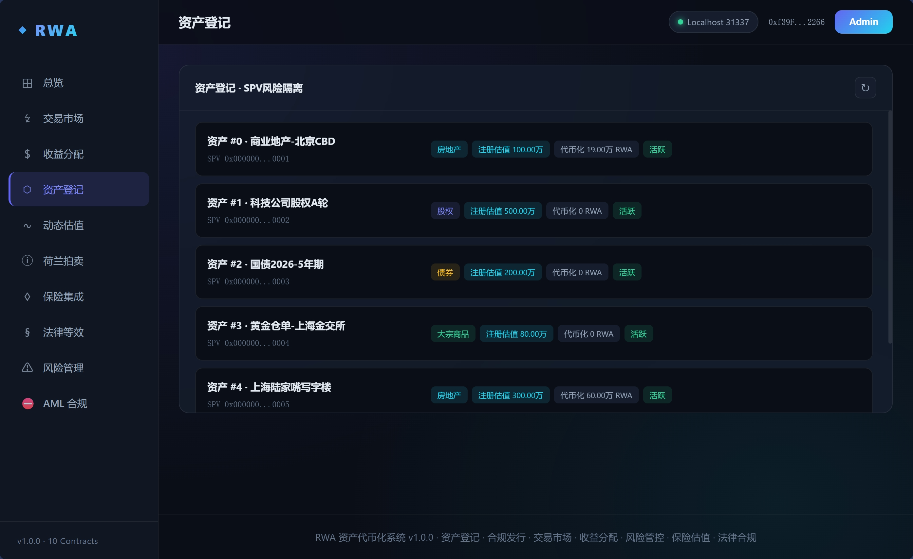
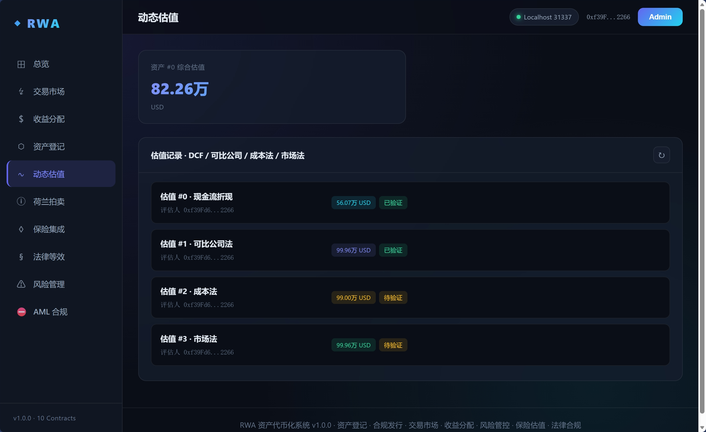
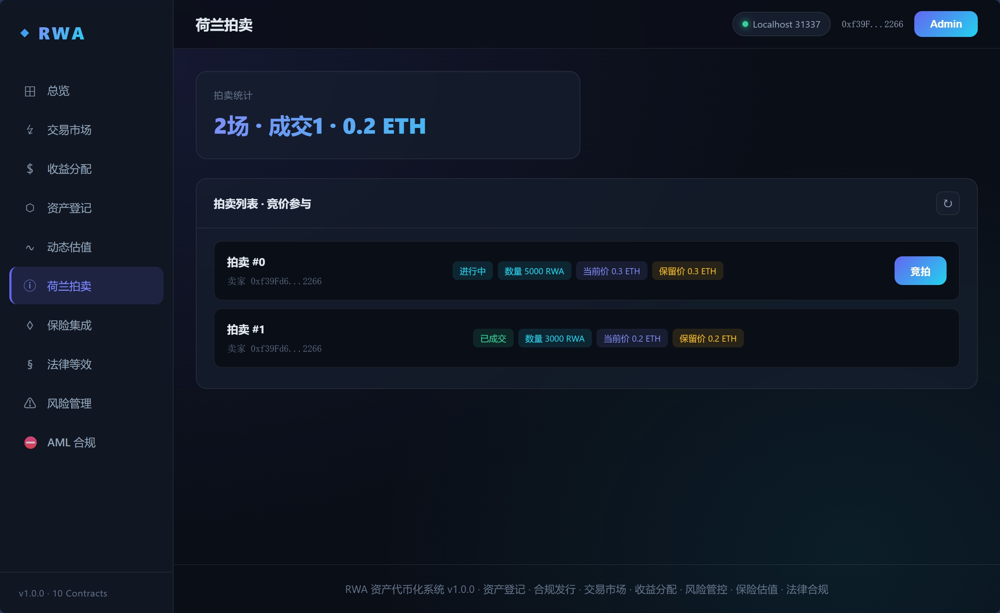
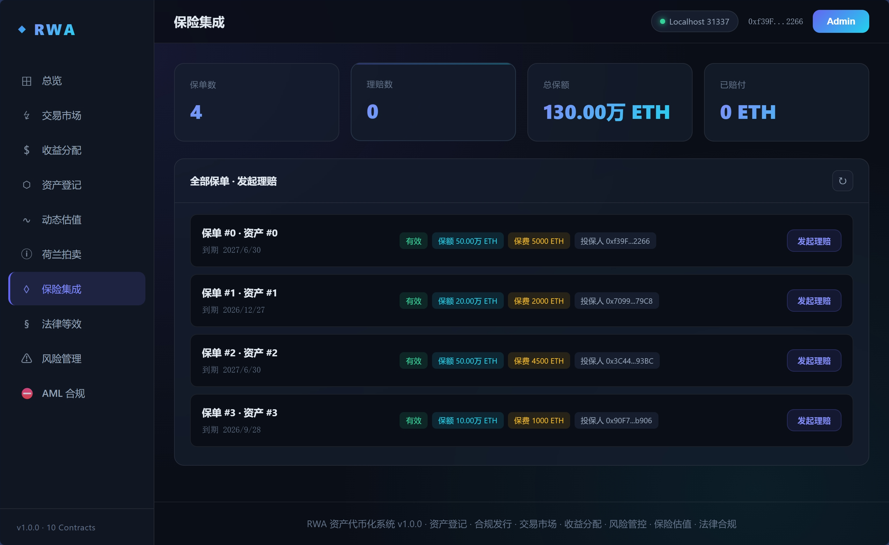
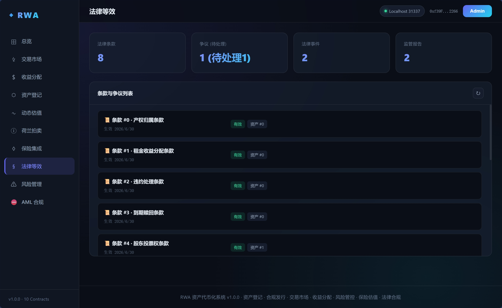
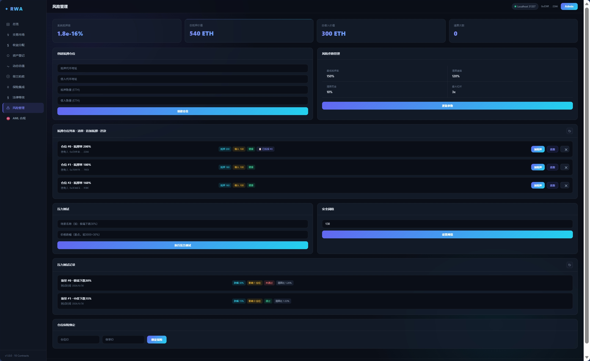
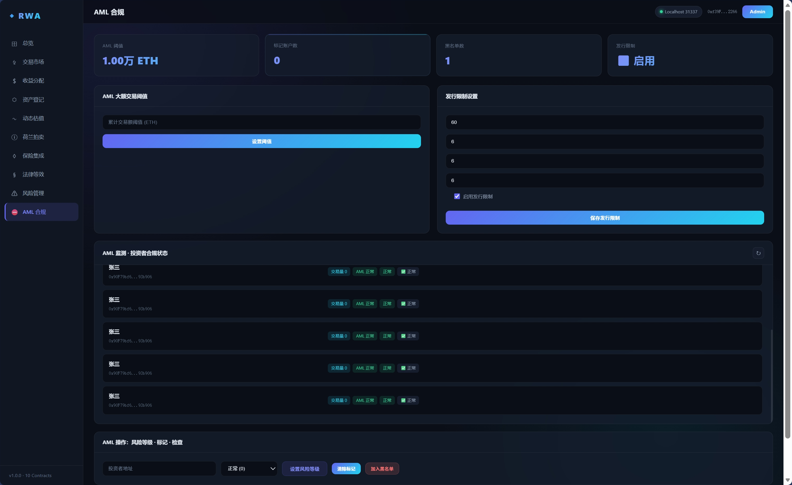

# 现实世界资产代币化系统 (RWA)

---

## 一、项目概述

### 1.1 项目信息

| 项目     | 内容                                                           |
| -------- | -------------------------------------------------------------- |
| 项目名称 | 现实世界资产代币化系统（Real World Asset Tokenization System） |
| 所属课程 | 区块链与 Web3 综合实践项目设计                                 |
| 项目类型 | 项目四 — 现实世界资产代币化系统                               |
| 作者姓名 | 牛晨勋                                                         |
| 学号     | 8208231403                                                     |
| 班级     | 大数据2304                                                     |
| 完成日期 | 2026-06-30                                                     |

### 1.2 项目简介

本系统是一套连接传统金融与去中心化金融（DeFi）的资产代币化平台，将房地产、股权、债券、大宗商品等现实资产通过区块链技术数字化，实现资产的链上登记、合规发行、二级市场流通、自动化收益分配与全流程风险管理。系统完整覆盖《项目设计要求文档》4.1-4.4 全部模块。

### 1.3 核心功能模块

| 模块                                                 | 合约                       |  设计要求  |
| ---------------------------------------------------- | -------------------------- | :---------: |
| 资产代币（ERC-20 + 白名单 + 合规检查）               | `RWAToken.sol`           | 4.1 / 4.2.1 |
| 资产登记层（多资产类型 + SPV 隔离 + 信息披露）       | `AssetRegistry.sol`      |    4.2.1    |
| 合规引擎（KYC / AML / 发行限制 / 转让限制 / 黑名单） | `Compliance.sol`         |    4.2.2    |
| 交易市场（订单簿 + 做市商 + OTC 场外交易）           | `Marketplace.sol`        |    4.2.3    |
| 荷兰式拍卖（降价拍卖）                               | `DutchAuction.sol`       |    4.2.3    |
| 收益分配自动化（存入 / 分配 / 领取 / 再投资）        | `RevenueDistributor.sol` |    4.3.3    |
| 智能合约法律等效（条款 / 争议 / 事件 / 报告）        | `LegalEnforcement.sol`   |    4.3.1    |
| 动态估值系统（DCF / 可比 / 成本 / 市场法）           | `Valuation.sol`          |    4.3.2    |
| 风险管理（抵押仓位 / 清算 / 压力测试 / 保险绑定）    | `RiskManager.sol`        |     4.4     |
| 保险集成（保单发行 / 理赔审批）                      | `Insurance.sol`          |     4.4     |

**合约统计**：10 个独立合约 | 22 个结构体 | 6 个枚举 | 67 个事件 | 125 个 public/external 函数

---

## 二、提交文件清单

```
学号_姓名_实践/
├── contracts/                       # 智能合约（10 个 .sol）
│   ├── RWAToken.sol                 # 资产代币（ERC-20 + 白名单）
│   ├── AssetRegistry.sol            # 资产登记层
│   ├── Compliance.sol               # 合规引擎
│   ├── Marketplace.sol              # 交易市场
│   ├── DutchAuction.sol             # 荷兰式拍卖
│   ├── RevenueDistributor.sol       # 收益分配
│   ├── LegalEnforcement.sol         # 法律等效
│   ├── Valuation.sol                # 动态估值
│   ├── RiskManager.sol              # 风险管理
│   └── Insurance.sol                # 保险集成
├── frontend/                        # 前端页面
│   ├── index.html                   # 主页面（10 个子页面 + 响应式布局）
│   ├── app.js                       # ethers.js 交互逻辑（内置私钥签名）
│   └── style.css                    # 样式文件
├── scripts/
│   ├── deploy.js                    # 合约部署脚本（含预置数据）
│   ├── init-data.js                 # 初始数据补充脚本
│   ├── sync-addresses.js            # 合约地址同步脚本
│   └── verify-all.js                # 完全验证脚本
├── rwa.sh                           # 一键部署脚本
├── server.js                        # Node.js 前端服务器（含 RPC 代理）
├── hardhat.config.js                # Hardhat 配置
├── package.json                     # 项目依赖
├── package-lock.json                # 依赖锁文件
├── README.md                        # 环境部署手册（本文件）
├── 项目设计要求文档.md                # 设计要求文档（原始任务书）
├── 设计说明文档.md                    # 系统设计文档
└── 测试报告.md                       # 测试报告
```

---

## 三、技术栈

| 层级         | 技术                            | 版本            | 说明                                       |
| ------------ | ------------------------------- | --------------- | ------------------------------------------ |
| 智能合约语言 | Solidity                        | ^0.8.28         | 最新稳定版，内置溢出保护                   |
| 开发框架     | Hardhat                         | 2.x             | 编译 / 部署 / 节点管理                     |
| 本地区块链   | Hardhat Network                 | Chain ID: 31337 | 预置 20 个测试账户（每账户 10000 ETH）     |
| 前端技术     | HTML5 + CSS3 + JavaScript (ES6) | —              | 纯原生实现，零框架依赖                     |
| 区块链交互   | ethers.js                       | 6.7             | 现代化以太坊 SDK                           |
| 前端服务     | Node.js HTTP Server             | —              | 静态文件托管 + RPC 代理转发                |
| 钱包方案     | 内置私钥签名                    | —              | 使用 Hardhat 账户私钥直接签名，免 MetaMask |
| 文件存证     | IPFS 内容哈希                   | —              | 法律文件 / 披露 / 参数以 Qm... 格式存证    |

---

## 四、环境要求

| 依赖     |           最低版本           | 说明                          |
| -------- | :---------------------------: | ----------------------------- |
| Node.js  |              18+              | JavaScript 运行环境           |
| npm      |              8+              | 包管理器，随 Node.js 一起安装 |
| 浏览器   |    Chrome / Edge / Firefox    | 访问前端页面                  |
| 操作系统 | Linux / macOS / Windows (WSL) | 开发与运行环境                |

---

## 五、快速开始（一键部署）

```bash
# 进入项目目录
cd Blockchain/Project

# 一键启动（安装依赖 → 编译合约 → 启动区块链 → 部署合约 → 初始化数据 → 启动前端）
bash rwa.sh
```

脚本 `rwa.sh` 自动执行以下步骤：

```
1. npm install              — 安装 Hardhat 及依赖
2. npx hardhat compile      — 编译 10 个智能合约
3. npx hardhat node &       — 后台启动本地区块链（端口 8545）
4. npx hardhat run scripts/deploy.js --network localhost   — 部署 10 个合约
5. npx hardhat run scripts/init-data.js --network localhost — 初始化演示数据
6. node scripts/sync-addresses.js — 同步合约地址到前端 app.js
7. node server.js           — 启动前端服务（端口 8080）
```

部署完成后，浏览器访问 **http://localhost:8080** 即可使用。

---

## 六、手动部署步骤

### 步骤一：安装依赖

```bash
cd Blockchain/Project
npm install
```

### 步骤二：编译合约

```bash
npx hardhat compile
```

预期输出：

```
Compiled 10 Solidity files successfully
```

### 步骤三：启动本地区块链

在终端 1 中运行：

```bash
npx hardhat node
```

输出 20 个测试账户及其私钥（每个账户 10000 ETH）。保持终端运行。

### 步骤四：部署合约

在终端 2 中运行：

```bash
npx hardhat run scripts/deploy.js --network localhost
```

部署顺序（按依赖关系）：

```
Compliance → RWAToken → Marketplace → RevenueDistributor
→ RiskManager → AssetRegistry → LegalEnforcement
→ Valuation → DutchAuction → Insurance
```

部署完成后输出全部合约地址，并自动写入 `deployed-addresses.json`。

部署脚本同步预置初始数据：

| 模块     | 预置数据                                      |
| -------- | --------------------------------------------- |
| 合规     | 4 账户 KYC 认证、转让限制、发行限制、AML 阈值 |
| 代币     | 4 账户白名单、190,000 RWA 铸造                |
| 资产登记 | 4 个多类型资产、2 条信息披露                  |
| 法律     | 4 条条款编码、2 个法律事件、2 份监管报告      |
| 估值     | 4 种方法估值、1 个综合估值、代币价格同步      |
| 保险     | 1 个保单                                      |

### 步骤五：补充初始化数据（可选）

```bash
npx hardhat run scripts/init-data.js --network localhost
```

补充数据（用于前端演示）：

| 模块     | 补充数据                                 |
| -------- | ---------------------------------------- |
| 资产登记 | +2 资产、+3 信息披露                     |
| 交易市场 | 4 个卖单、1 个做市商注册 + 报价          |
| 荷兰拍卖 | 2 场拍卖                                 |
| OTC      | 1 笔 OTC 意向                            |
| 收益分配 | 3 笔收益存入、2 笔分配方案               |
| 保险     | +3 个保单                                |
| 法律     | +4 条条款、1 笔争议                      |
| 估值     | +4 条估值、+2 综合估值、2 条验证         |
| 风险管理 | 3 个抵押仓位、1 个保险绑定、2 次压力测试 |

### 步骤六：同步合约地址

```bash
node scripts/sync-addresses.js
```

将 `deployed-addresses.json` 中的地址自动写入 `frontend/app.js`。

### 步骤七：启动前端

```bash
node server.js
```

前端架构：

```
浏览器 (http://localhost:8080)
    │
    ├── GET /* → 静态文件代理（frontend/ 目录）
    │
    └── POST /rpc → RPC 代理转发 → Hardhat Node (http://127.0.0.1:8545)
```

浏览器访问 `http://localhost:8080` 进入系统。

---

## 七、前端页面说明

前端采用侧边栏导航 + 内容区布局，共 10 个子页面：

### ⊞ 总览

资产信息总览、账户状态、快速操作（铸造/白名单/KYC）



### ↯ 交易市场

子导航：订单簿 / 做市商 / OTC 交易



### $ 收益分配

存入收益、创建分配、领取、再投资



### ⬡ 资产登记

SPV 隔离资产列表、代币化率查询



### ∿ 动态估值

四种方法估值记录、加权综合估值



### ⓘ 荷兰拍卖

拍卖列表、实时价格、竞价参与



### ◊ 保险集成

保单列表、理赔申请



### § 法律等效

条款 / 争议 / 事件 / 报告



### ⚠ 风险管理

仓位管理、压力测试、保险绑定、参数调整



### ⛔ AML 合规

AML 监控、发行限制、风险等级管理



**钱包机制**：前端使用 Hardhat 内置 Account #0 私钥创建 `ethers.Wallet` 签名所有交易，无需 MetaMask 交互。数据刷新通过 17 个并行函数自动完成。页面首次加载时自动检测数据状态，若为空则调用 `seedDemoData()` 创建演示数据。

---

## 八、验证测试

### 8.1 编译验证

```bash
npx hardhat compile
# → Compiled 10 Solidity files successfully
```

### 8.2 部署验证

```bash
node scripts/verify-all.js
```

验证 10 个合约全部已部署、合约关联关系正确、关键状态变量初始值正确。

### 8.3 功能测试清单

以下为各模块核心功能的手动测试步骤：

**资产登记（AssetRegistry）**

- [ ] `registerAsset` — 登记房地产/股权/债券/大宗商品四类资产
- [ ] `getSPVAssets(spvAddress)` — SPV 隔离查询
- [ ] `publishDisclosure` / `getAssetDisclosures` — 信息披露
- [ ] `getTokenizationRate` — 代币化率查询

**合规引擎（Compliance）**

- [ ] `verifyInvestor` — KYC 单地址认证
- [ ] `batchVerifyInvestors` — 批量 KYC 认证
- [ ] `updateBlacklist` / `batchUpdateBlacklist` — 黑名单管理
- [ ] `checkTransfer(from, to, amount)` — 转账合规检查
- [ ] `checkIssuance` — 发行限制检查
- [ ] `setAMLRiskLevel` — AML 风险等级（0-3）

**代币操作（RWAToken）**

- [ ] `mint` / `batchMint` — 铸造代币
- [ ] `updateWhitelist` / `batchUpdateWhitelist` — 白名单管理
- [ ] `transfer` — 含白名单 + 合规检查的转账
- [ ] `pause` / `unpause` — 紧急暂停/恢复
- [ ] `getTokenPrice` / `getTokenInfo` — 代币信息查询

**交易市场（Marketplace）**

- [ ] `createSellOrder` → `buyTokens` → 部分/全额成交
- [ ] `registerMarketMaker` → `updateQuote` → `buyFromMaker` / `sellToMaker`
- [ ] `proposeOTC` → `acceptOTC` → `settleOTC`（四状态流转）

**荷兰式拍卖（DutchAuction）**

- [ ] `createAuction` → `getCurrentPrice`（价格递减）→ `bid`

**收益分配（RevenueDistributor）**

- [ ] `depositRevenue` → `createDistribution` → `claim`
- [ ] `toggleAutoReinvest` → `claimWithReinvest`（再投资）

**法律等效（LegalEnforcement）**

- [ ] `encodeClause` → `fileDispute` → `resolveDispute`（仲裁裁决）
- [ ] `registerLegalEvent` → `triggerLegalEvent` → `executeLegalEvent`
- [ ] `generateReport` → `verifyReport`

**动态估值（Valuation）**

- [ ] `valuationByDCF` / `valuationByComparable` / `valuationByCost` / `valuationByMarket`
- [ ] `computeCompositeValue`（加权综合）

**风险管理（RiskManager）**

- [ ] `createPosition` → `addCollateral` → `repayDebt`
- [ ] `liquidate` / `liquidateWithInsurance`
- [ ] `runStressTest`（压力测试）
- [ ] `updateRiskParams`（动态参数）

**保险集成（Insurance）**

- [ ] `issuePolicy` → `fileClaim` → `approveClaim` / `rejectClaim`

---

## 九、安全机制

| 机制         | 实现方式                                | 覆盖范围                                                                          |
| ------------ | --------------------------------------- | --------------------------------------------------------------------------------- |
| 重入防护     | 自定义`nonReentrant` 修饰符           | Marketplace（8 个函数）、Revenue（4 个）、DutchAuction（2 个）、Insurance（2 个） |
| 暂停控制     | `whenNotPaused` 修饰符                | RWAToken、Marketplace                                                             |
| 白名单校验   | `onlyWhitelisted` 修饰符 + 转账前检查 | RWAToken                                                                          |
| 合规检查     | 转账/交易前调用`checkTransfer()`      | RWAToken、Marketplace                                                             |
| 黑名单       | 封禁违规地址，阻止其转账                | Compliance                                                                        |
| 路径穿越防护 | `filePath.startsWith(FRONTEND_DIR)`   | server.js                                                                         |
| 整数溢出保护 | Solidity 0.8.28 内置                    | 全部 10 个合约                                                                    |

**关键参数配置**：

| 参数       |      默认值      | 说明                   |
| ---------- | :---------------: | ---------------------- |
| 手续费率   | 0.25%（25/10000） | 每笔 Marketplace 交易  |
| 最低抵押率 |       150%       | 仓位安全线             |
| 清算阈值   |       120%       | 低于此值触发清算       |
| 清算罚金   |        10%        | 清算时惩罚比例         |
| 最大杠杆   |        3x        | 单仓位最高杠杆         |
| AML 阈值   |     50000 ETH     | 累计交易量超标自动标记 |

---

## 十、常见问题

**Q：端口被占用？**

```bash
# 检查 8545 端口（Hardhat Node）
lsof -i :8545
# 检查 8080 端口（前端服务）
lsof -i :8080
# 释放端口
kill -9 <PID>
```

**Q：合约地址变化？**

每次重新部署 Hardhat Node 合约地址会改变。请务必执行 `node scripts/sync-addresses.js` 同步最新地址。

**Q：前端报错"合约调用失败"？**

确认 Hardhat Node 正在运行（终端 1 保持 `npx hardhat node` 运行中），且合约已部署。可运行 `node scripts/verify-all.js` 检查。

**Q：浏览器无法连接？**

确保 `server.js` 正在运行。RPC 请求通过 `/rpc` 代理转发，不直接连接 8545 端口。

---

## 十一、注意事项

1. **独立完成**：本系统为个人独立完成，严禁抄袭，代码雷同按 0 分处理。
2. **环境要求**：确保 Node.js 18+、npm 8+ 已安装。
3. **端口检查**：确保 8545（Hardhat Node）和 8080（前端服务）端口未被占用。
4. **部署顺序**：必须先启动 Hardhat Node，再部署合约，最后启动前端。
5. **地址同步**：每次重新部署后必须运行 `sync-addresses.js`。
6. **提交格式**：打包为 `学号_姓名_实践.zip` 提交，包含所有源码和文档。

---

## 十二、学号哈希输出

```
学号: 8208231403
学号哈希: 67b67e91b33bffba28c884eb78362abd1f16f763852704f3b7a40e0059037d31
```

---

## 配套文档

| 文档                                      | 说明                                               |
| ----------------------------------------- | -------------------------------------------------- |
| [项目设计要求文档.md](项目设计要求文档.md) | 原始课程任务要求（不可修改）                       |
| [设计说明文档.md](设计说明文档.md)         | 系统架构设计、合约详细设计、数据结构、安全设计     |
| [测试报告.md](测试报告.md)                 | 143 个测试用例，覆盖全部 10 个合约和 10 个前端页面 |

---

> 📅 完成日期：2026-06-30 | 版本 V3.0

